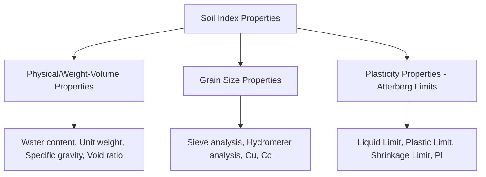
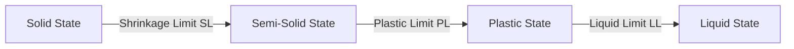

## Index Properties and Atterberg Limits

### Definition and Purpose

Index properties are the basic physical characteristics of soil measured through standardized laboratory tests that indirectly indicate engineering behavior (strength, compressibility, permeability) without requiring more complex and time-consuming performance tests. They serve as classification tools and provide preliminary estimates of soil engineering behavior through established correlations. Atterberg limits are a specific subset of index properties for fine-grained soils, defining moisture content boundaries between different consistency states.

### Categories of Index Properties

### Water Content Determination

Water content ($w$) is the ratio of the mass of water to the mass of solids in a soil sample, determined by oven-drying:

$$w = \frac{W_w}{W_s} \times 100\% = \frac{M_{wet} - M_{dry}}{M_{dry} - M_{container}} \times 100\%$$

Standard oven-drying procedure specifies drying at $110°C \pm 5°C$ until constant mass is achieved (typically 16–24 hours for most soils). Organic soils may require lower drying temperatures to avoid oxidation of organic matter, which would produce erroneously high apparent water content readings.

### Specific Gravity of Soil Solids

Specific gravity ($G_s$) represents the ratio of the density of soil solids to the density of water at a reference temperature (typically $20°C$), determined via the pycnometer (specific gravity bottle) method:

$$G_s = \frac{M_2 - M_1}{(M_4 - M_1) - (M_3 - M_2)}$$

where $M_1$ = mass of pycnometer, $M_2$ = mass of pycnometer + dry soil, $M_3$ = mass of pycnometer + soil + water, $M_4$ = mass of pycnometer filled with water only.

**Typical $G_s$ ranges** (widely cited in geotechnical references):

- Quartz sand: 2.65–2.67
- Silty soils: 2.67–2.73
- Clay soils: 2.70–2.80
- Organic soils: can be significantly lower, sometimes below 2.0

**[Unverified]** These ranges represent commonly cited typical values across standard soil mechanics references; actual $G_s$ for a specific site should always be determined by direct laboratory testing rather than assumed from typical ranges, given natural mineralogical variability.

### Unit Weight Determination

Unit weight (density) can be determined through several field and laboratory methods, including the sand cone method, rubber balloon method, nuclear density gauge (field), and direct measurement of a known-volume undisturbed sample (laboratory).

**Key unit weight relationships:**

$$\gamma = \frac{W}{V} \quad \text{(total/bulk unit weight)}$$

$$\gamma_d = \frac{W_s}{V} = \frac{\gamma}{1+w} \quad \text{(dry unit weight)}$$

$$\gamma_{sat} = \frac{(G_s + e)\gamma_w}{1+e} \quad \text{(saturated unit weight)}$$

$$\gamma' = \gamma_{sat} - \gamma_w \quad \text{(submerged/buoyant unit weight)}$$

### Atterberg Limits: Overview

Developed by Swedish agricultural scientist Albert Atterberg and later standardized for geotechnical engineering by Arthur Casagrande, Atterberg limits define the moisture content boundaries at which fine-grained soil transitions between four consistency states:

As water content decreases from a liquid slurry toward a dry solid, the soil passes through these four states, each exhibiting distinct mechanical behavior:

- **Liquid state**: Soil flows like a viscous liquid, offering no shear resistance.
- **Plastic state**: Soil can be molded/deformed without cracking and retains its shape (plastic deformation).
- **Semi-solid state**: Soil begins to crack when molded but does not yet exhibit significant volume change with further drying being minimal.
- **Solid state**: Below the shrinkage limit, further moisture loss produces no additional volume change; the soil has reached its minimum void ratio for that structure.

### Liquid Limit (LL) Determination

**Casagrande Cup Method (Standard Method)**

A brass cup containing a soil pat with a standardized groove cut through it is repeatedly dropped from a fixed height (10 mm) using a mechanical or hand-crank device. The liquid limit is defined as the water content at which the groove closes over a length of 13 mm (1/2 inch) after 25 blows/drops.

Since achieving exactly 25 blows at the target closure is impractical in a single trial, the standard procedure involves running multiple trials at varying water contents (typically bracketing 25 blows, e.g., trials yielding closure between roughly 15–35 blows), plotting the number of blows (log scale) against water content (linear scale) — the "flow curve" — and interpolating the water content corresponding to exactly 25 blows.

**Fall Cone Method (Alternative/International Method)**

A standardized cone (typically 80 g/30° or 60 g/60° cone, depending on regional standard) is allowed to penetrate a soil sample under its own weight for a fixed time (typically 5 seconds); the liquid limit corresponds to a specified penetration depth (commonly 20 mm for the 80g/30° cone). This method is widely used internationally (particularly in Europe, per BS/ISO standards) and is often considered more operator-independent/repeatable than the Casagrande method.

**[Inference]** Comparative studies generally suggest the fall cone method produces more consistent/repeatable results with less operator-dependent variability compared to the Casagrande cup method, though the two methods do not always produce identical LL values for a given soil, and any observed correlation factors between methods are soil-type dependent rather than universally fixed.

### Plastic Limit (PL) Determination

The plastic limit is determined by repeatedly rolling a small soil sample by hand into a thread on a glass plate or similarly non-absorbent surface until the thread is reduced to approximately 3 mm in diameter. The plastic limit is defined as the water content at which the thread just begins to crumble and break into pieces at this 3 mm diameter — if the thread can be rolled thinner without crumbling, the soil is still above the plastic limit (too wet); if it crumbles before reaching 3 mm, it is below the plastic limit (too dry).

This test relies substantially on operator technique and judgment, making it inherently more subjective than the liquid limit determination, though the standardized 3 mm thread-crumbling criterion provides a consistent target.

### Shrinkage Limit (SL) Determination

The shrinkage limit is determined by measuring the volume and mass of a saturated soil pat as it dries and shrinks, until no further volume decrease occurs despite continued moisture loss (the point at which soil pores become filled with air rather than remaining saturated, so further drying no longer causes shrinkage).

$$SL = w_i - \left(\frac{V_i - V_f}{W_s}\right)\gamma_w \times 100\%$$

where $w_i$ = initial water content, $V_i$ = initial volume, $V_f$ = final (dry) volume, $W_s$ = mass of dry soil solids.

The shrinkage limit is used less frequently in routine practice compared to LL and PL, but remains important for expansive/collapsible soil evaluation and shrink-swell potential assessment.

### Plasticity Index and Consistency Index

**Plasticity Index:**

$$PI = LL - PL$$

The plasticity index represents the range of water content over which the soil remains in a plastic (moldable) state. A PI of zero (or a non-plastic result, denoted NP) indicates the soil cannot be rolled into a 3 mm thread at any water content — typical of cohesionless soils (sands, gravels) or very low-plasticity silts.

**Liquidity Index:**

$$LI = \frac{w - PL}{PI}$$

where $w$ is the natural (in-situ) water content. The liquidity index indicates where the current field water content falls relative to the plastic and liquid limits:

- $LI < 0$: soil is drier than the plastic limit (semi-solid/solid state), typically indicating overconsolidated or heavily desiccated conditions.
- $0 \leq LI \leq 1$: soil is in the plastic range at its natural water content.
- $LI > 1$: soil is wetter than the liquid limit at its natural state, indicating potentially very soft, sensitive, or "quick" clay behavior.

**Consistency Index:**

$$CI = \frac{LL - w}{PI} = 1 - LI$$

Provides essentially the inverse perspective of liquidity index, indicating firmness relative to the liquid limit.

### Activity of Clay

Activity relates plasticity index to the clay-sized fraction of the soil, providing insight into clay mineralogy without requiring direct mineralogical testing:

$$A = \frac{PI}{\% \text{ clay fraction (by weight, particles} < 2\mu m)}$$

**Skempton's classification of clay activity:**

- Inactive clay: $A < 0.75$ (e.g., kaolinite-dominated)
- Normal clay: $0.75 \leq A \leq 1.25$ (e.g., illite-dominated)
- Active clay: $A > 1.25$ (e.g., montmorillonite-dominated, high swell potential)

**[Inference]** While these activity classification boundaries are widely cited (originating from Skempton's 1953 work), some subsequent references present slightly adjusted boundary values; the specific boundaries should be treated as a general classification guide rather than a precise physical threshold.

### Example: Atterberg Limits and Classification Calculation

**Given laboratory data:**

- Liquid Limit (LL) = 45%
- Plastic Limit (PL) = 22%
- Natural water content ($w$) = 30%
- Clay fraction (< 2 μm) = 35%

**Step 1 — Plasticity Index:**

$$PI = LL - PL = 45 - 22 = 23\%$$

**Step 2 — Liquidity Index:**

$$LI = \frac{w - PL}{PI} = \frac{30 - 22}{23} = 0.35$$

Since $0 \leq LI \leq 1$, the soil is currently in a plastic (moldable) state at its natural water content — consistent with a firm-to-stiff consistency rather than very soft or brittle behavior.

**Step 3 — Activity:**

$$A = \frac{PI}{\%\text{clay}} = \frac{23}{35} = 0.66$$

Since $A < 0.75$, this soil classifies as an **inactive clay** (kaolinite-dominated behavior likely, though direct mineralogical testing would confirm).

**Step 4 — USCS Plasticity Classification (using the A-line):**

$$PI_{A-line} = 0.73(LL - 20) = 0.73(45-20) = 18.25$$

Since the actual $PI = 23 > 18.25$ (above the A-line) and $LL = 45 < 50$, this soil classifies as **CL (low-plasticity clay)**.

### Illustration: Casagrande Plasticity Chart (svg_diagram)

<svg xmlns="http://www.w3.org/2000/svg" viewBox="0 0 620 420" font-family="Arial, sans-serif">
<text x="310" y="25" font-size="15" text-anchor="middle" font-weight="bold">Casagrande Plasticity Chart (svg_diagram)</text>

<line x1="80" y1="370" x2="580" y2="370" stroke="black" stroke-width="1.5" />
<line x1="80" y1="370" x2="80" y2="50" stroke="black" stroke-width="1.5" />
<text x="330" y="400" font-size="12" text-anchor="middle">Liquid Limit, LL (%)</text>
<text x="30" y="210" font-size="12" text-anchor="middle" transform="rotate(-90 30 210)">Plasticity Index, PI (%)</text>

<text x="80" y="385" font-size="10" text-anchor="middle">0</text>

<text x="205" y="385" font-size="10" text-anchor="middle">20</text>

<text x="330" y="385" font-size="10" text-anchor="middle">50</text>

<text x="455" y="385" font-size="10" text-anchor="middle">80</text>

<text x="580" y="385" font-size="10" text-anchor="middle">100</text>

<line x1="205" y1="370" x2="580" y2="90" stroke="#a93226" stroke-width="2" />
<text x="480" y="140" font-size="11" fill="#a93226" transform="rotate(-28 480 140)">A-line: PI = 0.73(LL-20)</text>

<line x1="140" y1="370" x2="580" y2="55" stroke="#1a5276" stroke-width="1.5" stroke-dasharray="4,3" />
<text x="470" y="90" font-size="10" fill="#1a5276" transform="rotate(-32 470 90)">U-line (upper bound)</text>

<line x1="330" y1="370" x2="330" y2="60" stroke="#555" stroke-width="1" stroke-dasharray="3,3" />

<text x="250" y="330" font-size="12" font-weight="bold">CL</text>

<text x="230" y="360" font-size="10">(low plasticity clay)</text>

<text x="230" y="290" font-size="12" font-weight="bold">ML</text>

<text x="200" y="270" font-size="10">(low plasticity silt, below A-line)</text>

<text x="440" y="220" font-size="12" font-weight="bold">CH</text>

<text x="420" y="240" font-size="10">(high plasticity clay)</text>

<text x="420" y="300" font-size="12" font-weight="bold">MH</text>

<text x="400" y="320" font-size="10">(high plasticity silt, below A-line)</text>

<circle cx="308" cy="278" r="5" fill="black" />
<text x="318" y="275" font-size="10">Example (LL=45, PI=23)</text>
</svg>

### Empirical Correlations Using Index Properties

Index properties are widely used to estimate engineering parameters via empirical correlations, though these should be treated as preliminary estimates rather than substitutes for direct testing:

- **Compression index correlation** (Terzaghi & Peck, for normally consolidated clays): $C_c \approx 0.009(LL - 10)$
- **Undrained shear strength vs. liquidity index**: Generally, higher LI correlates with lower undrained shear strength, though the specific relationship is soil-specific.
- **Swelling potential estimates**: Based on combinations of PI, activity, and clay fraction, used in various expansive soil classification charts (e.g., those by Holtz & Gibbs, or Van Der Merwe).

**[Inference]** Empirical correlations such as $C_c \approx 0.009(LL-10)$ are widely cited approximations derived from specific soil datasets; actual compression index for a given soil can deviate substantially from this correlation, and direct consolidation testing is standard practice for anything beyond preliminary estimation.

### Common Testing and Interpretation Pitfalls

- **Air-drying samples before testing**: Air-drying prior to Atterberg limits testing can irreversibly alter clay mineral structure (particularly for soils with allophane or certain tropical clay minerals), producing artificially lower LL/PL values compared to testing at natural moisture content; standard practice recommends testing without prior air-drying where possible.
- **Using worn or improperly calibrated Casagrande cup apparatus**: The cup's drop height, groove tool dimensions, and base hardness are all standardized (per ASTM D4318 or equivalent); deviation from calibration affects blow count results and thus LL determination.
- **Insufficient mixing/curing time**: Fine-grained soil samples generally require adequate moisture equilibration time (often a minimum curing period, commonly cited as at least 16 hours) after adding water and before testing, to allow uniform moisture distribution throughout the sample.
- **Applying index property correlations outside their original dataset's soil type/geologic origin**: Empirical correlations (e.g., for compression index) were often developed from specific regional soil datasets and may not transfer reliably to soils of different mineralogy or depositional history.
- **Confusing plastic limit subjectivity with test invalidity**: While the PL test is more operator-dependent than LL, properly trained technicians following standardized procedure (ASTM D4318) generally achieve acceptable repeatability; the multi-point liquid limit method paired with careful PL technique remains the standard approach.

### Related Topics

- Soil formation, composition, and classification (USCS/AASHTO systems)
- Unified Soil Classification System (USCS) group symbol determination
- Expansive/swelling soil identification and foundation design implications
- Consolidation testing and compressibility parameters
- Undrained shear strength testing (unconfined compression, vane shear, triaxial)
- Clay mineralogy and its relationship to plasticity behavior
- Sensitivity of clays and quick clay behavior
- Compaction testing (Proctor test) and optimum moisture content