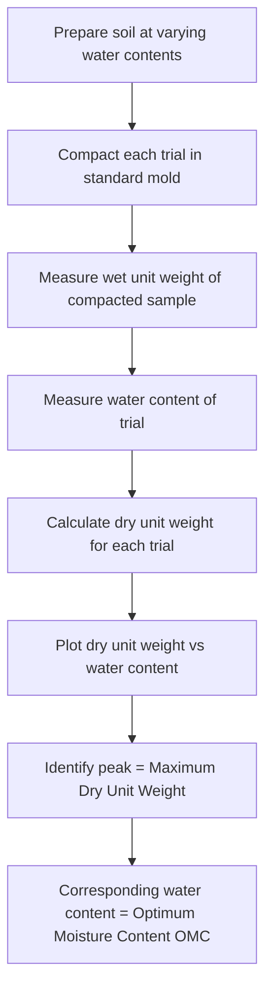
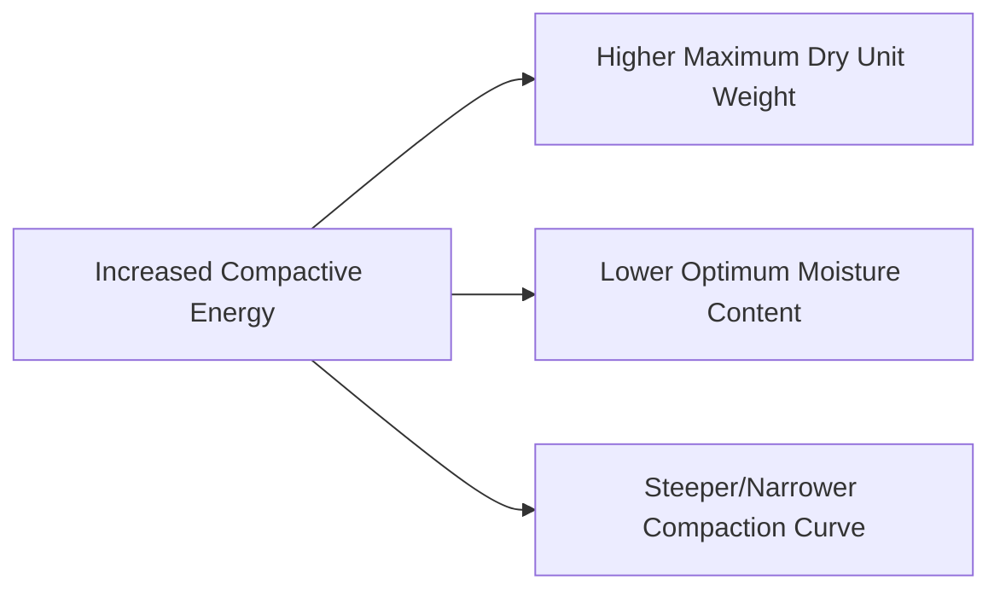

## Soil Compaction Principles

### Definition and Purpose

Compaction is the process of densifying soil by mechanically reducing air voids (not water content) within the soil mass, typically through the application of external mechanical energy such as rolling, tamping, or vibration. Compaction increases soil unit weight, shear strength, and stiffness while reducing compressibility and permeability, making it a fundamental ground improvement technique for building pads, embankments, pavement subgrades, backfill, and earth dam construction.

**Key distinction**: Compaction is a mechanical process that expels air from voids without necessarily changing water content, and occurs over a short timeframe. This differs fundamentally from **consolidation**, which is a time-dependent process involving the expulsion of water from saturated fine-grained soils under sustained load.

### The Compaction Curve and Standard Proctor Test

The relationship between dry unit weight and water content for a given compactive effort is established via the standard Proctor compaction test (or its variants), producing the characteristic bell-shaped "compaction curve."

**Standard Proctor Test Procedure (per ASTM D698 or equivalent):**

- Soil is compacted in a standard mold (typically 944 cm³ / 1/30 ft³) in three equal layers
- Each layer receives 25 blows from a 2.5 kg (5.5 lb) hammer falling from a height of 305 mm (12 in)
- The test is repeated at several different water contents to define the full compaction curve
- Dry unit weight is calculated for each trial and plotted against water content

$$\gamma_d = \frac{\gamma}{1+w}$$

where $\gamma$ = wet (bulk) unit weight of the compacted sample and $w$ = water content of that trial.

### Interpreting the Compaction Curve

The compaction curve rises from a lower dry unit weight at low water content, reaches a peak (**Maximum Dry Unit Weight**, $\gamma_{d,max}$), and then declines at higher water contents. The water content at the peak is the **Optimum Moisture Content (OMC)**.

**Behavior on the dry side of optimum**: At low water content, insufficient water is available to lubricate particles and allow efficient rearrangement into a denser packing; soil particles resist reorientation, and air voids remain relatively high despite compactive effort, resulting in lower dry density and a more flocculated (random) particle structure.

**Behavior at optimum**: Water provides sufficient lubrication for particles to slide into a denser arrangement under the applied compactive energy, minimizing air voids for that specific compactive effort and achieving maximum dry unit weight.

**Behavior on the wet side of optimum**: Excess water begins to occupy void space that would otherwise be filled by solid particles, and since water is incompressible relative to air, additional water content beyond optimum reduces the dry unit weight achievable for the same compactive effort. Particle structure tends toward a more dispersed (oriented, parallel) arrangement on the wet side.

**Zero Air Voids (ZAV) Curve**

The theoretical maximum dry unit weight at any given water content, assuming complete saturation (zero air voids, $S = 100\%$), forms an upper bound curve that the actual compaction curve approaches but never crosses:

$$\gamma_{d,ZAV} = \frac{G_s \cdot \gamma_w}{1 + w \cdot G_s}$$

The compaction curve peak always lies below and to the left of the ZAV curve at the same water content, since 100% saturation via mechanical compaction alone (without water expulsion, i.e., without consolidation) is not physically achievable.

### Illustration: Standard Compaction Curve with ZAV Line (svg_diagram)

<svg xmlns="http://www.w3.org/2000/svg" viewBox="0 0 600 400" font-family="Arial, sans-serif">
<text x="300" y="25" font-size="15" text-anchor="middle" font-weight="bold">Standard Compaction Curve (svg_diagram)</text>

<line x1="80" y1="340" x2="560" y2="340" stroke="black" stroke-width="1.5" />
<line x1="80" y1="340" x2="80" y2="50" stroke="black" stroke-width="1.5" />
<text x="320" y="375" font-size="12" text-anchor="middle">Water Content, w (%)</text>
<text x="30" y="195" font-size="12" text-anchor="middle" transform="rotate(-90 30 195)">Dry Unit Weight, γd</text>

<path d="M 120,300 Q 200,180 280,140 Q 340,120 400,180 Q 460,240 500,300" stroke="#1a5276" stroke-width="3" fill="none" />

<circle cx="330" cy="130" r="5" fill="#1a5276" />
<line x1="330" y1="130" x2="330" y2="340" stroke="#1a5276" stroke-width="1" stroke-dasharray="4,2" />
<line x1="80" y1="130" x2="330" y2="130" stroke="#1a5276" stroke-width="1" stroke-dasharray="4,2" />
<text x="335" y="360" font-size="10">OMC</text>
<text x="45" y="128" font-size="10">γd,max</text>

<path d="M 150,260 Q 250,150 350,100 Q 430,70 500,60" stroke="#a93226" stroke-width="2" stroke-dasharray="6,3" fill="none" />
<text x="440" y="55" font-size="11" fill="#a93226">Zero Air Voids (ZAV) curve</text>

<text x="180" y="220" font-size="11">Dry of optimum</text>

<text x="410" y="220" font-size="11">Wet of optimum</text>

</svg>

### Modified Proctor Test

The Modified Proctor test (per ASTM D1557 or equivalent) uses significantly higher compactive energy to better represent modern heavy compaction equipment and higher-load pavement/foundation applications:

- Same mold size as standard Proctor
- Soil compacted in **five** layers (vs. three for standard)
- Heavier hammer: 4.54 kg (10 lb), dropped from a greater height: 457 mm (18 in)
- Results in approximately 4.5 times the compactive energy per unit volume compared to standard Proctor

**Effect of increased compactive effort:**

**[Inference]** The general trend of higher compactive energy producing higher $\gamma_{d,max}$ and lower OMC is well established in soil mechanics literature; the specific magnitude of these shifts for a given soil depends on its gradation and plasticity characteristics, so exact shift values are not universally fixed across all soil types.

### Compactive Energy Calculation

$$E = \frac{N_b \times N_l \times W_h \times H}{V_m}$$

where:

- $N_b$ = number of blows per layer
- $N_l$ = number of layers
- $W_h$ = weight of hammer
- $H$ = drop height
- $V_m$ = volume of mold

**Standard Proctor energy** (approximate): $\approx 600$ kN·m/m³

**Modified Proctor energy** (approximate): $\approx 2,700$ kN·m/m³ (roughly 4.5× standard)

### Factors Affecting Compaction Behavior

**Soil Type and Gradation**

- Well-graded coarse-grained soils (e.g., GW, SW) generally achieve higher maximum dry unit weights with relatively flat compaction curves and less pronounced OMC sensitivity, since a wider range of particle sizes allows smaller particles to fill voids between larger ones even with modest compactive effort.
- Fine-grained, high-plasticity soils (e.g., CH) generally exhibit lower maximum dry unit weights, more pronounced (sharply peaked) compaction curves, and higher optimum moisture contents, since more water is needed to overcome interparticle cohesive/electrochemical forces before particles can rearrange efficiently.

**Compactive Effort**

As described above, higher compactive energy shifts the curve toward higher $\gamma_{d,max}$ and lower OMC.

**Method of Compaction**

Different compaction mechanisms mobilize different soil responses:

- **Kneading compaction** (e.g., sheepsfoot rollers): remolds soil through combined pressure and shear, generally effective for cohesive fine-grained soils.
- **Vibratory compaction** (e.g., vibratory smooth-drum rollers): effective for cohesionless coarse-grained soils, where vibration helps particles settle into denser packing.
- **Static/pressure compaction** (e.g., smooth-drum, pneumatic-tired rollers): applies compressive force without significant vibration or kneading action.
- **Impact compaction** (e.g., rammers, plate compactors): applies repeated impact energy, commonly used for confined areas (trenches, small pads).

**[Inference]** The general association between compaction equipment type and suitable soil type (e.g., sheepsfoot for clays, vibratory for sands) reflects widely accepted geotechnical construction practice, though actual equipment selection on a given project also depends on lift thickness, access constraints, and specification requirements beyond soil type alone.

### Field Compaction Specifications

**Relative Compaction (Percent Compaction)**

$$RC = \frac{\gamma_{d,field}}{\gamma_{d,max,lab}} \times 100\%$$

Typical specification requirements commonly range from 90% to 95% of standard or modified Proctor maximum dry unit weight, depending on the application (e.g., structural fill often requires higher RC than general grading fill).

**[Unverified]** Specific RC requirements (90%, 95%, 98%, etc.) and whether standard or modified Proctor is the reference basis vary substantially by project specification, local code, and application (pavement subgrade vs. building pad vs. utility trench backfill); the governing project specifications should always be consulted directly.

**Relative Density (for cohesionless soils)**

For granular soils where the standard Proctor test is not well-suited (due to poor moisture sensitivity and curve definition), relative density provides an alternative compaction adequacy measure:

$$D_r = \frac{e_{max} - e}{e_{max} - e_{min}} \times 100\%$$

where $e_{max}$ = void ratio in loosest state, $e_{min}$ = void ratio in densest state, and $e$ = in-situ (field) void ratio.

### Field Compaction Quality Control Testing

**Sand Cone Method**: A calibrated sand of known density is poured into a hand-excavated hole of known volume left after removing a soil sample, and the volume of the hole is back-calculated from the mass of sand used, allowing determination of the field dry unit weight.

**Rubber Balloon Method**: Similar principle to sand cone, but hole volume is determined via water displacement using a calibrated rubber membrane.

**Nuclear Density Gauge**: Uses gamma radiation source and detector to measure in-situ wet density and, via neutron backscatter, moisture content, providing rapid non-destructive field testing without excavation.

**[Unverified]** Nuclear density gauge use requires radioactive material licensing and specific safety/handling protocols; regulatory requirements vary by jurisdiction and should be confirmed with the applicable regulatory body before field use.

### Example: Compaction Test Interpretation

**Given laboratory Proctor test data:**

| Trial | Water Content (%) | Wet Unit Weight (kN/m³) |
| --- | --- | --- |
| 1 | 8 | 18.5 |
| 2 | 11 | 19.8 |
| 3 | 14 | 20.6 |
| 4 | 17 | 20.2 |
| 5 | 20 | 19.4 |

**Step 1 — Calculate dry unit weight for each trial using $\gamma_d = \gamma/(1+w)$:**

Trial 1: $\gamma_d = 18.5/1.08 = 17.13$ kN/m³

Trial 2: $\gamma_d = 19.8/1.11 = 17.84$ kN/m³

Trial 3: $\gamma_d = 20.6/1.14 = 18.07$ kN/m³

Trial 4: $\gamma_d = 20.2/1.17 = 17.26$ kN/m³

Trial 5: $\gamma_d = 19.4/1.20 = 16.17$ kN/m³

**Step 2 — Identify peak:**

The maximum dry unit weight occurs at Trial 3: $\gamma_{d,max} \approx 18.07$ kN/m³ at $OMC \approx 14\%$ (the true peak may fall slightly above or below this exact trial value; a smooth curve fitted through all points is used in practice to interpolate the precise peak).

**Step 3 — Field specification check:**

If the project specifies 95% relative compaction based on this standard Proctor result:

$$\gamma_{d,required} = 0.95 \times 18.07 = 17.17 \text{ kN/m}^3$$

Any field density test result at or above 17.17 kN/m³ (with water content reasonably near OMC, per specification tolerance) would satisfy this compaction requirement.

### Compaction Effects on Engineering Properties

**Permeability**: Compaction on the wet side of optimum generally produces lower permeability due to the more dispersed (parallel-oriented) particle structure, which is why clay liners for containment applications (landfills, ponds) are often specified to be compacted wet of optimum.

**Shear Strength**: Compaction dry of optimum, for a given compactive effort, often produces higher strength at low confining stress due to the flocculated structure, but this relationship reverses or becomes more complex at higher confining stress and under saturated conditions; strength behavior post-compaction is also highly dependent on subsequent saturation and loading history.

**Shrink-Swell Behavior**: Soils compacted dry of optimum with a flocculated structure tend to exhibit greater swelling potential upon subsequent wetting (since flocculated structure has more capacity for water absorption), while soils compacted wet of optimum tend to shrink more upon drying.

**[Inference]** These relationships between compaction water content and post-compaction strength, permeability, and swell behavior are well-documented general tendencies in geotechnical literature, but the specific magnitude and even direction of some effects (particularly strength at varying confining stress) can be soil-specific and should not be treated as absolute rules for all soil types without site-specific testing.

### Common Design/Construction Pitfalls

- **Specifying compaction requirements without specifying moisture content tolerance**: Achieving target dry unit weight without controlling water content relative to OMC can result in soil compacted dry of optimum (prone to future swelling) or wet of optimum (potentially under design strength), even if the density target is technically met.
- **Using standard Proctor results to evaluate compaction performed with modified Proctor equipment/energy, or vice versa**: Mixing reference standards produces misleading relative compaction percentages; the field compaction reference basis (standard vs. modified) must match the specification and be clearly stated in reports.
- **Applying Proctor-based testing to predominantly gravelly/cobbly soils**: Oversized particles beyond the mold's capacity require correction procedures (e.g., replacement or Walker-Holtz method) since the standard mold cannot properly accommodate large particles, and uncorrected results can be significantly misleading.
- **Neglecting lift thickness control in the field**: Compaction equipment has an effective depth of influence; excessively thick lifts can result in inadequately compacted material at the base of the lift even when surface density tests pass.
- **Ignoring test location representativeness**: Field density tests taken only in easily accessible areas (avoiding corners, edges, or areas near obstructions) may not represent actual compaction achieved throughout the fill, particularly near structures or utility trenches.

### Related Topics

- Soil formation, composition, and classification
- Index properties and Atterberg limits
- Consolidation and settlement analysis of fine-grained soils
- Ground improvement techniques (dynamic compaction, vibro-compaction, stone columns)
- Earthwork specifications and structural fill requirements
- Permeability testing and clay liner design
- Shear strength testing (triaxial, direct shear) of compacted soils
- Expansive soil identification and mitigation strategies