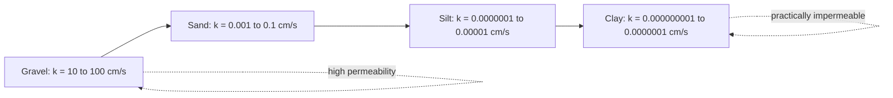
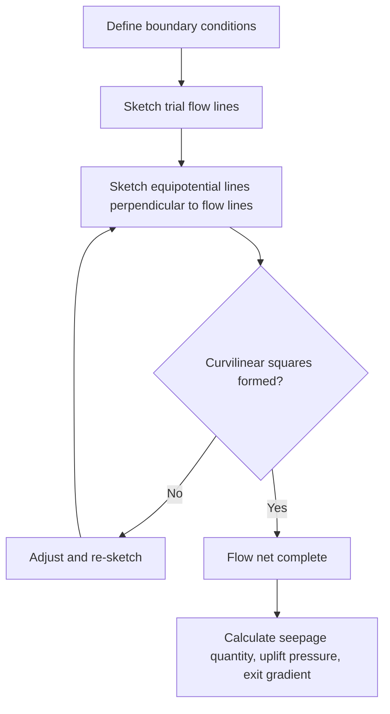

## Permeability and Seepage Analysis

### Definition and Purpose

Permeability is the property of a soil that describes its capacity to allow water (or other fluids) to flow through its interconnected void spaces under a hydraulic gradient. Seepage analysis applies permeability principles to predict flow rates, pore pressures, and flow patterns through and beneath soil masses and structures—essential for dam design, retaining wall drainage, excavation dewatering, slope stability, and foundation design in the presence of groundwater.

### Darcy's Law

The fundamental governing relationship for flow through porous media, established empirically by Henry Darcy, states that flow velocity is proportional to the hydraulic gradient:

$$v = k \cdot i$$

$$q = k \cdot i \cdot A$$

where:

- $v$ = discharge (Darcy) velocity
- $k$ = coefficient of permeability (hydraulic conductivity)
- $i$ = hydraulic gradient = $\Delta h / L$
- $q$ = flow rate
- $A$ = total cross-sectional area (including both solids and voids)

**Hydraulic gradient:**

$$i = \frac{\Delta h}{L}$$

where $\Delta h$ is the head loss over flow path length $L$.

**[Inference]** Darcy's law is generally valid for laminar flow conditions, which hold for most fine-to-medium-grained soils under typical seepage gradients; validity may break down for very coarse gravels or high-gradient conditions where flow becomes turbulent (typically assessed via Reynolds number criteria), and this limitation should be considered for coarse, highly permeable materials.

**Seepage Velocity (actual velocity through voids):**

$$v_s = \frac{v}{n} = \frac{k \cdot i}{n}$$

where $n$ is porosity. Seepage velocity is always greater than discharge velocity since flow only occurs through the void space, not the full cross-sectional area.

### Coefficient of Permeability Ranges by Soil Type

| Soil Type | Typical $k$ Range (cm/s) | Drainage Characteristic |
| --- | --- | --- |
| Clean gravel | $10^1$ to $10^2$ | Very high (free-draining) |
| Clean sand | $10^{-3}$ to $10^{-1}$ | High to medium |
| Fine sand, silty sand | $10^{-5}$ to $10^{-3}$ | Low to medium |
| Silt | $10^{-7}$ to $10^{-5}$ | Very low |
| Clay | $10^{-9}$ to $10^{-7}$ | Practically impermeable |

**[Unverified]** These are broadly cited order-of-magnitude ranges from standard geotechnical references; actual permeability for a given soil sample can vary significantly based on structure, fabric, degree of saturation, and testing method, so laboratory or field testing is standard practice for design-level values rather than relying on typical ranges.

### Factors Affecting Permeability

- **Grain size and gradation**: Smaller particle sizes and better-graded soils (where fines fill voids between larger particles) generally reduce permeability.
- **Void ratio**: Higher void ratio generally increases permeability, since more interconnected pore space is available for flow.
- **Soil structure/fabric**: Flocculated clay structures generally exhibit higher permeability than dispersed structures of the same soil at the same void ratio, due to more open interconnected flow paths in flocculated arrangements.
- **Degree of saturation**: Partially saturated soils exhibit lower effective permeability to water than fully saturated soils, since air in voids blocks some flow paths.
- **Temperature (fluid viscosity)**: Permeability is inversely related to fluid viscosity, which decreases with increasing temperature; laboratory permeability values are typically corrected to a standard reference temperature (commonly 20°C).
- **Anisotropy**: Natural soil deposits, particularly stratified sedimentary soils, often exhibit different permeability in horizontal ($k_h$) versus vertical ($k_v$) directions, typically with $k_h > k_v$ due to depositional layering.

### Laboratory Permeability Testing

**Constant Head Test**

Used for relatively permeable soils (coarse-grained: sands, gravels) where flow rate is high enough to measure accurately over a reasonable time period. A constant hydraulic head is maintained across the sample, and the volume of water collected over a measured time interval is used to calculate $k$:

$$k = \frac{Q \cdot L}{A \cdot h \cdot t}$$

where $Q$ = volume of water collected, $L$ = sample length, $A$ = cross-sectional area, $h$ = constant head, $t$ = time.

**Falling Head Test**

Used for less permeable soils (fine-grained: silts, clays) where flow rate under constant head would be too low to measure accurately. Water is allowed to flow through the sample from a standpipe, and the head is measured at the start and end of a timed interval as it falls:

$$k = \frac{a \cdot L}{A \cdot t} \ln\left(\frac{h_1}{h_2}\right)$$

where $a$ = cross-sectional area of the standpipe, $L$ = sample length, $A$ = cross-sectional area of sample, $t$ = elapsed time, $h_1$ = initial head, $h_2$ = final head.

**[Inference]** For very low-permeability clays, laboratory falling head tests (or triaxial permeability tests) may require extended testing durations and careful control of temperature and boundary conditions to obtain reliable results; flexible-wall permeameters are often preferred over rigid-wall for clay testing to better control effective stress and prevent sidewall leakage, though the specific testing standard/apparatus requirement depends on the governing test method (e.g., ASTM D5084).

### Field Permeability Testing

**Pumping Tests**: Water is pumped from a well at a controlled rate while measuring drawdown in observation wells at known distances, used to estimate the permeability (and transmissivity) of an aquifer over a large representative volume of soil, capturing natural heterogeneity better than small laboratory samples.

**Borehole Tests (Falling/Rising Head, Packer Tests)**: Conducted within a borehole to estimate localized permeability at specific depths; packer tests isolate a specific interval using inflatable packers to test permeability of a discrete stratum, often used in rock or layered soil profiles.

### Equivalent Permeability for Layered Soils

Natural soil deposits are often stratified, requiring equivalent permeability calculations for flow parallel versus perpendicular to layering.

**Flow parallel to layering (horizontal flow through horizontal layers):**

$$k_{H,eq} = \frac{k_1 H_1 + k_2 H_2 + \cdots + k_n H_n}{H_1 + H_2 + \cdots + H_n}$$

**Flow perpendicular to layering (vertical flow through horizontal layers):**

$$k_{V,eq} = \frac{H_1 + H_2 + \cdots + H_n}{\dfrac{H_1}{k_1} + \dfrac{H_2}{k_2} + \cdots + \dfrac{H_n}{k_n}}$$

This distinction is significant because $k_{H,eq}$ is dominated by the most permeable layer (analogous to parallel electrical resistance), while $k_{V,eq}$ is dominated (controlled) by the least permeable layer (analogous to series electrical resistance)—a thin clay seam can drastically reduce vertical seepage even within an otherwise sandy profile.

### Flow Nets

A flow net is a graphical method for solving two-dimensional steady-state seepage problems, consisting of two families of orthogonal curves:

- **Flow lines**: Paths that water particles follow as they seep through the soil.
- **Equipotential lines**: Lines connecting points of equal total head, always drawn perpendicular to flow lines for isotropic soil conditions.

A properly constructed flow net forms approximately curvilinear "squares" bounded by flow lines and equipotential lines. The flow net is used to calculate seepage quantity:

$$q = k \cdot H \cdot \frac{N_f}{N_d}$$

where:

- $H$ = total head loss across the flow domain
- $N_f$ = number of flow channels (spaces between adjacent flow lines)
- $N_d$ = number of equipotential drops (spaces between adjacent equipotential lines)

### Illustration: Flow Net Beneath a Sheet Pile Wall (svg_diagram)

<svg xmlns="http://www.w3.org/2000/svg" viewBox="0 0 600 380" font-family="Arial, sans-serif">
<text x="300" y="25" font-size="15" text-anchor="middle" font-weight="bold">Flow Net Beneath Sheet Pile Wall (svg_diagram)</text>

<rect x="40" y="290" width="520" height="15" fill="#555" />
<text x="300" y="345" font-size="10" text-anchor="middle">Impermeable Boundary</text>

<rect x="40" y="100" width="520" height="190" fill="#eef2f3" stroke="black" stroke-width="1" />

<rect x="290" y="60" width="10" height="180" fill="#666" />
<text x="295" y="55" font-size="10" text-anchor="middle">Sheet Pile</text>

<rect x="40" y="60" width="250" height="40" fill="#aed6f1" />
<text x="165" y="85" font-size="10" text-anchor="middle">Upstream (High Water)</text>
<rect x="300" y="130" width="260" height="10" fill="#aed6f1" />
<text x="430" y="122" font-size="10" text-anchor="middle">Downstream (Low Water)</text>

<g stroke="#1a5276" stroke-width="1.5" fill="none">
<path d="M 60,100 C 150,180 250,260 300,240 C 400,220 500,150 560,140" />
<path d="M 60,130 C 150,200 260,270 300,255 C 400,235 500,175 560,165" />
<path d="M 60,160 C 160,220 270,275 300,265 C 400,250 500,200 560,195" />
</g>

<g stroke="#a93226" stroke-width="1" stroke-dasharray="3,2" fill="none">
<path d="M 120,110 C 100,180 90,240 100,285" />
<path d="M 200,105 C 180,180 170,245 175,288" />
<path d="M 400,140 C 410,190 415,240 410,288" />
<path d="M 480,145 C 485,195 488,240 485,288" />
</g>

<text x="130" y="270" font-size="9" fill="`#1a5276`">Flow lines</text>

<text x="440" y="270" font-size="9" fill="`#a93226`">Equipotential lines</text>

</svg>

### Uplift Pressure and Exit Gradient

**Uplift Pressure**: Flow nets allow calculation of pore water pressure at any point along a structure's base (e.g., beneath a dam or weir), which is used to check stability against uplift/flotation:

$$u = \gamma_w \cdot h_p$$

where $h_p$ is the piezometric head at the point of interest, determined from the flow net's equipotential line spacing.

**Exit Gradient**: The hydraulic gradient at the point where seepage exits the soil (e.g., downstream toe of a dam or excavation), calculated from the flow net as:

$$i_{exit} = \frac{\Delta h}{l}$$

where $\Delta h$ is the head drop across the last equipotential drop and $l$ is the average length of the last flow field at the exit point. This is critical for evaluating piping potential.

### Piping and Critical Hydraulic Gradient

Piping is a progressive erosion failure mechanism where seepage forces exceed the soil's resistance to particle movement, initiating erosion (typically at an exit point) that can progress backward into a continuous "pipe" or channel, potentially leading to catastrophic structural failure (notably in dams and levees).

**Critical hydraulic gradient** (the gradient at which effective stress becomes zero, causing a "quick" or boiling condition):

$$i_{cr} = \frac{\gamma'}{\gamma_w} = \frac{G_s - 1}{1 + e}$$

where $\gamma'$ is the submerged unit weight of soil.

**Factor of safety against piping:**

$$FS_{piping} = \frac{i_{cr}}{i_{exit}}$$

**[Inference]** Minimum acceptable factors of safety against piping vary by application and governing code/guideline (commonly cited values in dam engineering literature range from approximately 1.5 to 4 or higher depending on consequence category and design standard); the specific required FS should be determined from the applicable design guideline or regulatory standard for the project type.

### Quicksand Condition

"Quicksand" is not a distinct soil type but rather a condition that occurs in cohesionless (sandy or silty) soil when upward seepage force equals or exceeds the submerged weight of the soil, causing effective stress to approach zero and the soil to lose essentially all shear strength, behaving as a viscous fluid-like suspension.

$$\sigma' = \sigma - u$$

When upward seepage gradient reaches the critical gradient $i_{cr}$, effective stress $\sigma'$ approaches zero regardless of total stress $\sigma$, since pore pressure $u$ rises to fully offset it.

### Seepage Force

Seepage force represents the drag force exerted by flowing water on soil particles, acting in the direction of flow:

$$F_s = i \cdot \gamma_w \cdot V$$

per unit volume, the seepage force per unit volume is:

$$f_s = i \cdot \gamma_w$$

This force must be considered in stability analyses wherever seepage occurs through or beneath a structure, as it can significantly reduce effective stress and thus shear strength in the direction of flow, contributing to slope instability or heave conditions.

### Example: Flow Net Seepage Calculation

**Given:**

- Flow net beneath a sheet pile wall with $N_f = 4$ flow channels and $N_d = 10$ equipotential drops
- Total head loss $H$ = 6 m
- Soil permeability $k = 2 \times 10^{-4}$ cm/s

**Step 1 — Convert permeability to consistent units:**

$$k = 2 \times 10^{-4} \text{ cm/s} = 2 \times 10^{-6} \text{ m/s}$$

**Step 2 — Calculate seepage quantity per unit length of wall:**

$$q = k \cdot H \cdot \frac{N_f}{N_d} = (2 \times 10^{-6})(6)\left(\frac{4}{10}\right) = 4.8 \times 10^{-6} \text{ m}^3/\text{s per meter of wall}$$

**Step 3 — Exit gradient check (assuming last flow field length $l$ = 1.2 m, head drop per equipotential drop $\Delta h = H/N_d = 0.6$ m):**

$$i_{exit} = \frac{0.6}{1.2} = 0.5$$

**Step 4 — Critical gradient (assuming $G_s = 2.65$, $e = 0.65$):**

$$i_{cr} = \frac{2.65 - 1}{1 + 0.65} = \frac{1.65}{1.65} = 1.0$$

**Step 5 — Factor of safety against piping:**

$$FS = \frac{i_{cr}}{i_{exit}} = \frac{1.0}{0.5} = 2.0$$

A factor of safety of 2.0 would generally be considered adequate against piping for most conventional applications, though this should be checked against the specific governing design standard's minimum requirement.

### Seepage Control Measures

- **Cutoff walls** (sheet piling, slurry walls, grout curtains): reduce seepage by extending an impermeable barrier into or through a permeable stratum, lengthening the flow path and reducing exit gradients.
- **Filter drains and relief wells**: control exit gradients and prevent piping by providing a controlled, filtered path for seepage to exit safely without carrying soil particles, often placed at the downstream toe of dams or behind retaining structures.
- **Upstream impervious blankets**: extend the seepage path length by placing low-permeability material over the upstream ground surface, reducing head loss gradient and seepage quantity.
- **Graded filters**: designed using filter design criteria (grain size ratios between protected soil and filter material) to prevent internal erosion/piping while still allowing water to pass.

### Common Analysis Pitfalls

- **Applying isotropic flow net construction rules to anisotropic soil** without first performing the standard transformation (scaling one dimension by $\sqrt{k_x/k_z}$) to create an equivalent isotropic section before sketching the flow net.
- **Neglecting equivalent permeability effects in layered profiles**, particularly underestimating how a thin low-permeability layer can control vertical seepage even within an otherwise permeable soil profile.
- **Using average or bulk permeability values without checking for macro-scale features** (fissures, sand seams, root holes) that can create preferential flow paths not captured by standard laboratory sample testing.
- **Ignoring temperature correction** when comparing laboratory permeability test results conducted at different temperatures, since fluid viscosity (and thus measured $k$) varies with temperature.
- **Underestimating exit gradient risk near excavation toes or dam downstream faces**, particularly during rapid drawdown or unusual flood-stage conditions that were not part of routine steady-state design analysis.

### Related Topics

- Soil formation, composition, and classification
- Effective stress principle and pore pressure concepts
- Consolidation and settlement of fine-grained soils
- Slope stability analysis (seepage effects on effective stress)
- Dewatering system design for excavations
- Filter design criteria for drainage systems
- Waterproofing and drainage detailing for foundations and retaining walls
- Dam and levee seepage control design