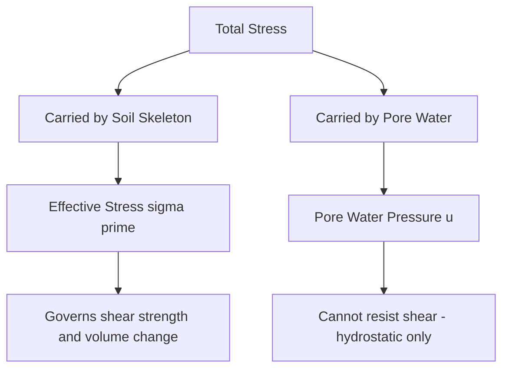

## Effective Stress Principle

### Definition and Significance

The effective stress principle, formulated by Karl Terzaghi, is the foundational concept of soil mechanics stating that the mechanical behavior of soil (deformation, strength) is governed not by total stress but by the stress carried by the soil skeleton (solid particle-to-particle contacts) after subtracting the pressure carried by pore water. This principle explains why saturated soils can lose strength dramatically under conditions of elevated pore pressure, even when total stress remains constant, and underlies virtually all subsequent analysis in shear strength, consolidation, and slope stability.

### Terzaghi's Effective Stress Equation

$$\sigma' = \sigma - u$$

where:

- $\sigma'$ = effective stress (carried by the soil skeleton/particle contacts)
- $\sigma$ = total stress (carried jointly by soil skeleton and pore fluid)
- $u$ = pore water pressure

**Conceptual basis**: Total stress at any point within a soil mass is the sum of the weight of everything above that point (soil, water, structures). This total stress is shared between the solid particle skeleton and the water occupying the voids. Since water cannot transmit shear stress, only the effective (inter-granular) stress governs shear strength and volume change behavior.

### Total Stress Calculation

Total vertical stress at a given depth is calculated by summing the weight of all overlying material (soil and water) per unit area:

$$\sigma_v = \sum \gamma_i \cdot z_i$$

For a single homogeneous layer:

$$\sigma_v = \gamma \cdot z$$

For multiple layers with different unit weights:

$$\sigma_v = \gamma_1 z_1 + \gamma_2 z_2 + \cdots + \gamma_n z_n$$

Where the soil is submerged (below a free water surface with static water), the appropriate unit weight above the water table is the moist/bulk unit weight, and below the water table, the saturated unit weight is used for total stress calculation (since total stress includes the full weight of water-filled soil).

### Pore Water Pressure Under Hydrostatic Conditions

Under static groundwater conditions (no seepage flow), pore pressure at any depth below the water table is simply hydrostatic:

$$u = \gamma_w \cdot h_w$$

where $h_w$ is the depth below the groundwater table (piezometric surface).

**Above the water table** (in the unsaturated/capillary zone), pore pressure can be negative (suction) due to capillary effects, though this is often conservatively neglected in routine design (treated as $u = 0$) unless capillary rise effects are specifically being evaluated.

### Effective Stress Under Static (No-Flow) Conditions

For a soil profile with the water table at depth $z_w$ below the ground surface, at any depth $z$ below the water table:

**Total stress:**

$$\sigma_v = \gamma_{moist} \cdot z_w + \gamma_{sat} \cdot (z - z_w)$$

**Pore pressure:**

$$u = \gamma_w \cdot (z - z_w)$$

**Effective stress:**

$$\sigma_v' = \sigma_v - u = \gamma_{moist} \cdot z_w + \gamma_{sat} \cdot (z - z_w) - \gamma_w \cdot (z - z_w)$$

$$\sigma_v' = \gamma_{moist} \cdot z_w + \gamma' \cdot (z - z_w)$$

where $\gamma' = \gamma_{sat} - \gamma_w$ is the submerged (buoyant) unit weight — demonstrating that below the water table, effective stress increases with depth at a rate governed by the submerged unit weight rather than the full saturated unit weight, since buoyancy effectively offsets part of the soil's weight.

### Illustration: Total Stress, Pore Pressure, and Effective Stress Profile (svg_diagram)

<svg xmlns="http://www.w3.org/2000/svg" viewBox="0 0 600 420" font-family="Arial, sans-serif">
<text x="300" y="25" font-size="15" text-anchor="middle" font-weight="bold">Stress Distribution with Depth (svg_diagram)</text>

<line x1="60" y1="60" x2="560" y2="60" stroke="black" stroke-width="1.5" />
<text x="30" y="63" font-size="10">GS</text>

<line x1="60" y1="140" x2="560" y2="140" stroke="#1a5276" stroke-width="1.5" stroke-dasharray="5,3" />
<text x="20" y="143" font-size="10" fill="#1a5276">WT</text>

<line x1="60" y1="340" x2="560" y2="340" stroke="black" stroke-width="1.5" />

<line x1="60" y1="60" x2="60" y2="340" stroke="black" stroke-width="1" />
<text x="30" y="210" font-size="11" transform="rotate(-90 30 210)">Depth, z</text>

<line x1="60" y1="60" x2="450" y2="340" stroke="#a93226" stroke-width="2.5" />
<text x="460" y="345" font-size="10" fill="#a93226">Total Stress σv</text>

<line x1="60" y1="140" x2="280" y2="340" stroke="#1a5276" stroke-width="2.5" />
<text x="285" y="345" font-size="10" fill="#1a5276">Pore Pressure u</text>

<line x1="60" y1="60" x2="200" y2="140" stroke="#1e8449" stroke-width="2.5" />
<line x1="200" y1="140" x2="330" y2="340" stroke="#1e8449" stroke-width="2.5" />
<text x="335" y="335" font-size="10" fill="#1e8449">Effective Stress σ'v</text>

<text x="150" y="100" font-size="10">(above WT: σ' = σ, u = 0)</text>

<text x="180" y="180" font-size="10">(slope reduces below WT due to γ')</text>

</svg>

### Effective Stress Under Seepage Conditions

When water flows through soil (seepage), pore pressure deviates from purely hydrostatic conditions, and the effective stress equation must incorporate the seepage-induced pressure change.

**Upward seepage** (e.g., beneath a dam, or in an excavation with upward flow from artesian pressure): increases pore pressure above hydrostatic, reducing effective stress. In the extreme case, when the upward seepage gradient equals the critical hydraulic gradient, effective stress approaches zero, producing the "quick" (quicksand) condition.

$$\sigma_v' = \gamma' \cdot z - i \cdot \gamma_w \cdot z \quad \text{(upward flow, reduces effective stress)}$$

**Downward seepage** (e.g., infiltration into a well-drained soil): decreases pore pressure below hydrostatic, increasing effective stress beyond the static case.

$$\sigma_v' = \gamma' \cdot z + i \cdot \gamma_w \cdot z \quad \text{(downward flow, increases effective stress)}$$

This seepage-effective stress relationship directly connects to the critical hydraulic gradient and piping analysis covered under seepage analysis.

### Effective Stress in Capillary Zone

Above the water table, within the capillary fringe, pore water can exist under negative pressure (suction) due to surface tension effects at the air-water interface within soil pores:

$$u = -\gamma_w \cdot h_c$$

where $h_c$ is height above the water table within the capillary zone (up to the height of capillary rise, $h_{c,max}$, which depends on pore size/soil type).

Since $u$ is negative in this zone, effective stress is correspondingly **increased**:

$$\sigma' = \sigma - u = \sigma + \gamma_w h_c$$

This effect explains phenomena such as increased apparent soil strength in partially saturated soils (apparent cohesion due to capillary suction) and is relevant to shallow foundation behavior in fine-grained soils above the water table.

**[Inference]** The magnitude and reliability of capillary suction contribution to effective stress and apparent strength is highly sensitive to soil type, degree of saturation, and environmental conditions (wetting/drying cycles); because capillary effects can diminish or reverse with wetting, many design codes conservatively neglect this beneficial contribution for long-term stability analysis unless specifically justified by site investigation.

### Effective Stress Changes Due to External Loading

**Immediate (Undrained) Loading on Saturated Fine-Grained Soil**

When a load is rapidly applied to saturated, low-permeability soil (e.g., clay), water cannot drain quickly enough to allow immediate volume change, so the applied stress is initially carried almost entirely by the pore water (excess pore pressure), with effective stress remaining nearly unchanged immediately after loading:

$$\Delta u \approx \Delta \sigma \quad \text{(immediately after undrained loading)}$$

**Time-Dependent Dissipation (Consolidation)**

Over time, as excess pore pressure dissipates through drainage, the load is gradually transferred from the pore water to the soil skeleton, increasing effective stress:

$$\sigma'(t) = \sigma - u(t)$$

As $u(t) \to u_{hydrostatic}$ (excess pore pressure fully dissipates), effective stress approaches its final, fully consolidated value:

$$\Delta \sigma' _{final} = \Delta \sigma$$

This time-dependent process is the foundation of consolidation theory, where settlement occurs progressively as effective stress increases over time due to pore pressure dissipation.

### Example: Effective Stress Calculation with Seepage

**Given:**

- Soil profile: 3 m of dry sand ($\gamma = 17$ kN/m³) above the water table, underlain by 5 m of saturated sand ($\gamma_{sat} = 19.5$ kN/m³) to a depth of 8 m
- Upward seepage occurring through the saturated layer with hydraulic gradient $i = 0.3$

**Step 1 — Total stress at 8 m depth:**

$$\sigma_v = (17)(3) + (19.5)(5) = 51 + 97.5 = 148.5 \text{ kPa}$$

**Step 2 — Submerged unit weight of saturated sand:**

$$\gamma' = \gamma_{sat} - \gamma_w = 19.5 - 9.81 = 9.69 \text{ kN/m}^3$$

**Step 3 — Effective stress at 8 m under static (no-flow) conditions (for comparison):**

\sigma_v'_{static} = (17)(3) + (9.69)(5) = 51 + 48.45 = 99.45 \text{ kPa}

**Step 4 — Effective stress reduction due to upward seepage:**

$$\Delta\sigma'_{seepage} = i \cdot \gamma_w \cdot z_{sat} = (0.3)(9.81)(5) = 14.72 \text{ kPa}$$

**Step 5 — Effective stress at 8 m with upward seepage:**

$$\sigma_v' = 99.45 - 14.72 = 84.73 \text{ kPa}$$

This demonstrates that upward seepage significantly reduces effective stress compared to static conditions, directly reducing available shear strength at that depth — a critical consideration for excavation base stability and slope stability analyses where upward seepage gradients are present.

### Effective Stress in Shear Strength (Mohr-Coulomb Framework)

The effective stress principle is directly embedded in the Mohr-Coulomb shear strength criterion, which governs soil strength in terms of effective (not total) stress:

$$\tau_f = c' + \sigma' \tan\phi'$$

where $c'$ = effective cohesion and $\phi'$ = effective friction angle. This formulation explains why increases in pore pressure (reducing effective stress) directly reduce available shear strength, even though total stress (and therefore total applied load) remains unchanged—a mechanism central to slope failures triggered by rainfall infiltration, rapid drawdown, or undrained loading of saturated clays.

### Effective Stress and the Principle of Effective Stress Limitations

**[Inference]** Terzaghi's original effective stress equation, $\sigma' = \sigma - u$, is generally considered highly accurate for fully saturated soils. For unsaturated (partially saturated) soils, more complex formulations (e.g., Bishop's effective stress equation incorporating a parameter $\chi$ related to degree of saturation) have been proposed in the geotechnical literature, since a single pore pressure term does not fully capture the two-phase (air and water) pore fluid behavior in unsaturated conditions; the appropriate formulation depends on whether the soil of interest is saturated or unsaturated for the analysis being performed.

**Bishop's equation (unsaturated soils, for reference):**

$$\sigma' = (\sigma - u_a) + \chi(u_a - u_w)$$

where $u_a$ = pore air pressure, $u_w$ = pore water pressure, and $\chi$ = a parameter ranging from 0 (dry soil) to 1 (fully saturated soil).

### Common Analysis Pitfalls

- **Using total unit weight below the water table**: A frequent error is applying moist/bulk unit weight for soil below the water table instead of saturated unit weight when calculating total stress, leading to underestimated total stress.
- **Forgetting to account for pore pressure changes due to seepage**: Assuming hydrostatic pore pressure distribution when actual seepage flow (upward or downward) is present, leading to incorrect effective stress and shear strength estimates.
- **Neglecting excess pore pressure during rapid construction on saturated clay**: Applying long-term (drained) strength parameters to short-term (undrained) loading scenarios, which can significantly overestimate available strength immediately after construction (e.g., embankment construction on soft clay).
- **Applying capillary suction benefits without considering potential wetting**: Relying on apparent cohesion from capillary suction for long-term stability without considering that infiltration, rising water table, or seasonal changes could eliminate this beneficial effect.
- **Confusing total and effective stress in shear strength calculations**: Mohr-Coulomb parameters must be paired consistently (effective stress parameters $c', \phi'$ with effective stress $\sigma'$, or total stress parameters $c_u, \phi_u$ with total stress $\sigma$) — mixing frameworks produces meaningless results.

### Related Topics

- Permeability and seepage analysis
- Consolidation and settlement of fine-grained soils
- Shear strength parameters and Mohr-Coulomb failure criterion
- Slope stability analysis under drained and undrained conditions
- Undrained vs. drained loading behavior of saturated clays
- Capillary action and unsaturated soil mechanics
- Soil formation, composition, and classification
- Excavation stability and dewatering design