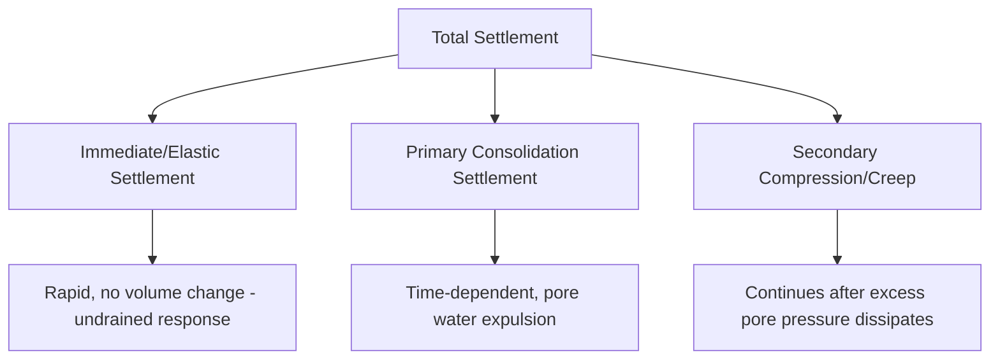
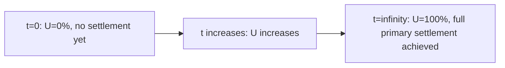

## Consolidation and Settlement

### Definition and Purpose

Consolidation is the time-dependent process by which saturated fine-grained soil (primarily clay) gradually decreases in volume under sustained load as excess pore water pressure dissipates and load is progressively transferred to the soil skeleton, increasing effective stress. Settlement refers to the resulting vertical downward displacement of the ground surface (or a structure founded on it) due to this volume reduction, along with other deformation mechanisms. Understanding and predicting settlement magnitude and rate is essential for foundation design, since excessive total or differential settlement can cause structural distress even without a bearing capacity (shear) failure.

### Components of Total Settlement

$$S_{total} = S_i + S_c + S_s$$

where:

- $S_i$ = immediate (elastic) settlement — occurs rapidly upon loading, due to elastic deformation of soil without volume change (particularly relevant for coarse-grained soils and undrained loading of clays)
- $S_c$ = primary consolidation settlement — time-dependent volume reduction due to pore water expulsion from saturated fine-grained soils
- $S_s$ = secondary compression (creep) settlement — continued settlement after excess pore pressure has fully dissipated, attributed to particle-level rearrangement/creep under constant effective stress

### Immediate (Elastic) Settlement

Estimated using elastic theory, treating the soil as a linear elastic material:

$$S_i = q \cdot B \cdot \frac{(1-\mu^2)}{E_s} \cdot I_f$$

where:

- $q$ = applied net foundation pressure
- $B$ = foundation width
- $\mu$ = Poisson's ratio of soil
- $E_s$ = modulus of elasticity of soil
- $I_f$ = influence factor depending on foundation shape, rigidity, and depth of embedment

**[Inference]** The elastic modulus $E_s$ used in this equation is notoriously difficult to determine reliably, as it depends on stress level, stress history, and strain range, and can vary substantially depending on whether it is derived from laboratory triaxial testing, plate load tests, or empirical correlations with SPT/CPT data; results from this method should be treated as an approximation requiring engineering judgment regarding the appropriate $E_s$ value.

### Primary Consolidation Theory (Terzaghi's One-Dimensional Consolidation)

Terzaghi's consolidation theory models a saturated clay layer as a spring-dashpot-piston analogy: the soil skeleton (spring) supports load only as pore water (dashpot representing resistance to flow through a "piston" with drainage holes) is squeezed out over time.

**Governing differential equation:**

$$\frac{\partial u}{\partial t} = c_v \frac{\partial^2 u}{\partial z^2}$$

where:

- $u$ = excess pore water pressure
- $t$ = time
- $z$ = depth coordinate within the compressible layer
- $c_v$ = coefficient of consolidation

**Coefficient of consolidation:**

$$c_v = \frac{k}{m_v \cdot \gamma_w}$$

where $k$ = coefficient of permeability and $m_v$ = coefficient of volume compressibility.

### Void Ratio–Effective Stress Relationship (e-log p Curve)

Consolidation behavior is characterized through laboratory oedometer (consolidation) testing, plotting void ratio against the logarithm of effective stress, producing the e-log p curve with distinct segments:

- **Recompression range**: Relatively flat, low-slope segment where the soil is being reloaded to stresses it has previously experienced (up to the preconsolidation pressure).
- **Virgin compression range**: Steeper segment beyond the preconsolidation pressure, representing stress levels the soil has never previously experienced, where compression is significantly greater per unit stress increase.
- **Swelling/rebound range**: Occurs upon unloading, showing partial (not fully reversible) volume recovery, generally with a slope similar to the recompression range.

### Key Consolidation Parameters

**Compression Index ($C_c$)**: Slope of the virgin compression curve on the e-log p plot, representing compressibility in the normally consolidated range:

$$C_c = \frac{e_1 - e_2}{\log(p_2/p_1)}$$

**Recompression (Swelling) Index ($C_r$ or $C_s$)**: Slope of the recompression/rebound curve, typically much smaller than $C_c$ (often cited as roughly 1/5 to 1/10 of $C_c$, though this ratio varies by soil):

$$C_r = \frac{e_1 - e_2}{\log(p_2/p_1)} \quad \text{(within recompression range)}$$

**Coefficient of Volume Compressibility ($m_v$)**: Volume change per unit increase in effective stress, per unit initial volume:

$$m_v = \frac{a_v}{1+e_0} = \frac{\Delta e / \Delta \sigma'}{1+e_0}$$

**Preconsolidation Pressure ($\sigma_c'$ or $p_c'$)**: The maximum effective stress a soil has experienced in its geologic history, marking the transition from recompression to virgin compression behavior on the e-log p curve; commonly estimated from oedometer test data using graphical methods such as the Casagrande construction.

### Overconsolidation Ratio (OCR)

$$OCR = \frac{\sigma_c'}{\sigma_{v0}'}$$

where $\sigma_{v0}'$ is the current (in-situ) effective overburden stress.

- $OCR = 1$: Normally consolidated (NC) soil — current effective stress equals the maximum historical effective stress.
- $OCR > 1$: Overconsolidated (OC) soil — the soil has previously experienced a higher effective stress than currently exists (e.g., due to past glacial loading, erosion of overlying material, or historical desiccation).
- $OCR < 1$: Underconsolidated soil — the soil has not yet reached equilibrium under its current overburden (e.g., recently deposited soft sediments still undergoing consolidation from their own weight).

**[Inference]** Common causes of overconsolidation (glacial loading, erosion, desiccation, groundwater table fluctuation, past structure removal) are well documented in geotechnical literature, but the specific cause for a given site typically requires geological history investigation rather than being inferable from OCR value alone.

### Primary Consolidation Settlement Calculation

**For normally consolidated soil ($\sigma_{v0}' = \sigma_c'$, i.e., $OCR = 1$):**

$$S_c = \frac{C_c \cdot H_0}{1+e_0} \log\left(\frac{\sigma_{v0}' + \Delta\sigma'}{\sigma_{v0}'}\right)$$

**For overconsolidated soil where final stress remains within the recompression range ($\sigma_{v0}' + \Delta\sigma' \leq \sigma_c'$):**

$$S_c = \frac{C_r \cdot H_0}{1+e_0} \log\left(\frac{\sigma_{v0}' + \Delta\sigma'}{\sigma_{v0}'}\right)$$

**For overconsolidated soil where final stress exceeds the preconsolidation pressure ($\sigma_{v0}' + \Delta\sigma' > \sigma_c'$):**

$$S_c = \frac{C_r \cdot H_0}{1+e_0} \log\left(\frac{\sigma_c'}{\sigma_{v0}'}\right) + \frac{C_c \cdot H_0}{1+e_0} \log\left(\frac{\sigma_{v0}' + \Delta\sigma'}{\sigma_c'}\right)$$

where $H_0$ is the initial thickness of the compressible layer and $e_0$ is the initial void ratio.

### Time Rate of Consolidation

**Time Factor:**

$$T_v = \frac{c_v \cdot t}{H_{dr}^2}$$

where $H_{dr}$ is the length of the longest drainage path (equal to the full layer thickness for single drainage, or half the layer thickness for double drainage, where the layer can drain from both top and bottom).

**Degree of Consolidation ($U$)**: Represents the percentage of total primary consolidation settlement that has occurred at a given time, related to $T_v$ through approximate empirical relationships:

For $U \leq 60\%$:

$$T_v = \frac{\pi}{4}\left(\frac{U}{100}\right)^2$$

For $U > 60\%$:

$$T_v = 1.781 - 0.933 \log(100 - U)$$

**Settlement at time $t$:**

$$S_c(t) = U \times S_{c,ultimate}$$

### Double vs. Single Drainage Conditions

**Double Drainage**: The compressible clay layer is bounded above and below by permeable (free-draining) layers, allowing water to escape from both faces simultaneously, resulting in $H_{dr} = H/2$ and correspondingly faster consolidation (settlement occurs roughly four times faster than single drainage for the same layer thickness, since $t \propto H_{dr}^2$).

**Single Drainage**: The compressible layer is bounded by an impermeable boundary on one side (e.g., bedrock or a much less permeable stratum), forcing water to travel the full layer thickness to escape, resulting in $H_{dr} = H$ and correspondingly slower consolidation.

### Illustration: Consolidation Settlement vs. Time Curve (svg_diagram)

<svg xmlns="http://www.w3.org/2000/svg" viewBox="0 0 600 380" font-family="Arial, sans-serif">
<text x="300" y="25" font-size="15" text-anchor="middle" font-weight="bold">Settlement vs. Time (svg_diagram)</text>

<line x1="80" y1="60" x2="80" y2="330" stroke="black" stroke-width="1.5" />
<line x1="80" y1="60" x2="560" y2="60" stroke="black" stroke-width="1.5" />
<text x="320" y="20" font-size="12" text-anchor="middle">Time, t (log scale) →</text>
<text x="30" y="200" font-size="12" text-anchor="middle" transform="rotate(90 30 200)">Settlement (increasing downward) ←</text>

<line x1="80" y1="60" x2="120" y2="100" stroke="#a93226" stroke-width="2.5" />
<text x="130" y="95" font-size="10" fill="#a93226">Immediate settlement</text>

<path d="M 120,100 Q 250,200 380,260" stroke="#1a5276" stroke-width="2.5" fill="none" />
<text x="200" y="230" font-size="10" fill="#1a5276">Primary consolidation</text>

<line x1="380" y1="260" x2="560" y2="300" stroke="#1e8449" stroke-width="2.5" />
<text x="420" y="320" font-size="10" fill="#1e8449">Secondary compression</text>

<circle cx="380" cy="260" r="4" fill="black" />
<text x="385" y="250" font-size="9">End of primary (100% U)</text>
</svg>

### Secondary Compression (Creep)

After primary consolidation is essentially complete (excess pore pressure has dissipated to near zero), some soils continue to settle at a slow, roughly log-linear rate due to particle-level creep/rearrangement under constant effective stress:

$$S_s = C_\alpha \cdot H_0 \cdot \log\left(\frac{t_2}{t_1}\right)$$

where $C_\alpha$ is the secondary compression index (coefficient of secondary compression), and $t_1$, $t_2$ define the time interval of interest (with $t_1$ typically taken as the time at end-of-primary consolidation).

**[Inference]** Secondary compression is generally most significant in highly organic soils, peats, and some soft, highly plastic clays; for many stiff or overconsolidated inorganic clays, secondary compression contribution to total settlement is often relatively minor compared to primary consolidation, though this varies by soil type and should be evaluated based on laboratory data (e.g., extended-duration oedometer testing) rather than assumed.

### Example: Primary Consolidation Settlement Calculation

**Given:**

- Clay layer thickness $H_0$ = 4 m, initial void ratio $e_0$ = 0.85
- Compression index $C_c$ = 0.32, recompression index $C_r$ = 0.05
- Initial effective overburden stress $\sigma_{v0}'$ = 80 kPa
- Preconsolidation pressure $\sigma_c'$ = 110 kPa (OCR = 110/80 = 1.375, overconsolidated)
- Applied stress increase from new foundation load $\Delta\sigma'$ = 60 kPa

**Step 1 — Check final stress against preconsolidation pressure:**

$$\sigma_{v0}' + \Delta\sigma' = 80 + 60 = 140 \text{ kPa} > \sigma_c' = 110 \text{ kPa}$$

Since final stress exceeds preconsolidation pressure, the settlement calculation spans both recompression and virgin compression ranges.

**Step 2 — Recompression range settlement (from 80 kPa to 110 kPa):**

$$S_{c,recompression} = \frac{(0.05)(4)}{1.85} \log\left(\frac{110}{80}\right) = \frac{0.20}{1.85} \times 0.138 = 0.0149 \text{ m}$$

**Step 3 — Virgin compression range settlement (from 110 kPa to 140 kPa):**

$$S_{c,virgin} = \frac{(0.32)(4)}{1.85} \log\left(\frac{140}{110}\right) = \frac{1.28}{1.85} \times 0.105 = 0.0726 \text{ m}$$

**Step 4 — Total primary consolidation settlement:**

$$S_c = 0.0149 + 0.0726 = 0.0875 \text{ m} \approx 87.5 \text{ mm}$$

**Step 5 — Time to reach 50% consolidation (given $c_v = 3 \times 10^{-3}$ cm²/s, double drainage, $H_{dr} = 2$ m):**

For $U = 50\%$: $T_v = \frac{\pi}{4}(0.5)^2 = 0.196$

$$t = \frac{T_v \cdot H_{dr}^2}{c_v} = \frac{(0.196)(200 \text{ cm})^2}{3\times10^{-3} \text{ cm}^2/\text{s}} = \frac{7840}{0.003} = 2{,}613{,}333 \text{ s} \approx 30.2 \text{ days}$$

### Allowable Settlement Criteria

Design typically checks both total settlement and differential settlement against allowable limits, since differential settlement (uneven settlement between different parts of a structure) is generally more damaging to structural elements than uniform total settlement:

**Angular distortion**:

$$\beta = \frac{\delta_{diff}}{L}$$

where $\delta_{diff}$ is the differential settlement between two points and $L$ is the horizontal distance between them.

**[Unverified]** Widely cited allowable angular distortion limits (e.g., approximately 1/500 for buildings with no tolerance for cracking, up to roughly 1/150 for structures where some cracking is tolerable, per classic references such as Bjerrum/Skempton & MacDonald guidance) vary by structure type, framing system, and governing code; the applicable limit should be confirmed against the specific structural system and governing design code/guideline for a given project rather than applied as a universal value.

### Common Analysis Pitfalls

- **Applying normally consolidated settlement equations to overconsolidated soil without checking OCR**, which can significantly overestimate settlement since the recompression index is much smaller than the compression index.
- **Using disturbed sample data without correction**: Sample disturbance during collection (particularly for soft, sensitive clays) can distort the e-log p curve near the preconsolidation pressure, making accurate determination of $\sigma_c'$ difficult without appropriate correction techniques (e.g., Schmertmann's method for reconstructing the field virgin compression line).
- **Neglecting secondary compression in organic or highly plastic soils**, where this component can represent a substantial fraction of long-term total settlement.
- **Incorrect drainage path assumption**: Assuming double drainage when one boundary of the compressible layer is actually a much less permeable stratum (effectively single drainage), leading to significant underestimation of consolidation time.
- **Confusing immediate settlement of clays with permanent settlement**: Immediate (undrained) settlement in saturated clay occurs without volume change (distortion only under constant volume assumption); it should not be added on top of the full primary consolidation settlement without recognizing the different mechanisms and potential for double-counting depending on the calculation method used.

### Related Topics

- Effective stress principle
- Permeability and seepage analysis
- Index properties and Atterberg limits (correlation with compression index)
- Soil formation, composition, and classification
- Shallow foundation design and allowable settlement criteria
- Preconsolidation pressure determination (Casagrande construction)
- Ground improvement techniques for settlement mitigation (preloading, wick drains)
- Mat foundation design basics (differential settlement considerations)