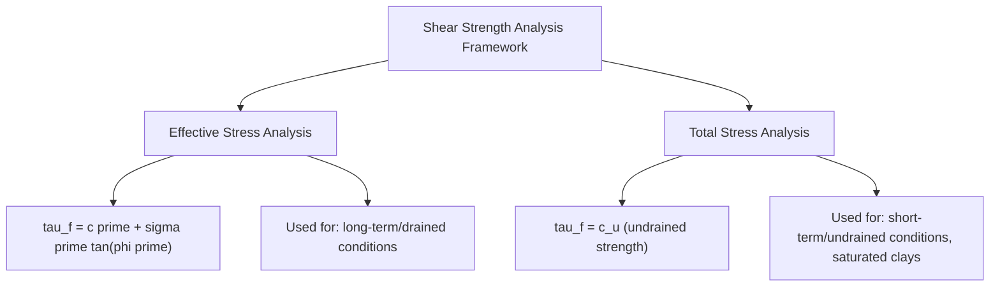
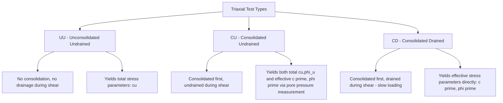
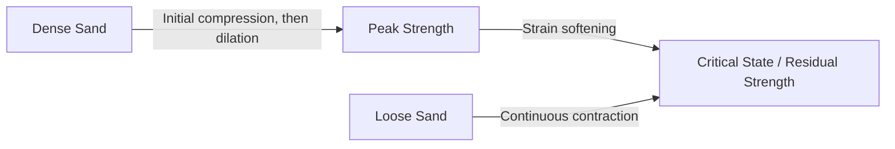

## Shear Strength of Soils

### Definition and Purpose

Shear strength is the maximum shear stress a soil can resist before failure occurs along a slip surface, governing virtually all geotechnical stability problems including bearing capacity of foundations, slope stability, lateral earth pressure on retaining structures, and pile capacity. Unlike most structural materials, soil shear strength is fundamentally stress-dependent (governed by effective stress) and highly sensitive to drainage conditions, stress history, and soil structure.

### Mohr-Coulomb Failure Criterion

The most widely used shear strength framework expresses failure shear stress as a linear function of normal effective stress:

$$\tau_f = c' + \sigma' \tan\phi'$$

where:

- $\tau_f$ = shear stress at failure
- $c'$ = effective cohesion intercept
- $\sigma'$ = effective normal stress on the failure plane
- $\phi'$ = effective angle of internal friction

**In terms of total stress** (for undrained analysis of saturated clays):

$$\tau_f = c_u$$

where $c_u$ is the undrained shear strength, and $\phi_u \approx 0$ for saturated clays under undrained loading (since undrained strength is independent of confining stress when no volume change/drainage occurs).

### Mohr Circle Representation

At failure, the Mohr circle representing the state of stress at a point becomes tangent to the Mohr-Coulomb failure envelope. The relationship between principal stresses at failure and the failure envelope parameters is:

$$\sigma_1' = \sigma_3' \tan^2\left(45° + \frac{\phi'}{2}\right) + 2c'\tan\left(45° + \frac{\phi'}{2}\right)$$

The **failure plane orientation** relative to the major principal stress plane is:

$$\theta_f = 45° + \frac{\phi'}{2}$$

### Illustration: Mohr-Coulomb Failure Envelope (svg_diagram)

<svg xmlns="http://www.w3.org/2000/svg" viewBox="0 0 600 380" font-family="Arial, sans-serif">
<text x="300" y="25" font-size="15" text-anchor="middle" font-weight="bold">Mohr-Coulomb Failure Envelope (svg_diagram)</text>

<line x1="80" y1="320" x2="560" y2="320" stroke="black" stroke-width="1.5" />
<line x1="80" y1="320" x2="80" y2="60" stroke="black" stroke-width="1.5" />
<text x="320" y="355" font-size="12" text-anchor="middle">Normal Stress, σ'</text>
<text x="35" y="190" font-size="12" text-anchor="middle" transform="rotate(-90 35 190)">Shear Stress, τ</text>

<line x1="80" y1="280" x2="500" y2="90" stroke="#a93226" stroke-width="2.5" />
<text x="380" y="130" font-size="11" fill="#a93226" transform="rotate(-24 380 130)">τf = c' + σ' tan(φ')</text>

<circle cx="80" cy="280" r="4" fill="black" />
<text x="90" y="285" font-size="10">c'</text>

<circle cx="220" cy="320" r="60" fill="none" stroke="#1a5276" stroke-width="2" />

<circle cx="380" cy="320" r="120" fill="none" stroke="#1e8449" stroke-width="2" />

<text x="220" y="340" font-size="9" text-anchor="middle">Test 1</text>

<text x="380" y="340" font-size="9" text-anchor="middle">Test 2</text>

<text x="150" y="245" font-size="9">σ3'</text>

<text x="280" y="245" font-size="9">σ1'</text>

<text x="255" y="200" font-size="9">σ3'</text>

<text x="500" y="200" font-size="9">σ1'</text>

</svg>

### Drained vs. Undrained Shear Strength

**Drained (Effective Stress) Conditions**

Occur when loading is applied slowly enough (or the soil is sufficiently permeable) that excess pore pressure fully dissipates during loading, so shear strength is governed by effective stress parameters $c'$ and $\phi'$. This applies to:

- Coarse-grained soils (sands, gravels) under virtually all loading rates, due to high permeability
- Fine-grained soils under slow, long-term loading (e.g., long-term slope stability after construction)

**Undrained (Total Stress) Conditions**

Occur when loading is applied faster than pore pressure can dissipate, typical of saturated fine-grained soils (clays) under rapid construction loading (e.g., immediately after embankment placement, or during rapid drawdown). Shear strength is characterized by the undrained shear strength $c_u$ (also denoted $s_u$), determined without allowing drainage during testing.

**[Inference]** The specific determination of whether a field loading scenario should be analyzed as drained or undrained depends on the relative rate of loading compared to the soil's consolidation characteristics (permeability, layer thickness, drainage path length); this assessment generally requires engineering judgment informed by the coefficient of consolidation and construction timeline rather than a fixed universal rule.

### Laboratory Shear Strength Testing Methods

**1. Direct Shear Test**

A soil sample is placed in a split shear box and sheared along a predetermined horizontal plane by displacing the upper half relative to the lower half, while a normal load is applied vertically. Multiple tests at different normal stresses allow plotting of the failure envelope.

*Advantages*: Simple, relatively quick, useful for cohesionless soils and residual strength determination.

*Limitations*: Forces failure along a predetermined horizontal plane (which may not be the actual weakest plane), does not allow direct pore pressure measurement, and produces non-uniform strain distribution across the sample.

**2. Triaxial Compression Test**

A cylindrical soil specimen is confined by a rubber membrane and cell fluid providing controlled confining pressure ($\sigma_3$), then axially loaded to failure while measuring axial stress, strain, and (depending on test type) pore pressure or volume change.

*Advantages*: Allows control of drainage conditions, direct pore pressure measurement, and more uniform stress/strain conditions compared to direct shear.

**Triaxial Test Types:**

**Unconsolidated Undrained (UU) Test**: Sample is not allowed to consolidate under the confining pressure, and drainage is prevented during shearing. Used to estimate the in-situ undrained shear strength for short-term (rapid loading) stability analysis, commonly yielding $\phi_u \approx 0$ for saturated clays (constant $c_u$ regardless of confining pressure).

**Consolidated Undrained (CU) Test**: Sample is allowed to consolidate fully under the confining pressure before shearing, but drainage is prevented during the shear phase itself, with pore pressure measured throughout. This test provides both total stress parameters and, via pore pressure measurement, effective stress parameters ($c'$, $\phi'$) from the same test.

**Consolidated Drained (CD) Test**: Sample is consolidated under confining pressure and then sheared very slowly, allowing full drainage throughout (no excess pore pressure develops). This directly yields effective stress parameters but requires much longer testing time than CU tests, particularly for low-permeability clays.

**3. Vane Shear Test (Field or Laboratory)**

A four-bladed vane is inserted into soft clay and rotated to measure torque at failure, from which undrained shear strength is calculated:

$$c_u = \frac{T}{\pi D^2\left(\frac{H}{2} + \frac{D}{6}\right)}$$

where $T$ = torque at failure, $D$ = vane diameter, $H$ = vane height. Particularly useful for very soft, sensitive clays where sample disturbance during triaxial specimen preparation would significantly affect results.

**4. Unconfined Compression Test**

A cylindrical clay specimen is loaded axially without any lateral confinement until failure, providing a rapid (though approximate) estimate of undrained shear strength:

$$c_u = \frac{q_u}{2}$$

where $q_u$ is the unconfined compressive strength (maximum axial stress at failure).

**[Inference]** The unconfined compression test implicitly assumes $\phi_u = 0$ and is strictly valid only for fully saturated clays tested rapidly enough to prevent drainage; results can be significantly affected by sample disturbance, and this test is generally considered less reliable than triaxial UU testing for critical design applications, though it remains widely used for preliminary/index-level strength estimation due to its speed and simplicity.

### Pore Pressure Parameters (Skempton's A and B)

For consolidated undrained triaxial tests, pore pressure response to applied stress is characterized by Skempton's pore pressure parameters:

$$\Delta u = B[\Delta\sigma_3 + A(\Delta\sigma_1 - \Delta\sigma_3)]$$

where:

- $B$ = pore pressure parameter relating pore pressure change to isotropic stress change (approaches 1.0 for fully saturated soils, less than 1.0 for partially saturated soils, providing a useful saturation check)
- $A$ = pore pressure parameter relating pore pressure change to deviator stress change (varies with soil type, stress history, and stress level; can be negative for heavily overconsolidated clays due to dilative tendency)

### Behavior of Sands: Dilatancy and Critical State

**Dense sand**: Under shear, dense (tightly packed) sand initially compresses slightly then dilates (expands in volume) as particles must ride up and over one another to move relative to each other, producing a distinct peak shear strength followed by strain-softening toward a lower residual strength.

**Loose sand**: Under shear, loose sand contracts (decreases in volume) throughout loading and does not exhibit a pronounced peak strength, instead approaching a critical state strength gradually without significant post-peak reduction.

**Critical State/Ultimate Strength**: At large strains, both dense and loose sand specimens of the same material tend to converge toward the same "critical state" void ratio and corresponding shear strength (critical state friction angle, $\phi_{cv}$), independent of initial density.

**[Inference]** The specific relationship between relative density, confining pressure, and the magnitude of the peak-to-critical-state strength difference is well established qualitatively in soil mechanics, but exact numerical peak friction angle values for a given sand require direct testing (e.g., triaxial or direct shear at representative density and confining stress), since peak strength is influenced by particle shape, gradation, and mineralogy beyond relative density alone.

### Peak vs. Residual Strength in Clays

Similar to dense sand, stiff overconsolidated clays can exhibit a pronounced peak strength followed by strain-softening to a lower residual strength as clay particles reorient (align parallel to the shear direction) along an established failure/slip surface. This is particularly significant for:

- **Progressive failure** in slopes, where strain is non-uniform and portions of a slip surface may have already passed peak strength and softened toward residual before failure becomes fully mobilized along the entire surface.
- **Reactivated landslides**, where a pre-existing slip surface has already been sheared to residual strength, making the slope susceptible to renewed movement even under conditions that would not cause a first-time (peak strength) failure.

### Effective Stress Failure Envelope Curvature

**[Inference]** While the Mohr-Coulomb criterion assumes a linear failure envelope, many soils (particularly sands and some clays tested over a wide confining stress range) exhibit a slightly curved failure envelope, especially at low confining stresses; for practical design over typical stress ranges, the linear approximation is standard, but for projects involving unusually high or low confining stresses, a curved (or bilinear) envelope derived from testing across the actual stress range of interest may be more appropriate.

### Factors Affecting Measured Shear Strength

- **Stress history (OCR)**: Overconsolidated clays generally exhibit higher peak strength and a non-zero effective cohesion intercept compared to normally consolidated clays of the same mineralogy, due to prior compression and particle bonding effects.
- **Strain rate**: Shear strength (particularly for clays) can be somewhat rate-dependent, with faster loading rates sometimes producing different (often higher, in undrained conditions) apparent strength compared to slow loading, though the magnitude of this effect is soil-specific.
- **Sample disturbance**: Disturbance during sampling, transport, and specimen preparation can significantly alter measured strength, particularly for sensitive clays, generally reducing measured peak strength compared to true in-situ conditions.
- **Anisotropy**: Natural soil deposits often exhibit different strength depending on the orientation of the failure plane relative to the original depositional bedding, which laboratory tests on vertically-trimmed samples may not fully capture depending on the field failure geometry of interest.

### Example: Effective Stress Parameter Determination from CU Triaxial Tests

**Given CU triaxial test results (two tests on the same clay):**

| Test | Confining Pressure $\sigma_3$ (kPa) | Deviator Stress at Failure $(\sigma_1-\sigma_3)_f$ (kPa) | Pore Pressure at Failure $u_f$ (kPa) |
| --- | --- | --- | --- |
| 1 | 100 | 180 | 40 |
| 2 | 200 | 320 | 75 |

**Step 1 — Calculate total and effective principal stresses at failure for each test:**

Test 1: $\sigma_1 = 100+180 = 280$ kPa; $\sigma_1' = 280-40 = 240$ kPa; $\sigma_3' = 100-40 = 60$ kPa

Test 2: $\sigma_1 = 200+320 = 520$ kPa; $\sigma_1' = 520-75 = 445$ kPa; $\sigma_3' = 200-75 = 125$ kPa

**Step 2 — Using the relationship $\sigma_1' = \sigma_3' \tan^2(45°+\phi'/2) + 2c'\tan(45°+\phi'/2)$, set up two equations and solve simultaneously (or use $p'$-$q$ plot method for a more standard graphical solution):**

**[Inference]** A full numerical solution requires either graphical Mohr circle plotting or a $p'$-$q$ (stress path) plot with the modified failure line $K_f$ line, from which $\phi'$ and $c'$ are back-calculated via $\sin\phi' = \tan\alpha$ (where $\alpha$ is the $K_f$ line slope) and $c' = a/\cos\phi'$ (where $a$ is the $K_f$ line intercept); presenting a complete worked numerical solution here would require additional graphical construction beyond algebraic simplification, so the method is outlined rather than fully solved numerically.

### Common Testing and Analysis Pitfalls

- **Mixing total and effective stress parameters**: Using $c'$, $\phi'$ with total stress, or $c_u$ with effective stress, produces meaningless or grossly incorrect strength predictions—strength parameters and stress type must always be paired consistently.
- **Applying UU test results to long-term (drained) stability problems**: UU strength represents short-term, undrained behavior only; long-term stability (e.g., years after embankment construction) requires drained (effective stress) parameters instead.
- **Ignoring strain-softening behavior in progressive failure scenarios**: Using peak strength uniformly along an entire potential failure surface can be unconservative where some portions of the surface have already reached large strain (post-peak, softened) conditions, particularly relevant to slopes with pre-existing shear surfaces.
- **Neglecting sample disturbance effects**, particularly for soft, sensitive clays, where measured strength from disturbed samples can be substantially lower than true in-situ strength.
- **Applying direct shear test results without considering forced failure plane limitations**: The predetermined horizontal failure plane in direct shear may not represent the critical failure surface orientation in the field, particularly for anisotropic or structured soils.

### Related Topics

- Effective stress principle
- Consolidation and settlement of fine-grained soils
- Slope stability analysis methods
- Bearing capacity theory for shallow foundations
- Index properties and Atterberg limits (correlation with strength parameters)
- Permeability and seepage analysis (drainage condition assessment)
- Sensitivity of clays and quick clay behavior
- Lateral earth pressure theory (Rankine and Coulomb)