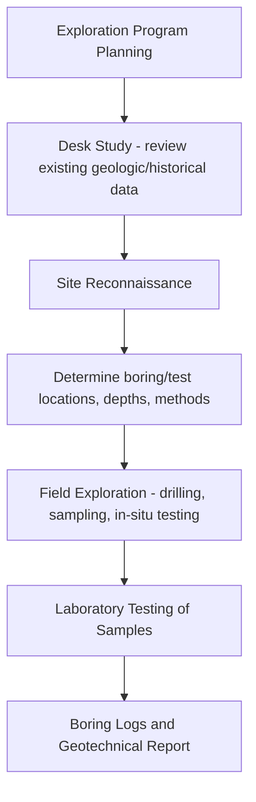
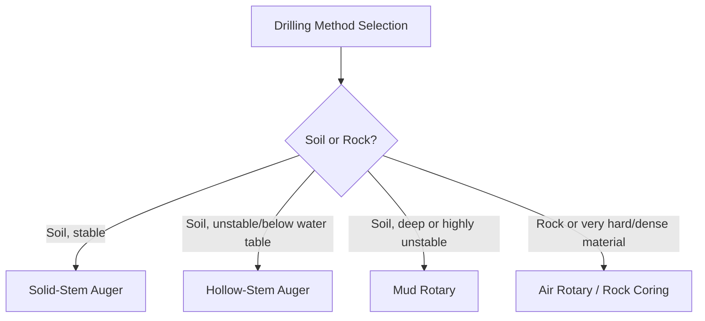
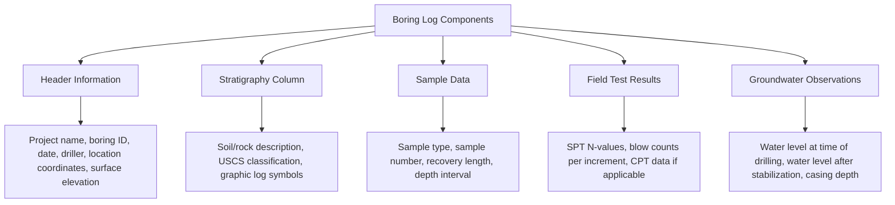

## Subsurface Exploration Methods and Boring Logs

### Definition and Purpose

Subsurface exploration is the systematic investigation of soil and rock conditions beneath a proposed construction site, undertaken to characterize stratigraphy, obtain samples for laboratory testing, measure in-situ engineering properties, and locate groundwater conditions. This information forms the basis for foundation design, earthwork planning, and geotechnical risk assessment. Boring logs are the standardized field and laboratory records documenting what was encountered at each exploration location, serving as the primary data source for subsequent geotechnical analysis and design.

### Planning a Subsurface Exploration Program

**Factors Influencing Exploration Scope:**

- Structure type, size, and anticipated loads
- Site geology and anticipated soil variability
- Known or suspected problem conditions (fill, organic soils, karst, expansive clay, liquefaction potential)
- Regulatory/code minimum requirements for boring spacing and depth
- Budget and schedule constraints

**Typical Boring Depth and Spacing Guidance**

**[Unverified]** General industry guidance (such as that summarized in various geotechnical engineering references and some building codes) suggests boring depths sufficient to penetrate significant stress influence zones beneath foundations (often cited informally as one to two times the anticipated foundation width below the bearing level for shallow foundations, or extending well below anticipated pile tip elevations for deep foundations) and boring spacing that captures site variability (ranging widely from roughly 15 m to 60+ m depending on structure type and site homogeneity); because these figures vary substantially by code, structure type, and regional practice, project-specific requirements from the governing building code and geotechnical engineer of record should always be consulted rather than relying on generic spacing/depth rules.

### Preliminary Desk Study and Site Reconnaissance

Before mobilizing drilling equipment, a desk study reviews:

- Published geologic maps and soil surveys
- Historical aerial photographs and topographic maps (identifying past site use, filled areas, or former water bodies)
- Existing nearby boring logs or geotechnical reports
- Utility locations and site access constraints

Site reconnaissance involves a physical walkover to observe surface conditions, existing structures/distress, vegetation (potentially indicating soil/moisture conditions), surface drainage patterns, and any evidence of slope instability or other geologic hazards.

### Drilling and Boring Methods

**1. Hollow-Stem Auger (HSA) Drilling**

A continuous-flight auger with a hollow center allows sampling tools to be advanced through the auger stem without removing the auger from the borehole, providing casing-like support to prevent hole collapse in unstable soils. Widely used in soil (non-rock) drilling for standard geotechnical investigations due to its versatility and relative speed.

**2. Solid-Stem (Continuous-Flight) Auger Drilling**

Similar to hollow-stem auger but without the hollow center; the auger must be removed to allow sampling, limiting its use primarily to stable soils above the water table where borehole collapse is not a significant concern.

**3. Mud Rotary Drilling**

Uses circulating drilling fluid (bentonite slurry or polymer mud) to stabilize the borehole wall and carry cuttings to the surface while a rotating bit advances the hole. Effective in a wide range of soil and soft rock conditions, and commonly used when advancing through unstable or caving soils, or for deeper borings.

**4. Air Rotary / Rotary Percussion Drilling**

Uses compressed air (sometimes with water/foam injection) to remove cuttings and cool the drill bit, commonly used for rock drilling or hard/dense soil/rock conditions where mud rotary methods are less effective or where mud contamination of samples is undesirable.

**5. Rock Coring**

Uses a diamond or tungsten-carbide core barrel to extract a continuous, intact cylindrical rock core sample once bedrock or a hard formation is encountered, allowing direct observation of rock quality, fracturing, and strength characteristics.

### Soil Sampling Methods

**Standard Penetration Test (SPT) Sampling**

A split-spoon (split-barrel) sampler is driven into the soil at the bottom of the borehole using a 63.5 kg (140 lb) hammer falling 760 mm (30 in), with blow counts recorded for each of three 150 mm (6 in) increments. The sum of blow counts for the second and third increments constitutes the SPT N-value (blows per 300 mm penetration), a widely used index of relative density (for sands) or consistency (for clays), while also recovering a disturbed sample for visual classification and index testing.

**[Inference]** SPT N-values are subject to numerous influencing factors (hammer energy efficiency, rod length, borehole diameter, sampler type, overburden pressure) that require correction (e.g., to a standardized $N_{60}$ or $(N_1)_{60}$ value) for reliable engineering correlation; raw field N-values should generally not be used directly in empirical design correlations without appropriate corrections, per standard geotechnical practice (e.g., as outlined in ASTM D1586 and subsequent correlation literature).

**Thin-Walled (Shelby) Tube Sampling**

A thin-walled steel tube is hydraulically pushed (not driven) into soft-to-stiff cohesive soil to obtain a relatively undisturbed sample suitable for laboratory strength and consolidation testing. Effective primarily in cohesive soils; not suitable for sampling cohesionless (sandy/gravelly) soils, which cannot be retained in the tube without significant disturbance.

**Piston Sampling**

A refinement of the thin-wall tube method incorporating an internal piston that helps prevent sample disturbance and improves sample recovery, particularly beneficial for very soft or sensitive clays where standard Shelby tube sampling may still cause excessive disturbance.

**Bulk (Disturbed) Sampling**

Larger-volume disturbed samples collected from auger cuttings or test pits, used primarily for index testing, compaction testing, and material classification where sample structure disturbance is not a concern for the intended testing.

### In-Situ Testing Methods

**Cone Penetration Test (CPT)**

A cone-tipped probe is hydraulically pushed into the ground at a constant rate while continuously measuring cone tip resistance ($q_c$), sleeve friction ($f_s$), and (for CPTu variants) pore water pressure, providing a continuous, high-resolution profile of soil behavior with depth without physical sample recovery.

*Advantages*: Continuous data (versus discrete intervals in SPT), highly repeatable, provides direct estimates of soil behavior type via established correlation charts.

*Limitations*: Cannot recover physical samples for laboratory testing or visual soil classification, and penetration can be refused in dense gravel, cobbles, or very stiff/hard strata.

**Vane Shear Test (Field)**

As discussed under shear strength testing, a field vane is inserted and rotated to measure in-situ undrained shear strength of soft clay directly, without the disturbance associated with sample recovery and transport.

**Pressuremeter Test (PMT)**

A cylindrical probe is inserted into a borehole (or pushed, for self-boring pressuremeters) and expanded radially against the borehole wall while measuring pressure-volume (or pressure-displacement) response, providing in-situ stress-strain behavior and estimates of soil stiffness and strength.

**Dilatometer Test (DMT)**

A flat, blade-shaped probe with a expandable circular membrane is pushed into the ground, and the membrane is inflated at set depth intervals to measure lift-off and expansion pressures, from which soil type, stress history (OCR), and stiffness parameters can be estimated via established correlations.

### Groundwater Observation

Groundwater level is typically measured in an open borehole after a stabilization period (since drilling fluid or recent precipitation can temporarily disturb natural groundwater levels), or more reliably through installation of a piezometer or observation well left in place for longer-term monitoring, particularly important in low-permeability soils where water levels equilibrate slowly after drilling disturbance.

**[Inference]** A single water level reading taken immediately after drilling is generally considered less reliable than readings taken after a stabilization period or from a properly installed piezometer, particularly in fine-grained soils; seasonal water table fluctuation should also be considered, since a single reading (regardless of stabilization) only represents conditions at that specific time of year and cannot by itself establish the full range of expected water table variation.

### Test Pits and Trenching

For shallow investigation depths (typically up to several meters, depending on excavation equipment and soil stability), test pits or trenches excavated by backhoe allow direct visual observation of soil stratigraphy, in-place testing, and larger-volume disturbed sample collection. Particularly useful for evaluating fill materials, shallow utility conflicts, or conditions requiring direct visual assessment (e.g., fault trenching for seismic hazard evaluation).

### Rock Quality Designation (RQD)

For rock coring, Rock Quality Designation quantifies rock mass quality based on the degree of fracturing recovered in the core:

$$RQD = \frac{\sum \text{length of core pieces} \geq 100 \text{ mm}}{\text{total length of core run}} \times 100\%$$

**RQD Classification (widely cited, per Deere's original classification):**

- 0–25%: Very poor
- 25–50%: Poor
- 50–75%: Fair
- 75–90%: Good
- 90–100%: Excellent

### Boring Log Components

A standard boring log documents the following information systematically with depth:

**Header Information**: Project identification, boring designation/number, drilling date, drilling contractor, drill rig type, drilling method, ground surface elevation and coordinates, total depth drilled, and name of the field geologist/engineer logging the boring.

**Stratigraphic Column**: A graphic representation (often using standardized USCS symbols/patterns) of soil/rock layers encountered with depth, accompanied by written descriptions including soil type, color, moisture condition, consistency/density, and any notable inclusions (organics, debris, cobbles).

**Sample Information**: For each sample taken, the log records sample type (SPT split-spoon, Shelby tube, etc.), sample number, depth interval, percent recovery, and (for SPT) individual blow counts for each 150 mm increment along with the calculated N-value.

**Field and Laboratory Test Data**: Often includes pocket penetrometer or torvane readings taken in the field on recovered samples (providing a quick, approximate undrained strength estimate), and may reference laboratory test results (Atterberg limits, water content, grain size) once available, sometimes presented directly on the log or in a companion laboratory summary table.

**Groundwater Information**: Depth to water encountered during drilling, depth to water after a stated stabilization period, and any observations of drilling fluid loss (indicating highly permeable zones) or artesian conditions (water rising above the encountered level, indicating confined aquifer conditions).

### Illustration: Simplified Boring Log Layout (svg_diagram)

<svg xmlns="http://www.w3.org/2000/svg" viewBox="0 0 620 440" font-family="Arial, sans-serif">
<text x="310" y="25" font-size="15" text-anchor="middle" font-weight="bold">Simplified Boring Log Layout (svg_diagram)</text>

<rect x="40" y="40" width="540" height="40" fill="#eef2f3" stroke="black" stroke-width="1" />
<text x="60" y="55" font-size="10">Project: Example Site</text>
<text x="60" y="70" font-size="10">Boring: B-1 Date: 2026-XX-XX Surface Elev: 100.0 m</text>
<text x="400" y="55" font-size="10">Driller: XYZ Drilling</text>
<text x="400" y="70" font-size="10">Method: HSA / SPT</text>

<line x1="40" y1="80" x2="580" y2="80" stroke="black" stroke-width="1" />
<text x="55" y="95" font-size="9" font-weight="bold">Depth(m)</text>
<text x="110" y="95" font-size="9" font-weight="bold">Graphic</text>
<text x="180" y="95" font-size="9" font-weight="bold">Description / USCS</text>
<text x="400" y="95" font-size="9" font-weight="bold">Sample/N-value</text>
<text x="500" y="95" font-size="9" font-weight="bold">Water</text>
<line x1="40" y1="100" x2="580" y2="100" stroke="black" stroke-width="1" />

<rect x="100" y="105" width="60" height="60" fill="#deb887" />
<text x="55" y="140" font-size="9">0-1.5</text>
<text x="180" y="120" font-size="9">Brown silty SAND, moist</text>
<text x="180" y="135" font-size="9">(SM), medium dense</text>
<text x="400" y="130" font-size="9">SPT-1, N=14</text>
<rect x="100" y="165" width="60" height="90" fill="#c9a876" />
<text x="55" y="215" font-size="9">1.5-4.0</text>
<text x="180" y="185" font-size="9">Gray CLAY, soft to</text>
<text x="180" y="200" font-size="9">medium stiff, moist</text>
<text x="180" y="215" font-size="9">(CL)</text>
<text x="400" y="200" font-size="9">SPT-2, N=6</text>
<text x="400" y="220" font-size="9">Shelby Tube ST-1</text>
<line x1="90" y1="230" x2="580" y2="230" stroke="#1a5276" stroke-width="1.5" stroke-dasharray="4,2" />
<text x="500" y="228" font-size="9" fill="#1a5276">▽ WT @ 2.1m</text>
<rect x="100" y="255" width="60" height="70" fill="#999" />
<text x="55" y="290" font-size="9">4.0-6.0</text>
<text x="180" y="275" font-size="9">Dense gravelly SAND</text>
<text x="180" y="290" font-size="9">(SP), wet</text>
<text x="400" y="285" font-size="9">SPT-3, N=32</text>
<line x1="40" y1="325" x2="580" y2="325" stroke="black" stroke-width="1.5" />
<text x="300" y="345" font-size="10" text-anchor="middle">Boring Terminated at 6.0 m</text>
</svg>

### Soil Description Standards

Field soil descriptions typically follow standardized visual-manual identification procedures (per ASTM D2488 or equivalent), documenting:

- Primary soil type and USCS group symbol (field-estimated, pending laboratory confirmation)
- Color (using consistent terminology, sometimes with Munsell color chart reference)
- Moisture condition (dry, moist, wet, saturated)
- Consistency (for cohesive soils: soft, firm, stiff, very stiff, hard) or relative density (for cohesionless soils: very loose, loose, medium dense, dense, very dense), often correlated to SPT N-value ranges
- Additional descriptors: plasticity, structure (laminated, fissured, blocky), presence of organics, odor, and any other notable characteristics

**[Unverified]** Correlation tables linking SPT N-value ranges to descriptive consistency/density terms (e.g., "N=4-8 → soft to firm") appear in multiple standard references but with some variation in exact boundary values between sources; the specific correlation table adopted by the project's geotechnical firm or governing standard should be used consistently throughout a given project's documentation.

### Sample Handling, Transport, and Preservation

- Samples (particularly undisturbed Shelby tube samples) should be sealed immediately after extrusion or capping to prevent moisture loss, labeled clearly with boring number, depth, and orientation, and transported/stored in a manner that minimizes disturbance (avoiding excessive vibration, temperature extremes, or prolonged storage before testing).
- Chain-of-custody documentation is maintained to track sample handling from field collection through laboratory testing, particularly important for projects with regulatory or quality assurance requirements.

### Common Exploration Program Pitfalls

- **Insufficient boring depth**: Terminating borings too shallow to capture compressible layers or bearing strata below the zone of significant stress influence, potentially missing critical settlement-controlling layers.
- **Inadequate boring spacing for variable site conditions**: Using generic spacing guidelines without adjusting for known or suspected site variability (e.g., karst terrain, old channel deposits, fill areas), risking unrepresentative characterization between boring locations.
- **Relying solely on SPT N-values without corrections**: Using raw, uncorrected N-values directly in empirical bearing capacity or liquefaction correlations without applying standard energy, overburden, and equipment corrections.
- **Insufficient groundwater monitoring duration**: Taking a single water level reading immediately after drilling in low-permeability soils, which may not reflect the true stabilized groundwater level or capture seasonal high-water conditions.
- **Poor sample preservation leading to moisture loss or disturbance**: Compromising the reliability of subsequent laboratory index and strength testing due to inadequate field handling procedures.
- **Failing to correlate borings across the site into a coherent subsurface model**: Treating each boring log in isolation rather than developing cross-sections that identify continuity (or discontinuity) of strata across the site, which is essential for anticipating differential conditions between foundation elements.

### Related Topics

- Soil formation, composition, and classification
- Index properties and Atterberg limits
- Shear strength of soils (correlation with in-situ test data)
- SPT N-value corrections and correlations to soil engineering properties
- CPT-based soil behavior type classification
- Geotechnical report preparation and interpretation
- Mat foundation design basics (data requirements from exploration)
- Liquefaction susceptibility assessment using SPT/CPT data