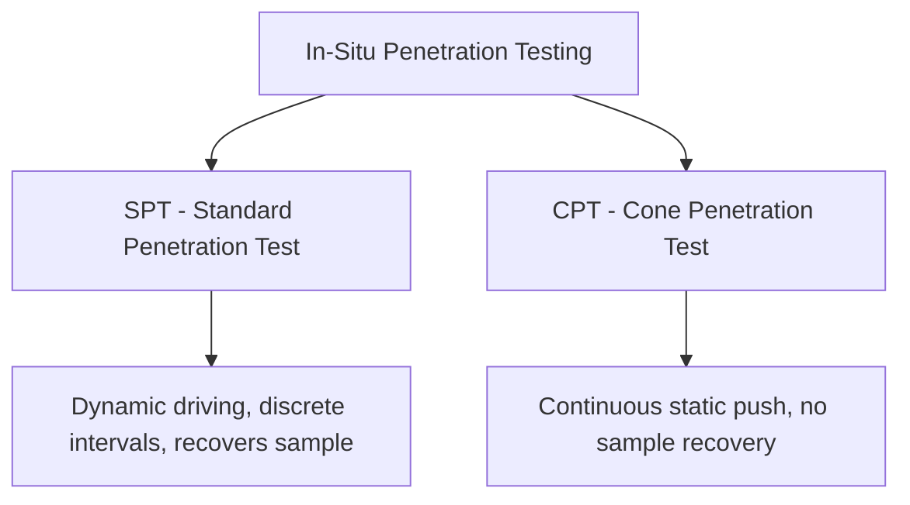
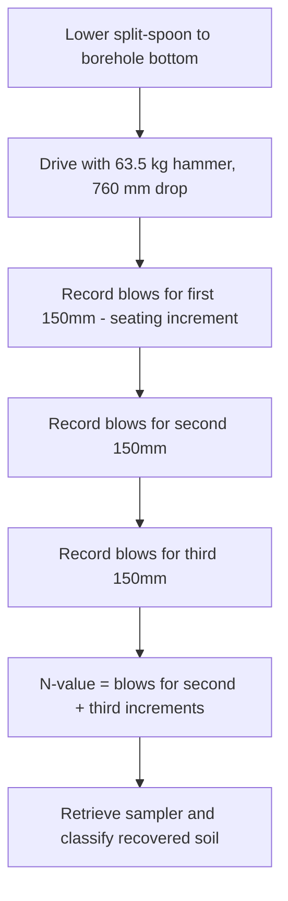
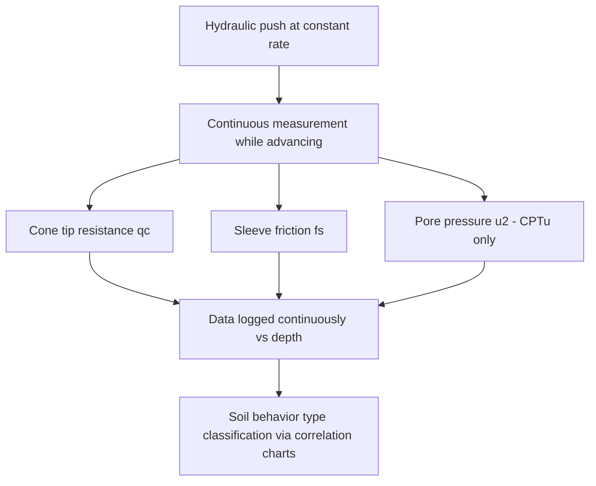

## Standard Penetration and Cone Penetration Testing

### Definition and Purpose

Standard Penetration Testing (SPT) and Cone Penetration Testing (CPT) are the two most widely used in-situ testing methods for characterizing subsurface soil engineering properties. Both provide indirect measures of soil resistance that correlate with density, strength, and compressibility parameters through empirical relationships developed over decades of geotechnical practice, offering faster and often more economical alternatives (or complements) to laboratory testing of recovered samples.

### Standard Penetration Test (SPT) Procedure

Performed per ASTM D1586 (or equivalent international standard), the SPT is conducted within a borehole at the base of the drilled hole:

1. A split-spoon (split-barrel) sampler, typically 50 mm outside diameter, is attached to drill rods and lowered to the bottom of the borehole.
2. A standardized hammer of 63.5 kg (140 lb) mass is raised and dropped a height of 760 mm (30 in) to drive the sampler into undisturbed soil below the borehole bottom.
3. The sampler is driven a total of 450 mm (18 in), with blow counts recorded separately for each of three successive 150 mm (6 in) increments.
4. The blow counts for the first 150 mm increment are typically excluded (considered to represent disturbed soil at the bottom of the borehole from prior drilling), and the **N-value** is defined as the sum of blow counts for the second and third increments (i.e., blows required to drive the sampler from 150 mm to 450 mm penetration).
5. The sampler is retrieved, and the recovered (disturbed) soil sample is examined, classified, and retained for index testing.

**Refusal Criteria**: If a specified number of blows (commonly 50, per common convention, though exact refusal criteria may vary by specification) is reached without completing a full 150 mm increment, the test is typically terminated and recorded as "refusal," with the penetration achieved for that blow count noted.

### SPT Hammer Types and Energy Efficiency

Different hammer release mechanisms produce different energy transfer efficiency to the sampling rods, significantly affecting raw N-values obtained from nominally identical procedures:

- **Safety hammer**: Encloses the falling weight, releasing it via a trip mechanism; commonly used in North American practice.
- **Automatic (trip) hammer**: Mechanically automated release providing more consistent, typically higher energy transfer efficiency compared to manual methods.
- **Donut hammer**: An older hammer type with a rope-and-cathead manual release mechanism, generally associated with lower and more variable energy efficiency.

**[Unverified]** Typical energy transfer efficiency ranges cited in geotechnical literature vary by hammer type and operator technique (commonly cited approximate ranges span roughly 45% to 90% of theoretical free-fall energy depending on hammer/system type), which is precisely why N-value correction to a standardized reference energy is considered standard practice; specific efficiency values for a given rig/hammer combination should ideally be established through calibration testing rather than assumed from generic literature ranges.

### N-Value Corrections

**Correction to Standard Energy Ratio ($N_{60}$)**

Raw field N-values are corrected to a reference energy ratio of 60% (representing a widely adopted historical baseline for correlation development):

$$N_{60} = \frac{N_{field} \times E_m \times C_B \times C_S \times C_R}{60}$$

where:

- $E_m$ = hammer energy efficiency (as a percentage, from calibration or typical values for the hammer/rig system)
- $C_B$ = borehole diameter correction
- $C_S$ = sampler correction (with or without liner)
- $C_R$ = rod length correction (accounting for energy losses in short rod strings, most significant for shallow tests)

**Overburden Pressure Correction ($(N_1)_{60}$)**

For use in liquefaction analysis and certain other correlations, $N_{60}$ is further corrected to account for the effect of overburden (confining) pressure on measured penetration resistance, normalizing results to a reference effective overburden stress (commonly 1 atmosphere, approximately 100 kPa):

$$(N_1)_{60} = C_N \times N_{60}$$

$$C_N = \sqrt{\frac{P_a}{\sigma_{v0}'}} \quad \text{(one commonly cited form, per Liao and Whitman, subject to an upper limit typically around 1.7 in most formulations)}$$

where $P_a$ = reference atmospheric pressure and $\sigma_{v0}'$ = effective overburden stress at the test depth.

**[Inference]** Multiple $C_N$ formulations exist in the geotechnical literature (Liao & Whitman, Skempton, Seed & Idriss, among others), producing somewhat different correction values, particularly at very shallow or very deep test depths; the specific formulation and any applicable upper/lower bounds should be selected consistent with the correlation or design method being applied, since correction formulas and downstream correlations are often developed as matched pairs.

### SPT N-Value Correlations

**Relative Density of Sand (approximate, widely cited but soil-specific):**

| $N_{60}$ (blows/300mm) | Relative Density Description |
| --- | --- |
| 0–4 | Very loose |
| 4–10 | Loose |
| 10–30 | Medium dense |
| 30–50 | Dense |
| >50 | Very dense |

**Undrained Shear Strength of Clay (approximate correlation, e.g., per Terzaghi & Peck and subsequent refinements):**

$$c_u \approx K \times N_{60}$$

where $K$ is an empirical constant, commonly cited in the approximate range of 4–6 kPa per blow (varying by soil plasticity and geologic origin).

**[Unverified]** SPT-based strength and density correlations are widely used for preliminary design and are well-established in geotechnical practice, but published correlation constants vary meaningfully between references and regional calibration studies; site-specific correlation validation against laboratory or other in-situ test data is standard best practice, particularly for final design of significant structures.

### Cone Penetration Test (CPT) Procedure

Performed per ASTM D5778 (or equivalent), the CPT involves hydraulically pushing an instrumented cone-tipped probe into the ground at a constant, standardized rate (typically 20 mm/s) while continuously recording:

- **Cone tip resistance ($q_c$)**: Resistance measured at the conical tip of the probe (typically 60° apex angle, 10 cm² or 15 cm² projected base area)
- **Sleeve friction ($f_s$)**: Frictional resistance measured along a cylindrical friction sleeve located just above the cone tip
- **Pore water pressure ($u$)**: For piezocone (CPTu) variants, measured at one or more locations on the probe (commonly at the cone shoulder, designated $u_2$), providing continuous pore pressure profiling

### Derived CPT Parameters

**Friction Ratio:**

$$R_f = \frac{f_s}{q_c} \times 100\%$$

Friction ratio is a key parameter for soil behavior type classification: cohesionless soils (sands) typically exhibit low friction ratios (high tip resistance relative to sleeve friction), while cohesive soils (clays) typically exhibit higher friction ratios (lower tip resistance relative to sleeve friction resulting from their different failure mechanism around the cone).

**Corrected Cone Resistance (for CPTu, accounting for pore pressure acting on unequal end areas of the cone geometry):**

$$q_t = q_c + u_2(1-a)$$

where $a$ is the net area ratio of the cone (a manufacturer-provided calibration parameter, typically ranging from about 0.5 to 0.85 depending on cone design).

**[Inference]** The correction from $q_c$ to $q_t$ becomes increasingly significant in soft, saturated fine-grained soils where pore pressure is substantial relative to tip resistance; in stiff, dry, or coarse-grained soils where pore pressure is low, the correction is often comparatively minor, though the exact significance depends on site-specific conditions and is best evaluated directly from the recorded data rather than assumed.

### Soil Behavior Type (SBT) Classification from CPT

CPT data is commonly interpreted using empirical soil behavior type charts (such as those developed by Robertson and colleagues), which plot normalized or non-normalized $q_c$ (or $q_t$) against friction ratio $R_f$ (or a normalized friction ratio) to estimate the likely soil behavior type without direct sample recovery.

**Normalized Soil Behavior Type Index ($I_c$)**, a commonly used simplified single-parameter classification (per Robertson's updated CPT classification approach):

$$I_c = \sqrt{(3.47 - \log Q_t)^2 + (\log F_r + 1.22)^2}$$

where $Q_t$ and $F_r$ are normalized tip resistance and friction ratio parameters, respectively (each incorporating corrections for overburden stress).

**[Inference]** The Robertson SBT charts and $I_c$ index estimate soil *behavior type* (i.e., how the soil behaves mechanically) rather than a strict grain-size-based classification (like USCS), and while correlation between SBT and conventional USCS classification is generally reasonable, discrepancies can occur for soils with unusual mineralogy, cementation, or structure; direct sampling/laboratory confirmation remains valuable for critical classification decisions.

### CPT-Based Engineering Parameter Correlations

**Undrained Shear Strength of Clay:**

$$c_u = \frac{q_t - \sigma_{v0}}{N_{kt}}$$

where $\sigma_{v0}$ = total overburden stress and $N_{kt}$ = empirical cone factor, commonly ranging from approximately 10 to 20 depending on soil type, plasticity, and regional calibration.

**Relative Density and Friction Angle of Sand**: Multiple empirical correlations exist (e.g., Robertson & Campanella, Kulhawy & Mayne) relating normalized cone resistance to relative density and peak friction angle, generally requiring normalization for overburden stress.

**[Unverified]** Cone factor $N_{kt}$ and sand correlation constants vary meaningfully by region, soil type, and specific correlation study; local calibration against laboratory triaxial or vane shear data is generally recommended practice rather than applying generic literature values without verification, particularly for significant design decisions.

### Illustration: SPT vs. CPT Data Profile Comparison (svg_diagram)

<svg xmlns="http://www.w3.org/2000/svg" viewBox="0 0 640 420" font-family="Arial, sans-serif">
<text x="320" y="25" font-size="15" text-anchor="middle" font-weight="bold">SPT vs. CPT Data Profile (svg_diagram)</text>

<line x1="90" y1="60" x2="90" y2="380" stroke="black" stroke-width="1.5" />
<text x="40" y="220" font-size="11" transform="rotate(-90 40 220)">Depth (m)</text>

<line x1="90" y1="60" x2="330" y2="60" stroke="black" stroke-width="1" />
<text x="200" y="50" font-size="12" text-anchor="middle" font-weight="bold">SPT (discrete points)</text>
<line x1="90" y1="380" x2="330" y2="380" stroke="black" stroke-width="1" />
<circle cx="130" cy="100" r="4" fill="#1a5276" />
<circle cx="160" cy="150" r="4" fill="#1a5276" />
<circle cx="145" cy="200" r="4" fill="#1a5276" />
<circle cx="200" cy="250" r="4" fill="#1a5276" />
<circle cx="250" cy="300" r="4" fill="#1a5276" />
<circle cx="280" cy="350" r="4" fill="#1a5276" />
<line x1="130" y1="100" x2="160" y2="150" stroke="#1a5276" stroke-width="1" stroke-dasharray="2,2" />
<line x1="160" y1="150" x2="145" y2="200" stroke="#1a5276" stroke-width="1" stroke-dasharray="2,2" />
<line x1="145" y1="200" x2="200" y2="250" stroke="#1a5276" stroke-width="1" stroke-dasharray="2,2" />
<line x1="200" y1="250" x2="250" y2="300" stroke="#1a5276" stroke-width="1" stroke-dasharray="2,2" />
<line x1="250" y1="300" x2="280" y2="350" stroke="#1a5276" stroke-width="1" stroke-dasharray="2,2" />
<text x="200" y="400" font-size="10" text-anchor="middle">N-value (widely spaced, 1.5m intervals typical)</text>

<line x1="360" y1="60" x2="600" y2="60" stroke="black" stroke-width="1" />
<text x="480" y="50" font-size="12" text-anchor="middle" font-weight="bold">CPT (continuous)</text>
<line x1="360" y1="380" x2="600" y2="380" stroke="black" stroke-width="1" />
<path d="M 400,60 C 420,110 380,160 410,200 C 440,240 460,270 490,300 C 510,330 520,350 540,380" stroke="#a93226" stroke-width="2" fill="none" />
<text x="480" y="400" font-size="10" text-anchor="middle">qc (continuous profile)</text>
</svg>

### Comparison: SPT vs. CPT

| Aspect | SPT | CPT |
| --- | --- | --- |
| Data resolution | Discrete intervals (commonly every 0.75–1.5 m) | Continuous (typically every 1–2 cm) |
| Sample recovery | Yes (disturbed sample for classification/index testing) | No physical sample |
| Applicable soils | Wide range, including gravelly/cobbly soils (with limitations) | Best in soft-to-medium soils; refusal common in dense gravel, cobbles, or cemented layers |
| Operator/equipment variability | Relatively high (hammer energy, technique-dependent) | Relatively low (standardized push rate, direct electronic measurement) |
| Repeatability | Moderate | High |
| Cost/speed | Generally requires full borehole drilling program | Often faster per unit depth once mobilized; no drilling spoil generated |

**[Inference]** Many geotechnical investigation programs use SPT and CPT in combination — CPT for rapid, continuous profiling and stratigraphic detail, with select SPT borings for direct sample recovery, index testing, and classification confirmation — since CPT's lack of sample recovery is often considered its primary limitation relative to SPT despite CPT's superior data resolution and repeatability, though the appropriate mix depends on project-specific objectives and site conditions.

### Example: SPT N-Value Correction

**Given:**

- Field SPT $N_{field}$ = 22 at 6 m depth
- Hammer energy efficiency $E_m$ = 75% (calibrated automatic trip hammer)
- Borehole diameter correction $C_B$ = 1.0 (standard diameter)
- Sampler correction $C_S$ = 1.0 (standard sampler, no liner)
- Rod length correction $C_R$ = 0.95 (per standard rod length correction tables for this depth)
- Effective overburden stress at 6 m depth, $\sigma_{v0}'$ = 65 kPa

**Step 1 — Calculate $N_{60}$:**

$$N_{60} = \frac{22 \times 75 \times 1.0 \times 1.0 \times 0.95}{60} = \frac{1567.5}{60} = 26.1$$

**Step 2 — Calculate overburden correction factor (using Liao & Whitman form, $P_a$ = 100 kPa):**

$$C_N = \sqrt{\frac{100}{65}} = 1.24$$

**Step 3 — Calculate $(N_1)_{60}$:**

$$(N_1)_{60} = 1.24 \times 26.1 = 32.4$$

This corrected value, rather than the raw field N-value of 22, would be the appropriate input for standard liquefaction triggering correlations or relative density correlations requiring overburden-normalized penetration resistance.

### Common Testing and Interpretation Pitfalls

- **Using raw (uncorrected) N-values directly in design correlations**: Skipping energy and overburden corrections can lead to significant errors, particularly when comparing data from different rigs/hammers or applying correlations developed using corrected values.
- **Applying SPT-clay strength correlations without considering plasticity/geologic origin**: Generic $c_u$–$N$ correlation constants can vary substantially between soft marine clays, stiff glacial tills, and other geologic settings.
- **Interpreting CPT soil behavior type as a definitive USCS classification**: SBT charts estimate mechanical behavior, not strict grain-size classification; discrepancies with laboratory classification can occur, particularly for cemented, structured, or unusual soils.
- **Ignoring CPT refusal information**: Premature refusal (e.g., on a thin gravel lens or cobble) can be misinterpreted as a competent bearing stratum if not cross-checked against borehole data or repeated at an offset location.
- **Neglecting rod length correction at shallow depths**: The rod length correction $C_R$ becomes particularly significant for shallow SPT tests (commonly within the upper few meters), and omitting it can meaningfully bias corrected N-values at shallow depth.
- **Assuming universal correlation constants across regions**: SPT and CPT correlation constants ($K$ for clay strength, $N_{kt}$ for CPT clay strength, relative density correlations) are often regionally calibrated; applying constants from an unrelated geologic setting without validation introduces uncertainty.

### Related Topics

- Subsurface exploration methods and boring logs
- Shear strength of soils (correlation basis for N-value and CPT strength estimates)
- Soil formation, composition, and classification
- Liquefaction susceptibility assessment
- Bearing capacity theory for shallow foundations (SPT/CPT-based methods)
- Pile capacity estimation using in-situ test data
- Consolidation and settlement (CPT-based settlement estimation methods)