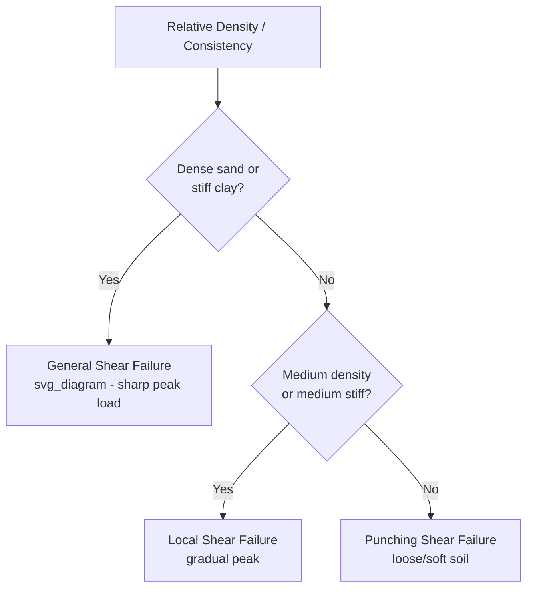

## Bearing Capacity Theories

### Overview

Bearing capacity theory quantifies the maximum pressure a foundation can transmit to soil without causing shear failure. It underlies the design of shallow foundations (footings, mats, rafts) and provides the theoretical basis for allowable soil pressure calculations. The subject evolved from classical plasticity theory applied to soil mechanics, beginning with Prandtl's work on metal indentation and extending through Terzaghi, Meyerhof, Hansen, and Vesic.

### Modes of Shear Failure

Before applying any theory, the expected failure mode must be identified, since bearing capacity equations assume general shear failure unless modified.

**General Shear Failure**

Occurs in dense sand or stiff clay. A well-defined continuous failure surface develops from one edge of the footing, through the soil, to the ground surface. Failure is sudden, accompanied by bulging of soil adjacent to the footing, and the load-settlement curve shows a clear peak.

**Local Shear Failure**

Occurs in medium-dense sand or medium-stiff clay. The failure surface develops only beneath the footing and does not reach the ground surface clearly. Significant settlement occurs before failure, and the load-settlement curve shows no sharp peak.

**Punching Shear Failure**

Occurs in loose sand, soft clay, or soils underlain by weak strata. The soil directly beneath the footing compresses vertically; the failure surface is essentially vertical, and no bulging or continuous rupture surface reaches the surface.

**(svg_diagram) Load–Settlement Response by Failure Mode**

<svg xmlns="http://www.w3.org/2000/svg" viewBox="0 0 560 340">
<text x="280" y="24" text-anchor="middle" font-size="16" font-weight="bold" fill="#1a1a1a">Load vs Settlement by Failure Mode (svg_diagram)</text>
<line x1="70" y1="290" x2="520" y2="290" stroke="#333" stroke-width="2" />
<line x1="70" y1="290" x2="70" y2="50" stroke="#333" stroke-width="2" />
<text x="30" y="170" font-size="13" transform="rotate(-90 30 170)">Settlement</text>
<text x="290" y="320" font-size="13" text-anchor="middle">Load</text>
<path d="M70,290 Q160,220 190,130 Q210,80 230,60" stroke="#c0392b" stroke-width="2.5" fill="none" />
<circle cx="230" cy="60" r="4" fill="#c0392b" />
<text x="235" y="55" font-size="12" fill="#c0392b">General Shear (peak)</text>
<path d="M70,290 Q220,240 320,150 Q380,110 430,95" stroke="#e67e22" stroke-width="2.5" fill="none" />
<text x="360" y="90" font-size="12" fill="#e67e22">Local Shear</text>
<path d="M70,290 Q250,270 400,220 Q470,190 510,150" stroke="#2980b9" stroke-width="2.5" fill="none" />
<text x="420" y="145" font-size="12" fill="#2980b9">Punching Shear</text>
</svg>

### Terzaghi's Bearing Capacity Theory (1943)

Terzaghi provided the foundational quantitative theory, assuming a rigid, rough strip footing on a homogeneous, semi-infinite soil mass, with general shear failure and a failure zone consisting of three regions: an active Rankine zone directly beneath the footing, radial shear (log-spiral) zones, and passive Rankine zones.

**Assumptions**

- Footing is shallow ($D_f \leq B$) and strip-shaped (infinite length)
- Soil above footing base is treated as a surcharge, its shear strength ignored
- Soil is homogeneous and isotropic
- General shear failure governs
- Footing base is rough (full friction/adhesion with soil)

**Ultimate Bearing Capacity Equation (Strip Footing)**

$$q_u = cN_c + qN_q + 0.5\gamma B N_\gamma$$

Where:

- $q_u$ = ultimate bearing capacity
- $c$ = cohesion of soil
- $q = \gamma D_f$ = effective overburden pressure at footing base
- $\gamma$ = unit weight of soil
- $B$ = footing width
- $N_c, N_q, N_\gamma$ = Terzaghi's bearing capacity factors (functions of friction angle $\phi$)

**Shape Modifications**

For square and circular footings, Terzaghi proposed empirical modifications:

Square: $q_u = 1.3cN_c + qN_q + 0.4\gamma B N_\gamma$

Circular: $q_u = 1.3cN_c + qN_q + 0.3\gamma B N_\gamma$

**Bearing Capacity Factors**

$$N_q = \frac{e^{2\pi(0.75 - \phi/360)\tan\phi}}{2\cos^2(45 + \phi/2)}$$

$$N_c = (N_q - 1)\cot\phi$$

$$N_\gamma = \frac{\tan\phi}{2}\left(\frac{K_{p\gamma}}{\cos^2\phi} - 1\right)$$

$N_\gamma$ has no closed-form derivation and is obtained from Terzaghi's charts or tabulated values, since $K_{p\gamma}$ (passive earth pressure coefficient) is determined graphically in the original work.

**Local Shear Failure Modification**

Terzaghi proposed reduced strength parameters for local shear conditions (loose sand, soft-to-medium clay):

$$c' = 0.67c$$

$$\tan\phi' = 0.67\tan\phi$$

The modified $c'$ and $\phi'$ are then used in the same bearing capacity equation with correspondingly reduced $N_c', N_q', N_\gamma'$ factors.

**Key Points**

- Terzaghi's theory is the historical baseline; it does not account for footing shape, depth, or load inclination in a unified rational way — corrections are largely empirical add-ons
- It remains widely taught and used for preliminary hand calculations due to its simplicity
- It overestimates capacity for footings with significant embedment since it neglects shear strength of overburden soil

### General Bearing Capacity Equation (Meyerhof, Hansen, Vesic)

Later researchers generalized Terzaghi's equation into a unified form applicable to any footing shape, depth, and loading condition:

$$q_u = cN_c s_c d_c i_c + qN_q s_q d_q i_q + 0.5\gamma B N_\gamma s_\gamma d_\gamma i_\gamma$$

Where the additional terms are:

- $s_c, s_q, s_\gamma$ = shape factors
- $d_c, d_q, d_\gamma$ = depth factors
- $i_c, i_q, i_\gamma$ = load inclination factors

Some formulations (Hansen, Vesic) add further correction factors for base inclination ($b$) and ground surface inclination ($g$).

### Meyerhof's Bearing Capacity Theory (1963)

Meyerhof extended Terzaghi's failure surface to include the shear resistance of soil above the footing base, producing more accurate results for deep and eccentrically/obliquely loaded footings.

**Bearing Capacity Factors**

$$N_q = e^{\pi\tan\phi}\tan^2\left(45 + \frac{\phi}{2}\right)$$

$$N_c = (N_q - 1)\cot\phi$$

$$N_\gamma = (N_q - 1)\tan(1.4\phi)$$

**Shape Factors** (with $K_p = \tan^2(45 + \phi/2)$)

$$s_c = 1 + 0.2K_p\left(\frac{B}{L}\right)$$

$$s_q = s_\gamma = 1 + 0.1K_p\left(\frac{B}{L}\right) \quad \text{for } \phi > 10°$$

$$s_q = s_\gamma = 1 \quad \text{for } \phi = 0$$

**Depth Factors**

$$d_c = 1 + 0.2\sqrt{K_p}\left(\frac{D_f}{B}\right)$$

$$d_q = d_\gamma = 1 + 0.1\sqrt{K_p}\left(\frac{D_f}{B}\right) \quad \text{for } \phi > 10°$$

$$d_q = d_\gamma = 1 \quad \text{for } \phi = 0$$

**Inclination Factors** (load inclined at angle $\alpha$ from vertical)

$$i_c = i_q = \left(1 - \frac{\alpha}{90°}\right)^2$$

$$i_\gamma = \left(1 - \frac{\alpha}{\phi}\right)^2$$

### Hansen's Bearing Capacity Theory (1970)

Hansen's equation is the most comprehensive of the classical formulations, valid for shallow and deep foundations, and includes base and ground inclination effects, making it suitable for complex geotechnical scenarios.

**Bearing Capacity Factors**

Hansen adopted the same $N_q$ and $N_c$ as Meyerhof, but proposed a different $N_\gamma$:

$$N_\gamma = 1.5(N_q - 1)\tan\phi$$

**Special Case: $\phi = 0$ (Undrained Clay)**

$$q_u = 5.14c_u(1 + s_c' + d_c' - i_c' - b_c' - g_c') + q$$

This form is widely used for undrained bearing capacity of saturated clays under short-term (total stress) loading.

**Depth Factor Distinction**

Hansen distinguishes between $D_f/B \leq 1$ and $D_f/B > 1$, using $\tan^{-1}(D_f/B)$ in radians for the latter case, reflecting the diminishing rate of capacity increase with depth.

### Vesic's Bearing Capacity Theory (1973, 1975)

Vesic's factors are nearly identical to Hansen's for $N_c$ and $N_q$, but he proposed an alternative $N_\gamma$ based on more refined slip-line field analysis:

$$N_\gamma = 2(N_q + 1)\tan\phi$$

Vesic's $N_\gamma$ values are generally higher than Hansen's, giving slightly more conservative (lower allowable stress relative to predicted ultimate, since higher $N_\gamma$ is offset by design factor of safety application) predictions in practice. Vesic also refined the shape, depth, and inclination factor expressions, and his system is widely adopted in modern geotechnical software (e.g., many foundation design codes reference Vesic's factors as default).

### Comparison of Bearing Capacity Factors

| $\phi$ (°) | $N_c$ (Terzaghi) | $N_q$ (Terzaghi) | $N_\gamma$ (Terzaghi) | $N_c$ (Meyerhof/Hansen/Vesic) | $N_q$ (Meyerhof/Hansen/Vesic) | $N_\gamma$ (Hansen) | $N_\gamma$ (Vesic) |
| --- | --- | --- | --- | --- | --- | --- | --- |
| 0 | 5.7 | 1.0 | 0.0 | 5.14 | 1.0 | 0.0 | 0.0 |
| 10 | 9.6 | 2.7 | 1.2 | 8.34 | 2.47 | 0.47 | 1.22 |
| 20 | 17.7 | 7.4 | 5.0 | 14.83 | 6.40 | 2.87 | 5.39 |
| 30 | 37.2 | 22.5 | 19.7 | 30.14 | 18.40 | 15.67 | 22.40 |
| 40 | 95.7 | 81.3 | 100.4 | 75.31 | 64.20 | 79.54 | 109.41 |

All values are approximate, sourced from standard geotechnical reference tables, and may vary slightly depending on the specific textbook or rounding convention used. [Unverified — exact decimal values differ marginally across textbook editions due to rounding in original derivations]

### Effect of Water Table

The position of the water table significantly affects $q_u$ through changes in effective unit weight.

**Case 1: Water table at or above footing base**

Use submerged (buoyant) unit weight $\gamma'$ in both the $q$ term and the $N_\gamma$ term.

**Case 2: Water table between base and depth $B$ below base**

Use an interpolated effective unit weight:

$$\gamma_{eff} = \gamma' + \frac{d_w}{B}(\gamma - \gamma')$$

where $d_w$ is depth of water table below footing base.

**Case 3: Water table at depth $\geq B$ below footing base**

No correction needed; use moist/bulk unit weight $\gamma$ throughout.

### Effect of Eccentric Loading — Meyerhof's Effective Area Method

When a footing is loaded eccentrically (moment plus vertical load), Meyerhof's effective width method replaces the actual footing dimensions with reduced "effective" dimensions centered on the resultant load.

$$B' = B - 2e_B$$

$$L' = L - 2e_L$$

The bearing capacity is computed using $B'$ (and $L'$ for shape/depth factors) in place of $B$, and the ultimate load capacity is:

$$Q_u = q_u \times (B' \times L')$$

**Example**

A rectangular footing $2\text{ m} \times 3\text{ m}$ carries a vertical load with eccentricity $e_B = 0.2\text{ m}$ along the short direction.

$$B' = 2 - 2(0.2) = 1.6\text{ m}$$

Bearing capacity is then computed using $B' = 1.6\text{ m}$, $L = 3\text{ m}$, with the smaller of $B'$ or $L$ used as the effective width in the $N_\gamma$ term.

### Net vs. Gross Bearing Capacity

$$q_{u(net)} = q_u - q$$

where $q = \gamma D_f$ is the overburden pressure removed during excavation. Net bearing capacity represents the actual net pressure increase the soil can sustain beyond its pre-existing overburden condition, and is the value typically compared against net applied foundation pressure in design.

**Allowable Bearing Capacity**

$$q_{all} = \frac{q_{u(net)}}{FS} + q$$

Typical factor of safety (FS) values range from 2.5 to 3.5 for shallow foundations, depending on the reliability of soil data, load type, and consequence of failure. [Inference — the specific FS selected in practice depends on project-specific code requirements, such as local building codes, which may prescribe different values]

### Worked Example

A strip footing, $B = 1.5\text{ m}$, is placed at $D_f = 1\text{ m}$ in a homogeneous sand with $\phi = 30°$, $\gamma = 18\text{ kN/m}^3$, $c = 0$. Using Terzaghi's general shear factors ($N_q = 22.5$, $N_\gamma = 19.7$):

$$q = \gamma D_f = 18 \times 1 = 18\text{ kN/m}^2$$

$$q_u = 0 + (18)(22.5) + 0.5(18)(1.5)(19.7)$$

$$q_u = 405 + 265.95 = 670.95\text{ kN/m}^2$$

Applying $FS = 3$:

$$q_{all} = \frac{q_u - q}{FS} + q = \frac{670.95 - 18}{3} + 18 = 217.65 + 18 = 235.65\text{ kN/m}^2$$

Allowable load per unit length of footing:

$$Q_{all} = q_{all} \times B = 235.65 \times 1.5 = 353.5\text{ kN/m}$$

### Bearing Capacity from In-Situ Tests (Empirical Correlations)

Where laboratory shear strength parameters are unavailable, empirical correlations from field tests are commonly used:

**Standard Penetration Test (SPT)**

Meyerhof's and later Bowles' correlations relate corrected blow count $N_{60}$ directly to allowable bearing pressure for a target settlement (commonly 25 mm), bypassing explicit $\phi$ estimation.

**Cone Penetration Test (CPT)**

Correlations relate cone tip resistance $q_c$ to bearing capacity, particularly useful in sands where undisturbed sampling is difficult.

**Plate Load Test**

Provides a direct, scaled measurement of load-settlement behavior, extrapolated to full footing size using settlement scaling relationships (e.g., Terzaghi-Peck equation for sands).

### Limitations of Classical Bearing Capacity Theories

- Assume homogeneous, isotropic soil — inapplicable to stratified or highly variable profiles without modification
- Assume rigid footing and uniform contact pressure, which does not hold for flexible mats or rafts
- Do not directly account for progressive failure, strain-softening, or anisotropic strength
- $N_\gamma$ values vary substantially between authors (Terzaghi, Hansen, Vesic), given the significant epistemic uncertainty attached to it historically, since a single true closed-form solution has not been agreed upon; [Unverified — the "correct" $N_\gamma$ remains a subject of ongoing academic discussion, with some researchers proposing yet other values via finite element or limit analysis]
- Two-dimensional (plane strain) basis for strip footings requires correction factors for finite-shape footings, which are themselves largely empirical

### Conclusion

Bearing capacity theory has progressed from Terzaghi's foundational strip-footing solution to increasingly generalized formulations by Meyerhof, Hansen, and Vesic that incorporate shape, depth, inclination, and eccentricity effects. While the underlying limit-equilibrium and plasticity assumptions remain simplified representations of real soil behavior, these theories continue to form the backbone of shallow foundation design worldwide, typically supplemented by empirical in-situ test correlations and appropriate factors of safety to account for inherent soil variability and model uncertainty.

**Related Topics**

- Settlement Analysis of Shallow Foundations (Elastic and Consolidation Settlement)
- Standard Penetration Test (SPT) and Correlations
- Cone Penetration Test (CPT) Interpretation
- Deep Foundation Bearing Capacity (Pile Capacity Theories)
- Plate Load Test Procedure and Interpretation
- Effective Stress and Water Table Effects in Foundation Design
- Combined Footings and Mat Foundation Design
- Slope Stability and Limit Equilibrium Methods
- Soil Classification Systems (USCS, AASHTO)
- Foundation Design Codes (IS 6403, Eurocode 7, ACI/ASCE Standards)