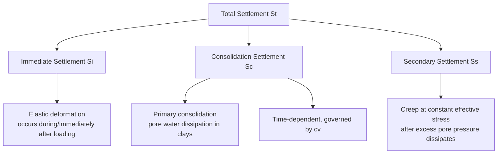
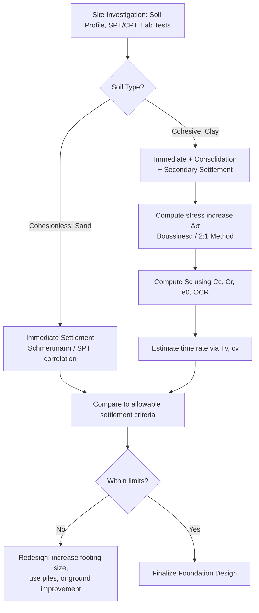

## Settlement Estimation for Shallow Foundations

### Overview

Settlement estimation quantifies the vertical downward movement of a foundation resulting from soil compression under applied load. Unlike bearing capacity, which governs shear failure, settlement governs serviceability — excessive or differential settlement causes structural distress even when the soil remains far from shear failure. Total settlement is conventionally decomposed into three components:

$$S_t = S_i + S_c + S_s$$

Where:

- $S_i$ = immediate (elastic) settlement
- $S_c$ = primary consolidation settlement
- $S_s$ = secondary compression (creep) settlement

### Classification of Settlement Components

**Key Points**

- In cohesionless soils (sands), settlement is predominantly immediate, occurring rapidly as load is applied, since permeability is high and excess pore pressure dissipates almost instantly
- In saturated cohesive soils (clays), consolidation settlement dominates and can take months to decades to fully develop, governed by the coefficient of consolidation $c_v$
- Secondary compression becomes significant in highly organic soils, peat, and some soft clays, continuing after excess pore pressure has fully dissipated

### Immediate (Elastic) Settlement

Immediate settlement is estimated using elasticity theory, treating the soil as a semi-infinite, homogeneous, isotropic elastic medium.

**Theory of Elasticity Approach (Flexible Footing)**

$$S_i = q_0 B \frac{1 - \mu^2}{E_s} I_f$$

Where:

- $q_0$ = net applied pressure
- $B$ = footing width
- $\mu$ = Poisson's ratio of soil
- $E_s$ = modulus of elasticity of soil
- $I_f$ = influence factor (depends on footing shape, rigidity, and $L/B$ ratio)

**Influence Factors for Flexible Footings (Corner)**

For a rectangular flexible footing, the influence factor $I_f$ varies with $L/B$ and is available from standard charts (Janbu, Bjerrum, and Kjaernsli or Steinbrenner's solutions). For a rigid footing, settlement is approximately 93% of the center settlement of an equivalent flexible footing (a widely used approximation).

**Janbu, Bjerrum, and Kjaernsli Method**

$$S_i = A_1 A_2 \frac{q_0 B}{E_s}$$

Where $A_1$ is a correction factor depending on $D_f/B$ (embedment) and $A_2$ depends on $H/B$ (thickness of compressible layer relative to footing width), both read from standard charts.

**Schmertmann's Method (Sands, using CPT/SPT data)**

Schmertmann's approach accounts for the actual distribution of vertical strain influence with depth beneath the footing, recognizing that peak strain influence occurs below the footing base rather than directly at it.

$$S_i = C_1 C_2 (q_0 - q) \sum_{i=1}^{n} \frac{I_z}{E_s} \Delta z$$

Where:

- $C_1 = 1 - 0.5\left(\frac{q}{q_0 - q}\right)$ = embedment correction factor
- $C_2 = 1 + 0.2\log\left(\frac{t}{0.1}\right)$ = creep correction factor ($t$ in years)
- $I_z$ = strain influence factor (triangular distribution, peak at depth $B/2$ for axisymmetric or $B$ for strip footings)
- $E_s$ = soil modulus, often correlated to CPT cone resistance: $E_s = 2.5q_c$ (axisymmetric) or $E_s = 3.5q_c$ (plane strain)

**Strain Influence Factor Diagram (Schmertmann)**

<svg xmlns="http://www.w3.org/2000/svg" viewBox="0 0 480 380">
<text x="240" y="24" text-anchor="middle" font-size="15" font-weight="bold" fill="#1a1a1a">Schmertmann Strain Influence Factor (svg_diagram)</text>
<line x1="240" y1="50" x2="240" y2="350" stroke="#333" stroke-width="1.5" />
<line x1="60" y1="50" x2="420" y2="50" stroke="#333" stroke-width="1.5" />
<text x="425" y="55" font-size="12">Iz</text>
<text x="245" y="365" font-size="12">Depth z</text>
<path d="M240,50 L240,130 L370,220 L240,350" stroke="#2980b9" stroke-width="2.5" fill="none" />
<line x1="60" y1="220" x2="420" y2="220" stroke="#999" stroke-dasharray="4,3" />
<text x="65" y="215" font-size="11" fill="#666">Peak at z = B/2 (axisym.)</text>
<text x="375" y="215" font-size="11" fill="#2980b9">Iz(peak) ≈ 0.5 + 0.1√(q0/σ'v)</text>
<text x="245" y="55" font-size="11">0.1</text>
<text x="245" y="345" font-size="11">2B</text>
</svg>

### Primary Consolidation Settlement

Consolidation settlement applies to saturated fine-grained soils (clays, silts) where load is initially carried by excess pore water pressure, which dissipates over time as water drains and effective stress increases (Terzaghi's consolidation theory).

**Normally Consolidated Clay**

$$S_c = \frac{C_c H}{1 + e_0} \log\left(\frac{\sigma_0' + \Delta\sigma'}{\sigma_0'}\right)$$

Where:

- $C_c$ = compression index
- $H$ = thickness of clay layer
- $e_0$ = initial void ratio
- $\sigma_0'$ = initial effective overburden stress at layer midpoint
- $\Delta\sigma'$ = increase in effective stress due to applied load

**Overconsolidated Clay**

Case 1: $\sigma_0' + \Delta\sigma' \leq \sigma_c'$ (final stress remains within recompression range)

$$S_c = \frac{C_r H}{1 + e_0} \log\left(\frac{\sigma_0' + \Delta\sigma'}{\sigma_0'}\right)$$

Case 2: $\sigma_0' + \Delta\sigma' > \sigma_c'$ (stress exceeds preconsolidation pressure)

$$S_c = \frac{C_r H}{1 + e_0} \log\left(\frac{\sigma_c'}{\sigma_0'}\right) + \frac{C_c H}{1 + e_0} \log\left(\frac{\sigma_0' + \Delta\sigma'}{\sigma_c'}\right)$$

Where:

- $C_r$ = recompression index (typically $C_r \approx 0.1$ to $0.2 \times C_c$)
- $\sigma_c'$ = preconsolidation pressure

**Overconsolidation Ratio**

$$OCR = \frac{\sigma_c'}{\sigma_0'}$$

$OCR = 1$ indicates normally consolidated soil; $OCR > 1$ indicates overconsolidated soil, which exhibits substantially lower settlement for the same stress increment due to stiffer recompression behavior.

### Stress Increase Beneath Foundations

$\Delta\sigma'$ at any depth is computed using elastic stress distribution theory, most commonly:

**Boussinesq's Solution (Point Load)**

$$\Delta\sigma_z = \frac{3Q}{2\pi z^2}\left[\frac{1}{1 + (r/z)^2}\right]^{5/2}$$

**2:1 Approximation Method (Simplified)**

$$\Delta\sigma_z = \frac{q_0 B L}{(B+z)(L+z)}$$

This method distributes the footing load over an area that increases at a slope of 2 (vertical) to 1 (horizontal) with depth, providing a quick and reasonably accurate estimate for preliminary design, though it does not capture the more concentrated stress distribution near the footing predicted by elastic theory.

**Newmark's Influence Chart / Influence Factor Tables**

For rectangular loaded areas, tabulated influence factors $I$ based on $m = L/z$ and $n = B/z$ give:

$$\Delta\sigma_z = q_0 \cdot I(m,n)$$

Superposition of four rectangular sub-areas is used for points not directly beneath the footing corner.

**Stress Distribution with Depth (2:1 Method)**

<svg xmlns="http://www.w3.org/2000/svg" viewBox="0 0 480 320">
<text x="240" y="22" text-anchor="middle" font-size="15" font-weight="bold" fill="#1a1a1a">2:1 Stress Distribution Method (svg_diagram)</text>
<rect x="180" y="45" width="120" height="18" fill="#7f8c8d" />
<text x="240" y="40" text-anchor="middle" font-size="12">q0, B</text>
<line x1="180" y1="63" x2="80" y2="270" stroke="#2980b9" stroke-width="2" />
<line x1="300" y1="63" x2="400" y2="270" stroke="#2980b9" stroke-width="2" />
<line x1="180" y1="63" x2="180" y2="63" stroke="#2980b9" />
<text x="120" y="160" font-size="11" fill="#2980b9" transform="rotate(-58 120 160)">Slope 2V:1H</text>
<line x1="80" y1="270" x2="400" y2="270" stroke="#333" stroke-dasharray="4,3" />
<text x="405" y="274" font-size="12">depth z</text>
<text x="180" y="290" font-size="11">B+z</text>
</svg>

### Secondary Compression (Creep) Settlement

Occurs after primary consolidation is essentially complete, driven by particle rearrangement under constant effective stress rather than pore pressure dissipation.

$$S_s = C_\alpha H \log\left(\frac{t_2}{t_1}\right)$$

Where:

- $C_\alpha$ = secondary compression index (often expressed as $C_\alpha / C_c$, which is relatively constant for a given soil, typically 0.03–0.08 for inorganic clays)
- $t_1$ = time at end of primary consolidation
- $t_2$ = time at which secondary settlement is being evaluated
- $H$ = layer thickness

Secondary compression is most significant in organic soils and peats, where $C_\alpha/C_c$ ratios can exceed 0.1.

### Time Rate of Consolidation Settlement

The degree of consolidation at a given time is governed by Terzaghi's one-dimensional consolidation theory:

$$T_v = \frac{c_v t}{H_{dr}^2}$$

Where:

- $T_v$ = time factor (dimensionless)
- $c_v$ = coefficient of consolidation
- $t$ = elapsed time
- $H_{dr}$ = length of drainage path (equal to $H$ for single drainage, $H/2$ for double drainage)

**Approximate Relations Between $T_v$ and Degree of Consolidation $U$**

For $U < 60\%$: $T_v = \frac{\pi}{4}\left(\frac{U}{100}\right)^2$

For $U \geq 60\%$: $T_v = 1.781 - 0.933\log(100 - U)$

Settlement at time $t$: $S_c(t) = U \times S_{c(ultimate)}$

**Time-Settlement Curve**

<svg xmlns="http://www.w3.org/2000/svg" viewBox="0 0 480 300">
<text x="240" y="20" text-anchor="middle" font-size="15" font-weight="bold" fill="#1a1a1a">Consolidation Settlement vs Time (svg_diagram)</text>
<line x1="60" y1="260" x2="440" y2="260" stroke="#333" stroke-width="2" />
<line x1="60" y1="260" x2="60" y2="45" stroke="#333" stroke-width="2" />
<text x="30" y="150" font-size="12" transform="rotate(-90 30 150)">Settlement</text>
<text x="240" y="285" font-size="12" text-anchor="middle">log(time)</text>
<path d="M60,50 Q150,90 220,140 Q300,200 380,225 Q410,232 440,235" stroke="#c0392b" stroke-width="2.5" fill="none" />
<line x1="60" y1="225" x2="440" y2="225" stroke="#999" stroke-dasharray="4,3" />
<text x="65" y="220" font-size="11" fill="#666">End of primary consolidation (U=100%)</text>
<path d="M300,225 L440,235" stroke="#27ae60" stroke-width="2.5" stroke-dasharray="6,3" />
<text x="320" y="248" font-size="11" fill="#27ae60">Secondary compression</text>
</svg>

### Allowable Settlement Criteria

Design codes limit settlement not by absolute magnitude alone but by differential settlement between adjacent foundations, since differential settlement causes angular distortion and structural cracking.

**Typical Limiting Values (illustrative, code-dependent)**

| Criterion | Typical Limit |
| --- | --- |
| Total settlement (isolated footings, sand) | 25 mm |
| Total settlement (isolated footings, clay) | 40–50 mm |
| Differential settlement | 0.75 × total settlement (approx.) |
| Angular distortion ($\delta/L$) — structural damage onset | 1/300 |
| Angular distortion — cracking in panel walls | 1/150 |

These values are drawn from widely referenced geotechnical practice (e.g., Skempton and MacDonald's criteria) but specific limits are ultimately governed by the applicable local or national building code, and may vary by structure type, framing system, and cladding sensitivity. [Unverified — exact permissible values should be confirmed against project-specific code requirements]

### Worked Example — Consolidation Settlement

A 3 m thick normally consolidated clay layer lies beneath a footing, with midpoint at $\sigma_0' = 80\text{ kPa}$. The footing load increases effective stress at the layer midpoint by $\Delta\sigma' = 40\text{ kPa}$. Given $C_c = 0.3$, $e_0 = 0.9$:

$$S_c = \frac{(0.3)(3)}{1 + 0.9}\log\left(\frac{80+40}{80}\right)$$

$$S_c = \frac{0.9}{1.9}\log(1.5) = 0.4737 \times 0.1761 = 0.0834\text{ m} = 83.4\text{ mm}$$

If double drainage applies, $H_{dr} = 1.5\text{ m}$, and $c_v = 0.5\text{ m}^2/\text{yr}$, time to reach 90% consolidation ($T_v = 0.848$):

$$t = \frac{T_v H_{dr}^2}{c_v} = \frac{0.848 \times 1.5^2}{0.5} = 3.816\text{ years}$$

### Settlement in Sands — Empirical SPT-Based Methods

Since undisturbed sampling of sand is impractical, settlement in cohesionless soils is commonly estimated from in-situ test correlations rather than elasticity parameters derived from lab tests.

**Meyerhof's Method (SPT-based)**

$$S_i(\text{mm}) = \frac{q_{net} B}{N_{60}} \times \text{(empirical constant, depends on } B\text{)}$$

Meyerhof's and later Burland-Burbidge's correlations relate corrected SPT blow count directly to settlement for a given net applied pressure, bypassing explicit elastic modulus estimation, and remain widely used for preliminary design due to their simplicity despite acknowledged scatter in prediction accuracy. [Inference — actual field settlement can deviate substantially from SPT-correlation predictions due to soil variability, and such methods are best used for preliminary rather than final design]

### Practical Workflow Summary

### Conclusion

Settlement estimation for shallow foundations requires distinguishing between immediate elastic deformation and time-dependent consolidation and creep behavior, with the governing mechanism dictated primarily by soil type. Elastic theory and Schmertmann's strain-influence method address immediate settlement, particularly in sands, while one-dimensional consolidation theory governs long-term settlement in saturated clays. Because serviceability limits are typically controlled by differential settlement rather than total settlement, accurate stress-distribution analysis and site-specific soil parameters (from laboratory consolidation tests or in-situ correlations) are essential for reliable prediction and safe, economical foundation design.

**Related Topics**

- Bearing Capacity Theories (Terzaghi, Meyerhof, Hansen, Vesic)
- One-Dimensional Consolidation Theory and Oedometer Testing
- Stress Distribution in Soils (Boussinesq, Westergaard Theories)
- Preconsolidation Pressure Determination (Casagrande Method)
- Ground Improvement Techniques for Settlement Control
- Pile Foundation Settlement Analysis
- Differential Settlement and Structural Damage Criteria
- In-Situ Testing Methods (SPT, CPT, Plate Load Test)