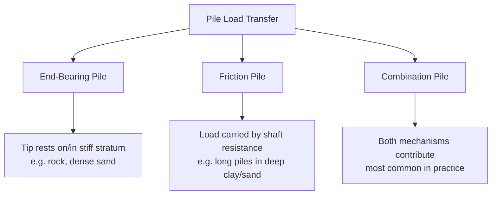
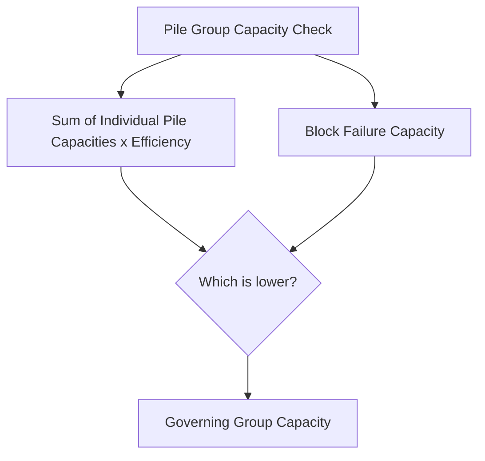
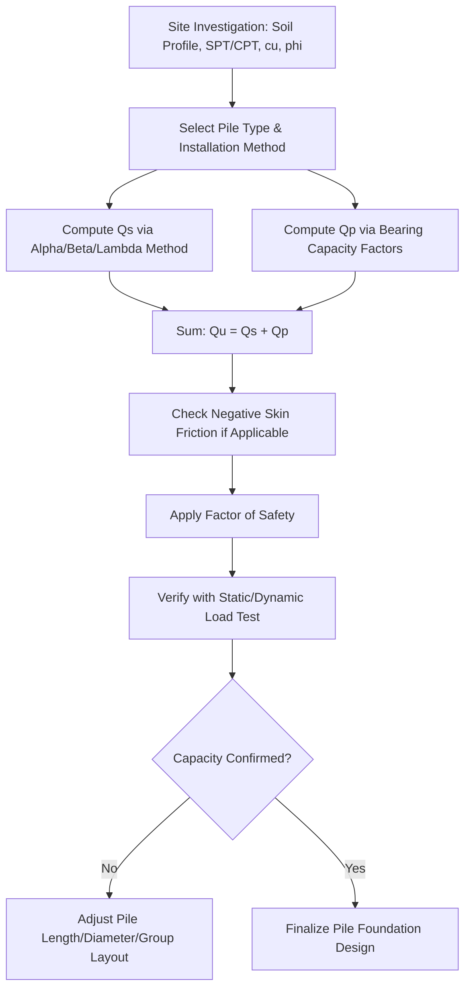

## Pile Capacity: Skin Friction and End Bearing

### Overview

Deep foundations transfer structural loads to soil strata below the reach of shallow foundations, either by mobilizing shear resistance along the pile shaft (skin friction), bearing resistance at the pile tip (end bearing), or a combination of both. The ultimate axial capacity of a single pile is expressed as:

$$Q_u = Q_s + Q_p - W_p$$

Where:

- $Q_u$ = ultimate pile capacity
- $Q_s$ = ultimate skin friction (shaft) resistance
- $Q_p$ = ultimate end bearing (point/tip) resistance
- $W_p$ = weight of the pile (often neglected or offset against overburden in net capacity calculations)

### Classification of Piles by Load Transfer Mechanism

**Key Points**

- Pure end-bearing piles behave structurally similar to columns, transferring load through the shaft to a competent bearing stratum with minimal shaft contribution
- Pure friction piles rely entirely on adhesion/friction along the embedded length, typical when no firm stratum is reachable at practical depth
- Most real piles derive capacity from both mechanisms, with the relative proportion depending on soil profile and pile length-to-diameter ratio

### End Bearing Capacity

The tip resistance is analogous to bearing capacity theory for deep, circular (or square) footings, using bearing capacity factors modified for depth effects.

**General Form**

$$Q_p = A_p \left(cN_c^* + q'N_q^*\right)$$

Where:

- $A_p$ = cross-sectional area of pile tip
- $c$ = cohesion of soil at pile tip
- $q'$ = effective overburden stress at pile tip
- $N_c^*, N_q^*$ = bearing capacity factors for deep foundations (distinct from shallow foundation factors due to different failure surface geometry)

**Meyerhof's Method for Sands**

$$Q_p = A_p q' N_q^* \leq A_p q_l$$

Where $q_l$ is a limiting unit point resistance, since $N_q^*$ increases with depth ratio $L/D$ up to a "critical depth ratio" beyond which point resistance does not increase further — an empirical observation reflecting the arching and confinement effects around a deep pile tip.

**Undrained Clay (Total Stress, $\phi = 0$)**

$$Q_p = A_p \times 9c_u$$

The factor 9 (as $N_c^* = 9$) is a widely accepted value for deep circular/square foundations in saturated clay under undrained loading, based on classical plasticity solutions and consistently supported by field pile load test correlations. [Fact-based, not an inference — this is standard, well-documented practice]

**Critical Depth Concept**

<svg xmlns="http://www.w3.org/2000/svg" viewBox="0 0 480 320">
<text x="240" y="20" text-anchor="middle" font-size="15" font-weight="bold" fill="#1a1a1a">Nq* vs L/D Ratio (svg_diagram)</text>
<line x1="60" y1="270" x2="440" y2="270" stroke="#333" stroke-width="2" />
<line x1="60" y1="270" x2="60" y2="45" stroke="#333" stroke-width="2" />
<text x="20" y="160" font-size="12" transform="rotate(-90 20 160)">Nq*</text>
<text x="240" y="295" font-size="12" text-anchor="middle">L/D ratio</text>
<path d="M60,270 Q160,180 240,110 L440,110" stroke="#c0392b" stroke-width="2.5" fill="none" />
<line x1="240" y1="270" x2="240" y2="110" stroke="#999" stroke-dasharray="4,3" />
<text x="245" y="285" font-size="11" fill="#666">Critical depth ratio</text>
<text x="300" y="100" font-size="11" fill="#c0392b">Nq* plateaus</text>
</svg>

### Skin Friction (Shaft) Resistance

**General Form**

$$Q_s = \sum f_s \cdot A_s$$

Where $f_s$ is the unit skin friction (adhesion or friction stress) and $A_s$ is the shaft surface area over the relevant length segment. For layered profiles, this summation is performed layer-by-layer.

**Cohesive Soils — Alpha ($\alpha$) Method**

Widely used for undrained (short-term) capacity in clays:

$$f_s = \alpha c_u$$

Where $\alpha$ is an empirical adhesion factor, typically ranging from about 0.3 to 1.0, decreasing as undrained shear strength $c_u$ increases (stiffer clays develop proportionally less shaft adhesion relative to their strength due to remolding and gap formation during installation). Tomlinson's and API's $\alpha$–$c_u$ correlation charts are the standard reference for selecting this value.

**Cohesionless Soils — Beta ($\beta$) Method**

$$f_s = \beta \sigma_v' = K\tan\delta \cdot \sigma_v'$$

Where:

- $K$ = lateral earth pressure coefficient (depends on installation method; driven piles typically increase $K$ above at-rest $K_0$ due to displacement and compaction effects)
- $\delta$ = friction angle between pile material and soil (typically $0.7\phi$ to $\phi$ depending on pile surface roughness)
- $\sigma_v'$ = effective vertical overburden stress at the depth considered

As with end bearing in sand, $f_s$ is often capped at a limiting value beyond the critical depth to reflect observed field behavior where shaft friction does not increase indefinitely with depth.

**Cohesive Soils — Lambda ($\lambda$) Method**

An alternative used for long piles in clay, based on mean effective and total stresses over the pile length:

$$f_s = \lambda(\sigma_v' + 2c_u)$$

Where $\lambda$ decreases with pile length, reflecting reduced average mobilized friction for longer embedments.

### Comparison of Shaft Friction Methods

| Method | Applicable Soil | Key Parameter | Primary Use Case |
| --- | --- | --- | --- |
| Alpha ($\alpha$) | Saturated clay, undrained | $c_u$, empirical $\alpha$ | Short-term capacity, driven/bored piles in clay |
| Beta ($\beta$) | Sand, drained clay (long-term) | $K$, $\delta$, $\sigma_v'$ | Effective stress approach, applicable to most soils long-term |
| Lambda ($\lambda$) | Clay (offshore, long piles) | $\lambda$, mean stresses | Long piles, originally developed for offshore platforms |

### Installation Method Effects

Pile capacity is strongly influenced by installation technique, since driving, boring, and jacking alter the surrounding soil structure differently.

**Driven (Displacement) Piles**

Densify surrounding granular soil and increase lateral stress, generally increasing both skin friction and end bearing relative to in-situ conditions. In clays, driving causes remolding and temporary strength loss (setup/freeze effects follow over subsequent weeks as excess pore pressure dissipates and thixotropic strength regain occurs).

**Bored (Non-Displacement) Piles / Drilled Shafts**

Involve excavation and concrete placement, generally resulting in lower lateral stresses (closer to at-rest $K_0$) than driven piles, and therefore typically lower unit skin friction values for a given soil, unless installation techniques (e.g., pressure grouting) are used to enhance capacity.

**Key Points**

- Setup effects in driven piles through clay mean capacity measured immediately after driving underestimates long-term capacity; re-strike or delayed load tests are used to verify actual capacity
- Bored pile capacity is sensitive to construction quality — soil softening at the base from water infiltration or inadequate cleaning can substantially reduce end bearing if not properly controlled during construction

### Pile Group Effects

Piles are rarely installed singly; group behavior differs from the sum of individual pile capacities due to overlapping stress zones.

**Group Efficiency**

$$\eta = \frac{Q_{g(ultimate)}}{n \times Q_u(\text{single pile})}$$

**Converse-Labarre Formula (Empirical, Friction Piles in Sand)**

$$\eta = 1 - \theta\left[\frac{(n_1 - 1)n_2 + (n_2-1)n_1}{90 n_1 n_2}\right]$$

Where $\theta = \tan^{-1}(D/s)$ in degrees, $D$ = pile diameter, $s$ = center-to-center spacing, $n_1, n_2$ = number of rows and columns in the group.

**Block Failure Check (Clay)**

For piles in clay, group capacity must also be checked against block failure, where the pile group and enclosed soil act as a single large "pier":

$$Q_{g(block)} = 2D_g(B_g + L_g)c_u(avg) + B_g L_g \times 9c_u(\text{base})$$

Where $B_g, L_g, D_g$ are the plan dimensions and depth of the equivalent block. The lower of the sum-of-individual-capacities and block failure capacity governs design.

### Negative Skin Friction (Downdrag)

When soil surrounding a pile settles more than the pile itself (e.g., due to consolidation of soft clay under new fill, or dewatering), the soil drags downward on the pile shaft, adding load rather than resisting it.

$$Q_{nsf} = f_n \times A_s(\text{zone of relative settlement})$$

Negative skin friction must be added to the structural load (not subtracted from capacity) when checking the pile's structural and geotechnical adequacy, and is typically evaluated using the same $\alpha$ or $\beta$ approach but applied as a downward-acting force over the depth where soil settles relative to the pile (down to the "neutral point" where relative displacement reverses direction).

**Neutral Point Concept**

<svg xmlns="http://www.w3.org/2000/svg" viewBox="0 0 420 360">
<text x="210" y="20" text-anchor="middle" font-size="14" font-weight="bold" fill="#1a1a1a">Negative Skin Friction Zone (svg_diagram)</text>
<rect x="190" y="45" width="20" height="290" fill="#95a5a6" />
<line x1="60" y1="45" x2="360" y2="45" stroke="#333" stroke-dasharray="3,3" />
<text x="65" y="40" font-size="11">Ground surface</text>
<line x1="60" y1="180" x2="360" y2="180" stroke="#e74c3c" stroke-dasharray="4,3" />
<text x="215" y="175" font-size="11" fill="#e74c3c">Neutral point</text>
<path d="M200,50 L200,175" stroke="#c0392b" stroke-width="3" marker-end="url(#arrowdown)" />
<text x="230" y="120" font-size="11" fill="#c0392b">Negative friction (adds load)</text>
<path d="M200,340 L200,185" stroke="#27ae60" stroke-width="3" />
<text x="230" y="260" font-size="11" fill="#27ae60">Positive friction (resists load)</text>
</svg>

### Factor of Safety and Allowable Capacity

$$Q_{all} = \frac{Q_u}{FS}$$

Typical FS values range from 2.0 to 3.0 depending on the quality and extent of site investigation, whether static or dynamic load tests are performed, and applicable design code (e.g., some codes permit lower FS when full-scale load tests confirm predicted capacity). Where separate factors are applied to shaft and tip resistance independently, this reflects differing confidence levels and mobilization behavior — skin friction typically mobilizes at smaller pile-head displacements than end bearing.

### Static Load Test Interpretation

Full-scale static load tests remain the most reliable method of verifying pile capacity, with several graphical interpretation criteria in common use.

**Davisson's Offset Limit Method**

Defines failure load as the point where the load-settlement curve deviates from the elastic line by an offset of $(4 + D/120)\text{ mm}$ (with $D$ in mm), incorporating elastic compression of the pile shaft itself.

**Other Common Criteria**

- Brinch Hansen's 80% criterion
- Chin-Kondner extrapolation method (hyperbolic curve fitting)
- Butler-Hoy criterion

Different interpretation methods can yield noticeably different "failure loads" from the same test data; [Unverified — the degree of variation depends on test-specific load-settlement curve shape and is not universally quantifiable] engineers should specify the intended interpretation method in advance per the governing design code.

### Dynamic Pile Formulas and Wave Equation Analysis

For driven piles, capacity is sometimes estimated during installation using dynamic (driving resistance) methods, though these are generally less reliable than static load tests.

**Simplified Dynamic Formula (Engineering News Formula — illustrative example)**

$$Q_u = \frac{W_r H}{s + C}$$

Where $W_r$ = hammer weight, $H$ = drop height, $s$ = penetration per blow, $C$ = empirical constant. Dynamic formulas based on simple energy balance are now largely superseded in modern practice by wave equation analysis (e.g., GRLWEAP-type programs) and dynamic load testing (e.g., Pile Driving Analyzer, using the Case Method or CAPWAP signal matching), which more accurately model stress wave propagation through the pile during driving. [Inference — the degree to which older formulas remain used varies by jurisdiction and project scale, with some smaller or less critical projects still referencing simplified formulas for preliminary estimates]

### Worked Example — Single Pile in Clay

A driven concrete pile, $D = 0.4\text{ m}$, length $L = 12\text{ m}$, is installed in a uniform saturated clay with $c_u = 60\text{ kPa}$ throughout, $\alpha = 0.6$.

**Skin Friction**

$$A_s = \pi D L = \pi (0.4)(12) = 15.08\text{ m}^2$$

$$Q_s = \alpha c_u A_s = 0.6 \times 60 \times 15.08 = 542.9\text{ kN}$$

**End Bearing**

$$A_p = \frac{\pi D^2}{4} = \frac{\pi (0.4)^2}{4} = 0.1257\text{ m}^2$$

$$Q_p = 9 c_u A_p = 9 \times 60 \times 0.1257 = 67.9\text{ kN}$$

**Ultimate and Allowable Capacity**

$$Q_u = Q_s + Q_p = 542.9 + 67.9 = 610.8\text{ kN}$$

Applying $FS = 2.5$:

$$Q_{all} = \frac{610.8}{2.5} = 244.3\text{ kN}$$

This example illustrates the common finding in long, slender piles through soft-to-medium clay that skin friction dominates total capacity, with end bearing contributing a relatively small fraction.

### Practical Design Workflow

### Conclusion

Pile capacity fundamentally arises from two resistance mechanisms — skin friction along the shaft and end bearing at the tip — whose relative contributions depend on soil stratigraphy, pile geometry, and installation method. Cohesive soils are typically analyzed using the alpha method for short-term undrained conditions, while cohesionless soils rely on effective stress (beta) approaches; both require careful attention to critical depth limitations and installation-induced changes in soil state. Group effects, negative skin friction, and load test verification further refine capacity estimates beyond single-pile theoretical calculations, making pile foundation design an iterative process combining analytical methods with field verification.

**Related Topics**

- Bearing Capacity Theories (Shallow Foundations)
- Settlement of Pile Groups and Pile-Soil-Pile Interaction
- Laterally Loaded Piles and p-y Curve Analysis
- Dynamic Pile Testing (PDA, CAPWAP, Wave Equation Analysis)
- Drilled Shaft (Caisson) Design Considerations
- Ground Improvement as an Alternative to Deep Foundations
- Downdrag and Negative Skin Friction Mitigation Techniques
- Pile Driving Equipment and Installation Methods