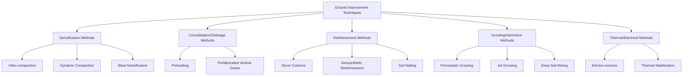
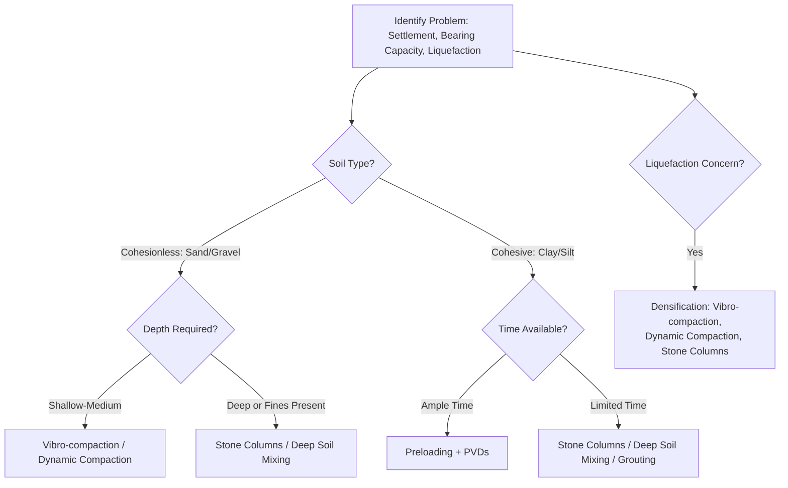

## Ground Improvement Techniques

### Overview

Ground improvement encompasses methods used to enhance the engineering properties of weak, loose, or problematic soils in situ, as an alternative or supplement to deep foundations or soil replacement. Improvement objectives typically include increasing shear strength, reducing compressibility, controlling settlement, mitigating liquefaction potential, and reducing permeability. Technique selection depends on soil type, depth of treatment required, project timeline, and cost.

### Classification of Ground Improvement Methods

**Key Points**

- Densification methods are most effective in cohesionless soils, where vibration or impact energy rearranges particles into a denser state
- Consolidation methods are most effective in saturated fine-grained soils, accelerating the natural drainage-driven settlement process
- Reinforcement and grouting methods can be applied across a wider range of soil types, including soft clays, by introducing engineered inclusions or binding agents

### Densification Methods

**Vibro-Compaction**

Applicable to clean, cohesionless soils (sands with less than about 15–20% fines). A vibrating probe is inserted into the ground, typically aided by water or air jetting, and densifies surrounding soil through vibration-induced particle rearrangement as it is withdrawn in stages.

$$D_r(\text{achieved}) = f(\text{vibratory energy, spacing, soil gradation})$$

Effective treatment depth is generally limited to about 20–30 m [Unverified — depth capability varies by equipment manufacturer and specific probe design], with treatment point spacing typically arranged in triangular or square grids based on required post-treatment relative density.

**Dynamic Compaction (Heavy Tamping)**

A heavy weight (typically 10–40 tonnes) is repeatedly dropped from height (10–30 m) onto the ground surface in a systematic grid pattern, densifying soil through shock wave propagation.

$$D = n\sqrt{WH}$$

Where $D$ = significant depth of influence (m), $W$ = weight (tonnes), $H$ = drop height (m), $n$ = empirical coefficient typically ranging from about 0.3 to 0.8 depending on soil type and energy transfer efficiency (Menard's original formula used $n \approx 0.5$ for many soil types, though this varies with local conditions).

Effective in partially saturated cohesionless soils and some fills; less effective in saturated fine-grained soils due to excess pore pressure buildup, unless combined with drainage measures.

**Blast Densification (Blast Compaction)**

Controlled detonation of explosive charges at depth induces liquefaction and subsequent densification of loose saturated sands, primarily used for large-scale or remote sites where other densification methods are impractical.

**Densification Method Comparison**

| Method | Suitable Soil | Typical Depth | Mechanism |
| --- | --- | --- | --- |
| Vibro-compaction | Clean sand, gravel | Up to ~30 m | Vibration-induced rearrangement |
| Dynamic compaction | Sand, fill, debris | Up to ~10–12 m | Impact shock wave |
| Blast densification | Saturated loose sand | Deep, variable | Induced liquefaction/settlement |

### Consolidation and Drainage Methods

**Preloading (Surcharge Method)**

Temporary fill or surcharge load is placed on site prior to construction to induce consolidation settlement of underlying compressible soils ahead of time, so that post-construction settlement of the permanent structure is minimized.

$$U = 1 - \left(\frac{S_{t(remaining)}}{S_{c(ultimate)}}\right)$$

Time required for adequate consolidation is governed by the same $T_v$–$c_v$ relationships used in settlement analysis, meaning preloading alone in thick clay deposits can require impractically long durations without supplementary drainage measures.

**Prefabricated Vertical Drains (PVDs) / Wick Drains**

Thin, permeable synthetic drains are installed in a grid pattern to shorten drainage paths, drastically accelerating radial consolidation and reducing the time required for a given degree of consolidation, since drainage path length is reduced from the full layer thickness (vertical drainage only) to the drain spacing (combined radial and vertical drainage).

**Combined Radial-Vertical Consolidation (Barron's Theory)**

$$T_r = \frac{c_r t}{4R^2} \quad \text{(radial time factor)}$$

$$U_r = 1 - \exp\left(-\frac{8T_r}{F(n)}\right)$$

Where $c_r$ = coefficient of consolidation for radial drainage, $R$ = radius of influence per drain, $F(n)$ = drain spacing function accounting for drain radius and smear zone effects.

$$U_{combined} = 1 - (1-U_v)(1-U_r)$$

Combining vertical ($U_v$) and radial ($U_r$) consolidation typically reduces required treatment time from years to months for a given target degree of consolidation, a well-established result of well-documented drainage path geometry. This is a widely applied and factual outcome of the underlying consolidation theory rather than an uncertain claim.

**Preloading with PVDs — Schematic**

<svg xmlns="http://www.w3.org/2000/svg" viewBox="0 0 480 320">
<text x="240" y="20" text-anchor="middle" font-size="14" font-weight="bold" fill="#1a1a1a">Preloading with Vertical Drains (svg_diagram)</text>
<rect x="60" y="55" width="360" height="30" fill="#95a5a6" />
<text x="240" y="48" font-size="11" text-anchor="middle">Surcharge Fill</text>
<rect x="60" y="85" width="360" height="180" fill="#dcd0b0" />
<text x="70" y="100" font-size="11">Soft Clay Layer</text>
<line x1="120" y1="85" x2="120" y2="255" stroke="#2980b9" stroke-width="4" />
<line x1="180" y1="85" x2="180" y2="255" stroke="#2980b9" stroke-width="4" />
<line x1="240" y1="85" x2="240" y2="255" stroke="#2980b9" stroke-width="4" />
<line x1="300" y1="85" x2="300" y2="255" stroke="#2980b9" stroke-width="4" />
<line x1="360" y1="85" x2="360" y2="255" stroke="#2980b9" stroke-width="4" />
<text x="150" y="280" font-size="10" fill="#2980b9">PVDs (radial drainage paths)</text>
<rect x="60" y="265" width="360" height="15" fill="#7f8c8d" />
<text x="70" y="278" font-size="10" fill="white">Sand Drainage Blanket</text>
</svg>

### Reinforcement Methods

**Stone Columns (Vibro Replacement)**

Columns of compacted granular material (typically crushed stone or gravel) are installed in soft soil using a vibrating probe, providing both reinforcement (load-sharing) and drainage benefits, particularly effective in soft to medium clays and silts.

**Stress Concentration and Load Sharing**

$$n = \frac{\sigma_c}{\sigma_s}$$

Where $n$ = stress concentration factor, $\sigma_c$ = stress carried by stone column, $\sigma_s$ = stress carried by surrounding soil. Load sharing depends on the relative stiffness of column versus soil and the area replacement ratio:

$$a_s = \frac{A_c}{A}$$

Where $A_c$ = area of stone column, $A$ = total tributary area per column.

**Settlement Reduction Factor**

$$\beta = \frac{S(\text{treated})}{S(\text{untreated})} = \frac{1}{1 + a_s(n-1)}$$

Stone columns reduce settlement by concentrating stress into the stiffer column material while simultaneously acting as vertical drains to accelerate consolidation of the surrounding soil, providing a dual benefit not offered by drainage-only or reinforcement-only techniques.

**Geosynthetic Reinforcement**

Geotextiles, geogrids, and geocells are used to reinforce embankment bases, improve bearing capacity over soft ground, and provide separation/filtration between dissimilar soil layers.

$$FS_{bearing} = \frac{q_{ult}(\text{reinforced})}{q_{applied}}$$

Reinforcement increases bearing capacity primarily through three mechanisms: lateral restraint of soil particles beneath the load, an increased effective bearing area distributing stress over a wider zone at depth, and a membrane effect where tensioned geosynthetic layers support vertical load through their curvature under deformation.

**Soil Nailing**

In-situ reinforcement technique primarily for slopes and excavations rather than foundation soil improvement directly; passive steel bars (nails) are grouted into drilled holes as excavation proceeds, mobilizing tensile and shear resistance to stabilize the retained soil mass.

### Grouting and Admixture Methods

**Permeation Grouting**

Low-viscosity grout (cement, chemical, or microfine cement) is injected into soil voids under pressure without disturbing soil structure, filling pore spaces to increase strength and reduce permeability. Effective mainly in coarse-grained soils (sands, gravels) with sufficient void space for grout penetration; ineffective in silts and clays where pore throats are too small.

**Jet Grouting**

High-pressure fluid jets (grout, sometimes combined with air and/or water) erode and mix in-situ soil to form soil-cement columns or panels, applicable across a much broader range of soil types than permeation grouting since it physically disaggregates and remixes the soil rather than relying on void penetration.

**Systems**

| System | Fluids Used | Mechanism |
| --- | --- | --- |
| Single fluid (S) | Grout only | Erosion + mixing by grout jet |
| Double fluid (D) | Grout + air shroud | Air shroud extends erosion radius |
| Triple fluid (T) | Water + air (erosion) + grout (fill) | Water/air erodes, grout fills separately |

**Deep Soil Mixing (DSM)**

Mechanical augers mix in-situ soil with cementitious binder (cement, lime, or slag-based) to form soil-cement columns, panels, or grid patterns, used for both settlement control and liquefaction mitigation.

$$q_u(\text{treated}) = f(\text{binder content, curing time, soil type, mixing energy})$$

Strength gain in soil-cement mixtures generally follows a pattern similar to concrete curing, with strength increasing over time and being sensitive to binder dosage, though achievable strength varies considerably with native soil organic content and mixing uniformity. [Unverified — precise strength-dosage relationships are project- and material-specific and require site-specific trial mixes to confirm]

### Thermal and Electrical Methods

**Electro-osmosis**

Direct current is applied between electrodes installed in fine-grained soil, causing pore water to migrate toward the cathode where it is extracted, accelerating drainage and increasing effective stress in soils too impermeable for conventional consolidation drainage methods to be practical within reasonable timeframes.

**Thermal Treatment**

Heating or freezing of soil to temporarily or permanently alter its properties — ground freezing is commonly used for temporary excavation support in saturated ground (particularly for tunneling and shaft construction), while heat treatment (e.g., vitrification) is a less common, more specialized technique for permanent strength enhancement.

### Selection Framework

**Key Points**

- No single technique suits all soil and project conditions; selection is governed by soil gradation, presence of fines, groundwater conditions, required treatment depth, proximity to existing structures (vibration/noise sensitivity), and project schedule
- Liquefaction mitigation specifically favors densification-based methods (vibro-compaction, dynamic compaction, stone columns) since increased relative density directly reduces liquefaction susceptibility
- Cost generally increases with treatment depth and soil heterogeneity; simpler methods (preloading) are often most economical where time permits, while grouting and soil mixing command a premium for speed and precision

### Field Verification

Post-treatment verification is essential to confirm that design improvement targets have been achieved, since ground improvement techniques inherently involve significant field variability.

**Common Verification Methods**

- SPT or CPT testing before and after treatment, comparing blow counts or cone resistance to confirm densification
- Plate load tests to verify improved bearing capacity and stiffness directly
- Settlement monitoring (settlement plates, inclinometers, piezometers) during and after preloading
- Core sampling and unconfined compressive strength testing for soil-cement columns (deep soil mixing, jet grouting)

### Worked Example — Stone Column Settlement Reduction

A soft clay site requires settlement reduction via stone columns arranged in a triangular grid, spacing $s = 2.0\text{ m}$, column diameter $= 0.8\text{ m}$. Estimate area replacement ratio and expected settlement reduction, assuming stress concentration factor $n = 4$ (typical for moderately stiff columns in soft clay).

**Tributary Area (Triangular Grid)**

$$A = 0.866 s^2 = 0.866 (2.0)^2 = 3.464\text{ m}^2$$

**Column Area**

$$A_c = \frac{\pi (0.8)^2}{4} = 0.503\text{ m}^2$$

**Area Replacement Ratio**

$$a_s = \frac{0.503}{3.464} = 0.145$$

**Settlement Reduction Factor**

$$\beta = \frac{1}{1 + a_s(n-1)} = \frac{1}{1 + 0.145(4-1)} = \frac{1}{1.435} = 0.697$$

Expected settlement after treatment is approximately 70% of the untreated value — a reduction of roughly 30%. Achieving greater reduction would require tighter column spacing (higher $a_s$) or improved column stiffness (higher $n$).

### Conclusion

Ground improvement techniques provide a versatile toolkit for addressing problematic soils without resorting to deep foundations, spanning densification for loose granular soils, consolidation acceleration for soft clays, reinforcement through inclusions like stone columns and geosynthetics, and grouting or mixing methods for strength enhancement across varied soil types. Selecting an appropriate technique requires careful consideration of soil characteristics, project timeline, treatment depth, and environmental constraints, with post-treatment field verification remaining essential to confirm that design improvement objectives have been met given the inherent variability of in-situ ground treatment.

**Related Topics**

- Settlement Estimation for Shallow Foundations
- Bearing Capacity Theories
- Liquefaction Potential Assessment
- Slope Stability and Retaining Structures
- Soil Classification and Index Properties
- In-Situ Testing Methods (SPT, CPT, Plate Load Test)
- Embankment and Fill Design over Soft Ground
- Geosynthetics in Civil Engineering Applications