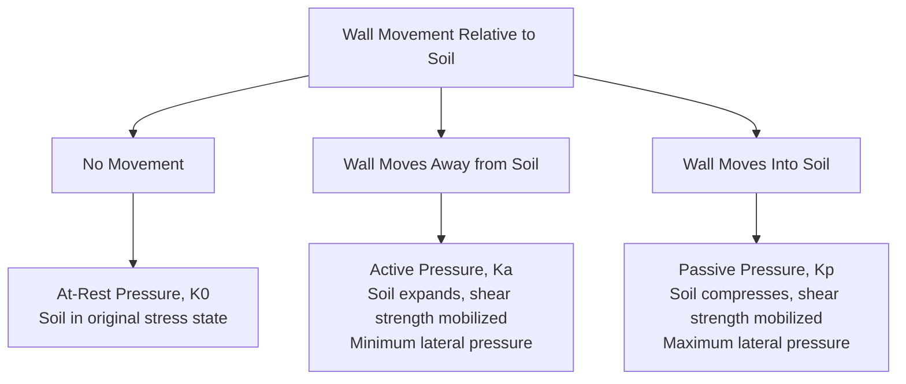
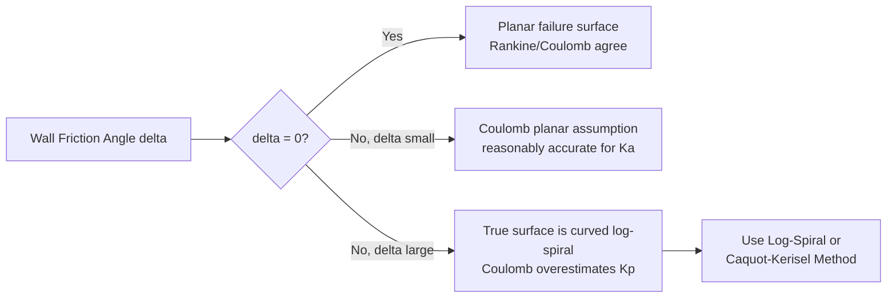
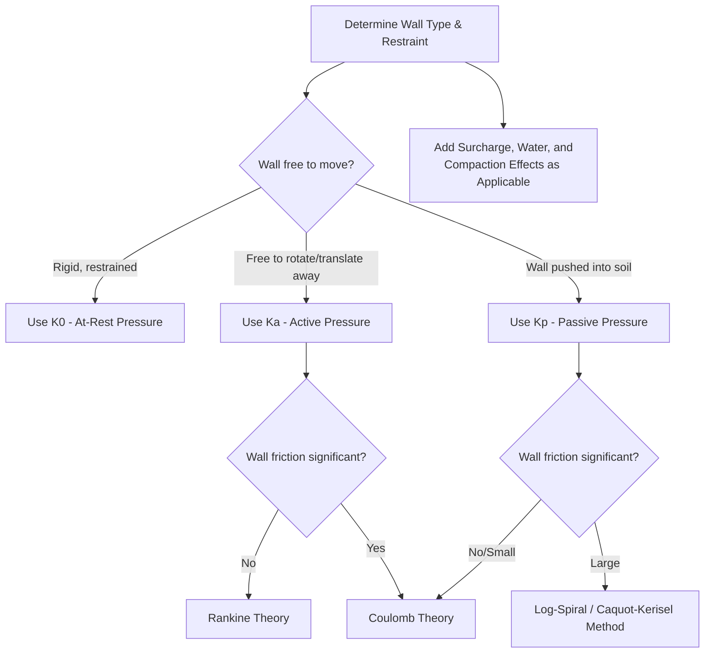

## Lateral Earth Pressure Theories

### Overview

Lateral earth pressure theory quantifies the horizontal stress exerted by soil against retaining structures, excavation supports, and buried elements. The magnitude and distribution of this pressure depend on the amount and direction of wall movement relative to the soil, soil shear strength parameters, and wall geometry. Three fundamental states are recognized: at-rest, active, and passive.

### The Three States of Earth Pressure

**Key Points**

- Active and passive states represent limiting equilibrium conditions where the soil mass has mobilized its full shear strength along a failure surface
- At-rest pressure applies to rigid, unyielding walls (e.g., basement walls restrained top and bottom) where no lateral strain occurs
- The active state requires much smaller wall movement to develop fully than the passive state, since passive resistance requires greater strain to mobilize full shear strength

### Mobilization of Pressure with Wall Movement

<svg xmlns="http://www.w3.org/2000/svg" viewBox="0 0 480 320">
<text x="240" y="20" text-anchor="middle" font-size="14" font-weight="bold" fill="#1a1a1a">Earth Pressure vs Wall Movement (svg_diagram)</text>
<line x1="240" y1="270" x2="240" y2="45" stroke="#333" stroke-width="2" />
<line x1="60" y1="180" x2="440" y2="180" stroke="#333" stroke-width="2" />
<text x="245" y="40" font-size="11">Kp (passive)</text>
<text x="245" y="285" font-size="11">Wall rotation/translation</text>
<path d="M240,180 Q300,100 400,60" stroke="#c0392b" stroke-width="2.5" fill="none" />
<path d="M240,180 Q180,220 100,240" stroke="#2980b9" stroke-width="2.5" fill="none" />
<circle cx="240" cy="180" r="4" fill="#333" />
<text x="245" y="175" font-size="11">K0 (at-rest)</text>
<text x="60" y="255" font-size="11" fill="#2980b9">Ka (active) — small movement to mobilize</text>
<text x="330" y="55" font-size="11" fill="#c0392b">Kp — large movement to mobilize</text>
</svg>

### At-Rest Earth Pressure

Applies when the wall does not deflect, and soil remains in its original in-situ stress condition.

$$\sigma_h' = K_0 \sigma_v'$$

**Jaky's Formula (Normally Consolidated Soil)**

$$K_0 = 1 - \sin\phi'$$

**Overconsolidated Soil (Mayne and Kulhawy correction)**

$$K_0(OC) = (1-\sin\phi')OCR^{\sin\phi'}$$

Overconsolidation increases $K_0$ substantially above the normally consolidated value, since prior unloading leaves residual horizontal stress locked into the soil structure that does not fully relax.

### Rankine's Earth Pressure Theory (1857)

Rankine's theory considers the entire soil mass in a state of plastic equilibrium, derived from Mohr-Coulomb failure criteria applied to a semi-infinite soil mass with a frictionless, vertical wall-soil interface (no wall friction), assuming the wall does not restrain soil movement.

**Active Pressure Coefficient (Cohesionless Soil, Horizontal Backfill)**

$$K_a = \tan^2\left(45 - \frac{\phi}{2}\right) = \frac{1-\sin\phi}{1+\sin\phi}$$

**Passive Pressure Coefficient**

$$K_p = \tan^2\left(45 + \frac{\phi}{2}\right) = \frac{1+\sin\phi}{1-\sin\phi}$$

**Pressure Distribution (Cohesionless Soil)**

$$\sigma_a' = K_a \sigma_v'$$

$$\sigma_p' = K_p \sigma_v'$$

Both distributions are triangular, increasing linearly with depth, since $\sigma_v'$ increases linearly with depth for a homogeneous soil.

**Cohesive Soil (c-$\phi$ Soil)**

$$\sigma_a' = K_a\sigma_v' - 2c\sqrt{K_a}$$

$$\sigma_p' = K_p\sigma_v' + 2c\sqrt{K_p}$$

The cohesion term reduces active pressure (can produce a zone of negative computed pressure near the surface, called the tension crack zone) and increases passive resistance.

**Depth of Tension Crack**

$$z_c = \frac{2c}{\gamma\sqrt{K_a}}$$

Above this depth, the theoretical active pressure is negative (tensile), which soil cannot sustain; in practice, this zone is either assumed to exert no pressure on the wall, or is assumed to fill with water in the worst-case design scenario, requiring the designer to check both conditions.

**Rankine Active and Passive Pressure Distributions**

<svg xmlns="http://www.w3.org/2000/svg" viewBox="0 0 520 340">
<text x="260" y="20" text-anchor="middle" font-size="14" font-weight="bold" fill="#1a1a1a">Rankine Pressure Distribution — Cohesive Soil (svg_diagram)</text>
<line x1="150" y1="50" x2="150" y2="300" stroke="#333" stroke-width="3" />
<text x="100" y="45" font-size="11">Wall</text>
<polygon points="150,50 150,155 90,300 150,300" fill="#3498db" opacity="0.5" />
<line x1="150" y1="50" x2="90" y2="300" stroke="#2980b9" stroke-width="2" />
<text x="40" y="180" font-size="11" fill="#2980b9">Active (net)</text>
<line x1="150" y1="155" x2="200" y2="155" stroke="#999" stroke-dasharray="3,3" />
<text x="205" y="158" font-size="10" fill="#666">zc (tension crack depth)</text>
<polygon points="150,50 150,300 380,300" fill="#e74c3c" opacity="0.3" />
<line x1="150" y1="50" x2="380" y2="300" stroke="#c0392b" stroke-width="2" />
<text x="330" y="200" font-size="11" fill="#c0392b">Passive</text>
</svg>

**Inclined Backfill (Cohesionless Soil, Rankine)**

$$K_a = \cos\beta \frac{\cos\beta - \sqrt{\cos^2\beta - \cos^2\phi}}{\cos\beta + \sqrt{\cos^2\beta - \cos^2\phi}}$$

Where $\beta$ is the backfill slope angle; the resultant pressure acts parallel to the backfill surface rather than horizontally in this case.

### Coulomb's Earth Pressure Theory (1776)

Coulomb's theory predates Rankine's but is more general, based on force equilibrium of a wedge-shaped soil mass on an assumed planar failure surface, explicitly accounting for wall friction ($\delta$), wall inclination, and sloped backfill.

**Active Pressure Coefficient (General Form)**

$$K_a = \frac{\cos^2(\phi - \theta)}{\cos^2\theta\cos(\delta+\theta)\left[1 + \sqrt{\dfrac{\sin(\phi+\delta)\sin(\phi-\beta)}{\cos(\delta+\theta)\cos(\theta-\beta)}}\right]^2}$$

**Passive Pressure Coefficient (General Form)**

$$K_p = \frac{\cos^2(\phi + \theta)}{\cos^2\theta\cos(\delta-\theta)\left[1 - \sqrt{\dfrac{\sin(\phi+\delta)\sin(\phi+\beta)}{\cos(\delta-\theta)\cos(\theta-\beta)}}\right]^2}$$

Where:

- $\theta$ = angle of wall face from vertical
- $\beta$ = angle of backfill surface from horizontal
- $\delta$ = angle of wall friction

**Comparison: Rankine vs. Coulomb**

| Aspect | Rankine | Coulomb |
| --- | --- | --- |
| Wall friction | Ignored ($\delta = 0$) | Explicitly included |
| Wall geometry | Vertical wall assumed (basic form) | Any wall inclination |
| Failure surface | Planar, at theoretical angle | Planar, assumed (approximation) |
| Backfill shape | Horizontal or uniformly sloped | Any slope |
| Accuracy for passive case | Less accurate (wall friction significantly affects $K_p$) | More accurate but assumes planar surface, which overestimates $K_p$ at high $\delta$ |

**Key Points**

- Coulomb's theory generally provides more realistic active pressure estimates since wall friction is almost always present in practice and reduces active thrust
- For passive pressure with significant wall friction ($\delta > \phi/3$, approximately), Coulomb's planar failure surface assumption becomes increasingly inaccurate, overestimating $K_p$, because the actual failure surface curves significantly (log-spiral shape) in this scenario [Well-established in geotechnical literature, not merely speculative — this is why curved-surface methods are recommended for high wall friction cases]
- Log-spiral or curved failure surface methods (Terzaghi, Caquot-Kerisel) provide more accurate passive pressure estimates when wall friction is significant

### Effect of Wall Friction on Failure Surface Shape

### Curved Failure Surface Methods (Log-Spiral)

For passive pressure with significant wall friction, the actual failure surface combines a curved (log-spiral or circular arc) portion near the wall with a planar Rankine zone further away.

$$K_p(\text{curved}) < K_p(\text{Coulomb, planar})$$

Terzaghi's and Caquot-Kerisel's charts provide tabulated $K_p$ values accounting for curved surface geometry across a range of $\phi$ and $\delta$ values, and remain the standard reference for accurate passive pressure calculation when wall friction is significant.

### Effect of Surcharge Loads

**Uniform Surcharge**

$$\Delta\sigma_h = K_a q_s$$

A uniform surcharge $q_s$ applied at the ground surface produces a uniform (rectangular) additional pressure distribution on the wall, unlike the wall's self-weight-induced triangular distribution.

**Point, Line, and Strip Loads**

For surcharges not covering the full backfill surface (e.g., adjacent footing loads, construction equipment), Boussinesq-based solutions adapted for a rigid wall boundary (typically using a 2x multiplier compared to the free-field elastic solution to account for wall rigidity) are used:

$$\Delta\sigma_h = \frac{2P}{\pi H}\frac{m^2n}{(m^2+n^2)^2} \quad \text{(line load, illustrative form)}$$

Where $m = a/H$, $n = z/H$ are normalized horizontal and vertical distances, $P$ = load per unit length, $H$ = wall height. Specific formulas vary depending on whether the load is a point, line, or strip load, and whether the wall is considered flexible or rigid.

### Effect of Water Table and Seepage

**Hydrostatic Water Pressure**

$$u = \gamma_w h_w$$

Water pressure acts in addition to effective lateral earth pressure and must be computed separately, then added to obtain total lateral pressure:

$$\sigma_h(\text{total}) = K_a\sigma_v' + u$$

**Submerged Unit Weight Below Water Table**

Below the water table, effective vertical stress is computed using submerged unit weight $\gamma' = \gamma_{sat} - \gamma_w$, and water pressure is added separately using full hydrostatic pressure — combining these correctly (rather than accidentally double-counting or omitting water pressure) is one of the most common sources of error in retaining wall design.

**Seepage Effects**

Where seepage occurs through or beneath a wall (e.g., inadequate drainage), pore pressures deviate from hydrostatic and must be evaluated using flow net analysis or numerical seepage modeling, since seepage forces can substantially increase effective lateral pressure and reduce wall stability if drainage is inadequate.

### Compaction-Induced Lateral Pressure

Compaction of backfill in lifts near a wall can induce residual lateral pressures exceeding both at-rest and even some active pressure estimates near the top of the wall, since compaction equipment applies transient surface loads that leave behind locked-in lateral stress after the equipment passes (a phenomenon distinct from simple overburden-driven pressure).

**Simplified Concept (illustrative)**

$$\sigma_h(\text{compaction-induced}) > K_0\sigma_v' \quad \text{(near surface, decreasing with depth)}$$

Design methods such as those originally developed by Broms and later refined by others provide charts relating compaction equipment weight and backfill layer thickness to induced lateral pressure, particularly relevant near the top of relatively rigid, restrained walls where compaction pressure does not have the movement needed to relax toward the active state.

### Design Application Summary

### Worked Example

A vertical retaining wall, height $H = 5\text{ m}$, retains a horizontal cohesionless backfill with $\phi = 32°$, $\gamma = 19\text{ kN/m}^3$. No wall friction assumed (Rankine). Compute active thrust.

$$K_a = \tan^2\left(45 - \frac{32}{2}\right) = \tan^2(29°) = (0.5543)^2 = 0.3073$$

Pressure at wall base:

$$\sigma_a' = K_a \gamma H = 0.3073 \times 19 \times 5 = 29.19\text{ kPa}$$

Total active thrust per unit length (area of triangular distribution):

$$P_a = \frac{1}{2}K_a\gamma H^2 = \frac{1}{2}(0.3073)(19)(5)^2 = 72.98\text{ kN/m}$$

Acting at $H/3 = 1.67\text{ m}$ above the wall base.

If a surcharge $q_s = 10\text{ kPa}$ is added:

$$P_{a,surcharge} = K_a q_s H = 0.3073 \times 10 \times 5 = 15.37\text{ kN/m}$$

acting at mid-height ($H/2 = 2.5\text{ m}$), since the surcharge produces a uniform (rectangular) rather than triangular distribution.

**Total Active Thrust**

$$P_{a,total} = 72.98 + 15.37 = 88.35\text{ kN/m}$$

### Conclusion

Lateral earth pressure theory provides the essential loading basis for retaining wall, excavation support, and buried structure design, governed by the relationship between wall movement and the mobilization of soil shear strength. Rankine's theory offers a simpler, conservative approach suited to vertical, frictionless-interface conditions, while Coulomb's theory incorporates wall friction and geometry for more general and typically more realistic active pressure estimates, with curved failure surface methods required for accurate passive pressure prediction when wall friction is substantial. Surcharge loads, groundwater conditions, and compaction effects must be superimposed onto the basic triangular pressure distribution to arrive at the complete design lateral pressure profile.

**Related Topics**

- Retaining Wall Design (Gravity, Cantilever, Reinforced Concrete)
- Sheet Pile Wall Design and Anchored Systems
- Braced Excavation Support Systems
- Mechanically Stabilized Earth (MSE) Walls
- Slope Stability Analysis Methods
- Seismic Lateral Earth Pressure (Mononobe-Okabe Method)
- Flow Nets and Seepage Analysis
- Ground Improvement Techniques