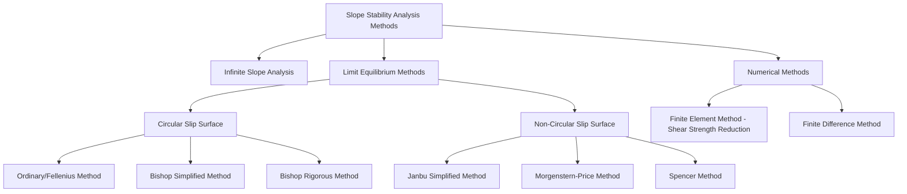
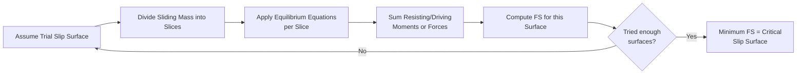
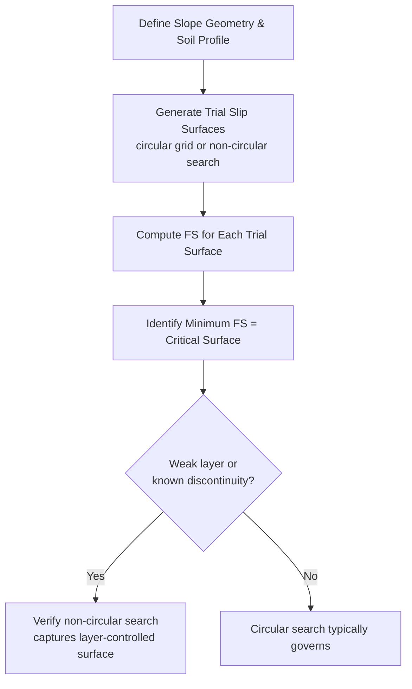

## Slope Stability Analysis Methods

### Overview

Slope stability analysis evaluates the safety of natural or constructed slopes against shear failure along a potential slip surface. Methods range from simple closed-form solutions for infinite slopes to iterative limit equilibrium procedures for arbitrary slip surfaces, and finite element or finite difference numerical methods for complex conditions. The central output of most methods is a factor of safety (FS) comparing available shear strength to mobilized shear stress along the critical slip surface.

$$FS = \frac{\tau_f}{\tau_{mobilized}} = \frac{\text{Resisting Forces/Moments}}{\text{Driving Forces/Moments}}$$

### Classification of Slope Stability Methods

### Infinite Slope Analysis

Applicable to long, uniform slopes where the failure surface is parallel to the slope surface and shallow relative to slope length — appropriate for translational failures in residual soils or thin cohesionless veneers over bedrock.

**Cohesionless Soil, Dry Condition**

$$FS = \frac{\tan\phi}{\tan\beta}$$

Where $\beta$ = slope angle, $\phi$ = friction angle. Notably, FS is independent of slope height and depth to the failure plane for dry cohesionless slopes.

**Cohesionless Soil, Seepage Parallel to Slope**

$$FS = \frac{\gamma'}{\gamma_{sat}}\frac{\tan\phi}{\tan\beta}$$

Seepage parallel to the slope roughly halves the factor of safety compared to the dry case (since $\gamma'/\gamma_{sat} \approx 0.5$ for typical soils), illustrating why seepage is a dominant trigger for shallow slope failures.

**c-$\phi$ Soil**

$$FS = \frac{c}{\gamma z \cos^2\beta\tan\beta} + \frac{\tan\phi}{\tan\beta}$$

Where $z$ = vertical depth to failure plane. Unlike the cohesionless case, FS here depends on depth $z$, since the cohesion term's contribution diminishes relative to the frictional term as depth (and hence normal stress) increases.

**Infinite Slope Geometry**

<svg xmlns="http://www.w3.org/2000/svg" viewBox="0 0 480 300">
<text x="240" y="20" text-anchor="middle" font-size="14" font-weight="bold" fill="#1a1a1a">Infinite Slope Analysis (svg_diagram)</text>
<line x1="40" y1="250" x2="440" y2="100" stroke="#333" stroke-width="2" />
<line x1="40" y1="280" x2="440" y2="130" stroke="#c0392b" stroke-width="2" stroke-dasharray="5,3" />
<text x="330" y="120" font-size="11">Ground surface</text>
<text x="330" y="155" font-size="11" fill="#c0392b">Failure plane (depth z)</text>
<line x1="200" y1="185" x2="200" y2="220" stroke="#333" />
<text x="205" y="205" font-size="11">z</text>
<path d="M60,240 A30,30 0 0,1 90,240" fill="none" stroke="#333" />
<text x="65" y="235" font-size="11">β</text>
</svg>

### Method of Slices — General Concept

For non-uniform slopes, layered soils, or complex geometry, the sliding mass is divided into vertical slices, and equilibrium is evaluated slice-by-slice, then summed to determine overall factor of safety along an assumed slip surface (typically circular for homogeneous soils, or non-circular where weak layers or geometric constraints dictate the failure path).

**Forces Acting on a Typical Slice**

<svg xmlns="http://www.w3.org/2000/svg" viewBox="0 0 420 320">
<text x="210" y="20" text-anchor="middle" font-size="13" font-weight="bold" fill="#1a1a1a">Forces on a Slice (svg_diagram)</text>
<path d="M100,260 A140,140 0 0,1 340,180" stroke="#c0392b" stroke-width="2" fill="none" stroke-dasharray="5,3" />
<polygon points="180,150 240,140 250,260 190,260" fill="#dcd0b0" stroke="#333" />
<line x1="215" y1="145" x2="215" y2="80" stroke="#333" stroke-width="2" />
<text x="220" y="90" font-size="11">W (weight)</text>
<line x1="180" y1="200" x2="140" y2="195" stroke="#2980b9" stroke-width="2" />
<text x="90" y="190" font-size="10" fill="#2980b9">XL, EL</text>
<line x1="250" y1="210" x2="290" y2="205" stroke="#2980b9" stroke-width="2" />
<text x="295" y="200" font-size="10" fill="#2980b9">XR, ER</text>
<line x1="215" y1="255" x2="215" y2="290" stroke="#27ae60" stroke-width="2" />
<text x="220" y="300" font-size="10" fill="#27ae60">N, S (base)</text>
</svg>

Where $E_L, E_R$ = interslice normal (horizontal) forces, $X_L, X_R$ = interslice shear forces, $N$ = normal force at slice base, $S$ = shear force at slice base, $W$ = slice weight. Different methods make different assumptions about interslice forces, which is the primary distinguishing feature between them.

### Ordinary Method of Slices (Fellenius Method)

The simplest method of slices, assuming interslice forces are parallel to the slice base (net interslice force effectively neglected in the normal force calculation).

$$FS = \frac{\sum\left[c'l + (W\cos\alpha - ul)\tan\phi'\right]}{\sum W\sin\alpha}$$

Where:

- $l$ = length of slice base along the slip surface
- $\alpha$ = inclination of slice base from horizontal
- $u$ = pore water pressure at slice base
- $W$ = slice weight

**Key Points**

- Known to be inaccurate (overly conservative, i.e., underestimates FS) for slip surfaces with high pore pressure or deep circular arcs, sometimes by 10-20% or more, because neglecting interslice forces violates force equilibrium
- Retained in practice mainly for hand calculations, quick checks, and educational purposes due to its computational simplicity
- Satisfies only moment equilibrium about the circle center; does not satisfy force equilibrium

### Bishop's Simplified Method (1955)

Assumes interslice shear forces are zero ($X_L = X_R = 0$) but retains interslice normal forces, satisfying vertical force equilibrium for each slice and overall moment equilibrium.

$$FS = \frac{\sum\dfrac{1}{m_\alpha}\left[c'b + (W - ub)\tan\phi'\right]}{\sum W\sin\alpha}$$

Where:

$$m_\alpha = \cos\alpha\left(1 + \frac{\tan\alpha\tan\phi'}{FS}\right)$$

Since $FS$ appears on both sides of the equation, Bishop's simplified method requires iterative solution, typically converging within a few iterations from an initial trial value (e.g., FS from the Ordinary Method).

**Key Points**

- Provides significantly improved accuracy over the Ordinary Method for circular slip surfaces, generally within a few percent of rigorous methods satisfying all equilibrium conditions
- Does not satisfy horizontal force equilibrium, though this omission has limited practical effect on computed FS for most circular surfaces
- Remains one of the most widely used methods in practice due to its favorable accuracy-to-complexity ratio

### Janbu's Simplified Method (1954, 1973)

Applicable to both circular and non-circular slip surfaces, based on horizontal force equilibrium rather than moment equilibrium, making it suitable for irregular or composite failure surfaces where a well-defined circle center does not exist.

$$FS_0 = \frac{\sum\dfrac{1}{n_\alpha}\left[c'b + (W-ub)\tan\phi'\right]\sec\alpha}{\sum W\tan\alpha}$$

Janbu introduced an empirical correction factor $f_0$ to account for interslice shear forces neglected in the simplified formulation:

$$FS = f_0 \times FS_0$$

$f_0$ depends on the ratio of slip surface depth to length and soil type, typically ranging from about 1.0 to 1.13, increasing with curvature of the slip surface.

**Key Points**

- Generally yields lower (more conservative) FS values than Bishop's method for the same circular surface, since satisfying force equilibrium alone (without moment equilibrium) tends to be more restrictive
- Primary advantage is applicability to arbitrary, non-circular slip surfaces, which is essential for slopes with distinct weak layers governing failure geometry

### Spencer's Method (1967)

A rigorous method satisfying both force and moment equilibrium for every slice, assuming a constant ratio between interslice shear and normal forces across all slices.

$$X = E\tan\theta$$

Where $\theta$ is a constant interslice force inclination angle, solved for simultaneously with FS such that both force and moment equilibrium are satisfied.

**Key Points**

- Considered one of the most accurate limit equilibrium methods available, applicable to both circular and non-circular surfaces
- Requires iterative numerical solution for two unknowns (FS and $\theta$) simultaneously, historically requiring charts or computer solution rather than hand calculation

### Morgenstern-Price Method (1965)

The most general limit equilibrium method, satisfying complete force and moment equilibrium, allowing the interslice force function to vary along the slip surface according to a user-selected function $f(x)$:

$$X = \lambda f(x) E$$

Where $\lambda$ is a scaling factor solved for along with FS, and $f(x)$ can be constant, half-sine, trapezoidal, or another user-defined shape.

**Key Points**

- Considered the most rigorous and flexible limit equilibrium method, forming the basis of most modern commercial slope stability software
- Requires numerical (typically computer-based) solution due to the complexity of simultaneously satisfying force and moment equilibrium with a variable interslice force function
- Results are generally very close to Spencer's method for most practical slope geometries, since both satisfy complete equilibrium

### Comparison of Limit Equilibrium Methods

| Method | Equilibrium Satisfied | Slip Surface | Relative Accuracy | Computational Demand |
| --- | --- | --- | --- | --- |
| Ordinary (Fellenius) | Moment only | Circular | Low (conservative) | Hand calculation feasible |
| Bishop Simplified | Moment + vertical force | Circular | Good | Iterative, hand feasible |
| Janbu Simplified | Horizontal force | Any | Moderate (conservative) | Iterative, hand feasible |
| Spencer | Full equilibrium | Any | High | Computer required |
| Morgenstern-Price | Full equilibrium | Any | High | Computer required |

### Numerical Methods — Finite Element Shear Strength Reduction (SSR)

Rather than assuming a slip surface geometry in advance, the finite element SSR method progressively reduces soil shear strength parameters until numerical non-convergence (indicating slope failure) occurs.

$$c_f = \frac{c}{SRF}, \quad \tan\phi_f = \frac{\tan\phi}{SRF}$$

The factor of safety is taken as the shear strength reduction factor (SRF) at which the analysis fails to converge, corresponding to the onset of unbounded plastic deformation along a failure mechanism that develops naturally from the stress-strain analysis rather than being pre-assumed.

**Key Points**

- Does not require pre-assumption of slip surface shape, allowing the critical failure mechanism to emerge naturally from the stress and strain field, which is particularly valuable for complex geometries, staged construction, or reinforced slopes
- Requires appropriate constitutive soil models (elastic-perfectly plastic Mohr-Coulomb being common baseline; more advanced models capture strain-softening and small-strain stiffness effects) and is computationally more demanding than limit equilibrium
- Increasingly used in practice for complex projects, though limit equilibrium methods remain standard for routine design due to speed, established acceptance in codes, and long track record [Inference — the relative prevalence of each method varies by firm, region, and project complexity]

### Selection of Critical Slip Surface

For homogeneous slopes, the critical surface is typically circular and found via grid search or optimization algorithms across trial circle centers and radii. Where distinct weak layers, bedding planes, or previously failed surfaces exist, non-circular search methods are essential since the critical surface will follow the weak layer rather than a smooth arc.

### Pore Pressure Representation

Accurate pore pressure input is critical since slope stability is highly sensitive to effective stress.

**Common Representations**

- Piezometric surface (phreatic line): a single surface representing groundwater level, from which hydrostatic pressure is computed at each slice base
- Pore pressure ratio $r_u = u/(\gamma z)$: a simplified dimensionless ratio, convenient for parametric studies but less precise than direct measurement
- Seepage analysis output: pore pressures derived from a separate flow net or finite element seepage analysis, most accurate for complex groundwater conditions or transient scenarios (e.g., rapid drawdown)

### Rapid Drawdown Condition

A critical loading case for slopes adjacent to reservoirs or water bodies, where rapid lowering of external water level removes stabilizing hydrostatic pressure while excess pore pressure within the slope has not yet dissipated (low-permeability soils), resulting in the lowest factor of safety condition during the slope's operational life for many earth dam and levee designs.

$$FS(\text{rapid drawdown}) < FS(\text{steady state, full pool})$$

Rapid drawdown analysis typically requires staged effective-stress analysis (or specialized undrained strength envelopes) that captures pore pressures remaining from the pre-drawdown condition rather than assuming pore pressures instantly re-equilibrate to the new lower water level.

### Seismic Slope Stability

**Pseudo-Static Method**

A horizontal (and sometimes vertical) seismic coefficient is applied as an additional static force to represent inertial earthquake loading:

$$F_h = k_h W$$

Where $k_h$ = horizontal seismic coefficient (a fraction of peak ground acceleration, typically reduced from PGA to account for the transient nature of seismic loading). Typical required pseudo-static FS thresholds (often around 1.0 to 1.5 depending on code and consequence of failure) are generally lower than static FS requirements, reflecting the acceptance of some permanent deformation under seismic loading rather than requiring no movement at all.

**Newmark Sliding Block Method**

For slopes where some seismic-induced displacement is tolerable, Newmark's method estimates cumulative permanent displacement by double-integrating the portion of an acceleration time-history exceeding the yield acceleration (the acceleration at which pseudo-static FS = 1.0), providing a displacement-based rather than purely FS-based seismic assessment.

### Typical Factor of Safety Criteria

| Condition | Typical Minimum FS |
| --- | --- |
| Static, long-term (drained) | 1.5 |
| Static, end-of-construction (undrained) | 1.3 |
| Rapid drawdown | 1.1–1.3 |
| Seismic (pseudo-static) | 1.0–1.15 |

These values are broadly representative of common geotechnical practice and codes (e.g., USACE, various dam safety guidelines) but specific required values vary by regulatory jurisdiction, structure classification (hazard/consequence category), and owner/agency-specific criteria, so project-specific code requirements should always be confirmed. [Unverified — exact thresholds depend on the governing design code or agency]

### Worked Example — Ordinary Method of Slices (Simplified, Single Slice Illustration)

A trial circular slip surface passes through a slope with a representative slice: $W = 150\text{ kN/m}$, $\alpha = 25°$, $c' = 10\text{ kPa}$, $\phi' = 28°$, base length $l = 2.5\text{ m}$, $u = 15\text{ kPa}$.

**Resisting Force Contribution (this slice)**

$$c'l + (W\cos\alpha - ul)\tan\phi'$$

$$= (10)(2.5) + \left[(150)(\cos 25°) - (15)(2.5)\right]\tan 28°$$

$$= 25 + \left135.9 - 37.5\right$$

$$= 25 + (98.4)(0.5317) = 25 + 52.3 = 77.3\text{ kN/m}$$

**Driving Force Contribution (this slice)**

$$W\sin\alpha = 150 \times \sin 25° = 150 \times 0.4226 = 63.4\text{ kN/m}$$

For a full analysis, this process is repeated for every slice along the trial surface and summed; the illustration above shows the per-slice contribution structure that underlies the full $FS = \sum(\text{resisting})/\sum(\text{driving})$ calculation.

### Conclusion

Slope stability analysis spans a spectrum from simple infinite-slope closed-form solutions to increasingly rigorous limit equilibrium methods and finite element approaches. The choice among Ordinary, Bishop, Janbu, Spencer, and Morgenstern-Price methods reflects a trade-off between computational simplicity and equilibrium rigor, with modern practice generally favoring computer-based rigorous methods (Spencer, Morgenstern-Price) for final design while simpler methods retain value for preliminary screening and hand verification. Critical loading scenarios — rapid drawdown, seismic loading, and worst-case pore pressure conditions — must be systematically evaluated alongside routine static cases to ensure comprehensive slope safety assessment.

**Related Topics**

- Lateral Earth Pressure Theories
- Seismic Design Considerations in Geotechnical Engineering
- Ground Improvement Techniques
- Retaining Wall Design (Gravity, Cantilever, MSE Walls)
- Seepage Analysis and Flow Nets
- Landslide Mechanisms and Mitigation
- Embankment Dam Design Fundamentals
- Site Investigation and Subsurface Exploration Methods