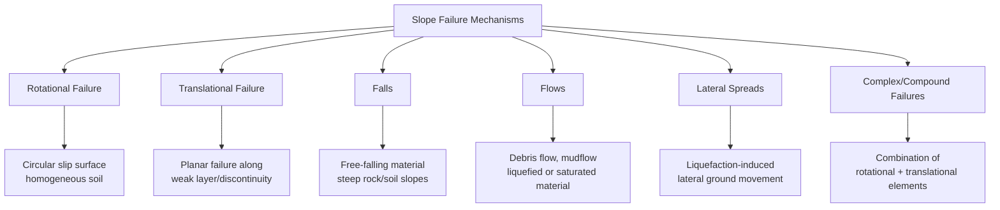
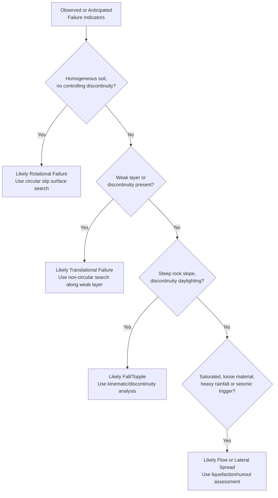

## Factors of Safety and Slope Failure Mechanisms

### Overview

Understanding how slopes fail — and how safety margins against that failure are defined and interpreted — is fundamental to geotechnical design. Factor of safety (FS) provides the quantitative bridge between analytical slope stability calculations and acceptable risk, while failure mechanism classification determines which analytical approach, monitoring strategy, and mitigation method is appropriate for a given slope.

### Definition and Interpretation of Factor of Safety

$$FS = \frac{\text{Available Shear Strength}}{\text{Mobilized Shear Stress}} = \frac{\tau_f}{\tau_d}$$

**Key Points**

- $FS = 1.0$ represents the theoretical threshold of limiting equilibrium (impending failure), not necessarily observed collapse, since real slopes exhibit progressive failure behavior rather than instantaneous global collapse at exactly FS = 1
- $FS > 1.0$ indicates a margin of safety, but the required minimum value depends on the reliability of soil parameters, consequence of failure, and loading scenario, not on a single universal threshold
- FS is calculated relative to an assumed or searched failure surface; the reported "factor of safety" for a slope refers specifically to its critical (minimum) surface unless stated otherwise

### Alternative Definitions of Factor of Safety

Different formulations exist depending on which quantity is factored, and results can differ meaningfully between definitions for the same slope.

**Strength-Based FS (most common, used in limit equilibrium methods)**

$$FS = \frac{c' + \sigma_n'\tan\phi'}{\tau_{mobilized}}$$

**Force/Moment-Based FS**

$$FS = \frac{\sum \text{Resisting Moments}}{\sum \text{Driving Moments}}$$

**Strength Reduction Factor (used in finite element SSR analysis)**

$$FS = SRF \text{ at which numerical non-convergence occurs}$$

These typically converge to similar values for simple slopes analyzed consistently, but can diverge for complex geometries, progressive failure scenarios, or when partial factors are applied differently to cohesion versus friction components. [Inference — the degree of divergence depends heavily on slope-specific characteristics and is not quantifiable as a general rule]

### Probabilistic and Reliability-Based Approaches

Deterministic FS treats soil parameters as single fixed values, but actual soil properties are inherently variable. Reliability-based methods explicitly account for this uncertainty.

$$\beta_{reliability} = \frac{E[FS] - 1}{\sigma_{FS}}$$

Where $\beta_{reliability}$ is the reliability index, $E[FS]$ is the expected (mean) factor of safety, and $\sigma_{FS}$ is its standard deviation, derived from probabilistic treatment of input parameter variability (commonly via Monte Carlo simulation, First-Order Second-Moment methods, or Point Estimate methods).

**Key Points**

- Two slopes with identical deterministic FS can have very different probabilities of failure if the underlying parameter uncertainty differs, since a slope with tightly clustered soil data carries less risk than one with the same mean FS but highly variable parameters
- Probabilistic methods are increasingly used for high-consequence structures (major dams, critical infrastructure) but deterministic FS with prescribed minimum values remains the dominant approach in routine practice [Inference — relative prevalence varies significantly by industry sector, project scale, and regulatory jurisdiction]

### Classification of Slope Failure Mechanisms

### Rotational Failure

The most common failure mode analyzed by classical limit equilibrium methods, involving movement along a curved (typically circular, approximately log-spiral in reality) slip surface, most characteristic of relatively homogeneous, isotropic soil slopes.

**Sub-Types**

- **Base failure**: slip surface passes beneath the toe, extending into the foundation soil, typical of soft clay foundations under embankments
- **Toe failure**: slip surface emerges at the toe of the slope, most common in moderately steep, homogeneous slopes
- **Slope failure (face failure)**: slip surface emerges on the slope face above the toe, typical of steep slopes or where a stronger layer exists below

**Rotational Failure Sub-Types**

<svg xmlns="http://www.w3.org/2000/svg" viewBox="0 0 500 340">
<text x="250" y="20" text-anchor="middle" font-size="14" font-weight="bold" fill="#1a1a1a">Rotational Failure Sub-Types (svg_diagram)</text>
<line x1="30" y1="120" x2="150" y2="60" stroke="#333" stroke-width="2" />
<line x1="30" y1="150" x2="30" y2="120" stroke="#333" stroke-width="2" />
<path d="M50,150 A70,70 0 0,1 130,80" stroke="#c0392b" stroke-width="2" fill="none" stroke-dasharray="4,3" />
<text x="10" y="170" font-size="10">Toe failure</text>
<line x1="200" y1="120" x2="320" y2="60" stroke="#333" stroke-width="2" />
<line x1="200" y1="150" x2="200" y2="120" stroke="#333" stroke-width="2" />
<path d="M180,180 A100,100 0 0,1 300,70" stroke="#c0392b" stroke-width="2" fill="none" stroke-dasharray="4,3" />
<text x="175" y="200" font-size="10">Base failure</text>
<line x1="370" y1="120" x2="470" y2="70" stroke="#333" stroke-width="2" />
<line x1="370" y1="150" x2="370" y2="120" stroke="#333" stroke-width="2" />
<path d="M390,140 A50,50 0 0,1 450,90" stroke="#c0392b" stroke-width="2" fill="none" stroke-dasharray="4,3" />
<text x="360" y="160" font-size="10">Slope (face) failure</text>
</svg>

### Translational Failure

Movement occurs along a relatively planar surface, typically controlled by a pre-existing weak layer, bedding plane, joint set, or the contact between soil and stronger underlying material (e.g., colluvium over bedrock). Translational failures can extend for long distances relative to their depth, distinguishing them from the more contained geometry of rotational failures.

**Common Triggers**

- Weak, thin clay or weathered layers at shallow to moderate depth
- Bedding planes or discontinuities dipping toward the slope face (daylighting), particularly critical in rock slopes
- Sharp contrast in permeability creating a perched water table and elevated pore pressure at the interface

### Falls and Topples

**Falls**: Detachment of rock or soil blocks from a steep slope or cliff face, descending primarily through the air by free fall, bouncing, or rolling — governed largely by discontinuity orientation and weathering in rock slopes rather than classical shear strength/limit equilibrium analysis.

**Topples**: Forward rotation of a rock or soil mass about a pivot point below its center of gravity, typically associated with steeply dipping discontinuities in rock masses, distinct from falls in that the mass rotates rather than detaching freely.

### Flows

Involve material moving as a viscous fluid-like mass, with internal deformation distributed throughout rather than concentrated along a discrete slip surface.

**Debris Flows**: Rapid, often channelized movement of saturated soil, rock fragments, and organic material, commonly triggered by intense rainfall on steep terrain with loose surficial material available for mobilization.

**Earth Flows**: Slower-moving, typically in fine-grained soils with elevated moisture content, often exhibiting a characteristic "hourglass" morphology (narrow zone of depletion at the head, wider zone of accumulation at the toe).

**Key Points**

- Flow-type failures are generally the most dangerous in terms of velocity and travel distance, since material behavior transitions toward fluid-like mobility once triggered
- Liquefaction-induced flows in loose saturated sands under seismic loading represent a particularly hazardous sub-category, capable of very large, rapid displacement

### Lateral Spreads

Occur when a competent surface layer moves laterally on top of a liquefied or plastically deforming subsurface layer, common in gently sloping ground during seismic liquefaction events. Distinguished from flows by the relatively intact, block-like movement of the surface layer, even though the underlying material has lost strength and is flowing.

### Complex and Compound Failures

Many real-world failures combine elements of multiple mechanisms — for example, an initial rotational failure at the head of a slope transitioning into a translational or flow-type failure downslope as material remolds and mobilizes water content during movement. Classification systems (such as the Varnes classification, widely used in landslide literature) accommodate this by allowing compound and complex categories alongside the primary mechanism types.

### Slope Failure Mechanism Decision Framework

### Common Triggering Mechanisms

**Increase in Driving Forces**

- Addition of load (fill placement, structures, stockpiles) at the slope crest
- Steepening of slope through excavation at the toe
- Increased pore water pressure from rainfall infiltration, reduced surface drainage, or rising groundwater
- Seismic loading (inertial forces during ground shaking)
- Erosion undercutting the toe

**Decrease in Resisting Forces**

- Weathering-induced reduction in shear strength over time
- Progressive strain-softening along developing shear surfaces (strength drops from peak toward residual value with accumulated displacement)
- Loss of matric suction in unsaturated soils following rainfall infiltration
- Freeze-thaw cycling degrading soil structure
- Removal of vegetation, reducing root reinforcement and increasing infiltration

### Progressive Failure and Strain-Softening

Many slope failures, particularly in stiff, fissured clays and overconsolidated materials, do not fail simultaneously along the entire slip surface at peak strength. Instead, strain concentrates first at points of highest stress, and as displacement accumulates, strength drops from peak toward residual value in already-strained zones while adjacent zones have not yet reached peak strength.

$$\tau_{residual} < \tau_{peak}$$

**Key Points**

- Analyses using peak strength parameters throughout can overestimate FS for slopes prone to progressive failure, since not all points along the surface mobilize peak strength simultaneously
- Back-analysis of failed slopes (using known failure geometry with $FS = 1.0$ to back-calculate mobilized strength) often reveals mobilized strength between peak and fully residual values, reflecting the progressive nature of the failure process
- This phenomenon is particularly significant in slopes with pre-existing shear surfaces (old landslides, tectonically sheared clays), where residual strength governs long-term stability

### Monitoring Indicators of Impending Failure

**Surface Indicators**

- Tension cracks developing at or near the slope crest, often the earliest visible sign
- Bulging or heaving near the toe
- Tilting of trees, poles, or structures on the slope
- Sudden changes in seepage patterns or new springs emerging

**Instrumented Monitoring**

- Inclinometers: measure subsurface lateral displacement with depth, directly identifying the depth and rate of movement along a developing or active slip surface
- Piezometers: monitor pore water pressure, allowing correlation between rainfall/groundwater events and reduced effective stress
- Survey monuments/GPS/InSAR: track surface displacement over time, useful for identifying acceleration trends that often precede failure
- Extensometers: measure crack widening across tension cracks at the crest

### Velocity Classification of Slope Movements (Cruden and Varnes)

| Class | Velocity | Description |
| --- | --- | --- |
| Extremely slow | < 16 mm/yr | Imperceptible without instruments |
| Very slow | 16 mm/yr – 1.6 m/yr | Structures tolerant with mitigation |
| Slow | 1.6 m/yr – 13 m/month | Remedial action generally feasible |
| Moderate | 13 m/month – 1.8 m/hr | Evacuation possible with warning |
| Rapid | 1.8 m/hr – 3 m/min | Evacuation difficult |
| Very rapid | 3 m/min – 5 m/sec | Escape difficult, significant loss of life risk |
| Extremely rapid | > 5 m/sec | Catastrophic, little to no warning |

This classification, widely referenced in landslide hazard literature, illustrates why identifying the likely failure mechanism matters practically: rotational failures in clay often progress slowly enough for evacuation, while flow-type failures and liquefaction-induced lateral spreads can occur too rapidly for effective warning.

### Relating Failure Mechanism to Analysis Method

| Failure Mechanism | Typical Analysis Approach |
| --- | --- |
| Rotational (circular) | Bishop, Spencer, Morgenstern-Price with circular search |
| Translational (planar) | Infinite slope analysis; non-circular limit equilibrium along weak layer |
| Rock falls/topples | Kinematic analysis, discontinuity stereonet analysis, rockfall trajectory modeling |
| Flows/liquefaction | Liquefaction triggering assessment (e.g., simplified stress-based procedures), post-liquefaction strength analysis, runout modeling |
| Lateral spreads | Empirical displacement relationships, effective/residual strength analysis of liquefied layer |
| Progressive/complex | Finite element SSR, back-analysis with residual strength, staged construction modeling |

### Worked Example — Back-Analysis of a Failed Slope

A slope failed along a known circular slip surface with driving moment $M_d = 4200\text{ kN·m/m}$ and a resisting moment contribution from friction (using peak $\phi' = 24°$) computed as $M_{r,friction} = 3100\text{ kN·m/m}$, with cohesion contribution unknown. Since the slope failed, $FS = 1.0$ at the moment of failure.

$$FS = 1.0 = \frac{M_{r,friction} + M_{r,cohesion}}{M_d}$$

$$M_{r,cohesion} = M_d - M_{r,friction} = 4200 - 3100 = 1100\text{ kN·m/m}$$

Back-calculated mobilized cohesion can then be derived from this resisting moment given the slip surface geometry (arc length and radius), providing a site-specific mobilized strength value for use in design of remedial measures — this back-calculated value often falls between laboratory peak and residual strength, consistent with progressive failure behavior.

### Conclusion

Factor of safety provides a quantitative but context-dependent measure of slope stability, whose interpretation depends on the analysis method, definition used, and increasingly on probabilistic treatment of parameter uncertainty for high-consequence projects. Understanding the specific failure mechanism — rotational, translational, fall, flow, or lateral spread — is essential not merely as classification but because it directly determines the appropriate analytical method, monitoring strategy, and warning time available before failure, with progressive failure and strain-softening behavior further complicating the relationship between calculated FS and actual field performance in stiff fissured or pre-sheared materials.

**Related Topics**

- Slope Stability Analysis Methods
- Liquefaction Potential Assessment
- Landslide Monitoring and Early Warning Systems
- Lateral Earth Pressure Theories
- Rock Slope Kinematic Analysis
- Seismic Design Considerations in Geotechnical Engineering
- Ground Improvement Techniques
- Site Investigation and Subsurface Exploration Methods