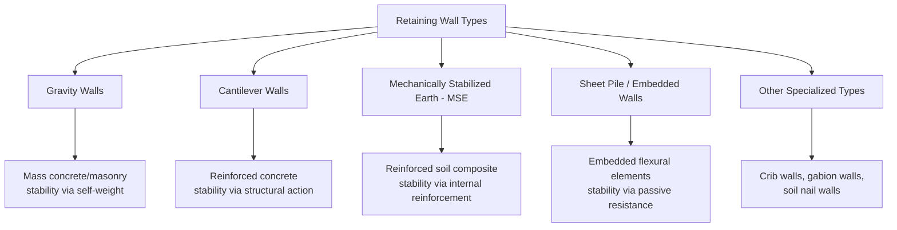
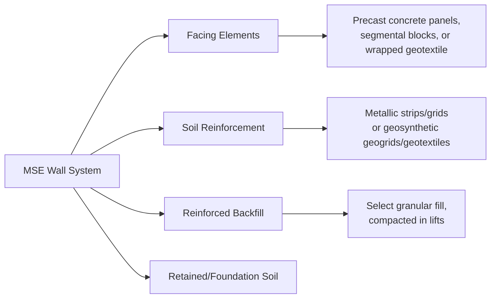
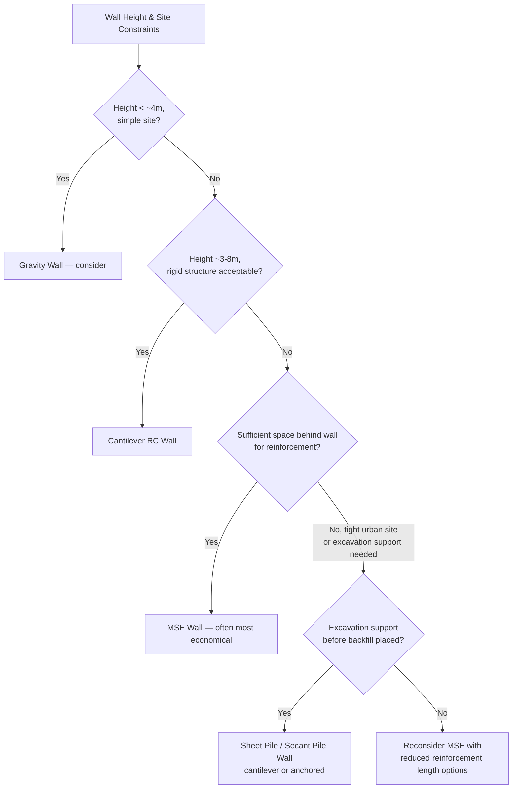

## Retaining Wall Types: Gravity, Cantilever, MSE, Sheet Pile

### Overview

Retaining walls resist lateral earth pressure to maintain a difference in ground elevation across a structure. Wall type selection depends on wall height, available space, soil conditions, aesthetic requirements, and economics. The major categories differ fundamentally in how they achieve stability — through self-weight, structural cantilever action, reinforced soil composite behavior, or embedded flexural resistance.

### Classification of Retaining Wall Systems

### Gravity Retaining Walls

Rely entirely on the mass of the wall material (concrete, stone masonry, or rubble) to resist overturning and sliding, with no significant tensile reinforcement — the wall functions essentially as a mass resisting lateral thrust through weight and friction.

**Stability Requirements**

Against overturning:

$$FS_{overturning} = \frac{\sum M_{resisting}}{\sum M_{overturning}} \geq 1.5 \text{ to } 2.0$$

Against sliding:

$$FS_{sliding} = \frac{\sum F_{resisting}}{\sum F_{driving}} = \frac{W\tan\delta + c_a B}{P_a\cos\beta} \geq 1.5$$

Against bearing capacity failure of foundation soil:

$$FS_{bearing} = \frac{q_{ult}}{q_{applied}} \geq 3.0$$

**Key Points**

- Economical only for relatively low wall heights (typically up to about 3–4 m) due to the large volume of material required as height increases, since resisting moment must scale with the cube of height while material cost scales similarly, making gravity walls increasingly inefficient at greater heights
- Require no tensile reinforcement, historically an advantage before reinforced concrete became economical and widely available
- Typically require a wide base relative to height, increasing footprint requirements compared to structural alternatives

**Gravity Wall Cross-Section**

<svg xmlns="http://www.w3.org/2000/svg" viewBox="0 0 400 300">
<text x="200" y="20" text-anchor="middle" font-size="14" font-weight="bold" fill="#1a1a1a">Gravity Wall (svg_diagram)</text>
<polygon points="150,260 150,60 190,50 220,260" fill="#95a5a6" stroke="#333" stroke-width="2" />
<line x1="220" y1="260" x2="350" y2="180" stroke="#dcd0b0" stroke-width="15" />
<text x="240" y="200" font-size="11">Retained soil</text>
<line x1="80" y1="260" x2="150" y2="260" stroke="#333" />
<text x="30" y="150" font-size="11">Self-weight W</text>
<path d="M180,150 L120,150" stroke="#c0392b" stroke-width="2" marker-end="url(#arrow1)" />
</svg>

### Cantilever Retaining Walls

Reinforced concrete walls consisting of a vertical stem and a base slab (footing), acting as a structural cantilever — the weight of soil above the heel of the footing contributes to stability along with the wall's own reduced material weight, making cantilever walls far more material-efficient than gravity walls for a given height.

**Components**

- **Stem**: vertical wall element resisting bending from lateral earth pressure, designed as a cantilever fixed at the base
- **Heel**: portion of base slab beneath retained soil, carrying the weight of soil above it as a stabilizing force
- **Toe**: portion of base slab on the excavated/exposed side, providing bearing area and some passive resistance

**Cantilever Wall Cross-Section**

<svg xmlns="http://www.w3.org/2000/svg" viewBox="0 0 420 300">
<text x="210" y="20" text-anchor="middle" font-size="14" font-weight="bold" fill="#1a1a1a">Cantilever Wall (svg_diagram)</text>
<rect x="150" y="50" width="30" height="200" fill="#7f8c8d" stroke="#333" />
<rect x="80" y="250" width="220" height="25" fill="#7f8c8d" stroke="#333" />
<text x="90" y="245" font-size="10">Heel</text>
<text x="270" y="245" font-size="10">Toe</text>
<polygon points="180,60 340,150 340,250 180,250" fill="#dcd0b0" opacity="0.7" />
<text x="220" y="140" font-size="11">Soil weight on heel (stabilizing)</text>
<text x="155" y="45" font-size="10">Stem</text>
</svg>

**Design Considerations**

- Stem designed for flexure and shear from lateral earth pressure, typically greatest at the base and decreasing toward the top for a triangular pressure distribution
- Heel designed considering downward soil weight plus any surcharge, combined with upward soil reaction (net loading can be upward or downward depending on relative magnitudes)
- Overall stability checks (overturning, sliding, bearing) are similar in form to gravity walls but benefit from the stabilizing soil weight over the heel, generally allowing taller walls with less concrete volume

**Economical Height Range**

Cantilever walls are typically economical for heights of roughly 3 m to 8 m; [Unverified — exact economical range depends on local material/labor costs, site conditions, and specific project constraints] beyond this range, the bending moments in the stem become large enough that MSE or other alternatives often become more economical.

### Counterfort and Buttressed Walls

Variants of the cantilever wall used for greater heights, incorporating additional vertical ribs (counterforts on the retained side, buttresses on the exposed side) connecting the stem to the base slab, reducing bending moments in the stem by converting it into a continuous slab spanning between the ribs rather than a pure vertical cantilever.

### Mechanically Stabilized Earth (MSE) Walls

Composite structures combining compacted granular backfill with horizontal reinforcement elements (metallic strips/grids or geosynthetic layers) extending back into the reinforced soil mass, with the reinforced soil block itself acting as a large gravity mass against a relatively lightweight facing panel.

**Internal Stability Design Concept**

Each reinforcement layer must resist pullout and rupture:

$$T_{max} = K\sigma_v'S_v$$

Where $T_{max}$ = maximum tensile force in reinforcement layer, $K$ = lateral earth pressure coefficient (varies with depth and reinforcement type per design guidance, e.g., AASHTO), $\sigma_v'$ = vertical stress at reinforcement level, $S_v$ = vertical spacing between reinforcement layers.

**Pullout Resistance**

$$P_r = F^* \alpha \sigma_v' L_e C \leq T_{max} \times FS_{pullout}$$

Where $F^*$ = pullout resistance factor, $\alpha$ = scale correction factor, $L_e$ = reinforcement length in the resistant zone beyond the theoretical failure surface, $C$ = reinforcement surface area factor.

**Key Points**

- MSE walls are generally the most economical option for medium-to-tall walls (roughly 5 m and above) due to their tolerance for differential settlement (flexible system), reduced excavation requirements, and rapid construction using standardized components
- Require sufficient horizontal space behind the wall face for reinforcement layers, typically extending back 0.7H to 1.0H (H = wall height) or more, which can be a limiting factor at constrained sites
- Perform well under seismic loading relative to rigid gravity/cantilever systems due to their flexibility and internal redundancy, generally exhibiting more ductile, distributed deformation rather than a single brittle failure mode [Inference — relative seismic performance depends on site-specific factors including reinforcement type, facing system, and foundation conditions]

**MSE Wall Cross-Section**

<svg xmlns="http://www.w3.org/2000/svg" viewBox="0 0 460 300">
<text x="230" y="20" text-anchor="middle" font-size="14" font-weight="bold" fill="#1a1a1a">MSE Wall (svg_diagram)</text>
<rect x="100" y="50" width="15" height="230" fill="#7f8c8d" stroke="#333" />
<text x="60" y="45" font-size="10">Facing panels</text>
<line x1="115" y1="90" x2="400" y2="90" stroke="#2980b9" stroke-width="3" />
<line x1="115" y1="140" x2="400" y2="140" stroke="#2980b9" stroke-width="3" />
<line x1="115" y1="190" x2="400" y2="190" stroke="#2980b9" stroke-width="3" />
<line x1="115" y1="240" x2="400" y2="240" stroke="#2980b9" stroke-width="3" />
<text x="200" y="80" font-size="10" fill="#2980b9">Reinforcement layers</text>
<text x="200" y="280" font-size="10">Reinforced backfill zone</text>
</svg>

### Sheet Pile and Embedded Walls

Relatively thin, flexible structural elements (steel, concrete, or vinyl sheet piles, or secant/tangent pile walls) driven or installed into the ground before excavation, deriving stability primarily from passive soil resistance developed below the excavation level, often supplemented by anchors or struts for taller applications.

**Cantilever Sheet Pile Wall**

For a cantilever sheet pile (no anchors), embedment depth is determined by balancing active pressure above and passive pressure below the excavation level, requiring the passive resistance on the embedded portion to provide sufficient moment resistance about the point of rotation.

$$\sum M = 0 \quad \text{(about point of net zero pressure or toe)}$$

An empirical increase in calculated theoretical embedment depth (commonly 20–40%) is standard practice to account for simplifications in the idealized pressure distribution used in the basic free-earth support method. [Unverified — exact percentage increase varies by design code and method]

**Anchored (Tied-Back) Sheet Pile Wall**

For taller excavations, an anchor (tie-rod to a deadman anchor, or ground anchor/tieback) is added near the top of the wall, substantially reducing required embedment depth and bending moment compared to a cantilever configuration for the same exposed height.

**Design Methods**

- **Free earth support method**: assumes the embedded toe is free to rotate (no fixity), simpler but generally more conservative for bending moment in the wall
- **Fixed earth support method**: assumes sufficient embedment to prevent toe rotation, more economical embedment prediction but requires more complex analysis of the resulting pressure distribution reversal near the toe

**Sheet Pile Wall Configurations**

<svg xmlns="http://www.w3.org/2000/svg" viewBox="0 0 480 300">
<text x="240" y="20" text-anchor="middle" font-size="13" font-weight="bold" fill="#1a1a1a">Cantilever vs Anchored Sheet Pile (svg_diagram)</text>
<line x1="120" y1="50" x2="120" y2="260" stroke="#333" stroke-width="4" />
<line x1="60" y1="140" x2="120" y2="140" stroke="#333" stroke-dasharray="3,3" />
<text x="60" y="135" font-size="10">Excavation level</text>
<text x="70" y="275" font-size="10">Cantilever</text>
<line x1="340" y1="70" x2="340" y2="260" stroke="#333" stroke-width="4" />
<line x1="280" y1="150" x2="340" y2="150" stroke="#333" stroke-dasharray="3,3" />
<line x1="340" y1="80" x2="420" y2="60" stroke="#c0392b" stroke-width="3" />
<text x="350" y="55" font-size="10" fill="#c0392b">Tieback anchor</text>
<text x="300" y="275" font-size="10">Anchored</text>
</svg>

### Comparison of Wall Types

| Wall Type | Typical Height Range | Key Advantage | Key Limitation |
| --- | --- | --- | --- |
| Gravity | Up to ~4 m | Simple, no reinforcement needed | Large footprint, material-inefficient at height |
| Cantilever | ~3–8 m | Material-efficient, moderate footprint | Requires formwork, rigid (sensitive to differential settlement) |
| MSE | ~5 m and above (also low walls) | Economical at height, tolerant of settlement, good seismic performance | Requires reinforcement length behind wall face |
| Sheet Pile (cantilever) | Low-moderate, limited by moment capacity | Fast installation, no excavation needed before installation | Limited height without anchors, vibration/noise during driving |
| Sheet Pile (anchored) | Moderate to tall excavations | Reduced embedment, handles taller cuts | Requires anchor installation, easement/right-of-way for tiebacks |

### Facing Systems for MSE Walls

**Precast Concrete Panels**: Most common for permanent, higher-visibility structures, offering durability and aesthetic finish options.

**Segmental (Modular Block) Facing**: Dry-stacked concrete blocks, commonly used for lower to moderate height walls, offering rapid construction without cast-in-place connections.

**Wrapped-Face (Geotextile/Geogrid)**: Reinforcement material wrapped around the face at each lift, typically used for temporary walls or as a construction expedient later covered by a permanent facing.

### Drainage Considerations (All Wall Types)

Adequate drainage is critical across all retaining wall types, since unanticipated hydrostatic pressure buildup behind a wall not designed for it is a common cause of retaining wall distress or failure.

**Common Drainage Measures**

- Weep holes through the wall face at regular intervals
- Continuous drainage blanket or geocomposite drain behind the wall, connected to a perforated collector pipe at the base
- Free-draining granular backfill immediately behind the wall, minimizing fines that would otherwise impede drainage

### Selection Framework

### Worked Example — Cantilever Wall Overturning Check (Simplified)

A cantilever wall, height $H = 6\text{ m}$, retains cohesionless backfill $\phi = 30°$, $\gamma = 18\text{ kN/m}^3$, no surcharge. $K_a = 0.333$.

**Active Thrust**

$$P_a = \frac{1}{2}K_a\gamma H^2 = \frac{1}{2}(0.333)(18)(6)^2 = 107.9\text{ kN/m}$$

Acting at $H/3 = 2.0\text{ m}$ above the base.

**Overturning Moment (about toe)**

$$M_o = P_a \times \frac{H}{3} = 107.9 \times 2.0 = 215.8\text{ kN·m/m}$$

Assume total resisting moment (wall self-weight + soil weight on heel, about the toe) is computed as $M_r = 480\text{ kN·m/m}$ from separate section property and geometry calculations.

$$FS_{overturning} = \frac{M_r}{M_o} = \frac{480}{215.8} = 2.22$$

This exceeds the typical minimum requirement of 1.5–2.0, indicating adequate overturning stability for this trial section; sliding and bearing capacity checks would be performed similarly to complete the stability verification.

### Conclusion

Retaining wall selection reflects a progression from simple mass-dependent gravity systems, through structurally efficient reinforced concrete cantilever walls, to composite reinforced-soil MSE systems that dominate modern medium-to-tall wall construction, alongside embedded sheet pile and anchored systems suited to excavation support applications. Each system type involves distinct stability mechanisms — self-weight, structural bending resistance, internal reinforcement pullout/rupture, and passive soil resistance respectively — requiring correspondingly different design methodologies, though all share the common requirement for adequate drainage to prevent unanticipated hydrostatic loading.

**Related Topics**

- Lateral Earth Pressure Theories
- Bearing Capacity Theories
- Slope Stability Analysis Methods
- Ground Anchors and Tieback Design
- Seismic Lateral Earth Pressure (Mononobe-Okabe Method)
- Geosynthetics in Civil Engineering Applications
- Braced Excavation Support Systems
- Ground Improvement Techniques