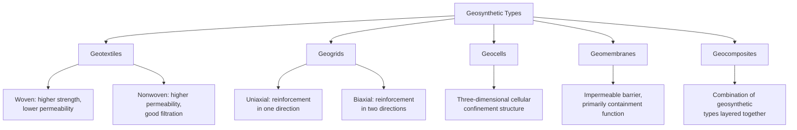
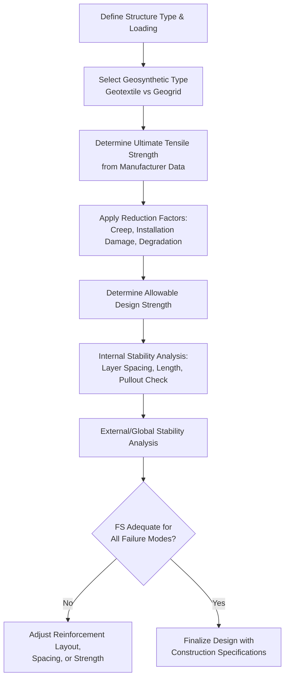

## Geosynthetic Reinforcement in Earth Structures

### Overview

Geosynthetics are engineered polymeric materials used to improve the performance of soil structures through reinforcement, separation, filtration, drainage, and containment functions. In the context of earth retaining and slope systems, reinforcement is the primary function of interest — geosynthetics provide tensile resistance that soil inherently lacks, enabling steeper slopes, taller walls, and improved bearing performance over weak ground.

### Classification of Geosynthetic Types

**Key Points**

- Geotextiles are permeable, fabric-like materials manufactured from synthetic polymers (typically polypropylene or polyester), serving separation, filtration, drainage, and reinforcement functions depending on design
- Geogrids have an open, grid-like structure specifically optimized for reinforcement through soil interlock within grid apertures, generally providing superior soil-reinforcement interaction compared to geotextiles for pure tensile reinforcement applications
- Material choice (polyester, polypropylene, HDPE, or polyvinyl alcohol) affects long-term durability, creep behavior, and chemical resistance, each with different sensitivity to installation damage, UV exposure, and long-term degradation mechanisms

### Primary Functions of Geosynthetics

| Function | Description | Typical Application |
| --- | --- | --- |
| Reinforcement | Provides tensile resistance soil lacks | MSE walls, reinforced slopes, embankments over soft ground |
| Separation | Prevents intermixing of dissimilar materials | Pavement layers, railway ballast |
| Filtration | Allows water passage while retaining soil particles | Drainage systems, erosion control |
| Drainage | Provides in-plane flow path for water | Retaining wall drainage, PVDs |
| Containment/Barrier | Prevents fluid migration | Landfill liners, containment ponds |

### Reinforcement Mechanisms

**Direct Tensile Reinforcement**

Geosynthetic layers embedded within soil carry tensile stress that develops as the soil mass tends to deform, analogous to steel reinforcement in concrete, redistributing stress and limiting deformation.

**Membrane Effect**

Under concentrated or differential loading (e.g., over soft ground or void areas), a tensioned geosynthetic layer can support load directly through its curvature, contributing a vertical component of resistance in addition to lateral restraint.

**Lateral Restraint / Confinement**

In reinforced foundations and base layers, geosynthetic reinforcement restrains lateral spreading of granular material under load, increasing the effective confinement and thus the mobilized shear strength of the confined soil.

**Reinforcement Mechanism Schematic**

<svg xmlns="http://www.w3.org/2000/svg" viewBox="0 0 480 300">
<text x="240" y="20" text-anchor="middle" font-size="13" font-weight="bold" fill="#1a1a1a">Geosynthetic Reinforcement Mechanisms (svg_diagram)</text>
<rect x="40" y="60" width="150" height="20" fill="#7f8c8d" />
<text x="45" y="55" font-size="10">Applied load</text>
<line x1="40" y1="130" x2="190" y2="130" stroke="#2980b9" stroke-width="3" />
<text x="45" y="145" font-size="10" fill="#2980b9">Tensile reinforcement</text>
<rect x="260" y="60" width="150" height="20" fill="#7f8c8d" />
<path d="M270,130 Q335,160 400,130" stroke="#2980b9" stroke-width="3" fill="none" />
<text x="270" y="155" font-size="10" fill="#2980b9">Membrane effect (curvature)</text>
</svg>

### Design Strength and Reduction Factors

Geosynthetic design strength accounts for the difference between manufacturer-reported ultimate tensile strength (index strength) and the long-term strength available for design under actual field conditions.

$$T_{allowable} = \frac{T_{ultimate}}{RF_{CR} \times RF_{ID} \times RF_{CBD}}$$

Where:

- $RF_{CR}$ = creep reduction factor, accounting for long-term load-induced deformation of polymeric materials under sustained tension
- $RF_{ID}$ = installation damage reduction factor, accounting for mechanical damage during placement and compaction
- $RF_{CBD}$ = chemical/biological degradation reduction factor, accounting for long-term environmental exposure effects

**Key Points**

- Creep is a particularly significant consideration for geosynthetics (unlike steel reinforcement), since polymeric materials exhibit time-dependent deformation under sustained load that must be accounted for over the design life of a permanent structure
- Polyester generally exhibits lower creep than polypropylene or polyethylene-based geogrids under comparable conditions, though exact relative performance depends on the specific product formulation and manufacturing process [Unverified — specific creep behavior should be confirmed against product-specific certified test data]
- Combined reduction factors commonly result in allowable design strength being a fraction (often roughly 20–50%) of the reported ultimate tensile strength, though the specific factor is highly product- and application-dependent

### Reinforced Soil Slopes (RSS)

Similar in concept to MSE walls but typically constructed with a steeper-than-natural but not vertical face (commonly 1:1 to nearly vertical), often with a vegetated or wrapped face rather than rigid panels, used to achieve slope angles steeper than the soil's natural angle of repose would otherwise allow.

**Internal Stability Concept**

$$FS(\text{reinforced}) = \frac{M_{r,soil} + M_{r,reinforcement}}{M_d}$$

Reinforcement layers intersecting the trial failure surface contribute additional resisting moment (or force, depending on method) proportional to their tensile capacity and the number of layers crossed, analyzed using modified limit equilibrium methods (e.g., Bishop's method extended to include reinforcement layer contributions).

**Design Considerations**

- Reinforcement length must extend sufficiently beyond the critical failure surface to develop adequate pullout resistance in the resistant zone
- Vertical spacing and layer strength are selected to satisfy both internal (through the reinforced zone) and external (overall slope) stability
- Facing treatment (wrapped, vegetated, or with erosion control matting) prevents surface raveling between reinforcement layers

### Reinforced Embankments over Soft Ground

Geosynthetic (typically high-strength geogrid or woven geotextile) basal reinforcement is placed at the base of embankments constructed over soft, low-strength foundation soils to improve stability against lateral spreading and bearing capacity failure during and immediately after construction.

**Basal Reinforcement Function**

$$FS_{stability} = \frac{M_{r,soil} + T_{reinforcement} \times \text{(moment arm)}}{M_d}$$

The reinforcement primarily resists lateral spreading of the embankment fill and provides tensile resistance across potential failure surfaces passing through the soft foundation, allowing more rapid construction (higher fill placement rates) than would otherwise be stable, or allowing steeper embankment side slopes for a given foundation strength.

**Key Points**

- Particularly valuable where soft foundation soil strength is too low to support conventional embankment construction rates without staged construction or ground improvement
- Often used in combination with other ground improvement techniques (PVDs for consolidation acceleration, stone columns) rather than as a standalone solution for very soft or thick compressible deposits
- Reinforcement primarily addresses short-term (undrained) stability; long-term settlement still requires evaluation through conventional consolidation analysis

**Basal Reinforcement Schematic**

<svg xmlns="http://www.w3.org/2000/svg" viewBox="0 0 480 280">
<text x="240" y="20" text-anchor="middle" font-size="13" font-weight="bold" fill="#1a1a1a">Basal Reinforced Embankment (svg_diagram)</text>
<polygon points="150,220 200,80 280,80 330,220" fill="#dcd0b0" stroke="#333" />
<text x="220" y="150" font-size="10">Embankment fill</text>
<line x1="100" y1="222" x2="380" y2="222" stroke="#2980b9" stroke-width="4" />
<text x="105" y="240" font-size="10" fill="#2980b9">Basal geogrid reinforcement</text>
<rect x="60" y="224" width="360" height="40" fill="#c8a97e" opacity="0.6" />
<text x="70" y="250" font-size="10">Soft foundation soil</text>
</svg>

### Reinforced Soil Foundations (Load-Bearing Applications)

Geogrid layers placed beneath shallow foundations or within pavement base courses improve bearing capacity and reduce settlement through the confinement and lateral restraint mechanisms described earlier, particularly effective in granular base materials over weaker subgrade.

**Bearing Capacity Improvement Ratio**

$$BCR = \frac{q_{ult}(\text{reinforced})}{q_{ult}(\text{unreinforced})}$$

$BCR$ values greater than 1 are consistently observed in laboratory and field studies of geogrid-reinforced granular bases, though the specific magnitude depends heavily on reinforcement depth, number of layers, and reinforcement stiffness relative to the confined soil. [Unverified — exact BCR values are application- and product-specific and require project-specific testing or established design charts to quantify precisely]

### Geosynthetic-Reinforced Pavement and Base Layers

Beyond earth retaining structures, geogrids are widely used in pavement design to reinforce base and subbase layers, distributing wheel loads over a wider area and reducing rutting, particularly valuable over weak or variable subgrade where conventional base thickness alone would be uneconomical.

### Design Workflow for Geosynthetic-Reinforced Structures

### Installation and Construction Considerations

- Proper overlap or mechanical connection at seams is critical to maintain continuous reinforcement, since gaps or inadequate overlap can create weak zones not accounted for in design
- Compaction equipment and lift thickness must be controlled to minimize installation damage, particularly for geogrids with relatively brittle junctions
- UV exposure during construction should be minimized for products sensitive to degradation before permanent cover is placed, since many polymers degrade measurably under prolonged sunlight exposure prior to burial
- Tensioning during placement (where specified) affects initial reinforcement engagement and should follow manufacturer and design specifications

### Worked Example — Reinforcement Layer Contribution in a Reinforced Slope

A reinforced soil slope includes a geogrid layer with allowable design tensile strength $T_a = 40\text{ kN/m}$, intersecting a trial circular failure surface at a point where the moment arm from the slip circle center is $r = 8\text{ m}$ (assuming reinforcement force acts tangential to the slip circle for this simplified illustration).

**Resisting Moment Contribution (this layer)**

$$M_{r,reinforcement} = T_a \times r = 40 \times 8 = 320\text{ kN·m/m}$$

If the total soil-only resisting moment for this trial surface is $M_{r,soil} = 1800\text{ kN·m/m}$ and driving moment is $M_d = 1900\text{ kN·m/m}$:

**Without reinforcement**

$$FS = \frac{1800}{1900} = 0.947 \quad \text{(unstable)}$$

**With this single reinforcement layer**

$$FS = \frac{1800 + 320}{1900} = \frac{2120}{1900} = 1.116$$

This illustrates how a single reinforcement layer can shift a marginally unstable slope toward stability; a full design would evaluate multiple trial surfaces and typically multiple reinforcement layers to achieve the target factor of safety across the full range of potential failure geometries, not just the single surface illustrated here.

### Long-Term Performance Considerations

- Field performance monitoring of geosynthetic-reinforced structures over multi-decade periods has generally supported the design assumptions embedded in current reduction factor methodology, though as with any polymer-based material, long-term behavior beyond the available observation record for newer products carries greater uncertainty than for well-established, long-monitored product lines. [Speculation — the degree of long-term uncertainty for very new geosynthetic formulations cannot be precisely quantified without extended field data]
- Regular inspection of exposed geosynthetic elements (facing wraps, exposed drainage composites) is recommended to identify UV degradation, mechanical damage, or vegetation-related deterioration not necessarily captured by internal stability calculations alone

### Conclusion

Geosynthetic reinforcement has become integral to modern earth retaining and slope engineering, enabling steeper reinforced slopes, taller MSE walls, and improved embankment performance over soft ground through tensile resistance, membrane action, and lateral confinement mechanisms that native soil cannot provide alone. Design requires careful attention to long-term reduction factors — particularly creep, which distinguishes polymeric reinforcement design from traditional steel reinforcement — alongside conventional internal and external stability analysis, with installation quality control remaining essential to ensure as-built performance matches design assumptions.

**Related Topics**

- Retaining Wall Types: Gravity, Cantilever, MSE, Sheet Pile
- Ground Improvement Techniques
- Slope Stability Analysis Methods
- Reinforced Embankment Design over Soft Ground
- Pavement Design Fundamentals
- Erosion Control and Slope Protection Methods
- Landfill Liner and Containment System Design
- Lateral Earth Pressure Theories