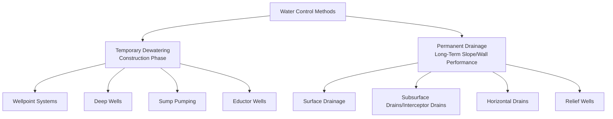
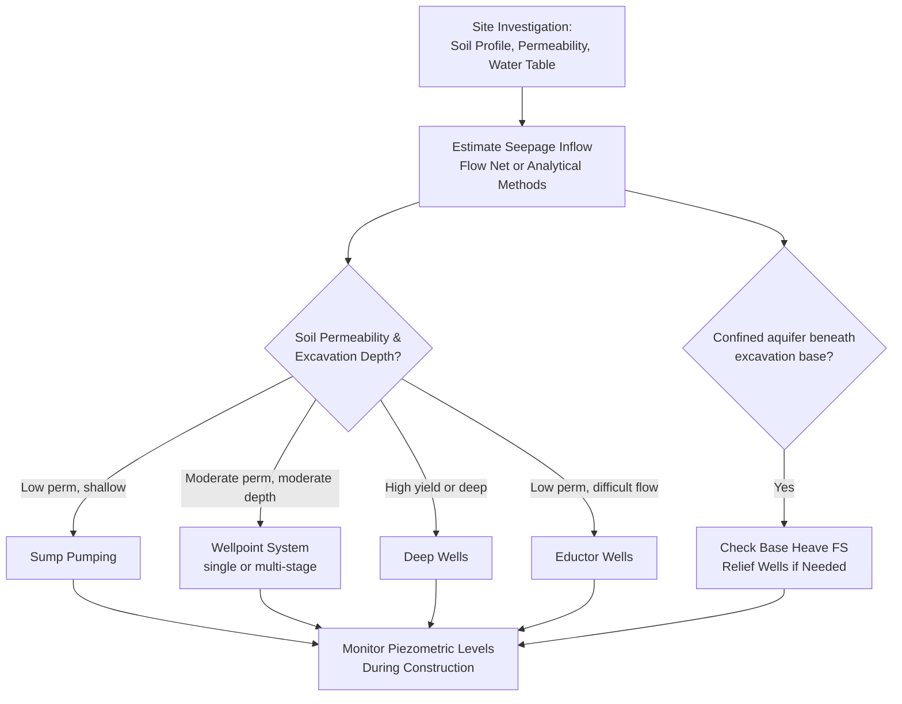

## Dewatering and Slope Drainage

### Overview

Water is the single most common triggering factor in slope instability and a critical consideration in excavation and construction engineering. Dewatering refers to the temporary or permanent removal of groundwater to enable construction below the water table, while slope drainage encompasses permanent systems designed to control seepage and pore pressure within slopes and behind retaining structures. Both disciplines share the common objective of controlling pore water pressure, since effective stress — and therefore shear strength — depends directly on reducing pore pressure relative to total stress.

$$\sigma' = \sigma - u$$

Reducing $u$ (pore pressure) increases $\sigma'$ (effective stress) and thus mobilized shear strength, which is the fundamental mechanism underlying both dewatering and drainage design.

### Classification of Water Control Methods

### Temporary Dewatering — Sump Pumping

The simplest dewatering method, involving collection of seeping groundwater in sumps (excavated low points) within the excavation, from which water is pumped to the surface.

**Applicability**

- Suitable for relatively impermeable soils (low seepage rates) and shallow excavations where inflow rates are manageable without lowering the surrounding water table significantly
- Economical and simple to implement, requiring minimal specialized equipment

**Key Points**

- Risk of piping or boiling (upward seepage gradient causing soil particle migration) at the sump base if not properly filtered, since concentrated flow toward a sump increases local hydraulic gradient
- Not effective in loose, fine sands or silts where uncontrolled seepage can cause instability of the excavation base or side slopes before water is adequately captured

### Wellpoint Systems

A series of closely spaced small-diameter wells (wellpoints), each connected to a common header pipe under vacuum, used to lower the water table around an excavation perimeter before and during excavation.

**Design Concept**

$$s_w = \frac{Q}{2\pi T}\ln\left(\frac{R}{r_w}\right)$$

Where $s_w$ = drawdown at the well, $Q$ = pumping rate, $T$ = aquifer transmissivity, $R$ = radius of influence, $r_w$ = well radius — based on steady-state radial flow (Dupuit-Thiem) equations adapted for multiple closely spaced wells acting collectively.

**Key Points**

- Practical lift limitation of approximately 4.5–6 m per stage due to atmospheric pressure constraints on suction lift, requiring multi-stage wellpoint systems (successive lower headers) for deeper drawdown requirements
- Well suited to relatively permeable soils (sands, silty sands) where sufficient flow can be induced toward closely spaced wellpoints
- Widely used for trench excavations, shallow-to-moderate depth foundation excavations, and pipeline construction due to relative simplicity and moderate cost

**Wellpoint System Schematic**

<svg xmlns="http://www.w3.org/2000/svg" viewBox="0 0 480 300">
<text x="240" y="20" text-anchor="middle" font-size="13" font-weight="bold" fill="#1a1a1a">Wellpoint Dewatering System (svg_diagram)</text>
<line x1="40" y1="80" x2="440" y2="80" stroke="#333" stroke-width="3" />
<text x="45" y="70" font-size="10">Header pipe (vacuum)</text>
<line x1="80" y1="80" x2="80" y2="230" stroke="#2980b9" stroke-width="4" />
<line x1="160" y1="80" x2="160" y2="230" stroke="#2980b9" stroke-width="4" />
<line x1="240" y1="80" x2="240" y2="230" stroke="#2980b9" stroke-width="4" />
<line x1="320" y1="80" x2="320" y2="230" stroke="#2980b9" stroke-width="4" />
<line x1="400" y1="80" x2="400" y2="230" stroke="#2980b9" stroke-width="4" />
<path d="M40,110 Q240,180 440,110" stroke="#c0392b" stroke-width="2" fill="none" stroke-dasharray="4,3" />
<text x="180" y="175" font-size="10" fill="#c0392b">Drawn-down water table</text>
<line x1="40,45" x2="440,45" stroke="#999" />
<line x1="40" y1="45" x2="440" y2="45" stroke="#999" stroke-dasharray="3,3" />
<text x="45" y="40" font-size="10" fill="#666">Original water table</text>
</svg>

### Deep Wells

Individual, widely spaced, larger-diameter wells with submersible pumps, extending to significant depth, used where large drawdown or high pumping capacity is required beyond what wellpoint systems can achieve.

**Applicability**

- Suited to deep excavations, highly permeable soils requiring large flow rate removal, or situations where a single-stage system achieving significant drawdown is preferred over multi-stage wellpoints
- Commonly used for large excavations, shaft construction, and dewatering of confined or semi-confined aquifers beneath excavation-base clay layers (relief of uplift pressure)

**Uplift/Base Heave Consideration**

For excavations underlain by a confined aquifer beneath a clay layer, artesian pressure can cause base heave or blowout if not relieved:

$$FS_{uplift} = \frac{\gamma_{clay} \times D_{clay}}{u_{aquifer}} \geq 1.2 \text{ to } 1.5$$

Deep wells (or relief wells) are used specifically to reduce $u_{aquifer}$ and maintain adequate factor of safety against base heave during excavation, a critical check independent of and in addition to general dewatering for excavation dryness.

### Eductor (Ejector) Well Systems

Use high-pressure water jetted through a nozzle (venturi effect) within each well to lift groundwater, rather than vacuum or submersible pump mechanisms, enabling greater drawdown depth in a single stage compared to conventional wellpoints (since the lift mechanism is not limited by atmospheric suction constraints).

**Key Points**

- Particularly useful in low-permeability soils where achieving adequate flow with wellpoints is difficult, since eductor systems can sustain higher vacuum-equivalent drawdown at each well
- Generally higher energy consumption and operating cost than wellpoint or deep well systems for equivalent flow rates, reflecting the inherent inefficiency of the venturi lifting mechanism relative to direct pumping

### Comparison of Dewatering Methods

| Method | Typical Soil Suitability | Max Single-Stage Lift | Relative Cost |
| --- | --- | --- | --- |
| Sump pumping | Low permeability, shallow | N/A (gravity flow to sump) | Low |
| Wellpoints | Sand, silty sand | ~4.5–6 m | Moderate |
| Deep wells | Wide range, especially high-yield aquifers | Large (pump-dependent) | Moderate–High |
| Eductor wells | Low permeability, fine sands/silts | Greater than wellpoints, single stage | High |

### Groundwater Control Design Process

### Permanent Slope Drainage — Surface Water Control

**Key Measures**

- Grading slope crests and berms to direct surface runoff away from the slope face, minimizing infiltration
- Lined or unlined surface channels (ditches, swales) intercepting runoff before it reaches the slope, directing flow to controlled discharge points
- Erosion protection (vegetation, riprap, erosion control matting) preventing surface erosion that could otherwise create preferential infiltration paths or undermine slope stability directly

**Key Points**

- Surface drainage is often the most cost-effective first line of defense against slope instability, since preventing infiltration is generally more economical than managing water after it has entered the slope mass
- Poorly maintained or blocked surface drainage is a commonly cited contributing factor in slope failure investigations, underscoring the importance of ongoing maintenance rather than drainage design alone

### Permanent Slope Drainage — Subsurface Methods

**Horizontal Drains**

Near-horizontal (typically slightly inclined, 3–5° to promote gravity flow) perforated pipes drilled into a slope to intercept and drain groundwater from within the slope mass, discharging at the slope face or toe.

$$\text{Effective drainage radius depends on: } k, \text{ drain spacing, slope geometry, and aquifer characteristics}$$

Horizontal drains are widely used as a retrofit measure for slopes showing signs of instability related to elevated groundwater, since they can often be installed without major excavation or disruption to the existing slope, though their effectiveness depends heavily on intercepting the actual water-bearing zones or discontinuities responsible for elevated pore pressure — which requires reasonably accurate subsurface characterization to target effectively.

**Interceptor (Cutoff) Drains**

Trench drains excavated across the anticipated flow path upslope of a structure or slope of concern, backfilled with free-draining granular material and a perforated collector pipe, intercepting subsurface flow before it reaches the area of concern.

**Relief Wells**

Vertical wells extending into a confined or semi-confined water-bearing layer, allowing pressure relief through controlled discharge, commonly used downstream of levees and dams where underseepage through a pervious foundation layer could otherwise generate excessive uplift pressure or piping.

**Blanket and Toe Drains (Embankments and Levees)**

Horizontal drainage blankets placed beneath or within embankment fill, combined with toe drains at the downstream edge, control seepage exit points and prevent piping by ensuring seepage exits through a filtered, controlled drainage path rather than emerging uncontrolled through the embankment slope or foundation.

**Horizontal Drain Retrofit Schematic**

<svg xmlns="http://www.w3.org/2000/svg" viewBox="0 0 480 300">
<text x="240" y="20" text-anchor="middle" font-size="13" font-weight="bold" fill="#1a1a1a">Horizontal Drain in Slope (svg_diagram)</text>
<polygon points="60,260 60,120 380,60 380,260" fill="#dcd0b0" stroke="#333" />
<line x1="90" y1="230" x2="350" y2="90" stroke="#2980b9" stroke-width="3" />
<text x="150" y="180" font-size="10" fill="#2980b9" transform="rotate(-22 150 180)">Horizontal drain</text>
<path d="M60,150 Q120,140 180,155 Q240,170 300,150" stroke="#999" stroke-dasharray="3,3" fill="none" />
<text x="65" y="145" font-size="9" fill="#666">Phreatic surface</text>
<path d="M90,230 L60,230" stroke="#2980b9" stroke-width="3" marker-end="url(#arrow2)" />
</svg>

### Filter Design for Drainage Systems

Drainage systems must include properly graded filter material to prevent soil particle migration (piping) into the drain while maintaining adequate permeability for water flow — a critical detail often governed by standard filter criteria.

**Terzaghi's Filter Criteria (Illustrative Form)**

$$\frac{D_{15}(\text{filter})}{D_{85}(\text{base soil})} \leq 5 \quad \text{(piping/retention criterion)}$$

$$\frac{D_{15}(\text{filter})}{D_{15}(\text{base soil})} \geq 4 \quad \text{(permeability criterion)}$$

Where $D_{15}$ and $D_{85}$ refer to grain sizes at which 15% and 85% of the material passes by weight, respectively. Modern practice often uses geotextile filters designed according to apparent opening size (AOS) criteria relative to base soil gradation, following similar retention/permeability logic adapted for geotextile products in place of graded granular filters.

### Piezometric Monitoring

Both dewatering operations and permanent drainage system performance are verified through piezometric monitoring, since design assumptions about achievable drawdown or steady-state pore pressure reduction must be confirmed against actual field response.

**Types of Piezometers**

- **Standpipe (Casagrande) piezometers**: simple, reliable, measure pore pressure at a discrete zone via a filter tip connected to a standpipe, though relatively slow response time in low-permeability soils
- **Vibrating wire piezometers**: faster response time, suitable for lower-permeability soils and remote/automated monitoring, though generally more expensive and requiring more sophisticated readout equipment
- **Pneumatic piezometers**: intermediate response time, useful where electrical monitoring equipment is impractical

### Effects of Inadequate Dewatering or Drainage

**During Construction**

- Base instability (heave, boiling, piping) in excavations with inadequate seepage control
- Reduced excavation slope stability due to elevated pore pressure in temporary cut slopes
- Difficulty achieving proper compaction of fill materials placed in wet conditions

**Long-Term (Permanent Structures)**

- Elevated hydrostatic pressure behind retaining walls not designed for full hydrostatic loading, if drainage becomes blocked or was inadequately designed
- Reduced slope factor of safety from elevated pore pressure following heavy rainfall, particularly where surface or subsurface drainage has deteriorated or been obstructed over time
- Piping and internal erosion in embankments and levees where seepage exits are uncontrolled, potentially progressing to structural failure if undetected

### Worked Example — Wellpoint Spacing Estimate (Simplified)

A trench excavation requires dewatering in medium sand, $k = 2\times10^{-4}\text{ m/s}$, required drawdown $s_w = 3\text{ m}$, radius of influence estimated at $R = 60\text{ m}$ (based on Sichardt's empirical approximation), well radius $r_w = 0.05\text{ m}$, aquifer transmissivity $T = kb$ where saturated thickness $b = 8\text{ m}$:

$$T = (2\times10^{-4})(8) = 1.6\times10^{-3}\text{ m}^2/\text{s}$$

Using the simplified steady-state radial flow relation to estimate required discharge per well for target drawdown:

$$Q = \frac{2\pi T s_w}{\ln(R/r_w)} = \frac{2\pi(1.6\times10^{-3})(3)}{\ln(60/0.05)} = \frac{0.0302}{7.09} = 4.26\times10^{-3}\text{ m}^3/\text{s} \approx 4.26\text{ L/s per well}$$

This illustrates the general calculation approach; actual wellpoint system design requires accounting for well interference (multiple closely spaced wells affecting each other's drawdown), which this simplified single-well estimate does not capture, and is typically refined using specialized dewatering design software or superposition methods for multi-well configurations. [Inference — actual field performance depends on aquifer heterogeneity not captured in this simplified homogeneous, isotropic assumption]

### Conclusion

Dewatering and slope drainage share the unifying principle of pore pressure control to maintain adequate effective stress and shear strength, but differ in application: dewatering addresses temporary construction-phase water table lowering through wellpoints, deep wells, sump pumping, or eductor systems selected according to soil permeability and required drawdown, while permanent slope and wall drainage relies on surface water management, horizontal drains, interceptor drains, and properly designed filter systems to control long-term pore pressure. Both disciplines require careful attention to filter design to prevent piping, ongoing monitoring via piezometers to verify performance against design assumptions, and long-term maintenance, since drainage system deterioration remains a persistent contributing factor in slope and retaining structure distress.

**Related Topics**

- Slope Stability Analysis Methods
- Lateral Earth Pressure Theories
- Factors of Safety and Slope Failure Mechanisms
- Seepage Analysis and Flow Nets
- Retaining Wall Types: Gravity, Cantilever, MSE, Sheet Pile
- Ground Improvement Techniques
- Braced Excavation Support Systems
- Embankment Dam Design Fundamentals