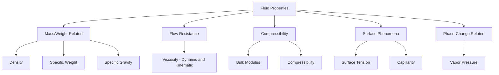
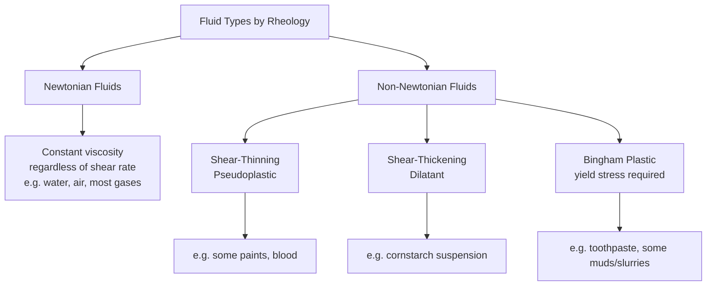
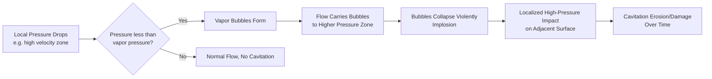

## Properties of Fluids

### Overview

Fluid properties describe the physical characteristics that govern how liquids and gases respond to applied forces, temperature changes, and flow conditions. These properties form the foundational parameters used throughout fluid mechanics and hydraulics analysis, from pipe flow calculations to open channel design and hydraulic structure analysis. A fluid is defined as a substance that continuously deforms (flows) under application of a shear stress, however small, distinguishing it fundamentally from a solid, which can sustain shear stress while remaining at rest.

### Classification of Fluid Properties

### Density, Specific Weight, and Specific Gravity

**Mass Density**

$$\rho = \frac{m}{V}$$

Mass per unit volume of fluid, with SI units of $\text{kg/m}^3$. For water at $4°\text{C}$, $\rho \approx 1000\text{ kg/m}^3$, the reference condition typically used for specific gravity comparisons.

**Specific Weight**

$$\gamma = \rho g$$

Weight per unit volume, with SI units of $\text{N/m}^3$. For water at standard conditions, $\gamma \approx 9810\text{ N/m}^3$ (or approximately $9.81\text{ kN/m}^3$).

**Specific Gravity**

$$SG = \frac{\rho_{fluid}}{\rho_{water}} = \frac{\gamma_{fluid}}{\gamma_{water}}$$

A dimensionless ratio comparing fluid density to that of water at a reference temperature, commonly used for quick comparison across fluids (e.g., mercury $SG \approx 13.6$, typical petroleum products $SG \approx 0.7$–$0.9$).

**Key Points**

- Density of liquids varies relatively little with pressure (liquids are nearly incompressible for most practical engineering purposes) but does vary measurably with temperature
- Density of gases is highly sensitive to both pressure and temperature, governed by the ideal gas law for most engineering applications at typical pressures and temperatures
- Specific weight depends on local gravitational acceleration $g$, while density does not, making density the more fundamental property for problems where $g$ might vary (though this distinction rarely matters in typical civil engineering practice at Earth's surface)

### Ideal Gas Law (for Compressible Fluid/Gas Properties)

$$pV = mRT \quad \text{or} \quad p = \rho RT$$

Where $p$ = absolute pressure, $V$ = volume, $m$ = mass, $R$ = specific gas constant (dependent on the specific gas), $T$ = absolute temperature. This relationship is used when analyzing compressible flow problems (e.g., pneumatic systems, gas pipeline flow) where gas density cannot be treated as constant.

### Viscosity

Viscosity quantifies a fluid's resistance to shear deformation — informally, its "thickness" or internal friction — and is the property most directly responsible for energy losses in fluid flow through pipes and channels.

**Newton's Law of Viscosity**

$$\tau = \mu\frac{du}{dy}$$

Where $\tau$ = shear stress, $\mu$ = dynamic (absolute) viscosity, $du/dy$ = velocity gradient perpendicular to flow direction (rate of angular deformation).

**Dynamic Viscosity**

SI units: $\text{Pa·s}$ (equivalently $\text{N·s/m}^2$ or $\text{kg/(m·s)}$). For water at $20°\text{C}$, $\mu \approx 1.0\times10^{-3}\text{ Pa·s}$.

**Kinematic Viscosity**

$$\nu = \frac{\mu}{\rho}$$

SI units: $\text{m}^2/\text{s}$, commonly reported in centistokes (cSt) in practice, where $1\text{ cSt} = 1\times10^{-6}\text{ m}^2/\text{s}$. For water at $20°\text{C}$, $\nu \approx 1.0\times10^{-6}\text{ m}^2/\text{s}$.

**Velocity Profile and Shear Stress Concept**

<svg xmlns="http://www.w3.org/2000/svg" viewBox="0 0 420 280">
<text x="210" y="20" text-anchor="middle" font-size="13" font-weight="bold" fill="#1a1a1a">Velocity Gradient and Shear Stress (svg_diagram)</text>
<line x1="60" y1="60" x2="60" y2="240" stroke="#333" stroke-width="3" />
<text x="20" y="55" font-size="10">Fixed plate</text>
<line x1="60" y1="60" x2="360" y2="60" stroke="#c0392b" stroke-width="3" />
<text x="365" y="65" font-size="10" fill="#c0392b">Moving plate, velocity U</text>
<line x1="60" y1="90" x2="160" y2="90" stroke="#2980b9" stroke-width="2" />
<line x1="60" y1="130" x2="220" y2="130" stroke="#2980b9" stroke-width="2" />
<line x1="60" y1="170" x2="280" y2="170" stroke="#2980b9" stroke-width="2" />
<line x1="60" y1="210" x2="340" y2="210" stroke="#2980b9" stroke-width="2" />
<path d="M60,240 L360,60" stroke="#999" stroke-dasharray="3,3" fill="none" />
<text x="200" y="230" font-size="10">Linear velocity profile (Couette flow)</text>
</svg>

### Classification of Fluids by Viscous Behavior

**Key Points**

- Newtonian fluids exhibit a linear relationship between shear stress and shear rate, with viscosity independent of the rate of deformation — most fluids relevant to conventional civil engineering hydraulics (water, air) are Newtonian
- Non-Newtonian behavior becomes relevant in specialized geotechnical and construction contexts, such as drilling muds, grouts, and certain slurries used in diaphragm wall or bored pile construction
- Bingham plastic behavior (requiring a minimum yield stress before flow begins) is particularly relevant to bentonite slurries used in excavation support, where the fluid must remain effectively "solid" at rest to suspend cuttings but flow readily once sufficient shear is applied

### Effect of Temperature on Viscosity

- **Liquids**: viscosity decreases with increasing temperature, since increased thermal energy reduces intermolecular cohesive forces that resist relative motion between fluid layers
- **Gases**: viscosity increases with increasing temperature, since gas viscosity arises primarily from molecular momentum transfer, which increases with molecular kinetic energy at higher temperature

This opposite temperature dependence is a well-documented distinguishing characteristic between liquid and gas viscous behavior.

### Compressibility and Bulk Modulus

**Bulk Modulus of Elasticity**

$$E_v = -V\frac{dp}{dV} = \rho\frac{dp}{d\rho}$$

Quantifies a fluid's resistance to uniform compression; higher bulk modulus indicates a less compressible fluid. For water at typical conditions, $E_v \approx 2.2\times10^9\text{ Pa}$ (2.2 GPa), reflecting water's very low compressibility under ordinary engineering pressure ranges.

**Key Points**

- Liquids are typically treated as incompressible for most civil and hydraulic engineering applications, since pressure changes encountered in typical systems produce negligible volume change
- Compressibility becomes significant in specific scenarios such as water hammer analysis in pipelines, where the finite bulk modulus of water directly governs the speed of pressure wave propagation and resulting transient pressure surges
- Gas compressibility is generally significant and must be explicitly accounted for using the ideal gas law or more complex equations of state in compressible flow analysis

**Speed of Sound in a Fluid (relevant to water hammer analysis)**

$$c = \sqrt{\frac{E_v}{\rho}}$$

For water, this yields a pressure wave celerity of approximately 1400–1500 m/s in an unconfined, rigid-pipe scenario, though actual pipeline water hammer celerity is reduced by pipe wall elasticity and is calculated using a modified formula incorporating pipe material and diameter-to-thickness ratio.

### Surface Tension

Surface tension arises from cohesive intermolecular forces at a fluid interface (typically liquid-gas or liquid-liquid), causing the surface to behave somewhat like a stretched elastic membrane.

$$\sigma = \frac{F}{L}$$

SI units: $\text{N/m}$. For water at $20°\text{C}$ in contact with air, $\sigma \approx 0.0728\text{ N/m}$.

**Pressure Difference Across a Curved Interface (Young-Laplace Equation)**

For a spherical droplet or bubble:

$$\Delta p = \frac{2\sigma}{r} \quad \text{(droplet, single surface)}$$

$$\Delta p = \frac{4\sigma}{r} \quad \text{(soap bubble, two surfaces)}$$

Where $r$ = radius of curvature. This relationship explains why smaller droplets sustain higher internal pressure relative to surrounding fluid than larger droplets, given the inverse relationship between pressure difference and radius.

### Capillarity

Capillary rise or depression occurs in narrow tubes or pore spaces due to the combined effects of surface tension and the wetting characteristics (contact angle) between the fluid and the containing surface.

$$h = \frac{2\sigma\cos\theta}{\rho g r}$$

Where $h$ = capillary rise (or depression if negative), $\theta$ = contact angle between fluid and tube wall, $r$ = tube radius.

**Key Points**

- Water in a clean glass tube exhibits capillary rise (contact angle near $0°$, strongly wetting), while mercury in glass exhibits capillary depression (contact angle greater than $90°$, non-wetting)
- Capillarity is directly relevant to geotechnical engineering through capillary rise in soil pore spaces above the water table, contributing to the zone of capillary saturation and influencing effective stress calculations near the ground surface
- In hydraulic measurement (e.g., small-diameter piezometer tubes or manometers), capillary effects can introduce measurement error and are typically minimized by using tubes of sufficient diameter (generally greater than about 6–10 mm) where capillary rise becomes negligible

**Capillary Rise Illustration**

<svg xmlns="http://www.w3.org/2000/svg" viewBox="0 0 400 260">
<text x="200" y="20" text-anchor="middle" font-size="13" font-weight="bold" fill="#1a1a1a">Capillary Rise vs Depression (svg_diagram)</text>
<line x1="60" y1="220" x2="340" y2="220" stroke="#333" stroke-width="2" />
<rect x="90" y="80" width="30" height="160" fill="none" stroke="#333" stroke-width="2" />
<rect x="93" y="130" width="24" height="90" fill="#3498db" opacity="0.5" />
<text x="60" y="120" font-size="10" fill="#2980b9">Water rise (wetting)</text>
<rect x="250" y="80" width="30" height="160" fill="none" stroke="#333" stroke-width="2" />
<rect x="253" y="170" width="24" height="50" fill="#95a5a6" opacity="0.7" />
<text x="220" y="165" font-size="10" fill="#666">Mercury depression (non-wetting)</text>
</svg>

### Vapor Pressure

The pressure at which a liquid transitions to vapor phase at a given temperature — when local fluid pressure drops to or below the fluid's vapor pressure at the prevailing temperature, vaporization (boiling or cavitation) occurs regardless of the fluid's actual temperature relative to its atmospheric boiling point.

**Key Points**

- Vapor pressure increases with temperature for all fluids, which is why boiling point decreases at reduced atmospheric pressure (e.g., at high altitude)
- Directly relevant to cavitation in hydraulic machinery (pumps, turbines) and pipeline systems, where local pressure reduction (e.g., at pump impeller inlet, or at high-velocity constrictions per Bernoulli's principle) can drop below vapor pressure, causing vapor bubble formation followed by violent collapse when the fluid returns to higher-pressure regions
- Cavitation damage (pitting, erosion of mechanical components) is a significant design consideration in pump selection, siphon design, and spillway/energy dissipator design, where locally accelerated flow can approach vapor pressure conditions

### Cavitation Mechanism

### Summary Table of Key Properties (Water and Air, Standard Conditions)

| Property | Symbol | Water (20°C) | Air (20°C, 1 atm) |
| --- | --- | --- | --- |
| Density | $\rho$ | ~998 kg/m³ | ~1.20 kg/m³ |
| Specific weight | $\gamma$ | ~9790 N/m³ | ~11.8 N/m³ |
| Dynamic viscosity | $\mu$ | ~1.0×10⁻³ Pa·s | ~1.8×10⁻⁵ Pa·s |
| Kinematic viscosity | $\nu$ | ~1.0×10⁻⁶ m²/s | ~1.5×10⁻⁵ m²/s |
| Bulk modulus | $E_v$ | ~2.2×10⁹ Pa | N/A (highly compressible) |
| Surface tension | $\sigma$ | ~0.073 N/m | N/A |

Values are approximate reference figures widely cited in standard fluid mechanics textbooks and may vary slightly depending on exact temperature, purity, and atmospheric conditions assumed. [Unverified — precise values depend on exact reference source and measurement conditions]

### Worked Example — Viscosity and Shear Stress

A flat plate of area $A = 0.5\text{ m}^2$ moves at constant velocity $U = 0.3\text{ m/s}$ over a stationary plate, separated by a fluid layer of thickness $y = 2\text{ mm}$ with dynamic viscosity $\mu = 0.9\times10^{-3}\text{ Pa·s}$ (approximately water at $25°\text{C}$). Assuming a linear velocity profile (Couette flow), find the shear stress and force required to maintain plate motion.

**Velocity Gradient**

$$\frac{du}{dy} = \frac{U}{y} = \frac{0.3}{0.002} = 150\text{ s}^{-1}$$

**Shear Stress**

$$\tau = \mu\frac{du}{dy} = (0.9\times10^{-3})(150) = 0.135\text{ Pa}$$

**Force Required**

$$F = \tau A = 0.135 \times 0.5 = 0.0675\text{ N}$$

### Worked Example — Capillary Rise

Estimate the capillary rise of water in a clean glass tube of diameter $d = 1\text{ mm}$ ($r = 0.5\text{ mm}$), assuming $\sigma = 0.0728\text{ N/m}$, $\theta \approx 0°$ (complete wetting), $\rho = 1000\text{ kg/m}^3$, $g = 9.81\text{ m/s}^2$.

$$h = \frac{2\sigma\cos\theta}{\rho g r} = \frac{2(0.0728)(1)}{(1000)(9.81)(0.0005)} = \frac{0.1456}{4.905} = 0.02968\text{ m} \approx 29.7\text{ mm}$$

This illustrates why small-diameter measurement tubes (manometers, piezometers) can introduce non-negligible capillary error, reinforcing the earlier guidance to use tubes of at least 6–10 mm diameter for accurate hydraulic pressure measurement.

### Conclusion

Fluid properties — density, viscosity, compressibility, surface tension, capillarity, and vapor pressure — collectively govern how fluids respond to applied forces and environmental conditions, forming the essential parameter set underlying all subsequent fluid mechanics and hydraulics analysis. Viscosity governs flow resistance and energy losses central to pipe and channel flow calculations; compressibility becomes critical in transient phenomena like water hammer; and surface tension, capillarity, and vapor pressure govern more specialized but practically important phenomena including capillary rise in soils, measurement error in narrow tubes, and cavitation damage in hydraulic machinery. A firm grasp of these fundamental properties is prerequisite to the fluid statics, kinematics, and dynamics topics that follow.

**Related Topics**

- Fluid Statics and Pressure Measurement
- Bernoulli's Equation and Energy Conservation in Flow
- Viscous Flow in Pipes (Laminar and Turbulent)
- Reynolds Number and Flow Regime Classification
- Open Channel Flow Fundamentals
- Water Hammer and Transient Flow Analysis
- Pump and Turbine Fundamentals (Cavitation Considerations)
- Manometry and Pressure Measurement Devices