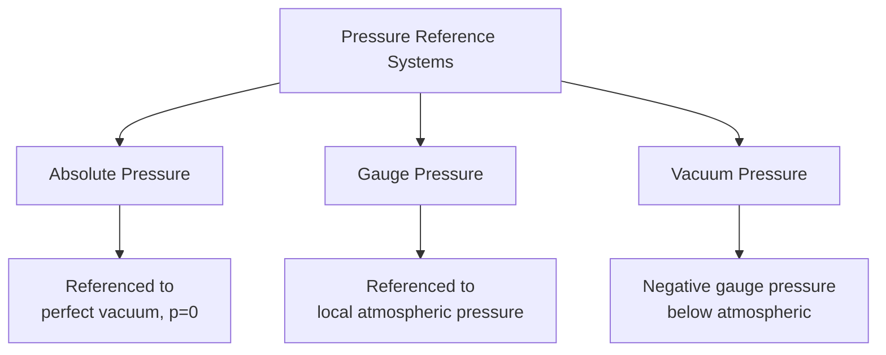

## Fluid Statics and Pressure

### Overview

Fluid statics examines fluids at rest, where no relative motion exists between fluid layers and therefore no shear stress is present, regardless of viscosity. Under these conditions, pressure becomes the sole stress acting within the fluid, and its distribution is governed entirely by gravity (or other body forces) rather than viscous effects. This foundational topic underlies the design of dams, retaining walls, tanks, gates, and all submerged or partially submerged hydraulic structures.

### Fundamental Characteristics of Fluid Pressure

**Pascal's Law**

At any point within a static fluid, pressure is equal in all directions — it acts equally on all surfaces regardless of orientation, since a static fluid cannot sustain shear stress and therefore cannot exhibit directional variation in pressure at a given point.

$$p_x = p_y = p_z = p$$

**Key Points**

- Pressure at a point in a static fluid is a scalar quantity, not a vector — it has magnitude but no inherent direction, though the force it produces on a surface always acts perpendicular (normal) to that surface
- This isotropic property is what enables hydraulic systems (e.g., hydraulic jacks, presses) to transmit and amplify force through enclosed fluid, since pressure applied at one point is transmitted equally throughout the fluid

### Hydrostatic Pressure Variation with Depth

**Basic Hydrostatic Equation**

$$\frac{dp}{dz} = -\rho g$$

For an incompressible fluid with constant density, integrating with respect to depth gives:

$$p = p_0 + \rho g h$$

Where $p_0$ = pressure at the reference surface (typically atmospheric pressure at a free surface), $h$ = depth below the reference surface, $\rho g$ = specific weight $\gamma$.

**Key Points**

- Pressure increases linearly with depth in a fluid of constant density, a direct consequence of the increasing weight of fluid above any given point
- Pressure at a given depth is independent of the shape or cross-sectional area of the containing vessel — a principle sometimes called the "hydrostatic paradox," since a narrow tube and a wide tank at the same fluid depth produce identical pressure at that depth despite vastly different total fluid weight
- In a connected, continuous body of static fluid, all points at the same elevation have equal pressure, regardless of the path taken between them (this underlies manometer analysis)

### Hydrostatic Paradox Illustration

<svg xmlns="http://www.w3.org/2000/svg" viewBox="0 0 480 280">
<text x="240" y="20" text-anchor="middle" font-size="13" font-weight="bold" fill="#1a1a1a">Hydrostatic Paradox (svg_diagram)</text>
<rect x="40" y="60" width="60" height="180" fill="#3498db" opacity="0.4" stroke="#333" />
<rect x="160" y="60" width="140" height="180" fill="#3498db" opacity="0.4" stroke="#333" />
<polygon points="360,60 440,60 460,240 340,240" fill="#3498db" opacity="0.4" stroke="#333" />
<line x1="30" y1="240" x2="470" y2="240" stroke="#c0392b" stroke-width="2" stroke-dasharray="4,3" />
<text x="475" y="245" font-size="10" fill="#c0392b">Same p here (all vessels)</text>
<line x1="30" y1="60" x2="470" y2="60" stroke="#999" stroke-dasharray="3,3" />
<text x="475" y="65" font-size="10" fill="#666">Free surface</text>
</svg>

### Absolute, Gauge, and Vacuum Pressure

$$p_{absolute} = p_{gauge} + p_{atmospheric}$$

**Key Points**

- Most engineering pressure gauges read gauge pressure by design (zeroed to atmospheric), since it is generally more practically useful than absolute pressure for structural and hydraulic design purposes
- Absolute pressure is required for problems involving vapor pressure, cavitation analysis, or compressible gas behavior (ideal gas law), since these phenomena are governed by the true zero-referenced pressure scale
- Standard atmospheric pressure at sea level is approximately 101.3 kPa (14.7 psi), though actual local atmospheric pressure varies with elevation and weather conditions

### Manometry

Manometers use the principle that pressure is equal at equal elevations within a connected static fluid to measure pressure differences by observing fluid column height differences.

**Simple Piezometer Tube**

$$p_A = \gamma h$$

Directly measures gauge pressure at point A via the height of fluid rise in an open tube connected to the pressure point, limited to relatively low positive pressures (otherwise the tube would need to be impractically tall) and unsuitable for measuring pressure in gases directly (no fluid column visible).

**U-Tube Manometer**

For a U-tube manometer with manometer fluid of specific weight $\gamma_m$ connected to a system containing fluid of specific weight $\gamma_1$:

$$p_A + \gamma_1 h_1 - \gamma_m h_m = p_{atm} \quad \text{(illustrative form, depends on configuration)}$$

The general approach involves starting at one point of known pressure, then adding or subtracting $\gamma h$ terms while traversing the manometer, moving downward (add) or upward (subtract) through each fluid column, until reaching the point of interest.

**Differential Manometer**

Measures the pressure difference between two points (e.g., across a pipe constriction, valve, or orifice meter) without requiring a separate reference to atmospheric pressure, widely used in flow measurement applications (e.g., venturi meters, orifice meters) where the pressure differential itself is the quantity of interest.

**U-Tube Manometer Schematic**

<svg xmlns="http://www.w3.org/2000/svg" viewBox="0 0 420 300">
<text x="210" y="20" text-anchor="middle" font-size="13" font-weight="bold" fill="#1a1a1a">U-Tube Manometer (svg_diagram)</text>
<path d="M100,60 L100,200 Q100,230 130,230 L290,230 Q320,230 320,200 L320,60" fill="none" stroke="#333" stroke-width="3" />
<rect x="88" y="60" width="24" height="60" fill="#3498db" opacity="0.5" />
<text x="60" y="70" font-size="10">System fluid</text>
<rect x="100" y="150" width="220" height="80" fill="#e67e22" opacity="0.5" />
<text x="140" y="270" font-size="10">Manometer fluid (denser)</text>
<line x1="308" y1="150" x2="345" y2="150" stroke="#999" stroke-dasharray="3,3" />
<text x="330" y="145" font-size="9">hm</text>
</svg>

### Hydrostatic Force on Plane Surfaces

**Resultant Force Magnitude**

$$F = \gamma \bar{h} A$$

Where $\bar{h}$ = depth of the centroid of the submerged plane area below the free surface, $A$ = total area of the submerged surface. The resultant force equals the pressure at the centroid multiplied by the total area, a direct consequence of pressure varying linearly with depth across the surface.

**Location of Center of Pressure**

The resultant force does not act at the centroid, but at a point below it (center of pressure), since pressure increases with depth and the lower portion of the surface therefore contributes proportionally more to the resultant force and its moment.

$$y_{cp} = \bar{y} + \frac{I_{\bar{x}}}{\bar{y}A}$$

Where $y_{cp}$ = distance from the free surface to the center of pressure (measured along the inclined or vertical surface), $\bar{y}$ = distance from free surface to centroid (along the surface), $I_{\bar{x}}$ = second moment of area (moment of inertia) about the centroidal axis parallel to the free surface.

**Key Points**

- The vertical distance between the centroid and center of pressure decreases as depth increases, since deeper submergence reduces the relative variation in pressure across the surface (the surface behaves increasingly like a small element at nearly uniform pressure)
- For a surface with its centroid at the free surface itself, the formula becomes indeterminate (zero depth), reflecting that shallow surfaces close to the free surface experience the most pronounced difference between centroid and center of pressure location relative to their own depth

**Plane Surface Force Diagram**

<svg xmlns="http://www.w3.org/2000/svg" viewBox="0 0 420 300">
<text x="210" y="20" text-anchor="middle" font-size="13" font-weight="bold" fill="#1a1a1a">Force on Inclined Plane Surface (svg_diagram)</text>
<line x1="40" y1="60" x2="380" y2="60" stroke="#999" stroke-dasharray="3,3" />
<text x="385" y="65" font-size="10" fill="#666">Free surface</text>
<line x1="120" y1="80" x2="280" y2="240" stroke="#333" stroke-width="3" />
<circle cx="200" cy="160" r="5" fill="#2980b9" />
<text x="210" y="155" font-size="10" fill="#2980b9">Centroid</text>
<circle cx="220" cy="190" r="5" fill="#c0392b" />
<text x="230" y="200" font-size="10" fill="#c0392b">Center of pressure</text>
<line x1="200" y1="160" x2="220" y2="190" stroke="#666" stroke-dasharray="2,2" />
</svg>

### Hydrostatic Force on Curved Surfaces

For curved surfaces, the resultant hydrostatic force is resolved into horizontal and vertical components rather than computed directly as a single resultant.

**Horizontal Component**

$$F_H = \gamma \bar{h} A_{proj}$$

Equal to the hydrostatic force on the vertical projection of the curved surface — the horizontal component is computed exactly as for an equivalent flat vertical surface of the same projected area and depth.

**Vertical Component**

$$F_V = \gamma \times V_{fluid \, above \, or \, displaced}$$

Equal to the weight of fluid, real or virtual, directly above the curved surface up to the free surface (or, for surfaces where fluid is below the curve, the weight of the volume that would occupy that space if extended to the free surface, treated as buoyant/upward in that case).

**Resultant Force**

$$F_R = \sqrt{F_H^2 + F_V^2}$$

Acting through the point where the horizontal and vertical component lines of action intersect, with direction determined by:

$$\theta = \tan^{-1}\left(\frac{F_V}{F_H}\right)$$

**Curved Surface Force Components**

<svg xmlns="http://www.w3.org/2000/svg" viewBox="0 0 420 300">
<text x="210" y="20" text-anchor="middle" font-size="13" font-weight="bold" fill="#1a1a1a">Force on Curved Surface (svg_diagram)</text>
<line x1="40" y1="60" x2="380" y2="60" stroke="#999" stroke-dasharray="3,3" />
<path d="M120,60 Q120,200 260,220" stroke="#333" stroke-width="3" fill="none" />
<rect x="120" y="60" width="140" height="160" fill="#3498db" opacity="0.2" />
<line x1="190" y1="140" x2="130" y2="140" stroke="#c0392b" stroke-width="2" marker-end="url(#arrowh)" />
<text x="60" y="135" font-size="10" fill="#c0392b">FH</text>
<line x1="190" y1="140" x2="190" y2="240" stroke="#27ae60" stroke-width="2" marker-end="url(#arrowv)" />
<text x="195" y="255" font-size="10" fill="#27ae60">FV</text>
</svg>

### Buoyancy — Archimedes' Principle

$$F_B = \gamma_{fluid} \times V_{displaced}$$

A submerged or floating body experiences an upward buoyant force equal to the weight of fluid displaced by the body, acting through the centroid of the displaced volume (the center of buoyancy), which may not coincide with the body's own center of gravity for non-homogeneous bodies.

**Floating Body Stability**

$$GM = BM - BG$$

Where $GM$ = metacentric height, $BM$ = distance from center of buoyancy to metacenter ($BM = I/V_{displaced}$, with $I$ = second moment of the waterplane area), $BG$ = distance between center of gravity and center of buoyancy.

**Key Points**

- Positive metacentric height ($GM > 0$) indicates stable floating equilibrium — a small angular disturbance produces a righting moment tending to return the body to equilibrium
- Negative $GM$ indicates unstable equilibrium, where disturbance produces a moment that increases the tilt rather than correcting it
- Relevant in civil engineering primarily to floating structures (pontoons, floating docks, caissons during construction/placement) rather than typical fixed hydraulic structures

**Buoyancy and Metacenter Diagram**

<svg xmlns="http://www.w3.org/2000/svg" viewBox="0 0 420 300">
<text x="210" y="20" text-anchor="middle" font-size="13" font-weight="bold" fill="#1a1a1a">Floating Body Stability (svg_diagram)</text>
<line x1="40" y1="150" x2="380" y2="150" stroke="#999" stroke-dasharray="3,3" />
<text x="385" y="155" font-size="10" fill="#666">Waterline</text>
<polygon points="150,100 270,100 260,200 160,200" fill="#95a5a6" stroke="#333" />
<circle cx="210" cy="120" r="4" fill="#333" />
<text x="220" y="115" font-size="9">G (center of gravity)</text>
<circle cx="210" cy="175" r="4" fill="#2980b9" />
<text x="220" y="185" font-size="9" fill="#2980b9">B (center of buoyancy)</text>
<circle cx="210" cy="80" r="4" fill="#c0392b" />
<text x="220" y="75" font-size="9" fill="#c0392b">M (metacenter)</text>
<line x1="210" y1="80" x2="210" y2="175" stroke="#666" stroke-dasharray="2,2" />
</svg>

### Pressure Variation in Compressible Fluids

For gases, where density varies significantly with pressure and elevation, the hydrostatic equation cannot simply be integrated assuming constant $\rho$ across large elevation changes.

$$p = p_0 \exp\left(-\frac{g}{RT}\Delta z\right) \quad \text{(isothermal atmosphere, illustrative)}$$

For most civil engineering applications involving gases over modest elevation differences (e.g., within a building or short pipe run), pressure variation with elevation is negligible compared to variation in liquids, and is typically ignored except in specialized applications such as tall structure wind/pressure analysis or large-scale atmospheric engineering problems.

### Worked Example — Hydrostatic Force on a Vertical Gate

A rectangular gate, width $b = 2\text{ m}$, height $H = 3\text{ m}$, is set vertically in a reservoir wall with its top edge at the free water surface. Find the total hydrostatic force and the location of the center of pressure.

**Centroid Depth**

$$\bar{h} = \frac{H}{2} = 1.5\text{ m}$$

**Total Force**

$$F = \gamma \bar{h} A = (9.81)(1.5)(2 \times 3) = 9.81 \times 1.5 \times 6 = 88.29\text{ kN}$$

**Second Moment of Area (rectangle about centroidal axis)**

$$I_{\bar{x}} = \frac{bH^3}{12} = \frac{(2)(3)^3}{12} = 4.5\text{ m}^4$$

**Center of Pressure Depth**

$$y_{cp} = \bar{y} + \frac{I_{\bar{x}}}{\bar{y}A} = 1.5 + \frac{4.5}{(1.5)(6)} = 1.5 + 0.5 = 2.0\text{ m}$$

The center of pressure lies 2.0 m below the free surface, or 0.5 m below the centroid, confirming the expected downward shift due to the linearly increasing pressure distribution with depth.

### Worked Example — U-Tube Manometer

A U-tube manometer connected to a pipe carrying water ($\gamma_w = 9.81\text{ kN/m}^3$) uses mercury ($\gamma_{Hg} = 133.4\text{ kN/m}^3$) as the manometer fluid. The mercury level on the open side is 0.4 m higher than on the pipe side, and the pipe centerline is 0.3 m above the mercury surface on the pipe side. Find the gauge pressure in the pipe.

Starting at the pipe (point A) and traversing to the open end (atmospheric, $p = 0$ gauge):

$$p_A + \gamma_w(0.3) - \gamma_{Hg}(0.4) = 0$$

$$p_A = \gamma_{Hg}(0.4) - \gamma_w(0.3) = (133.4)(0.4) - (9.81)(0.3)$$

$$p_A = 53.36 - 2.94 = 50.42\text{ kPa}$$

### Conclusion

Fluid statics establishes that pressure in a fluid at rest varies linearly with depth, acts equally in all directions at a given point, and forms the basis for manometry, hydrostatic force calculations on plane and curved surfaces, and buoyancy analysis. These principles directly underpin the structural design of dams, retaining structures, tanks, gates, and floating or submerged elements, where accurately locating both the magnitude and point of application of hydrostatic force (particularly the center of pressure, offset below the centroid) is essential for correct structural analysis and stability verification.

**Related Topics**

- Properties of Fluids
- Manometry and Pressure Measurement Devices
- Dam Design and Hydrostatic Loading
- Buoyancy and Floating Body Stability
- Bernoulli's Equation and Energy Conservation in Flow
- Retaining Wall Types: Gravity, Cantilever, MSE, Sheet Pile
- Gate and Valve Design in Hydraulic Structures
- Open Channel Flow Fundamentals