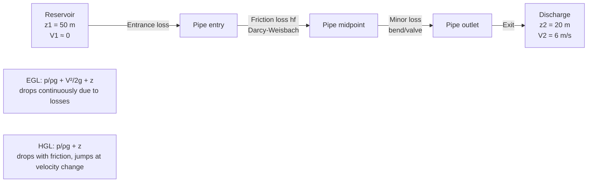

## Continuity, Momentum, and Energy Equations

### Overview

The continuity, momentum, and energy equations are the three fundamental conservation laws governing fluid flow in civil and hydraulic engineering. They derive from the general physical principles of conservation of mass, Newton's second law, and conservation of energy, applied to a fluid control volume. Together they form the analytical basis for pipe flow, open channel flow, pump/turbine design, and hydraulic structure analysis.

### Continuity Equation (Conservation of Mass)

**Key Points**

- States that mass cannot be created or destroyed within a control volume
- For steady, incompressible flow, the volumetric flow rate is constant along a streamline or conduit
- Forms the basis for relating velocity changes to cross-sectional area changes

**General (Reynolds Transport Theorem) Form**

$$\frac{\partial}{\partial t}\int_{CV} \rho \, dV + \int_{CS} \rho (\vec{V} \cdot \hat{n}) \, dA = 0$$

For steady, one-dimensional, incompressible flow between two sections (1 and 2) of a pipe or channel:

$$A_1 V_1 = A_2 V_2 = Q$$

where $A$ is cross-sectional area ($m^2$), $V$ is mean velocity ($m/s$), and $Q$ is volumetric discharge ($m^3/s$).

For compressible flow, density $\rho$ must be included:

$$\rho_1 A_1 V_1 = \rho_2 A_2 V_2$$

**Example**

A pipe narrows from a diameter of $D_1 = 0.30\,m$ to $D_2 = 0.15\,m$. If $V_1 = 2\,m/s$:

$$A_1 = \frac{\pi}{4}(0.30)^2 = 0.0707\,m^2, \quad A_2 = \frac{\pi}{4}(0.15)^2 = 0.0177\,m^2$$

$$V_2 = \frac{A_1 V_1}{A_2} = \frac{0.0707 \times 2}{0.0177} = 8.0\,m/s$$

The velocity increases fourfold since area decreases by a factor of four (consistent with $D^2$ scaling).

**Continuity for Branching Systems**

At a junction with one inflow and two outflows:

$$Q_{in} = Q_{out,1} + Q_{out,2}$$

This principle underlies pipe network analysis (e.g., Hardy Cross method) and storm drain design.

### Momentum Equation (Conservation of Momentum)

**Key Points**

- Derived from Newton's second law applied to a fluid control volume
- Relates the net force acting on a fluid mass to the rate of change of momentum
- Essential for computing forces on pipe bends, nozzles, hydraulic jumps, and structures

**General Form (Linear Momentum Equation)**

$$\sum \vec{F} = \frac{\partial}{\partial t}\int_{CV} \rho \vec{V} \, dV + \int_{CS} \rho \vec{V} (\vec{V} \cdot \hat{n}) \, dA$$

For steady, one-dimensional flow, this simplifies to:

$$\sum \vec{F} = \rho Q (\vec{V}_2 - \vec{V}_1)$$

The forces $\sum \vec{F}$ typically include pressure forces, gravity, and reaction forces from solid boundaries (e.g., a pipe bend restraining the fluid).

**Applying Momentum to a Pipe Bend**

For a horizontal reducing bend turning the flow by angle $\theta$, the force components on the fluid (and reaction on the bend, by Newton's third law) are:

$$F_x = \rho Q (V_2 \cos\theta - V_1) + p_1 A_1 - p_2 A_2 \cos\theta$$

$$F_y = \rho Q (V_2 \sin\theta) - p_2 A_2 \sin\theta$$

where $p_1$, $p_2$ are static pressures at sections 1 and 2. The resultant force $F = \sqrt{F_x^2 + F_y^2}$ represents the anchoring/thrust force the bend support must resist.

**Momentum in Open Channel Flow — Specific Force**

For open channels, the momentum equation is expressed via specific force $M$:

$$M = \frac{Q^2}{gA} + \bar{y}A$$

where $\bar{y}$ is the depth to the centroid of the flow area. This is central to analyzing the **hydraulic jump**, where momentum is conserved but energy is dissipated:

$$\frac{y_2}{y_1} = \frac{1}{2}\left(\sqrt{1+8Fr_1^2} - 1\right)$$

with $Fr_1 = V_1/\sqrt{gy_1}$ the upstream Froude number.

**Diagram: Momentum Force on a Pipe Bend (svg_diagram)**

<svg xmlns="http://www.w3.org/2000/svg" viewBox="0 0 700 320">
<rect x="0" y="0" width="700" height="320" fill="#ffffff" />
<text x="350" y="25" text-anchor="middle" font-size="16" font-weight="bold" fill="#1a1a1a">Momentum Force on a Pipe Bend (svg_diagram)</text>
<path d="M 60 150 L 260 150" stroke="#2563eb" stroke-width="28" fill="none" />
<path d="M 260 150 Q 340 150 360 100" stroke="#2563eb" stroke-width="28" fill="none" />
<path d="M 360 100 L 480 40" stroke="#2563eb" stroke-width="20" fill="none" />
<line x1="60" y1="150" x2="260" y2="150" stroke="#000" stroke-width="2" stroke-dasharray="4,3" />
<text x="150" y="130" font-size="13" fill="#1a1a1a">Section 1: A1, V1, p1</text>
<line x1="360" y1="100" x2="480" y2="40" stroke="#000" stroke-width="2" stroke-dasharray="4,3" />
<text x="410" y="75" font-size="13" fill="#1a1a1a" transform="rotate(-27 410 75)">Section 2: A2, V2, p2</text>
<line x1="260" y1="150" x2="340" y2="150" stroke="#dc2626" stroke-width="2" marker-end="url(#arrow)" />
<text x="270" y="175" font-size="12" fill="#dc2626">p1A1 (force in)</text>
<line x1="360" y1="100" x2="410" y2="60" stroke="#dc2626" stroke-width="2" marker-end="url(#arrow)" />
<text x="400" y="45" font-size="12" fill="#dc2626">p2A2 (force out)</text>
<line x1="300" y1="220" x2="360" y2="170" stroke="#059669" stroke-width="3" marker-end="url(#arrow2)" />
<text x="290" y="245" font-size="13" fill="#059669" font-weight="bold">Fx, Fy: Reaction force</text>
<text x="290" y="262" font-size="13" fill="#059669" font-weight="bold">on bend anchor/thrust block</text>
<text x="60" y="290" font-size="12" fill="`#4b5563`">Control volume boundary spans Section 1 to Section 2; bend deflects flow through angle θ, producing net momentum change ρQ(V2 − V1).</text>

</svg>

### Energy Equation (Conservation of Energy — Bernoulli / Extended Bernoulli)

**Key Points**

- Derived from the first law of thermodynamics applied to steady flow
- The inviscid form (Bernoulli equation) assumes no friction losses and no external work
- The extended (engineering) form includes head losses, pump head added, and turbine head extracted
- All terms have units of length (head), making it physically intuitive for hydraulic design

**Ideal Bernoulli Equation**

For steady, incompressible, inviscid, irrotational flow along a streamline:

$$\frac{p_1}{\rho g} + \frac{V_1^2}{2g} + z_1 = \frac{p_2}{\rho g} + \frac{V_2^2}{2g} + z_2$$

The three terms represent:

- $\frac{p}{\rho g}$ — pressure head
- $\frac{V^2}{2g}$ — velocity (kinetic) head
- $z$ — elevation head

**Extended Energy Equation (Real Fluids)**

$$\frac{p_1}{\rho g} + \frac{V_1^2}{2g} + z_1 + h_p = \frac{p_2}{\rho g} + \frac{V_2^2}{2g} + z_2 + h_t + h_L$$

where:

- $h_p$ = head added by a pump
- $h_t$ = head extracted by a turbine
- $h_L$ = total head loss (major + minor losses) between sections 1 and 2

**Head Loss Components**

Major (friction) losses via Darcy-Weisbach:

$$h_f = f \frac{L}{D}\frac{V^2}{2g}$$

where $f$ is the Darcy friction factor (from Moody chart or Colebrook equation), $L$ is pipe length, $D$ is pipe diameter.

Minor losses (fittings, bends, valves, entrances/exits):

$$h_m = K \frac{V^2}{2g}$$

where $K$ is a loss coefficient specific to the fitting geometry.

**Example**

Water flows from a reservoir (surface elevation $z_1 = 50\,m$, $V_1 \approx 0$, $p_1 = 0$ gauge) through a pipe discharging to atmosphere at $z_2 = 20\,m$ with $V_2 = 6\,m/s$, and total head loss $h_L = 4\,m$. Applying the extended energy equation:

$$50 + 0 + 0 = \frac{p_2}{\rho g} + \frac{6^2}{2(9.81)} + 20 + 4$$

$$50 = \frac{p_2}{\rho g} + 1.83 + 24$$

$$\frac{p_2}{\rho g} = 24.17\,m$$

Since discharge is to atmosphere, $p_2 = 0$ gauge is expected only at the free jet exit; a nonzero result here indicates the exit is not free discharge, or the calculation point is upstream of the outlet — illustrating how the energy equation is used to solve for an unknown head, pressure, or velocity term.

**Diagram: Energy Grade Line and Hydraulic Grade Line**

### Relationship Between the Three Equations

**Key Points**

- Continuity provides the kinematic constraint (velocity-area relationship)
- Momentum provides forces, especially where energy is *not* conserved (e.g., hydraulic jump, sudden expansion)
- Energy provides head loss and is invalid across regions of high turbulence/separation where mechanical energy is dissipated but momentum is still conserved
- In a sudden pipe expansion, momentum equation gives an accurate head loss prediction (Borda-Carnot loss), while direct application of Bernoulli would be inaccurate due to unaccounted turbulent dissipation

**Borda-Carnot Loss (Sudden Expansion) — Momentum-Derived**

$$h_L = \frac{(V_1 - V_2)^2}{2g}$$

This result comes from combining continuity and momentum equations across the expansion, then substituting into the energy equation — demonstrating how the three principles are used together, not in isolation.

### Comparison Table

| Equation | Physical Law | Conserved Quantity | Typical Use |
| --- | --- | --- | --- |
| Continuity | Conservation of mass | Mass/volume flow rate | Velocity-area relations, flow splitting |
| Momentum | Newton's second law | Linear momentum | Forces on bends, jumps, thrust blocks |
| Energy | First law of thermodynamics | Mechanical energy (head) | Head loss, pump/turbine sizing, HGL/EGL |

### Common Pitfalls

- **Applying Bernoulli across a hydraulic jump or sudden expansion**: mechanical energy is dissipated as turbulence, so only momentum (not energy) is conserved there. [Unverified: exact loss magnitude depends on jump/expansion geometry and requires the momentum-derived formula, not direct Bernoulli]
- **Ignoring compressibility** in high-velocity gas flow — continuity requires the $\rho AV$ form, not simplified $AV$
- **Sign errors in momentum analysis** — force directions must be consistent with the assumed control volume and coordinate system
- **Confusing HGL and EGL** — EGL is always above HGL by the velocity head $V^2/2g$, and EGL only decreases (never rises) in the flow direction unless a pump adds energy

**Next Steps**

- Bernoulli Equation Applications and Limitations
- Darcy-Weisbach Equation and Moody Chart
- Minor Losses in Pipe Systems
- Hydraulic Jump Analysis
- Specific Energy and Critical Flow in Open Channels
- Pipe Network Analysis (Hardy Cross Method)
- Pump and Turbine Head Calculations
- Dimensional Analysis and Similitude in Fluid Mechanics