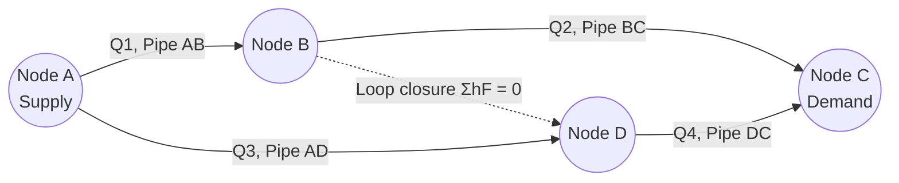

## Flow in Pipes and Pipe Networks

### Overview

Pipe flow analysis addresses the movement of fluid through closed conduits under pressure, governed by continuity, momentum, and energy principles combined with empirical resistance laws. Pipe network analysis extends single-conduit theory to interconnected systems (water distribution networks, building plumbing, irrigation systems) where flow splits and recombines at junctions, requiring iterative solution methods to satisfy both continuity and energy conservation simultaneously.

### Flow Regimes and the Reynolds Number

**Key Points**

- Flow in pipes is classified as laminar, transitional, or turbulent based on the Reynolds number
- Regime determines which friction-factor relationship applies
- Most municipal and civil engineering pipe flows are turbulent

$$Re = \frac{\rho V D}{\mu} = \frac{VD}{\nu}$$

where $V$ is mean velocity, $D$ is pipe diameter, $\rho$ is fluid density, $\mu$ is dynamic viscosity, and $\nu$ is kinematic viscosity.

| Regime | Reynolds Number |
| --- | --- |
| Laminar | $Re < 2300$ |
| Transitional | $2300 \le Re \le 4000$ |
| Turbulent | $Re > 4000$ |

**Example**

Water ($\nu = 1.0 \times 10^{-6}\,m^2/s$) flows at $V = 1.5\,m/s$ in a $D = 0.20\,m$ pipe:

$$Re = \frac{1.5 \times 0.20}{1.0 \times 10^{-6}} = 300{,}000$$

This is well into the turbulent regime, typical for municipal water mains.

### Head Loss: Major Losses

**Key Points**

- Major losses arise from wall shear (friction) distributed along the pipe length
- The Darcy-Weisbach equation is the standard general-purpose formula, valid for laminar and turbulent flow
- The Hazen-Williams formula is an empirical alternative widely used in water distribution design (water only, limited velocity/temperature range)

**Darcy-Weisbach Equation**

$$h_f = f \frac{L}{D}\frac{V^2}{2g}$$

**Friction Factor Determination**

For laminar flow ($Re < 2300$):

$$f = \frac{64}{Re}$$

For turbulent flow, the Colebrook-White equation (implicit):

$$\frac{1}{\sqrt{f}} = -2\log_{10}\left(\frac{\varepsilon/D}{3.7} + \frac{2.51}{Re\sqrt{f}}\right)$$

where $\varepsilon$ is the pipe's absolute roughness. This is commonly solved graphically via the **Moody chart** or explicitly via approximations such as the Swamee-Jain equation:

$$f = \frac{0.25}{\left[\log_{10}\left(\frac{\varepsilon/D}{3.7} + \frac{5.74}{Re^{0.9}}\right)\right]^2}$$

[Inference: Swamee-Jain is an explicit approximation to Colebrook-White; accuracy is typically within about 1% over the equation's valid range of $10^{-6} \le \varepsilon/D \le 10^{-2}$ and $5000 \le Re \le 10^8$, though this depends on the specific roughness/Re combination]

**Hazen-Williams Equation (SI units)**

$$V = 0.849\, C_{HW} R_h^{0.63} S^{0.54}$$

or in head-loss form for circular pipes:

$$h_f = 10.67 \frac{L}{C_{HW}^{1.852} D^{4.87}} Q^{1.852}$$

where $C_{HW}$ is the Hazen-Williams roughness coefficient (e.g., ~140 for new PVC, ~100 for old cast iron), $R_h$ is hydraulic radius, and $S$ is the slope of the energy grade line.

**Typical Roughness and Coefficient Values**

| Material | $\varepsilon$ (mm) | $C_{HW}$ |
| --- | --- | --- |
| PVC / plastic | 0.0015 | 150 |
| New steel | 0.045 | 120 |
| New cast iron | 0.26 | 130 |
| Concrete | 0.3–3.0 | 120–140 |
| Old/corroded iron | 1.0–3.0 | 80–100 |

### Head Loss: Minor Losses

**Key Points**

- Minor losses occur at fittings, bends, valves, entrances, exits, and sudden area changes
- Despite the name, minor losses can dominate in short pipes with many fittings

$$h_m = K\frac{V^2}{2g}$$

| Fitting | Typical K |
| --- | --- |
| Sharp entrance | 0.5 |
| Rounded entrance | 0.04–0.2 |
| Exit (to reservoir) | 1.0 |
| 90° standard elbow | 0.9 |
| 45° elbow | 0.4 |
| Gate valve (fully open) | 0.2 |
| Globe valve (fully open) | 10 |

[Unverified: K values vary by manufacturer, fitting geometry, and Reynolds number; values above are representative textbook figures and should be confirmed against manufacturer data or standard references such as Crane Technical Paper 410 for design work]

Equivalent length method (alternative to K-values):

$$h_m = f\frac{L_{eq}}{D}\frac{V^2}{2g}$$

### Pipes in Series and Parallel

**Series Pipes**

Same flow rate through each segment; head losses add:

$$Q_1 = Q_2 = Q_3 = \ldots = Q$$

$$h_{L,total} = h_{L,1} + h_{L,2} + h_{L,3} + \ldots$$

**Parallel Pipes**

Same head loss across each branch; flows add:

$$Q_{total} = Q_1 + Q_2 + \ldots$$

$$h_{L,1} = h_{L,2} = \ldots$$

This equality condition is the basis for iterative network-balancing methods.

**Diagram: Series vs Parallel Pipe Systems (svg_diagram)**

<svg xmlns="http://www.w3.org/2000/svg" viewBox="0 0 700 260">
<rect x="0" y="0" width="700" height="260" fill="#ffffff" />
<text x="350" y="22" text-anchor="middle" font-size="15" font-weight="bold" fill="#1a1a1a">Series vs Parallel Pipe Systems (svg_diagram)</text>

<text x="40" y="55" font-size="13" font-weight="bold" fill="`#1a1a1a`">Series</text>

<line x1="40" y1="80" x2="180" y2="80" stroke="`#2563eb`" stroke-width="10" />

<line x1="180" y1="80" x2="320" y2="80" stroke="`#7c3aed`" stroke-width="6" />

<line x1="320" y1="80" x2="460" y2="80" stroke="`#059669`" stroke-width="8" />

<text x="60" y="100" font-size="11" fill="`#4b5563`">Pipe 1 (D1)</text>

<text x="200" y="100" font-size="11" fill="`#4b5563`">Pipe 2 (D2)</text>

<text x="340" y="100" font-size="11" fill="`#4b5563`">Pipe 3 (D3)</text>

<text x="40" y="120" font-size="11" fill="`#dc2626`">Q constant; hL sums</text>

<text x="40" y="165" font-size="13" font-weight="bold" fill="`#1a1a1a`">Parallel</text>

<circle cx="60" cy="220" r="5" fill="`#1a1a1a`" />

<circle cx="500" cy="220" r="5" fill="`#1a1a1a`" />

<path d="M 60 220 Q 280 170 500 220" stroke="`#2563eb`" stroke-width="6" fill="none" />

<path d="M 60 220 L 500 220" stroke="`#7c3aed`" stroke-width="6" fill="none" />

<path d="M 60 220 Q 280 270 500 220" stroke="`#059669`" stroke-width="6" fill="none" />

<text x="250" y="165" font-size="11" fill="`#4b5563`">Branch A</text>

<text x="250" y="235" font-size="11" fill="`#4b5563`">Branch B</text>

<text x="250" y="265" font-size="11" fill="`#4b5563`">Branch C</text>

<text x="520" y="225" font-size="11" fill="`#dc2626`">Q sums; hL equal</text>

</svg>

### Pipe Network Analysis

**Key Points**

- Networks must satisfy continuity at every junction (node) and energy conservation around every closed loop
- The nonlinear relationship between $h_f$ and $Q$ prevents direct linear solution, requiring iterative numerical methods
- The Hardy Cross method is the classical hand-calculation approach; modern practice uses computer solvers (e.g., EPANET) based on similar underlying equations

**Governing Conditions**

1. **Junction continuity**: at each node, inflow equals outflow

   $$\sum Q_{in} = \sum Q_{out}$$
2. **Loop energy condition**: around any closed loop, the algebraic sum of head losses is zero

   $$\sum h_{f,loop} = 0$$

**Head Loss as a Function of Flow**

$$h_f = rQ^n$$

where $r$ is a resistance coefficient (depends on pipe properties) and $n \approx 1.85$ (Hazen-Williams) or $n = 2$ (Darcy-Weisbach with constant $f$).

**Hardy Cross Method — Iterative Correction**

For each loop, an assumed flow distribution is corrected iteratively using:

$$\Delta Q = -\frac{\sum r Q |Q|^{n-1}}{n \sum r |Q|^{n-1}}$$

Applied iteratively:

1. Assume an initial flow distribution satisfying junction continuity
2. Compute $h_f = rQ^n$ (signed by assumed flow direction) for each pipe in each loop
3. Calculate $\Delta Q$ for each loop and adjust flows
4. Repeat until $\sum h_f$ per loop approaches zero within tolerance

**Diagram: Pipe Network with Loop**

### Pump Systems in Pipe Networks

**Key Points**

- Pumps add head to overcome elevation and friction losses; sized using the system curve and pump characteristic curve intersection
- The operating point occurs where pump head equals system head requirement at a given flow rate

**System Curve**

$$H_{system} = H_{static} + kQ^2$$

where $H_{static}$ is the elevation difference and $kQ^2$ represents combined major and minor losses. The pump operating point is found at the intersection of this curve with the manufacturer's pump head-capacity (H-Q) curve.

**Pumps in Series and Parallel**

- **Series**: heads add at the same flow rate (used to increase pressure/head)
- **Parallel**: flows add at the same head (used to increase capacity)

### Water Hammer (Transient Flow)

**Key Points**

- Sudden valve closure or pump trip causes a pressure surge (water hammer) that propagates through the pipe as a wave
- Relevant to pipeline design for surge protection (air chambers, surge tanks, slow-closing valves)

**Joukowsky Equation (instantaneous closure)**

$$\Delta p = \rho c \Delta V$$

where $c$ is the wave (celerity) speed in the pipe:

$$c = \sqrt{\frac{K/\rho}{1 + (K/E)(D/t)}}$$

with $K$ the fluid bulk modulus, $E$ the pipe material's modulus of elasticity, $D$ the diameter, and $t$ the wall thickness. [Inference: full transient surge analysis for design purposes typically requires numerical methods such as the method of characteristics rather than this closed-form estimate alone, particularly for gradual closures or complex network topology]

### Worked Example — Series Pipe System

A pipeline delivers water from a reservoir at elevation 80 m to a discharge point at elevation 40 m through 500 m of $D = 0.25\,m$ PVC pipe ($C_{HW} = 150$), including a gate valve ($K = 0.2$) and exit loss ($K = 1.0$). Find the discharge $Q$.

Available head: $\Delta z = 80 - 40 = 40\,m$

Using Hazen-Williams for major loss and summing minor losses, the energy equation reduces to:

$$40 = 10.67\frac{L}{C_{HW}^{1.852}D^{4.87}}Q^{1.852} + (K_{valve}+K_{exit})\frac{V^2}{2g}$$

Solving iteratively (substituting $V = Q/A$, $A = 0.0491\,m^2$) converges to approximately $Q \approx 0.085\,m^3/s$ [Inference: exact value depends on iteration precision and rounding of the Hazen-Williams exponent; a rigorous solution should be verified numerically].

### Common Pitfalls

- Mixing Darcy-Weisbach and Hazen-Williams formulations within the same calculation — they use different exponents and are not directly interchangeable
- Neglecting minor losses in short, fitting-heavy pipe runs (e.g., pump station piping)
- Assuming laminar friction factor formula ($f = 64/Re$) for turbulent flow
- In network analysis, failing to maintain consistent sign conventions for flow direction around loops, which invalidates the Hardy Cross correction

**Next Steps**

- Continuity, Momentum, and Energy Equations (foundational review)
- Open Channel Flow Fundamentals
- Pump Selection and System Curves
- EPANET and Computer-Aided Network Modeling
- Water Hammer and Transient Surge Protection
- Water Distribution System Design Standards