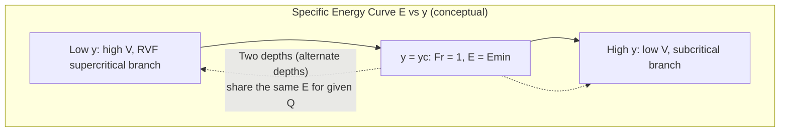

## Open Channel Flow

### Overview

Open channel flow describes liquid flow with a free surface exposed to atmospheric pressure, driven by gravity rather than pressure gradients as in pipe flow. It governs the design of canals, rivers, storm drains, spillways, and culverts in civil engineering. Unlike pipe flow, the flow area is not fixed by the conduit boundary alone — it depends on the flow depth, which is itself an unknown determined by the flow conditions.

### Fundamental Concepts

**Key Points**

- Flow is driven by gravity component along the channel slope, resisted by boundary friction
- The free surface is at atmospheric pressure, so pressure head is not a driving variable the way it is in pipes
- Classified by flow depth variation in time and space: steady/unsteady, uniform/non-uniform (varied)

**Channel Geometry Parameters**

| Parameter | Symbol | Definition |
| --- | --- | --- |
| Flow area | $A$ | Cross-sectional area of flow |
| Wetted perimeter | $P$ | Length of channel boundary in contact with fluid |
| Hydraulic radius | $R = A/P$ | Governs friction resistance |
| Top width | $T$ | Width of free surface |
| Hydraulic depth | $D_h = A/T$ | Used in Froude number for non-rectangular sections |

**Classification of Flow**

- **Uniform flow**: depth, velocity, and cross-section constant along the channel (occurs in long prismatic channels at normal depth)
- **Non-uniform (varied) flow**: depth changes along the channel
  - **Gradually varied flow (GVF)**: depth changes slowly over long distances (backwater curves)
  - **Rapidly varied flow (RVF)**: depth changes abruptly over short distances (hydraulic jump, weir flow)

### Uniform Flow — Manning's Equation

**Key Points**

- The Manning equation is the standard empirical formula for uniform open channel flow resistance
- Requires an empirically determined roughness coefficient $n$ specific to channel lining material

**Manning's Equation (SI units)**

$$V = \frac{1}{n}R^{2/3}S_0^{1/2}$$

$$Q = \frac{1}{n}AR^{2/3}S_0^{1/2}$$

where $n$ is Manning's roughness coefficient, $R$ is hydraulic radius, and $S_0$ is the channel bed slope (dimensionless, m/m).

**Typical Manning's n Values**

| Channel Surface | Manning's n |
| --- | --- |
| Smooth concrete | 0.012–0.014 |
| Rough concrete | 0.015–0.017 |
| Earth, straight and uniform | 0.020–0.025 |
| Natural streams, clean and straight | 0.025–0.035 |
| Natural streams, weedy/irregular | 0.050–0.100 |

[Unverified: n values vary with depth, vegetation season, sediment, and channel condition; project-specific field calibration or reference to standardized tables (e.g., Chow's Open-Channel Hydraulics) is recommended for design]

**Normal Depth**

Normal depth $y_n$ is the depth at which uniform flow occurs for a given $Q$, $S_0$, $n$, and channel geometry. For a rectangular channel of width $b$:

$$Q = \frac{1}{n}\left(\frac{by_n}{b+2y_n}\right)^{2/3}(by_n)S_0^{1/2}$$

This is implicit in $y_n$ and typically solved iteratively or via design charts.

**Example**

A rectangular concrete channel ($n = 0.013$), width $b = 3\,m$, bed slope $S_0 = 0.001$, carries $Q = 5\,m^3/s$. Estimate normal depth by trial:

Try $y_n = 1.0\,m$: $A = 3.0\,m^2$, $P = 3 + 2(1.0) = 5.0\,m$, $R = 0.6\,m$

$$Q = \frac{1}{0.013}(3.0)(0.6)^{2/3}(0.001)^{1/2} = \frac{1}{0.013}(3.0)(0.711)(0.0316) = 5.19\,m^3/s$$

Close to target; $y_n \approx 0.97\,m$ after refinement. [Inference: exact converged value requires iterative solution; shown here as an illustrative approximation]

### Specific Energy and Critical Flow

**Key Points**

- Specific energy is measured relative to the channel bed, not a fixed datum
- Critical depth marks the transition between subcritical and supercritical flow and corresponds to minimum specific energy for a given discharge
- The Froude number determines flow regime

**Specific Energy**

$$E = y + \frac{V^2}{2g} = y + \frac{Q^2}{2gA^2}$$

**Froude Number**

$$Fr = \frac{V}{\sqrt{gD_h}} = \frac{V}{\sqrt{g(A/T)}}$$

| Froude Number | Regime | Characteristics |
| --- | --- | --- |
| $Fr < 1$ | Subcritical | Deep, slow, downstream control dominates |
| $Fr = 1$ | Critical | Minimum specific energy for given Q |
| $Fr > 1$ | Supercritical | Shallow, fast, upstream control dominates |

**Critical Depth (Rectangular Channel)**

For a rectangular channel with unit discharge $q = Q/b$:

$$y_c = \left(\frac{q^2}{g}\right)^{1/3}$$

At critical depth, specific energy is minimum:

$$E_{min} = \frac{3}{2}y_c$$

**Specific Energy Diagram**

### Rapidly Varied Flow — Hydraulic Jump

**Key Points**

- Occurs when flow transitions abruptly from supercritical to subcritical
- Momentum is conserved across the jump; energy is dissipated as turbulence (cannot use Bernoulli across it)
- Common at the base of spillways and downstream of sluice gates as an energy dissipator

**Sequent Depth Relation (Rectangular Channel)**

$$\frac{y_2}{y_1} = \frac{1}{2}\left(\sqrt{1+8Fr_1^2}-1\right)$$

**Energy Loss in the Jump**

$$\Delta E = \frac{(y_2-y_1)^3}{4y_1y_2}$$

**Example**

Flow below a sluice gate has $y_1 = 0.5\,m$, $V_1 = 8\,m/s$.

$$Fr_1 = \frac{8}{\sqrt{9.81 \times 0.5}} = 3.61$$

$$\frac{y_2}{y_1} = \frac{1}{2}(\sqrt{1+8(3.61)^2}-1) = \frac{1}{2}(\sqrt{105.3}-1) = 4.63$$

$$y_2 = 4.63 \times 0.5 = 2.32\,m$$

This confirms a strong hydraulic jump, consistent with $Fr_1$ in the 2.5–4.5 range (oscillating jump range per USBR classification).

**Diagram: Hydraulic Jump Profile (svg_diagram)**

<svg xmlns="http://www.w3.org/2000/svg" viewBox="0 0 700 280">
<rect x="0" y="0" width="700" height="280" fill="#ffffff" />
<text x="350" y="22" text-anchor="middle" font-size="15" font-weight="bold" fill="#1a1a1a">Hydraulic Jump Profile (svg_diagram)</text>
<line x1="40" y1="230" x2="660" y2="230" stroke="#78350f" stroke-width="4" />
<text x="330" y="250" font-size="11" fill="#78350f">Channel bed</text>
<path d="M 60 220 L 60 210 L 250 210 L 250 220" stroke="#2563eb" stroke-width="0" fill="none" />
<rect x="60" y="210" width="190" height="20" fill="#93c5fd" opacity="0.7" />
<text x="100" y="205" font-size="12" fill="#1a1a1a">y1 (supercritical, Fr1 &gt; 1)</text>
<path d="M 250 210 Q 300 210 320 150 Q 335 110 400 100 L 620 100" stroke="#1e40af" stroke-width="0" fill="none" />
<path d="M 250 230 L 250 210 Q 300 210 320 150 Q 335 110 400 100 L 620 100 L 620 230 Z" fill="#3b82f6" opacity="0.6" />
<text x="420" y="90" font-size="12" fill="#1a1a1a">y2 (subcritical, Fr2 &lt; 1)</text>

<text x="270" y="175" font-size="11" fill="`#dc2626`" font-weight="bold">Turbulent</text>

<text x="270" y="190" font-size="11" fill="`#dc2626`" font-weight="bold">roller</text>

<line x1="620" y1="230" x2="620" y2="100" stroke="#000" stroke-width="1" stroke-dasharray="3,2" />

<text x="60" y="265" font-size="11" fill="`#4b5563`">Momentum conserved across jump; energy dissipated as heat/turbulence (ΔE).</text>

</svg>

### Gradually Varied Flow (GVF)

**Key Points**

- Governs backwater and drawdown profiles upstream/downstream of controls (dams, gates, channel slope changes)
- Classified by channel slope type and relationship of actual depth to normal depth $y_n$ and critical depth $y_c$

**GVF Governing Equation**

$$\frac{dy}{dx} = \frac{S_0 - S_f}{1 - Fr^2}$$

where $S_f$ is the friction slope (computed via Manning's equation using local depth and velocity).

**Slope and Profile Classification**

| Slope Type | Condition | Example Profiles |
| --- | --- | --- |
| Mild (M) | $y_n > y_c$ | M1, M2, M3 |
| Steep (S) | $y_n < y_c$ | S1, S2, S3 |
| Critical (C) | $y_n = y_c$ | C1, C3 |
| Horizontal (H) | $S_0 = 0$ | H2, H3 |
| Adverse (A) | $S_0 < 0$ | A2, A3 |

M1 profile (backwater curve, common upstream of dams): actual depth $y > y_n > y_c$, depth increases in the downstream direction approaching the obstruction.

### Weirs and Flow Measurement

**Key Points**

- Weirs are used for flow measurement and flow control in open channels
- Discharge relationships depend on weir geometry (rectangular, triangular/V-notch, broad-crested)

**Rectangular Sharp-Crested Weir**

$$Q = C_d \frac{2}{3}\sqrt{2g}\, b\, H^{3/2}$$

**Triangular (V-Notch) Weir**

$$Q = C_d \frac{8}{15}\sqrt{2g}\,\tan\left(\frac{\theta}{2}\right) H^{5/2}$$

where $H$ is head over the weir crest, $b$ is crest width, $\theta$ is the notch angle, and $C_d$ is a discharge coefficient (typically 0.60–0.62 for sharp-crested weirs). [Unverified: $C_d$ is sensitive to approach velocity, nappe aeration, and weir geometry — should be calibrated or taken from standard hydraulic references such as USBR or ISO 1438 for design-grade accuracy]

### Culvert and Channel Transition Design Notes

**Key Points**

- Culverts may flow under inlet control (constrained by entrance geometry) or outlet control (constrained by full-barrel friction and tailwater)
- Channel transitions (contractions/expansions) must account for changes in specific energy and potential choking when Froude number approaches 1

**Choking Condition**

A channel contraction can "choke" the flow if the reduced width forces the specific energy below the minimum required to pass the given discharge, causing upstream backwater — this is checked by comparing available specific energy to $E_{min} = \frac{3}{2}y_c$ at the contracted section.

### Common Pitfalls

- Using Manning's n values without accounting for actual channel condition (vegetation, sediment, age) — can produce significant depth/capacity errors
- Applying uniform flow (Manning's) equations where flow is actually gradually or rapidly varied
- Forgetting that hydraulic jumps conserve momentum, not energy — using Bernoulli directly across a jump gives incorrect results
- Confusing critical depth (a function of Q and geometry only) with normal depth (a function of Q, n, S0, and geometry)
- Misapplying weir discharge coefficients across different weir types or unverified field conditions

**Next Steps**

- Continuity, Momentum, and Energy Equations (foundational review)
- Flow in Pipes and Pipe Networks (foundational review)
- Gradually Varied Flow Profile Computation Methods
- Culvert Hydraulic Design (Inlet vs Outlet Control)
- Spillway and Energy Dissipator Design
- Sediment Transport and Channel Stability