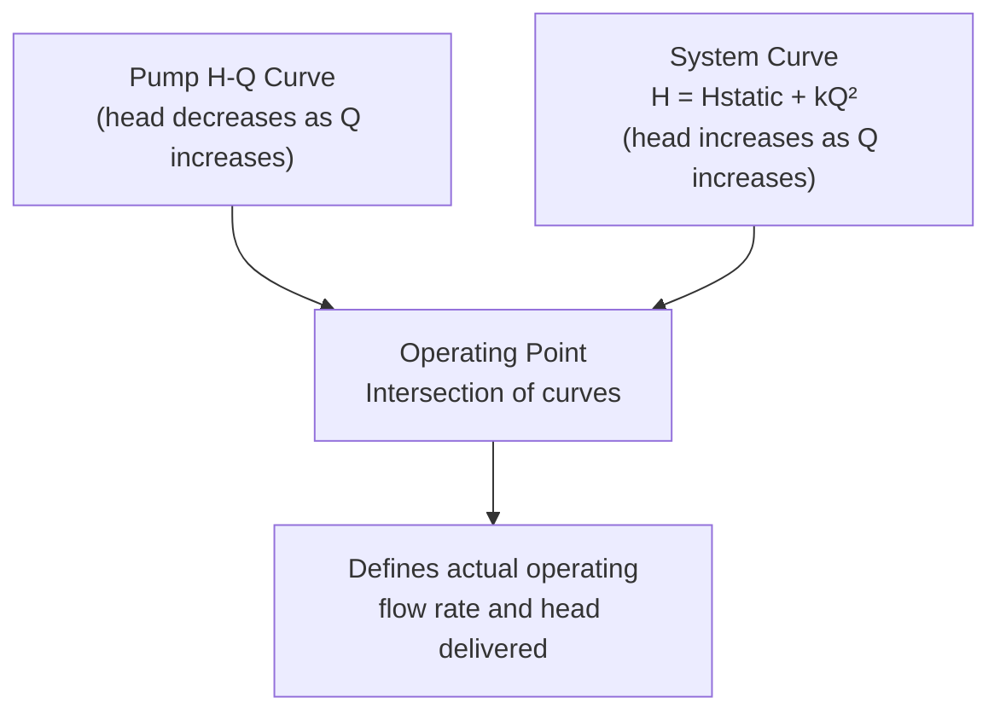

## Pumps, Turbines, and Hydraulic Structures

### Overview

Pumps and turbines are turbomachines that convert between mechanical/electrical energy and fluid energy — pumps add head to a fluid, turbines extract energy from it. Hydraulic structures (spillways, gates, stilling basins, intakes) manage and control flow at dams, reservoirs, and diversion works. Together these form the mechanical and structural core of water resource and hydropower engineering.

### Pump Fundamentals

**Key Points**

- Pumps add mechanical energy (head) to a fluid, converting shaft work into pressure and kinetic energy
- Centrifugal pumps are the dominant type in civil/water engineering applications (water supply, wastewater, irrigation)
- Pump performance is characterized by head-capacity (H-Q), efficiency, and power curves supplied by the manufacturer

**Pump Types**

| Type | Mechanism | Typical Application |
| --- | --- | --- |
| Centrifugal | Radial acceleration via impeller | Water supply, general civil use |
| Axial flow (propeller) | Axial acceleration | Large flow, low head (drainage, flood control) |
| Mixed flow | Combination radial/axial | Intermediate flow-head applications |
| Positive displacement | Fixed volume per cycle | Sludge, viscous fluids, metering |

**Total Dynamic Head (TDH)**

$$TDH = H_{static} + h_{L,suction} + h_{L,discharge} + \frac{V_{discharge}^2 - V_{suction}^2}{2g}$$

where $H_{static}$ is the elevation difference between suction and discharge water surfaces, and $h_L$ terms are friction and minor losses in suction and discharge piping.

**Pump Power and Efficiency**

$$P_{water} = \rho g Q\, TDH$$

$$\eta_{pump} = \frac{P_{water}}{P_{shaft}}$$

$$P_{shaft} = \frac{\rho g Q\, TDH}{\eta_{pump}}$$

where $P_{water}$ is hydraulic (water) power output, $P_{shaft}$ is the brake power input at the pump shaft, and $\eta_{pump}$ is overall pump efficiency (typically 60–85% for well-selected centrifugal pumps near their best efficiency point).

**Example**

A pump delivers $Q = 0.05\,m^3/s$ against $TDH = 30\,m$, with $\eta_{pump} = 0.75$:

$$P_{water} = 1000 \times 9.81 \times 0.05 \times 30 = 14{,}715\,W \approx 14.7\,kW$$

$$P_{shaft} = \frac{14.7}{0.75} = 19.6\,kW$$

### Pump-System Interaction

**Key Points**

- The pump operating point occurs at the intersection of the pump's H-Q curve and the system head curve
- Multiple pumps combine in series (head-adding) or parallel (flow-adding) configurations

**System Curve**

$$H_{system} = H_{static} + kQ^2$$

The operating point is found graphically or numerically where $H_{pump}(Q) = H_{system}(Q)$.

**Pump Combinations**

- **Series**: total head at given Q = sum of individual pump heads (used to reach higher pressure/head targets)
- **Parallel**: total flow at given H = sum of individual pump flows (used to increase capacity; note that system curve steepness limits the practical gain from adding parallel pumps)

**Diagram: Pump Operating Point**

### Cavitation and NPSH

**Key Points**

- Cavitation occurs when local pressure at the pump impeller eye drops below vapor pressure, causing vapor bubble formation and collapse
- Causes pitting damage, noise, vibration, and efficiency loss; a critical design check for pump suction conditions
- Governed by comparing Net Positive Suction Head Available (NPSHA) to Required (NPSHR, from manufacturer)

**NPSH Available**

$$NPSH_A = \frac{p_{atm}}{\rho g} - \frac{p_v}{\rho g} \pm z_s - h_{L,suction}$$

where $p_{atm}$ is atmospheric pressure, $p_v$ is vapor pressure at operating temperature, $z_s$ is the static suction lift (negative if pump is below source, i.e., flooded suction) or suction head, and $h_{L,suction}$ is friction/minor loss in the suction line.

**Cavitation Criterion**

$$NPSH_A > NPSH_R \quad \text{(required for safe operation, typically with a margin)}$$

[Inference: design margins of NPSHA exceeding NPSHR by at least 0.5–1.0 m are commonly recommended in practice to account for uncertainties, though the exact required margin depends on pump specific speed, application criticality, and manufacturer guidance]

### Turbine Fundamentals

**Key Points**

- Turbines extract energy from flowing/falling water and convert it to mechanical (then electrical) energy
- Selection depends primarily on available head and flow rate, characterized by specific speed
- Major types: impulse (Pelton) for high head/low flow, reaction (Francis, Kaplan) for low-to-medium head/higher flow

**Turbine Types and Application Range**

| Type | Category | Head Range | Typical Application |
| --- | --- | --- | --- |
| Pelton | Impulse | High (>300 m) | Mountain hydropower, high-head sites |
| Francis | Reaction | Medium (30–300 m) | Most common; wide range of dam heights |
| Kaplan | Reaction (axial) | Low (<30 m) | Run-of-river, low-head large-flow sites |
| Crossflow (Banki) | Impulse | Low–medium | Small hydro, micro-hydro |

**Turbine Power and Efficiency**

$$P_{turbine} = \eta_{turbine}\, \rho g Q H_{net}$$

where $H_{net}$ is the net head available after subtracting penstock friction losses from gross head, and $\eta_{turbine}$ is overall turbine efficiency (typically 85–95% for large modern turbines at design flow).

**Specific Speed (Turbine Selection Parameter)**

$$N_s = \frac{N\sqrt{P}}{H^{5/4}}$$

where $N$ is rotational speed, $P$ is power output, and $H$ is net head — used to select turbine type appropriate to a given head/flow combination. [Unverified: specific speed formula units and constants vary by regional convention (metric vs. US customary); consult the applicable standard for the design context]

**Example**

A Francis turbine operates at $Q = 15\,m^3/s$, $H_{net} = 60\,m$, $\eta_{turbine} = 0.90$:

$$P_{turbine} = 0.90 \times 1000 \times 9.81 \times 15 \times 60 = 7{,}946{,}100\,W \approx 7.95\,MW$$

### Hydraulic Structures — Spillways

**Key Points**

- Spillways safely pass excess reservoir inflow that exceeds storage or outlet capacity, preventing dam overtopping
- Ogee (overflow) spillways are shaped to match the trajectory of the nappe from a sharp-crested weir, minimizing negative pressure and cavitation risk

**Ogee Spillway Discharge**

$$Q = C_d L H^{3/2}$$

where $C_d$ is a discharge coefficient dependent on the spillway shape and approach conditions (typically 2.0–2.2 in SI units for well-designed ogee crests), $L$ is effective crest length, and $H$ is head over the crest.

**Spillway Types**

| Type | Description |
| --- | --- |
| Ogee (overflow) | Curved profile matching free-falling nappe; most common on concrete/masonry dams |
| Chute | Steep open channel conveying flow from crest to downstream channel |
| Side channel | Crest parallel to and set into the abutment/hillside |
| Siphon | Uses siphonic action to increase discharge capacity within limited crest length |
| Morning glory (shaft) | Circular crest discharging into a vertical/inclined shaft |

### Energy Dissipation Structures

**Key Points**

- High-velocity spillway discharge carries significant kinetic energy that must be dissipated to prevent downstream erosion and structural undermining
- Stilling basins use a controlled hydraulic jump to dissipate energy before flow re-enters the natural channel

**Stilling Basin Design Basis**

Design uses the sequent depth relation from the hydraulic jump theory to size basin length and required tailwater depth:

$$\frac{y_2}{y_1} = \frac{1}{2}\left(\sqrt{1+8Fr_1^2}-1\right)$$

USBR basin types (I–IV) are standardized configurations with baffle blocks and end sills selected based on incoming Froude number, providing shorter basin lengths than a plain hydraulic jump would require. [Unverified: specific basin type selection criteria and dimension ratios should be referenced from USBR Engineering Monograph No. 25 for design-grade work]

### Gates and Control Structures

**Key Points**

- Gates regulate discharge and reservoir water level; selection depends on head, size, and operational requirements

**Common Gate Types**

| Gate Type | Application |
| --- | --- |
| Sluice (slide) gate | Bottom outlets, irrigation control |
| Radial (Tainter) gate | Spillway crest gates on large dams |
| Roller gate | Large spans, moderate head |
| Flap gate | Tide/backflow prevention |
| Butterfly valve | Pipeline flow control/isolation |

**Diagram: Dam Hydraulic Structure Layout (svg_diagram)**

<svg xmlns="http://www.w3.org/2000/svg" viewBox="0 0 700 300">
<rect x="0" y="0" width="700" height="300" fill="#ffffff" />
<text x="350" y="22" text-anchor="middle" font-size="15" font-weight="bold" fill="#1a1a1a">Dam Hydraulic Structure Layout (svg_diagram)</text>
<rect x="0" y="240" width="700" height="60" fill="#a3a3a3" />
<polygon points="100,240 100,60 180,60 260,240" fill="#9ca3af" />
<text x="130" y="150" font-size="11" fill="#1a1a1a" transform="rotate(-90 130 150)">Dam body</text>
<rect x="60" y="50" width="40" height="190" fill="#60a5fa" opacity="0.6" />
<text x="15" y="90" font-size="11" fill="#1a1a1a">Reservoir</text>
<path d="M 180 60 Q 220 60 240 90 Q 255 115 260 140" stroke="#2563eb" stroke-width="8" fill="none" />
<text x="260" y="80" font-size="11" fill="#1a1a1a">Ogee spillway crest</text>
<path d="M 260 140 L 300 240" stroke="#2563eb" stroke-width="8" fill="none" />
<text x="280" y="200" font-size="10" fill="#1a1a1a" transform="rotate(70 280 200)">Chute</text>
<rect x="300" y="230" width="120" height="30" fill="#93c5fd" opacity="0.7" />
<text x="305" y="280" font-size="11" fill="#1a1a1a">Stilling basin (hydraulic jump)</text>
<line x1="330" y1="230" x2="330" y2="215" stroke="#1e40af" stroke-width="3" />
<line x1="360" y1="230" x2="360" y2="215" stroke="#1e40af" stroke-width="3" />
<text x="330" y="210" font-size="9" fill="#1a1a1a">Baffle blocks</text>
<rect x="90" y="150" width="15" height="60" fill="#374151" />
<text x="0" y="175" font-size="10" fill="#1a1a1a">Intake/</text>
<text x="0" y="188" font-size="10" fill="#1a1a1a">gate</text>
<line x1="420" y1="260" x2="660" y2="260" stroke="#2563eb" stroke-width="6" />
<text x="500" y="250" font-size="11" fill="#1a1a1a">Downstream channel</text>
</svg>

### Common Pitfalls

- Selecting a pump based on head/flow alone without checking NPSH available against NPSH required, risking cavitation
- Neglecting suction-side losses when computing TDH, leading to undersized pump selection
- Applying a single spillway discharge coefficient without adjusting for submergence or approach velocity effects at high reservoir levels
- Confusing gross head (elevation difference only) with net head (gross head minus penstock/conveyance losses) in turbine power calculations
- Underestimating stilling basin length by using plain hydraulic jump theory without accounting for standardized basin appurtenances (baffles, end sills) that shorten required length

**Next Steps**

- Continuity, Momentum, and Energy Equations (foundational review)
- Flow in Pipes and Pipe Networks (foundational review)
- Open Channel Flow (foundational review)
- Dam Types and Structural Design Considerations
- Hydropower Plant Layout and Penstock Design
- Pump Station Design and Wet Well Sizing
- Cavitation Prevention in Hydraulic Machinery