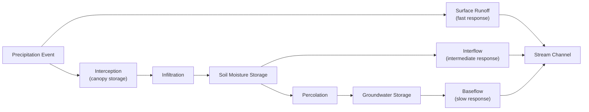

## The Hydrologic Cycle

### Overview

The hydrologic cycle describes the continuous movement and storage of water through the atmosphere, land surface, and subsurface, driven primarily by solar energy and gravity. It is the foundational conceptual framework for hydrology and water resources engineering, underpinning design of water supply systems, flood control infrastructure, stormwater management, and reservoir operations.

### Core Processes

**Key Points**

- The cycle is a closed system at the global scale but is analyzed as an open system with inputs/outputs at regional or catchment scale
- Each process transfers water between atmospheric, surface, and subsurface storage compartments
- Engineering hydrology focuses on quantifying these transfers as fluxes (volume per unit time) for a defined watershed

**Process Definitions**

| Process | Description |
| --- | --- |
| Evaporation | Conversion of liquid water (open water, soil, snow/ice) to vapor via solar energy |
| Transpiration | Water vapor release from plant leaves as part of plant water uptake |
| Evapotranspiration (ET) | Combined evaporation and transpiration, typically treated as a single flux in watershed modeling |
| Condensation | Water vapor converting to liquid droplets/ice crystals, forming clouds |
| Precipitation | Water falling to the surface as rain, snow, sleet, or hail |
| Interception | Precipitation captured by vegetation canopy before reaching the ground |
| Infiltration | Water entering the soil surface from precipitation or ponded water |
| Percolation | Downward movement of infiltrated water through soil to the water table |
| Runoff (surface) | Water flowing over the land surface to streams, rivers, and water bodies |
| Interflow (subsurface stormflow) | Lateral subsurface flow above the water table, contributing to streamflow relatively quickly |
| Baseflow (groundwater flow) | Slow subsurface flow that sustains streams between precipitation events |
| Sublimation | Direct conversion of ice/snow to vapor without a liquid phase |

### Water Balance Equation

**Key Points**

- The water balance (continuity applied to hydrology) is the quantitative expression of the hydrologic cycle for a defined control volume (watershed, reservoir, aquifer)
- Forms the basis for water resources planning, reservoir yield analysis, and groundwater management

**General Water Balance**

$$P = Q + ET + \Delta S + G_{out} - G_{in}$$

where:

- $P$ = precipitation (input)
- $Q$ = surface runoff (output)
- $ET$ = evapotranspiration (output)
- $\Delta S$ = change in storage (surface + soil moisture + groundwater, within the watershed)
- $G_{out}, G_{in}$ = groundwater outflow/inflow across watershed boundary (often assumed negligible for surface-water-dominated basins, but critical in karst or highly permeable settings)

**Simplified Watershed Water Balance**

For many surface-water watershed studies where deep groundwater exchange across boundaries is neglected:

$$P = Q + ET + \Delta S$$

**Example**

An urban watershed receives $P = 1200\,mm/yr$. Annual evapotranspiration is estimated at $ET = 500\,mm/yr$, and storage change over the year is assumed negligible ($\Delta S \approx 0$):

$$Q = P - ET - \Delta S = 1200 - 500 - 0 = 700\,mm/yr$$

This represents the annual depth of runoff available for streamflow, storm drainage design consideration, and water supply yield.

### Global Water Distribution and Residence Time

**Key Points**

- The vast majority of Earth's water is stored in oceans; freshwater represents a small fraction, most of it locked in ice caps and glaciers
- Residence time (average duration water spends in a given reservoir) varies dramatically by compartment, informing which systems are renewable at human timescales versus effectively non-renewable

| Reservoir | Approximate Share of Total Water | Approximate Residence Time |
| --- | --- | --- |
| Oceans | ~96.5% | ~3,000+ years |
| Ice caps/glaciers | ~1.7% | 20–100,000+ years |
| Groundwater | ~1.7% | Days to >10,000 years (depth-dependent) |
| Lakes | <0.01% | Days to decades |
| Soil moisture | <0.01% | Weeks to months |
| Atmosphere | <0.001% | ~9–10 days |
| Rivers | <0.0001% | Days to weeks |

[Unverified: precise percentages and residence times vary slightly between authoritative sources (e.g., USGS, Shiklomanov's global water balance estimates) depending on methodology and measurement era; figures above represent commonly cited approximate ranges]

**Diagram: The Hydrologic Cycle (svg_diagram)**

<svg xmlns="http://www.w3.org/2000/svg" viewBox="0 0 720 380">
<rect x="0" y="0" width="720" height="380" fill="#ffffff" />
<text x="360" y="22" text-anchor="middle" font-size="15" font-weight="bold" fill="#1a1a1a">The Hydrologic Cycle (svg_diagram)</text>
<rect x="0" y="300" width="250" height="60" fill="#1e3a8a" opacity="0.5" />
<text x="80" y="335" font-size="12" fill="#1a1a1a">Ocean</text>
<polygon points="350,150 300,300 500,300" fill="#a3a3a3" />
<text x="380" y="290" font-size="11" fill="#1a1a1a">Mountain / land</text>
<ellipse cx="200" cy="90" rx="60" ry="25" fill="#d1d5db" />
<ellipse cx="450" cy="70" rx="70" ry="28" fill="#d1d5db" />
<text x="160" y="60" font-size="11" fill="#1a1a1a">Clouds (condensation)</text>
<path d="M 100 300 Q 120 200 180 110" stroke="#3b82f6" stroke-width="2" fill="none" marker-end="url(#a1)" />
<text x="60" y="220" font-size="10" fill="#1a1a1a" transform="rotate(-70 60 220)">Evaporation</text>
<path d="M 380 250 Q 390 180 420 100" stroke="#059669" stroke-width="2" fill="none" marker-end="url(#a1)" />
<text x="395" y="200" font-size="10" fill="#059669">Transpiration</text>
<path d="M 220 100 L 260 260" stroke="#1e3a8a" stroke-width="2" fill="none" marker-end="url(#a1)" />
<text x="240" y="180" font-size="10" fill="#1a1a1a">Precipitation</text>
<path d="M 430 90 L 400 250" stroke="#1e3a8a" stroke-width="2" fill="none" marker-end="url(#a1)" />
<text x="415" y="180" font-size="10" fill="#1a1a1a">Precipitation</text>
<path d="M 280 280 Q 200 310 100 305" stroke="#dc2626" stroke-width="2" fill="none" marker-end="url(#a1)" />
<text x="150" y="300" font-size="10" fill="#dc2626">Surface runoff</text>
<path d="M 300 290 L 300 340 Q 280 355 250 340" stroke="#7c3aed" stroke-width="2" fill="none" marker-end="url(#a1)" />
<text x="260" y="365" font-size="10" fill="#7c3aed">Infiltration → Baseflow</text>
</svg>

### Watershed (Catchment) Concept

**Key Points**

- A watershed is the land area that drains to a common outlet point, defined by topographic divides
- The fundamental spatial unit for applying the water balance equation and hydrologic modeling
- Delineated using topographic maps, DEMs (digital elevation models), and GIS flow-direction analysis in modern practice

**Watershed Characteristics Relevant to Hydrologic Response**

| Characteristic | Influence |
| --- | --- |
| Drainage area | Scales total water volume available |
| Slope | Affects runoff velocity and time of concentration |
| Land use/cover | Affects infiltration capacity and ET rates |
| Soil type | Governs infiltration rate and storage capacity |
| Drainage density | Stream length per unit area; affects response speed |
| Shape | Elongated vs circular basins affect hydrograph peak timing |

### Time Scales and Hydrologic Response

**Key Points**

- Different flow pathways contribute to streamflow at different timescales, shaping the storm hydrograph
- Understanding this partitioning is essential for flood forecasting and stormwater design

**Streamflow Components by Response Speed**

1. **Direct/surface runoff** — fastest response, dominates the rising limb and peak of a storm hydrograph
2. **Interflow** — intermediate response, delayed lateral subsurface flow
3. **Baseflow** — slowest response, sustains flow during dry periods (recession limb and between-storm flow)

### Human Interaction with the Hydrologic Cycle

**Key Points**

- Urbanization alters the natural cycle by increasing impervious surface area, reducing infiltration, and increasing/accelerating surface runoff
- Engineering interventions (reservoirs, wells, diversions, stormwater systems) intentionally modify natural fluxes for water supply, flood control, and drainage objectives

**Effects of Urbanization on Water Balance**

| Component | Natural (pervious) | Urbanized (impervious) |
| --- | --- | --- |
| Infiltration | High | Substantially reduced |
| Surface runoff | Low, delayed | High, rapid (increased peak flow, reduced time to peak) |
| Evapotranspiration | Moderate-high | Reduced (less vegetation) |
| Baseflow | Sustained | Reduced (less groundwater recharge) |

This shift is the underlying rationale for stormwater management practices such as detention/retention basins, permeable pavement, and low-impact development (LID) design, which aim to restore pre-development hydrologic response characteristics.

### Common Pitfalls

- Treating the hydrologic cycle as a purely qualitative diagram rather than applying the quantitative water balance for design purposes
- Neglecting storage change ($\Delta S$) in short-duration water balance analyses (valid to neglect only over sufficiently long averaging periods, such as multi-year averages, where storage fluctuations approximately cancel)
- Ignoring groundwater exchange across watershed boundaries in basins with significant karst or highly permeable geology, where the simplified surface-only water balance is invalid
- Assuming evapotranspiration rates are constant across land uses/seasons, when ET is highly dependent on vegetation cover, temperature, and available soil moisture

**Next Steps**

- Precipitation Analysis and Design Storms
- Infiltration Models (Horton, Green-Ampt)
- Runoff Estimation (Rational Method, SCS Curve Number)
- Unit Hydrograph Theory
- Watershed Delineation and GIS Hydrology
- Groundwater Hydrology and Aquifer Properties
- Stormwater Management and Low-Impact Development