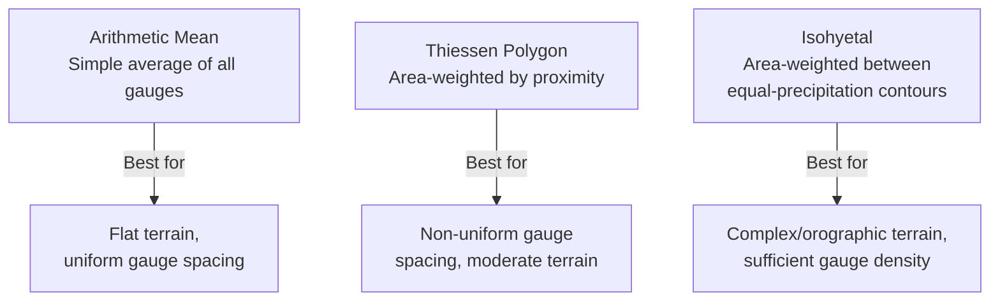
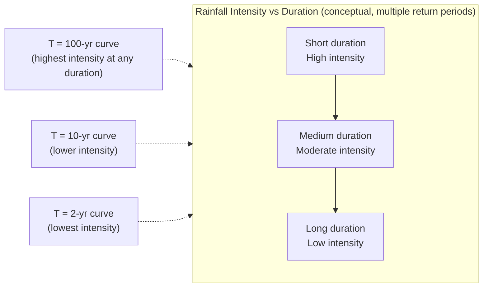

## Precipitation Analysis

### Overview

Precipitation analysis is the quantitative study of rainfall (and other precipitation forms) data to characterize amount, intensity, duration, and frequency for use in hydrologic design. It provides the statistical and computational foundation for sizing drainage infrastructure, estimating flood magnitudes, and establishing design storms used throughout water resources engineering.

### Precipitation Measurement

**Key Points**

- Point measurements from rain gauges must be converted to areal (watershed-average) estimates for hydrologic analysis
- Modern practice increasingly supplements gauge networks with radar and satellite-derived precipitation estimates

**Measurement Methods**

| Method | Description |
| --- | --- |
| Non-recording gauge | Manual reading of accumulated depth (e.g., standard 8-inch gauge) |
| Recording (tipping bucket) gauge | Records incremental depth over time, enabling intensity calculation |
| Weather radar | Estimates rainfall rate from reflectivity; provides spatial coverage but requires ground-truth calibration |
| Satellite-based | Large-scale/global coverage, coarser resolution, useful for ungauged regions |

### Areal Precipitation Estimation

**Key Points**

- Point gauge data must be spatially averaged to represent precipitation over an entire watershed
- Method selection depends on gauge density, terrain complexity, and available data

**Arithmetic Mean Method**

$$\bar{P} = \frac{1}{n}\sum_{i=1}^{n} P_i$$

Simplest method; appropriate only for relatively flat terrain with uniformly distributed gauges.

**Thiessen Polygon Method**

$$\bar{P} = \frac{\sum_{i=1}^{n} A_i P_i}{\sum_{i=1}^{n} A_i}$$

where $A_i$ is the area of the Thiessen polygon (region closer to gauge $i$ than any other gauge) associated with gauge $i$. Accounts for non-uniform gauge spacing but assumes linear variation between gauges and does not account for terrain/orographic effects.

**Isohyetal Method**

$$\bar{P} = \frac{\sum_{i=1}^{n} A_i \bar{P}_i}{\sum_{i=1}^{n} A_i}$$

where isohyets (lines of equal precipitation) are drawn (traditionally by hand, now via GIS interpolation) and $\bar{P}_i$ is the average precipitation between two adjacent isohyets over sub-area $A_i$. Considered the most accurate method when sufficient gauge density and analyst judgment (or reliable interpolation) are available, particularly in areas with orographic influence.

**Diagram: Areal Precipitation Methods Comparison**

**Example (Thiessen Method)**

A watershed is divided into 3 Thiessen polygons with areas $A_1=20\,km^2$, $A_2=35\,km^2$, $A_3=15\,km^2$ and gauge readings $P_1=80\,mm$, $P_2=65\,mm$, $P_3=95\,mm$:

$$\bar{P} = \frac{(20)(80)+(35)(65)+(15)(95)}{20+35+15} = \frac{1600+2275+1425}{70} = \frac{5300}{70} = 75.7\,mm$$

### Rainfall Intensity-Duration-Frequency (IDF) Analysis

**Key Points**

- IDF relationships describe how rainfall intensity varies with storm duration for a given return period (frequency)
- IDF curves are the standard basis for design storm selection in stormwater and culvert/drainage design
- Derived from statistical (frequency) analysis of historical annual maximum rainfall series

**General IDF Equation Form**

$$i = \frac{c}{(t_d + b)^e}$$

where $i$ is rainfall intensity, $t_d$ is storm duration, and $c$, $b$, $e$ are empirical coefficients specific to a location and return period, typically derived by regression from local/regional rainfall records (e.g., NOAA Atlas 14 in the US, or local meteorological agency publications elsewhere).

**Return Period and Probability**

$$P(\text{exceedance in 1 year}) = \frac{1}{T}$$

where $T$ is the return period in years. The probability of at least one exceedance occurring within $n$ years:

$$P(\text{at least one exceedance in } n\,\text{years}) = 1-\left(1-\frac{1}{T}\right)^n$$

**Example**

For a 100-year design storm ($T=100$), the probability of exceedance in any given year is $1/100 = 1\%$. The probability of at least one such event occurring over a 30-year design life:

$$P = 1-\left(1-\frac{1}{100}\right)^{30} = 1-(0.99)^{30} = 1-0.740 = 0.260 = 26.0\%$$

This illustrates a common misconception: a "100-year storm" does not mean it occurs only once every 100 years on a fixed schedule — it carries meaningful probability of occurring multiple times, or not at all, within any given period.

**Typical IDF Curve Shape**

### Design Storm Hyetographs

**Key Points**

- A hyetograph distributes total design storm depth over time, needed as input to rainfall-runoff models (unlike IDF curves, which only give average intensity over a duration)
- Common synthetic distribution methods convert IDF-derived total depth into a time-varying intensity pattern

**Common Design Storm Distribution Methods**

| Method | Description |
| --- | --- |
| Alternating Block Method | Constructs a hyetograph from IDF data by arranging intensity blocks with the peak intensity centered and decreasing blocks alternating outward |
| SCS (NRCS) Type Storms (Type I, IA, II, III) | Standardized 24-hour dimensionless rainfall distributions for different US regions, scaled to design storm total depth |
| Triangular Hyetograph | Simplified triangular distribution, often used for smaller/simpler analyses |

**Alternating Block Method — Procedure**

1. Select design return period $T$ and total storm duration $t_d$, divided into time increments $\Delta t$
2. For each cumulative duration ($\Delta t$, $2\Delta t$, $3\Delta t$, ...), compute intensity from the IDF equation, then cumulative depth ($i \times t$)
3. Compute incremental depth for each block by successive subtraction
4. Arrange blocks with the maximum increment centered in the storm duration, remaining blocks placed alternately in descending order on either side

### Probable Maximum Precipitation (PMP)

**Key Points**

- PMP represents the theoretical greatest depth of precipitation physically possible for a given duration and area, under current climatic conditions
- Used for critical infrastructure design (large dam spillways) where failure consequences are catastrophic, rather than a standard return-period approach

$$PMP \text{ (estimation)} = \bar{P}_n + K_m \sigma_n$$

where $\bar{P}_n$ and $\sigma_n$ are the mean and standard deviation of annual maximum series, and $K_m$ is a frequency factor (Hershfield method) — one of several statistical/meteorological approaches used to estimate PMP. [Unverified: PMP estimation is a specialized field with multiple accepted methodologies (statistical, meteorological/storm transposition, generalized regional studies); the Hershfield statistical method shown is illustrative and site-specific PMP studies typically require specialized meteorological analysis beyond this simplified form]

### Frequency Analysis of Annual Maximum Series

**Key Points**

- Statistical distributions are fit to historical annual maximum rainfall (or flood) series to estimate return-period magnitudes
- Common distributions include Gumbel (Extreme Value Type I), Log-Pearson Type III, and Log-Normal

**Gumbel Distribution — Return Period Estimate**

$$X_T = \bar{X} + K_T \sigma$$

$$K_T = -\frac{\sqrt{6}}{\pi}\left[0.5772 + \ln\left(\ln\left(\frac{T}{T-1}\right)\right)\right]$$

where $X_T$ is the estimated value for return period $T$, $\bar{X}$ and $\sigma$ are the mean and standard deviation of the annual maximum series, and $K_T$ is the Gumbel frequency factor.

### Common Pitfalls

- Applying the arithmetic mean method in mountainous or orographically complex terrain, ignoring elevation-driven precipitation variation
- Confusing IDF curve output (average intensity over a duration) with a time-distributed hyetograph needed for hydrograph modeling — these are not interchangeable without applying a distribution method
- Misinterpreting "T-year return period" as a fixed recurrence interval rather than a probabilistic exceedance frequency
- Using outdated or regionally inappropriate IDF data; precipitation frequency estimates should be updated periodically and are region-specific (e.g., due to changing climate patterns) [Inference: the degree of change and update frequency needed depends on regional climate trends and the governing local design standard]
- Applying PMP methods interchangeably with standard frequency-based design storms — PMP is a deterministic upper-bound concept, not a statistical return-period value

**Next Steps**

- The Hydrologic Cycle (foundational review)
- Infiltration Models (Horton, Green-Ampt)
- Runoff Estimation (Rational Method, SCS Curve Number)
- Unit Hydrograph Theory
- Flood Frequency Analysis
- Stormwater Drainage System Design