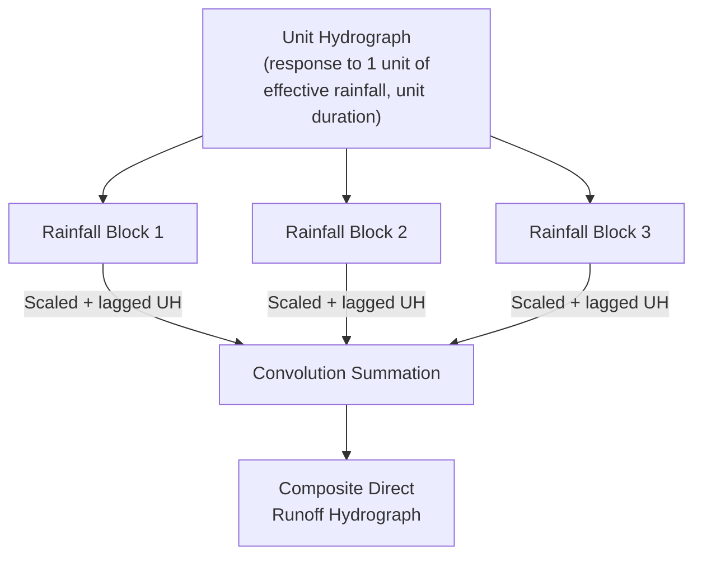

## Runoff Estimation and Unit Hydrographs

### Overview

Runoff estimation quantifies the portion of precipitation that becomes surface streamflow, while unit hydrograph theory provides a systematic method for converting effective (excess) rainfall into a time-distributed streamflow response. Together these techniques form the core rainfall-runoff modeling toolkit used for flood design, culvert/storm drain sizing, and reservoir/detention basin analysis.

### Runoff Fundamentals

**Key Points**

- Total precipitation splits into losses (interception, infiltration, depression storage) and effective rainfall (excess precipitation that becomes direct runoff)
- Runoff estimation methods range from simple peak-flow formulas to full time-distributed hydrograph methods, selected based on watershed size and design objective

$$P = P_e + L$$

where $P$ is total precipitation, $P_e$ is effective (excess) rainfall producing direct runoff, and $L$ represents combined losses (interception, infiltration, depression storage, ET).

### Rational Method

**Key Points**

- Widely used for peak flow estimation in small urban/suburban watersheds (typically under ~80–200 hectares, per common regional guidance)
- Estimates only peak discharge, not a full hydrograph — a significant limitation for detention/routing design
- Assumes rainfall intensity is uniform over the watershed and over the storm duration equal to time of concentration

**Rational Formula**

$$Q_p = CiA$$

where $Q_p$ is peak discharge, $C$ is a dimensionless runoff coefficient (0 to 1), $i$ is rainfall intensity (from IDF curve, at duration = time of concentration) corresponding to the design return period, and $A$ is drainage area (units depend on convention: in SI, $Q_p$ [m³/s] = $C \times i$ [mm/hr] $\times A$ [ha] / 360; in US customary, $Q_p$ [cfs] = $C \times i$ [in/hr] $\times A$ [acres]).

**Typical Runoff Coefficients**

| Surface Type | C (typical range) |
| --- | --- |
| Pavement/roofs | 0.85–0.95 |
| Lawns, sandy soil, flat | 0.05–0.10 |
| Lawns, clay soil, steep | 0.25–0.35 |
| Dense residential (moderate impervious) | 0.40–0.60 |
| Commercial/dense urban | 0.70–0.95 |

[Unverified: C values are approximate and depend on soil type, slope, land cover density, and storm return period; many jurisdictions use composite/weighted C values or C values that increase with return period — consult local drainage design manuals]

**Time of Concentration**

The time for runoff to travel from the hydraulically most distant point in the watershed to the outlet; commonly estimated via empirical formulas such as the Kirpich equation:

$$t_c = 0.0195\, L^{0.77} S^{-0.385}$$

where $t_c$ is in minutes, $L$ is flow length (m), and $S$ is average watershed slope (m/m).

**Example**

A commercial site has $A = 5\,ha$, composite $C = 0.75$, and design rainfall intensity $i = 90\,mm/hr$ (from IDF curve at $t_c$ for the design return period):

$$Q_p = \frac{0.75 \times 90 \times 5}{360} = 0.9375\,m^3/s$$

### SCS (NRCS) Curve Number Method

**Key Points**

- Developed by the USDA Soil Conservation Service (now NRCS); widely used for both peak flow and full hydrograph estimation
- Accounts for soil type, land use, and antecedent moisture condition via a single empirical parameter (Curve Number, CN)
- Applicable to a much broader range of watershed sizes than the Rational Method

**SCS Runoff Equation**

$$Q = \frac{(P-0.2S)^2}{P+0.8S} \quad \text{for } P > 0.2S$$

$$S = \frac{25400}{CN} - 254 \quad \text{(SI units, S in mm)}$$

where $Q$ is direct runoff depth, $P$ is total storm rainfall depth, and $S$ is potential maximum retention after runoff begins. The term $0.2S$ represents the initial abstraction $I_a$ (interception, depression storage, and initial infiltration before runoff begins).

**Curve Number Selection**

CN values (0–100) depend on hydrologic soil group (A–D, by infiltration capacity), land use/cover, and hydrologic condition, tabulated in NRCS TR-55 and related publications.

| Land Use | Soil Group A | Soil Group D |
| --- | --- | --- |
| Woods, good condition | 30 | 77 |
| Open space, good condition (grass >75% cover) | 39 | 80 |
| Residential, 1/4-acre lots (38% impervious) | 61 | 87 |
| Commercial/business (85% impervious) | 89 | 95 |
| Paved parking/roofs | 98 | 98 |

**Example**

A watershed has composite $CN = 75$, and total storm rainfall $P = 100\,mm$:

$$S = \frac{25400}{75} - 254 = 338.7 - 254 = 84.7\,mm$$

$$Q = \frac{(100 - 0.2 \times 84.7)^2}{100 + 0.8 \times 84.7} = \frac{(100-16.9)^2}{100+67.7} = \frac{6905}{167.7} = 41.2\,mm$$

This represents the direct runoff depth; multiplying by watershed area gives runoff volume.

### Unit Hydrograph Theory

**Key Points**

- A unit hydrograph (UH) represents the direct runoff hydrograph resulting from one unit depth (e.g., 1 mm or 1 inch) of effective rainfall, uniformly distributed over the watershed, occurring over a specified unit duration
- Based on the assumption of linearity and time-invariance: watershed response scales proportionally with rainfall excess and can be superimposed for multi-period storms
- Once derived for a watershed, the UH can be used (via convolution) to predict the runoff hydrograph for any storm of the same unit duration

**Key Assumptions**

1. Effective rainfall of a given duration is uniformly distributed over the watershed
2. Effective rainfall intensity is constant over the unit duration
3. **Linearity**: runoff ordinates are directly proportional to effective rainfall depth
4. **Superposition**: total hydrograph from multiple rainfall increments equals the sum of individual (lagged) unit hydrograph responses
5. **Time invariance**: the watershed's UH response does not change between storm events (a simplifying assumption; actual watershed response can vary with antecedent conditions)

**Convolution Equation (Discrete Form)**

$$Q_n = \sum_{i=1}^{n} P_i U_{n-i+1}$$

where $Q_n$ is the direct runoff ordinate at time step $n$, $P_i$ is effective rainfall in period $i$, and $U_{n-i+1}$ is the unit hydrograph ordinate.

**Diagram: Unit Hydrograph Convolution Concept**

### Synthetic Unit Hydrographs

**Key Points**

- Used when observed rainfall-runoff data are unavailable to derive a UH empirically (the typical case for design)
- Relate hydrograph shape/timing parameters to measurable watershed characteristics (area, length, slope)

**SCS Dimensionless Unit Hydrograph**

Defines UH shape via dimensionless ratios of $q/q_p$ versus $t/T_p$, scaled using:

$$q_p = \frac{2.08 A}{T_p} \quad \text{(SI units: } q_p \text{ in } m^3/s \text{ per mm, } A \text{ in } km^2, T_p \text{ in hours)}$$

$$T_p = \frac{t_r}{2} + t_{lag}$$

where $T_p$ is time to peak, $t_r$ is unit rainfall duration, and $t_{lag}$ is basin lag (commonly estimated as $t_{lag} \approx 0.6\,t_c$).

**Snyder's Synthetic Unit Hydrograph**

An alternative method using regional coefficients $C_t$ (timing) and $C_p$ (peaking) calibrated to gauged watersheds in similar physiographic regions:

$$t_p = C_t (LL_{ca})^{0.3}$$

where $L$ is main channel length and $L_{ca}$ is length to the centroid of the watershed. [Unverified: Snyder coefficients are regionally calibrated and should not be applied outside the region/physiographic conditions for which they were developed without local verification]

### Hydrograph Components

**Key Points**

- A storm hydrograph combines direct runoff (from the current storm, represented by the UH-convolution) with baseflow (antecedent groundwater contribution)
- Baseflow separation is required to isolate direct runoff before UH derivation from observed data

**Typical Hydrograph Shape**

**Baseflow Separation Methods**

- **Straight-line method**: connects hydrograph start to a point on the recession limb
- **Fixed-base method**: uses a fixed time after peak to define baseflow recession
- **Master recession curve method**: uses a characteristic recession curve extrapolated from the falling limb

### Comparison of Runoff Estimation Methods

| Method | Output | Best Suited For |
| --- | --- | --- |
| Rational Method | Peak flow only | Small urban watersheds, storm sewer sizing |
| SCS Curve Number | Runoff depth/volume; combinable with UH for full hydrograph | Wide range of watershed sizes, common in US practice |
| Unit Hydrograph (observed) | Full hydrograph shape | Gauged watersheds with historical rainfall-runoff records |
| Synthetic UH (SCS, Snyder) | Full hydrograph shape | Ungauged watersheds, design-storm modeling |

### Common Pitfalls

- Applying the Rational Method to large or complex watersheds beyond its valid size range, where it fails to capture storage/attenuation effects
- Using the SCS CN method with an inappropriate antecedent moisture condition (AMC) adjustment, significantly affecting computed runoff volume
- Violating unit hydrograph linearity assumptions when applying it to extreme storms far outside the range of events used for derivation [Inference: watershed response is generally understood to become less linear at very high rainfall intensities due to changes in infiltration capacity and flow pathways, though the degree of deviation is watershed-specific]
- Neglecting proper baseflow separation before deriving an empirical UH from observed streamflow records, leading to a distorted direct-runoff hydrograph
- Confusing unit hydrograph duration with total storm duration — a UH is tied to a specific unit rainfall duration and cannot be applied directly to rainfall of a different increment without adjustment (e.g., S-curve method)

**Next Steps**

- The Hydrologic Cycle (foundational review)
- Precipitation Analysis (foundational review)
- Flood Routing (Hydrologic and Hydraulic)
- Detention/Retention Basin Design
- Storm Sewer System Design
- Flood Frequency Analysis