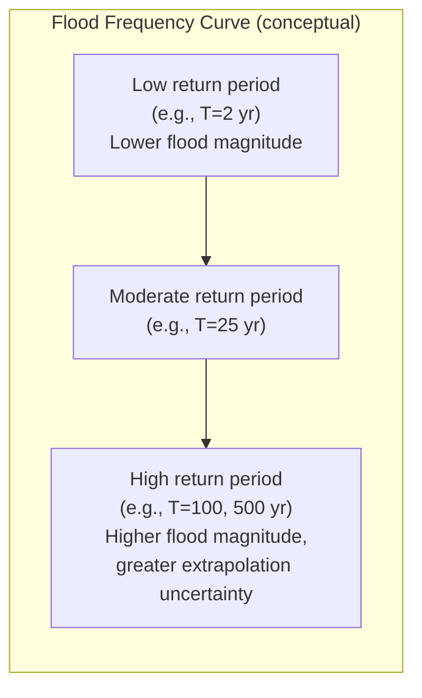
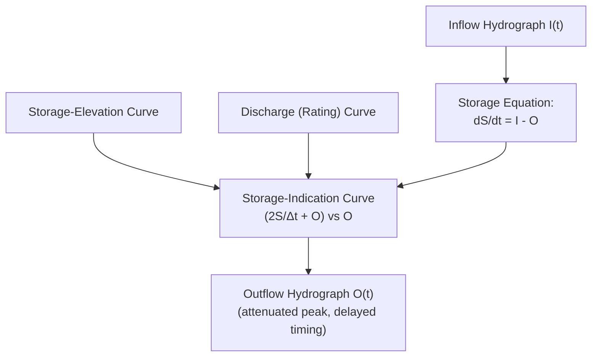

## Flood Frequency Analysis and Routing

### Overview

Flood frequency analysis applies statistical methods to historical streamflow data to estimate the magnitude of floods associated with given return periods, supporting design of dams, bridges, and floodplain regulations. Flood routing computes how a flood wave transforms as it moves through a river reach or reservoir, accounting for storage effects that attenuate peak flow and delay timing — essential for reservoir operation, downstream flood forecasting, and channel design.

### Flood Frequency Analysis Fundamentals

**Key Points**

- Uses historical annual maximum (or partial duration) streamflow series to fit a probability distribution
- Provides design flood magnitudes for specified return periods (e.g., 100-year flood) used in floodplain mapping and infrastructure design
- Requires sufficiently long, homogeneous, and unregulated (or adjusted) streamflow records for reliable results

**Data Series Types**

| Series Type | Description |
| --- | --- |
| Annual maximum series (AMS) | Single largest flood event per year; most common basis for standard frequency analysis |
| Partial duration series (PDS) / Peaks-over-threshold (POT) | All independent peaks exceeding a threshold, regardless of year; captures multiple events per year |

### Log-Pearson Type III Distribution

**Key Points**

- The standard method recommended by many national guidelines (e.g., US Bulletin 17C) for flood frequency analysis
- Fits a Pearson Type III distribution to the logarithms of the annual maximum flow series
- Requires three parameters: mean, standard deviation, and skew coefficient of log-transformed data

**Log-Pearson III Procedure**

1. Transform annual maximum flows: $y_i = \log_{10}(Q_i)$
2. Compute mean $\bar{y}$, standard deviation $S_y$, and skew coefficient $G$ of the log-transformed series
3. Estimate the flood magnitude for return period $T$:

$$\log_{10}(Q_T) = \bar{y} + K_T S_y$$

where $K_T$ is a frequency factor depending on both return period $T$ and skew coefficient $G$, obtained from standard tables (Pearson Type III frequency factor tables).

**Skew Coefficient**

$$G = \frac{n\sum_{i=1}^n (y_i-\bar{y})^3}{(n-1)(n-2)S_y^3}$$

[Unverified: many design guidelines recommend weighting the station skew with a regional skew estimate to improve reliability for short records, per methods such as those in Bulletin 17C; the specific weighting approach is jurisdiction-dependent]

**Example (Simplified)**

An annual maximum flow series has $\bar{y} = 2.30$ (log of flow in $m^3/s$), $S_y = 0.25$, and for $T=100$ with a given skew, $K_{100} = 2.107$ (illustrative table value):

$$\log_{10}(Q_{100}) = 2.30 + 2.107(0.25) = 2.30+0.527=2.827$$

$$Q_{100} = 10^{2.827} \approx 671\,m^3/s$$

### Gumbel (Extreme Value Type I) Distribution

**Key Points**

- Simpler two-parameter alternative to Log-Pearson III, historically widely used, particularly outside regions where Log-Pearson III is the mandated standard

$$X_T = \bar{X} + K_T \sigma$$

$$K_T = -\frac{\sqrt{6}}{\pi}\left[0.5772+\ln\left(\ln\left(\frac{T}{T-1}\right)\right)\right]$$

where $\bar{X}$ and $\sigma$ are the mean and standard deviation of the (untransformed) annual maximum series.

### Flood Frequency Curve

**Key Points**

- Plots flood magnitude against return period (or exceedance probability), typically on a probability or log-probability scale
- Used to interpolate/extrapolate design flood values and to visually assess distribution fit against plotted (empirical) data points

**Plotting Position Formula (Weibull)**

$$P = \frac{m}{n+1}$$

where $m$ is the rank of the flood event (largest = 1) and $n$ is the total number of years of record, giving the exceedance probability for plotting empirical data against the fitted distribution.

### Flood Routing — Overview

**Key Points**

- Routing predicts how a flood hydrograph changes shape (peak attenuation, time lag) as it travels through a reservoir or river reach
- Two broad categories: **hydrologic routing** (storage-based, uses continuity + simplified storage-discharge relationships) and **hydraulic routing** (uses full momentum + continuity, i.e., Saint-Venant equations, for greater accuracy at the cost of complexity)

**Storage (Continuity) Equation — Basis for Hydrologic Routing**

$$\frac{dS}{dt} = I(t) - O(t)$$

where $S$ is storage, $I(t)$ is inflow, and $O(t)$ is outflow, all functions of time.

### Reservoir (Level Pool) Routing

**Key Points**

- Used for routing a flood hydrograph through a reservoir with a known storage-elevation-discharge relationship
- Assumes horizontal water surface within the reservoir (valid for reservoirs, not river reaches with significant flow gradient)

**Discretized Storage Equation**

$$\frac{S_2-S_1}{\Delta t} = \frac{I_1+I_2}{2} - \frac{O_1+O_2}{2}$$

Rearranged into the standard storage-indication (modified Puls) routing form:

$$\left(\frac{2S_2}{\Delta t}+O_2\right) = (I_1+I_2) + \left(\frac{2S_1}{\Delta t}-O_1\right)$$

**Modified Puls (Storage-Indication) Method — Procedure**

1. Develop storage-outflow relationship: $S$ vs $O$ from reservoir stage-storage and stage-discharge (spillway rating) curves
2. Construct the storage-indication curve: $\left(\frac{2S}{\Delta t}+O\right)$ versus $O$
3. For each time step, compute the right-hand side using known values from the previous step and the given inflow hydrograph
4. Use the storage-indication curve to look up (or solve for) $O_2$
5. Advance to the next time step

**Diagram: Reservoir Routing Logic**

**Effect of Reservoir Routing on Hydrograph**

- Peak outflow is less than peak inflow (attenuation), because storage absorbs the difference during the rising limb
- Peak outflow timing is delayed relative to peak inflow
- Peak outflow occurs at the point where the inflow and outflow hydrographs cross (since $dS/dt=0$, i.e., $I=O$, at maximum storage)

### River (Channel) Routing — Muskingum Method

**Key Points**

- Used for routing floods through river reaches (as opposed to reservoirs), accounting for both storage magnitude and the wedge-shaped storage effect caused by the flow gradient along the reach
- The most widely used hydrologic channel routing method in civil engineering practice due to its relative simplicity and reasonable accuracy for many applications

**Muskingum Storage Equation**

$$S = K[XI+(1-X)O]$$

where $K$ is the storage time constant (approximately the travel time through the reach), and $X$ is a dimensionless weighting factor (0 to 0.5) reflecting the relative importance of inflow versus outflow in determining storage (wedge storage effect).

**Muskingum Routing Equation**

$$O_2 = C_0 I_2 + C_1 I_1 + C_2 O_1$$

with routing coefficients:

$$C_0 = \frac{-KX+0.5\Delta t}{K-KX+0.5\Delta t}, \quad C_1=\frac{KX+0.5\Delta t}{K-KX+0.5\Delta t}, \quad C_2=\frac{K-KX-0.5\Delta t}{K-KX+0.5\Delta t}$$

Note: $C_0+C_1+C_2=1$, which serves as a useful computational check.

**Parameter Estimation**

$K$ and $X$ are typically estimated by calibration against observed inflow-outflow hydrograph pairs for the reach, or estimated from channel hydraulic properties when observed data are unavailable. [Unverified: X typically ranges from 0 (reservoir-like, pure translation with no wedge storage) to 0.5 (full wedge storage, minimal attenuation); most natural channels fall in the 0.2–0.3 range, though this varies by channel characteristics]

**Example**

Given $K = 2.0\,hr$, $X = 0.2$, $\Delta t = 1.0\,hr$:

$$C_0 = \frac{-2.0(0.2)+0.5(1.0)}{2.0-2.0(0.2)+0.5(1.0)} = \frac{-0.4+0.5}{2.0-0.4+0.5} = \frac{0.1}{2.1}=0.0476$$

$$C_1 = \frac{2.0(0.2)+0.5(1.0)}{2.1} = \frac{0.4+0.5}{2.1}=0.4286$$

$$C_2 = \frac{2.0-0.4-0.5}{2.1} = \frac{1.1}{2.1}=0.5238$$

Check: $0.0476+0.4286+0.5238 = 1.0000$ ✓

### Comparison: Reservoir vs Channel Routing

| Aspect | Reservoir (Level Pool) Routing | Channel (Muskingum) Routing |
| --- | --- | --- |
| Storage assumption | Function of outflow only ($S = f(O)$) | Function of both inflow and outflow (wedge + prism storage) |
| Peak attenuation | Significant (large storage relative to flow) | Typically moderate, reach-dependent |
| Water surface | Assumed horizontal (level pool) | Sloped along reach (flow gradient) |
| Primary parameters | Stage-storage, stage-discharge curves | K (travel time), X (weighting factor) |

### Hydraulic Routing (Saint-Venant Equations)

**Key Points**

- Full hydraulic routing solves the complete Saint-Venant (continuity + momentum) equations for unsteady open channel flow, providing the most physically accurate representation
- Computationally intensive; typically implemented via numerical models rather than hand calculation, used for complex channels, backwater-affected reaches, or where hydrologic routing assumptions are invalid

**Saint-Venant Equations**

Continuity:

$$\frac{\partial A}{\partial t}+\frac{\partial Q}{\partial x}=0$$

Momentum:

$$\frac{\partial Q}{\partial t}+\frac{\partial}{\partial x}\left(\frac{Q^2}{A}\right)+gA\frac{\partial y}{\partial x}=gA(S_0-S_f)$$

[Unverified: numerical solution requires specialized software (e.g., HEC-RAS unsteady flow module) and appropriate boundary/initial conditions; simplified hydrologic routing methods remain standard for many design applications where full hydraulic detail is not warranted]

### Common Pitfalls

- Applying Log-Pearson III or Gumbel frequency analysis to short or non-homogeneous streamflow records (e.g., records spanning a period before and after major land use change or dam construction) without appropriate adjustment
- Confusing hydrologic routing (storage-based, computationally simple) with hydraulic routing (momentum-based, required when backwater or highly dynamic wave effects are significant) and applying the wrong method for the situation
- Using Muskingum parameters calibrated for one reach on a hydraulically dissimilar reach without recalibration
- Extrapolating flood frequency curves far beyond the range of the historical record (e.g., estimating a 500-year flood from 20 years of data) without acknowledging substantially increased uncertainty
- Neglecting to verify $C_0+C_1+C_2=1$ as a computational check in Muskingum routing calculations

**Next Steps**

- The Hydrologic Cycle (foundational review)
- Precipitation Analysis (foundational review)
- Runoff Estimation and Unit Hydrographs (foundational review)
- Floodplain Mapping and Regulatory Design Standards
- Reservoir Operation and Yield Analysis
- HEC-RAS and HEC-HMS Modeling Fundamentals
- Dam Spillway Capacity Design