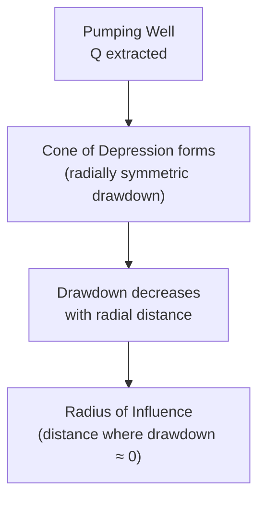

## Groundwater Hydrology

### Overview

Groundwater hydrology studies the occurrence, movement, and management of water stored in subsurface geologic formations (aquifers). It underpins water supply well design, dewatering for construction, contaminant transport assessment, and the baseflow component of surface water systems. Groundwater flow is governed by Darcy's Law, a linear relationship between flow rate and hydraulic gradient analogous in role to the momentum equations governing surface water flow.

### Subsurface Water Zones

**Key Points**

- The subsurface is vertically divided into an unsaturated (vadose) zone and a saturated zone, separated by the water table
- Only the saturated zone yields water readily to wells under gravity drainage

**Vertical Zonation**

| Zone | Description |
| --- | --- |
| Unsaturated (vadose) zone | Pore spaces contain both air and water; includes soil water zone near surface and capillary fringe just above water table |
| Water table | Surface where pore water pressure equals atmospheric pressure (top of saturated zone in an unconfined aquifer) |
| Saturated zone | Pore spaces fully filled with water; source of groundwater to wells |

### Aquifer Types

**Key Points**

- Aquifer classification determines well design, pumping test interpretation, and response to pumping stress
- The distinction between confined and unconfined critically affects the storage mechanism and drawdown behavior

**Aquifer Classification**

| Type | Description |
| --- | --- |
| Unconfined (water table) aquifer | Upper boundary is the water table itself, open to atmospheric pressure through the vadose zone; water released from storage primarily by gravity drainage |
| Confined (artesian) aquifer | Bounded above and below by low-permeability confining layers (aquitards/aquicludes); water under pressure greater than atmospheric; water released from storage by aquifer/water compressibility and expansion |
| Semi-confined (leaky) aquifer | Confining layer allows some vertical leakage between adjacent aquifers |
| Perched aquifer | Localized saturated zone above the regional water table, sitting on a discontinuous low-permeability lens |

**Piezometric (Potentiometric) Surface**

For confined aquifers, the piezometric surface represents the level to which water would rise in a well penetrating the aquifer — analogous to the hydraulic grade line in pipe flow, and may lie above the ground surface (flowing artesian conditions) or below it.

**Diagram: Aquifer Types (svg_diagram)**

<svg xmlns="http://www.w3.org/2000/svg" viewBox="0 0 700 320">
<rect x="0" y="0" width="700" height="320" fill="#ffffff" />
<text x="350" y="22" text-anchor="middle" font-size="15" font-weight="bold" fill="#1a1a1a">Aquifer Types (svg_diagram)</text>
<rect x="0" y="40" width="700" height="30" fill="#fef3c7" />
<text x="10" y="60" font-size="11" fill="#1a1a1a">Ground surface</text>
<rect x="0" y="70" width="200" height="60" fill="#fde68a" opacity="0.6" />
<text x="30" y="105" font-size="11" fill="#1a1a1a">Unsaturated zone</text>
<line x1="0" y1="130" x2="200" y2="130" stroke="#2563eb" stroke-width="2" stroke-dasharray="4,3" />
<text x="20" y="145" font-size="10" fill="#1a1a1a">Water table</text>
<rect x="0" y="130" width="200" height="100" fill="#93c5fd" opacity="0.7" />
<text x="20" y="180" font-size="11" fill="#1a1a1a">Unconfined aquifer</text>
<rect x="0" y="230" width="700" height="15" fill="#78716c" />
<text x="220" y="242" font-size="10" fill="#fff">Aquitard (confining layer)</text>
<rect x="0" y="245" width="700" height="45" fill="#60a5fa" opacity="0.7" />
<text x="220" y="270" font-size="11" fill="#1a1a1a">Confined aquifer</text>
<line x1="250" y1="60" x2="250" y2="180" stroke="#1e40af" stroke-width="2" stroke-dasharray="3,2" />
<text x="255" y="100" font-size="10" fill="#1e40af">Piezometric surface</text>
<rect x="240" y="55" width="20" height="8" fill="#1e40af" />
<text x="240" y="50" font-size="9" fill="#1a1a1a">Flowing well</text>
<rect x="400" y="60" width="12" height="230" fill="#374151" />
<text x="415" y="75" font-size="10" fill="#1a1a1a">Well casing</text>
<rect x="400" y="245" width="12" height="45" fill="#dc2626" opacity="0.5" />
<text x="415" y="270" font-size="10" fill="#dc2626">Screen (confined)</text>
</svg>

### Darcy's Law

**Key Points**

- The fundamental governing equation for groundwater flow, analogous to the momentum/energy relationships in surface hydraulics but linear (laminar flow assumption)
- Valid for the low Reynolds numbers typical of flow through porous media

**Darcy's Law**

$$Q = -KA\frac{dh}{dl}$$

$$v = -K\frac{dh}{dl}$$

where $Q$ is flow rate, $K$ is hydraulic conductivity, $A$ is cross-sectional area (including both pore space and solid grains), $dh/dl$ is the hydraulic gradient, and $v$ is the Darcy (specific discharge) velocity — a bulk-flow velocity across the full cross-section, not the true average pore velocity.

**Average Linear (Seepage) Velocity**

$$v_s = \frac{v}{n_e} = \frac{Q}{n_e A}$$

where $n_e$ is effective porosity. Since $n_e < 1$, actual seepage velocity through pore spaces exceeds the Darcy velocity — an important distinction for contaminant transport time estimates.

**Typical Hydraulic Conductivity Values**

| Material | K (m/s), approximate range |
| --- | --- |
| Clean gravel | $10^{-3}$ to $10^{-1}$ |
| Clean sand | $10^{-5}$ to $10^{-2}$ |
| Silty sand | $10^{-6}$ to $10^{-4}$ |
| Silt | $10^{-9}$ to $10^{-5}$ |
| Clay | $10^{-11}$ to $10^{-9}$ |

[Unverified: K values span orders of magnitude even within a given soil classification due to heterogeneity, gradation, and structure; site-specific field or lab testing (pumping tests, slug tests, permeameter tests) is standard practice rather than relying on generalized ranges]

**Example**

An unconfined aquifer has $K = 5\times10^{-4}\,m/s$, cross-sectional area $A = 200\,m^2$, and hydraulic gradient $dh/dl = 0.002$:

$$Q = KA\frac{dh}{dl} = 5\times10^{-4} \times 200 \times 0.002 = 2\times10^{-4}\,m^3/s = 0.2\,L/s$$

### Aquifer Storage Properties

**Key Points**

- Storage coefficient (storativity) quantifies the volume of water an aquifer releases per unit surface area per unit decline in head, differing fundamentally between confined and unconfined systems
- Unconfined aquifers release far more water per unit drawdown than confined aquifers, due to actual gravity drainage of pore spaces versus compressibility effects

**Storage Coefficient**

| Aquifer Type | Typical Storativity (S) | Mechanism |
| --- | --- | --- |
| Confined | $10^{-5}$ to $10^{-3}$ | Aquifer/water compressibility, elastic expansion |
| Unconfined | 0.01–0.30 (approximately equal to specific yield $S_y$) | Gravity drainage of pore spaces |

**Specific Yield and Specific Retention**

$$n = S_y + S_r$$

where $n$ is total porosity, $S_y$ is specific yield (drainable water fraction), and $S_r$ is specific retention (water held against gravity by molecular/capillary forces).

### Governing Equation for Groundwater Flow

**Key Points**

- Combining Darcy's Law with mass conservation (continuity) yields the general groundwater flow equation, the subsurface analog of the surface water continuity + momentum combination
- Used as the basis for both analytical solutions (simple geometries) and numerical groundwater models (complex geometries)

**General Groundwater Flow Equation (Confined, 2D, Transient)**

$$\frac{\partial}{\partial x}\left(T\frac{\partial h}{\partial x}\right)+\frac{\partial}{\partial y}\left(T\frac{\partial h}{\partial y}\right) = S\frac{\partial h}{\partial t} - W$$

where $T = Kb$ is transmissivity (K times saturated thickness $b$), $S$ is storativity, and $W$ represents source/sink terms (pumping, recharge).

**Steady-State Simplification (Laplace Equation)**

For steady-state flow with no sources/sinks:

$$\frac{\partial^2 h}{\partial x^2}+\frac{\partial^2 h}{\partial y^2}=0$$

### Well Hydraulics — Steady-State Radial Flow

**Key Points**

- Pumping a well creates a radially symmetric drawdown pattern (cone of depression) around the well
- Steady-state equations (Thiem equations) provide a simplified basis for determining aquifer transmissivity/conductivity from pumping test data

**Thiem Equation — Confined Aquifer**

$$Q = \frac{2\pi T (h_2-h_1)}{\ln(r_2/r_1)}$$

**Thiem Equation — Unconfined Aquifer**

$$Q = \frac{\pi K (h_2^2-h_1^2)}{\ln(r_2/r_1)}$$

where $h_1$, $h_2$ are heads (or saturated thickness, unconfined case) at observation wells/piezometers at radial distances $r_1$, $r_2$ from the pumping well.

**Cone of Depression**

### Transient Well Hydraulics — Theis Solution

**Key Points**

- Accounts for time-dependent drawdown during pumping (unlike the steady-state Thiem equation), important for early pumping-test analysis and predicting drawdown at any time
- Requires numerical evaluation of the well function, historically via type-curve matching, now typically via software or series approximation

**Theis Equation**

$$s = \frac{Q}{4\pi T}W(u)$$

$$u = \frac{r^2 S}{4Tt}$$

where $s$ is drawdown, $W(u)$ is the "well function" (an exponential integral), $r$ is distance from the pumping well, $t$ is time since pumping began, and $u$ is a dimensionless time-distance parameter.

[Unverified: the Theis solution assumes a fully confined, homogeneous, isotropic, infinite aquifer with a fully penetrating well and constant pumping rate — real aquifer conditions often require modified solutions (e.g., Jacob's approximation, Hantush leaky aquifer solution, Neuman unconfined solution) depending on which assumptions are violated]

### Groundwater Recharge and Discharge

**Key Points**

- Recharge replenishes aquifer storage (precipitation infiltration, losing streams, artificial recharge/injection wells)
- Discharge removes water from aquifer storage (springs, gaining streams/baseflow, evapotranspiration from shallow water tables, wells)
- The stream-aquifer connection determines whether a stream gains or loses water relative to the adjacent water table

**Gaining vs Losing Streams**

| Condition | Water Table Relative to Stream | Effect |
| --- | --- | --- |
| Gaining stream | Water table above stream surface | Groundwater discharges into stream (contributes to baseflow) |
| Losing stream | Water table below stream surface | Stream water recharges the aquifer |
| Disconnected losing stream | Water table well below streambed, separated by unsaturated zone | Recharge rate limited by streambed conductivity, independent of aquifer head |

### Common Pitfalls

- Confusing Darcy (specific discharge) velocity with actual seepage velocity when estimating contaminant travel time — using Darcy velocity directly underestimates true transport speed
- Applying the confined-aquifer Thiem/Theis equations directly to unconfined aquifers without the appropriate modification (e.g., Jacob correction for unconfined drawdown, or using $h^2$ formulation)
- Assuming a single representative hydraulic conductivity value for a heterogeneous or anisotropic aquifer without field verification
- Neglecting boundary effects (impermeable boundaries, recharge boundaries such as rivers) when interpreting pumping test drawdown data using the infinite-aquifer Theis assumption
- Overlooking the stream-aquifer interaction (gaining/losing status) when assessing baseflow contribution or the impact of groundwater pumping on nearby surface water

**Next Steps**

- The Hydrologic Cycle (foundational review)
- Runoff Estimation and Unit Hydrographs (foundational review)
- Well Design and Pumping Test Analysis
- Contaminant Transport in Groundwater
- Aquifer Recharge and Sustainable Yield
- Dewatering Methods for Construction Excavations