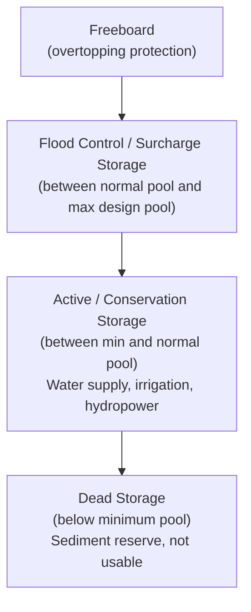
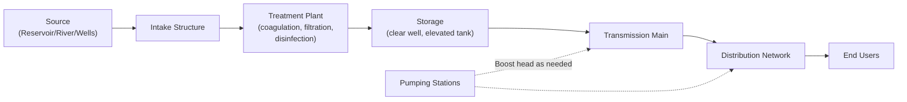

## Reservoir, Dam, and Water Supply System Basics

### Overview

Reservoirs impound water behind dams to store, regulate, and deliver flow for water supply, flood control, hydropower, and irrigation. Their design integrates hydrology (yield estimation, flood inflow), structural/geotechnical engineering (dam type and stability), and hydraulics (spillway/outlet works) into an operational system that must reliably balance supply against demand while managing flood risk.

### Dam Types

**Key Points**

- Dam type selection depends on site geology/foundation conditions, available construction materials, topography, height, and reservoir purpose
- Broadly categorized by construction material and structural mechanism resisting water pressure

**Structural Classification**

| Dam Type | Resisting Mechanism | Typical Foundation Requirement |
| --- | --- | --- |
| Gravity (concrete/masonry) | Self-weight resists overturning/sliding | Sound rock foundation |
| Arch | Transfers load to abutments via arch action | Narrow canyon, strong abutment rock |
| Buttress | Inclined face transfers load to buttresses | Moderate foundation strength |
| Embankment (earthfill) | Mass and internal friction; requires impervious core/zone | Wide range of foundations, including softer soils |
| Embankment (rockfill) | Mass of rock with impervious membrane or core | Rock or firm foundation |

**Gravity Dam Stability Checks**

Fundamental checks for gravity dam design against applied forces (water pressure, uplift, self-weight, seismic):

$$\text{Factor of Safety against Sliding} = \frac{\mu \sum F_V}{\sum F_H}$$

$$\text{Factor of Safety against Overturning} = \frac{\sum M_{resisting}}{\sum M_{overturning}}$$

where $\mu$ is the friction coefficient at the dam-foundation interface, $\sum F_V$ and $\sum F_H$ are total vertical and horizontal forces, and moments are taken about the toe of the dam. Additionally, the resultant force location must remain within the middle third of the base to avoid tensile stress at the heel (for gravity/masonry dams designed on a no-tension basis).

**Diagram: Gravity Dam Force Diagram (svg_diagram)**

<svg xmlns="http://www.w3.org/2000/svg" viewBox="0 0 600 340">
<rect x="0" y="0" width="600" height="340" fill="#ffffff" />
<text x="300" y="22" text-anchor="middle" font-size="15" font-weight="bold" fill="#1a1a1a">Gravity Dam Force Diagram (svg_diagram)</text>
<polygon points="150,60 190,60 320,280 150,280" fill="#9ca3af" />
<text x="200" y="270" font-size="11" fill="#1a1a1a">Dam cross-section</text>
<rect x="60" y="90" width="90" height="190" fill="#60a5fa" opacity="0.6" />
<text x="65" y="110" font-size="11" fill="#1a1a1a">Reservoir</text>
<line x1="150" y1="90" x2="190" y2="90" stroke="#1e40af" stroke-width="2" />
<polygon points="150,90 150,280 90,280" fill="#3b82f6" opacity="0.4" />
<line x1="90" y1="280" x2="150" y2="90" stroke="#1e40af" stroke-width="1" stroke-dasharray="2,2" />
<text x="60" y="180" font-size="10" fill="#1e40af" transform="rotate(-90 60 180)">Hydrostatic pressure (Fh)</text>
<line x1="150" y1="280" x2="320" y2="280" stroke="#dc2626" stroke-width="1" stroke-dasharray="3,2" />
<text x="330" y="285" font-size="10" fill="#dc2626">Uplift pressure</text>
<line x1="230" y1="160" x2="230" y2="230" stroke="#059669" stroke-width="3" marker-end="url(#a2)" />
<text x="240" y="195" font-size="11" fill="#059669">W (self-weight)</text>
<text x="60" y="320" font-size="10" fill="`#4b5563`">Stability requires resultant of W, Fh, and uplift to fall within the middle third of the base.</text>

</svg>

### Reservoir Storage Zones

**Key Points**

- Reservoir storage is divided into functional zones that serve different operational purposes
- Understanding these zones is essential for reservoir operation rules and flood control planning

| Zone | Purpose |
| --- | --- |
| Dead storage | Below minimum operating level; sediment accumulation buffer, not usable for supply |
| Active (useful/conservation) storage | Between minimum and normal operating levels; available for water supply, irrigation, hydropower |
| Flood control (surcharge) storage | Between normal pool and maximum design pool; temporarily stores flood inflow, released in controlled manner |
| Freeboard | Additional height above maximum design pool to prevent overtopping during extreme events |

**Diagram: Reservoir Storage Zones**

### Reservoir Yield Analysis

**Key Points**

- Yield analysis determines the reliable water supply a reservoir can deliver given inflow variability and storage capacity
- The mass curve (Rippl diagram) method is a classical graphical technique for estimating required storage for a target yield, or achievable yield for a given storage

**Mass Curve (Rippl) Method — Concept**

1. Plot cumulative inflow volume against time from historical streamflow records
2. Draw a demand line (cumulative demand) at the target draft rate
3. The maximum cumulative deviation of the demand line above the mass curve (during a drawdown period) indicates the required storage capacity to meet that demand through the critical (driest) period represented in the record

**Sequent Peak Algorithm (Numerical Alternative)**

An equivalent computational method (avoiding manual graphical construction):

$$K_t = K_{t-1} + D_t - Q_t \quad \text{(if positive; otherwise reset to 0)}$$

where $K_t$ is cumulative storage requirement, $D_t$ is demand in period $t$, and $Q_t$ is inflow in period $t$. Required storage capacity is the maximum $K_t$ value over the sequence (typically applied over two cycles of the historical record to capture critical periods spanning the record's start/end).

[Unverified: both methods rely on the assumption that historical inflow records adequately represent future hydrologic variability including drought severity; this assumption carries increasing uncertainty under non-stationary climate conditions]

### Spillway Capacity and Freeboard

**Key Points**

- Spillway must safely pass the design flood (often the Probable Maximum Flood, PMF, for large dams) without overtopping the dam
- Freeboard accounts for wave action, wind setup, and settlement, providing a safety margin above the maximum routed flood pool level

**Flood Routing Through Reservoir (Design Check)**

The design flood hydrograph is routed through the reservoir using the storage-indication (modified Puls) method to determine peak reservoir elevation and required spillway capacity, linking directly to reservoir routing principles covered in flood routing analysis.

### Water Supply System Components

**Key Points**

- A complete municipal water supply system integrates source, treatment, storage, and distribution subsystems
- Each component must be sized for both average demand and peak demand conditions, with redundancy for reliability

**System Components**

| Component | Function |
| --- | --- |
| Source (intake/wells) | Raw water withdrawal from reservoir, river, or aquifer |
| Treatment plant | Removes contaminants to meet potable water quality standards (coagulation, filtration, disinfection) |
| Transmission mains | Conveys treated water from plant to distribution system/storage |
| Storage (tanks, standpipes, elevated tanks) | Balances supply/demand fluctuations, provides fire flow reserve, maintains system pressure |
| Distribution network | Pipe network delivering water to individual users |
| Pumping stations | Provides head where gravity flow is insufficient |

**Diagram: Water Supply System Layout**

### Demand Estimation

**Key Points**

- Water demand varies by land use, population, and time (diurnal, seasonal patterns), requiring multiple design flow criteria
- Fire flow requirements often govern pipe sizing in residential/commercial areas rather than average domestic demand alone

**Design Flow Criteria**

| Demand Condition | Typical Basis |
| --- | --- |
| Average Daily Demand (ADD) | Base design parameter, per capita consumption × population |
| Maximum Daily Demand (MDD) | ADD × peaking factor (commonly ~1.5–2.0×) |
| Peak Hourly Demand (PHD) | ADD × peaking factor (commonly ~2.5–3.5×), governs distribution pipe sizing |
| Fire Flow Demand | Governed by fire code requirements (occupancy type, building size), often added to MDD for critical pipe sizing checks |

[Unverified: peaking factors and per-capita consumption rates vary significantly by region, climate, and community type; local water utility design standards or codes should govern actual design values]

### Reservoir Sedimentation

**Key Points**

- Sediment inflow progressively reduces reservoir active/dead storage capacity over the project life
- Dead storage is typically sized to accommodate anticipated sediment accumulation over the design life (commonly 50–100 years), though estimates carry significant uncertainty

**Trap Efficiency Concept**

The fraction of incoming sediment retained in the reservoir (trap efficiency) depends on reservoir capacity relative to average annual inflow (capacity-inflow ratio) — larger reservoirs relative to inflow trap a greater fraction of incoming sediment, commonly estimated using empirical curves such as Brune's method. [Unverified: sediment yield estimation itself requires watershed-specific erosion and sediment transport analysis, and trap efficiency curves are empirical correlations with regional applicability limits]

### Common Pitfalls

- Sizing dead storage without adequate sediment yield analysis, leading to premature loss of active storage capacity
- Confusing average daily demand with peak hourly demand when sizing distribution pipes, leading to undersized infrastructure during peak use or fire events
- Using an inadequate historical record length for mass curve/sequent peak yield analysis, understating drought risk
- Neglecting freeboard requirements for wave action and wind setup, considering only the routed flood pool elevation
- Applying gravity dam stability formulas to embankment dams, which require fundamentally different geotechnical slope stability and seepage analysis methods

**Next Steps**

- The Hydrologic Cycle (foundational review)
- Flood Frequency Analysis and Routing (foundational review)
- Groundwater Hydrology (foundational review)
- Water Treatment Process Fundamentals
- Distribution System Hydraulic Design
- Dam Safety and Seepage Control (Embankment Dams)
- Reservoir Sedimentation and Watershed Management