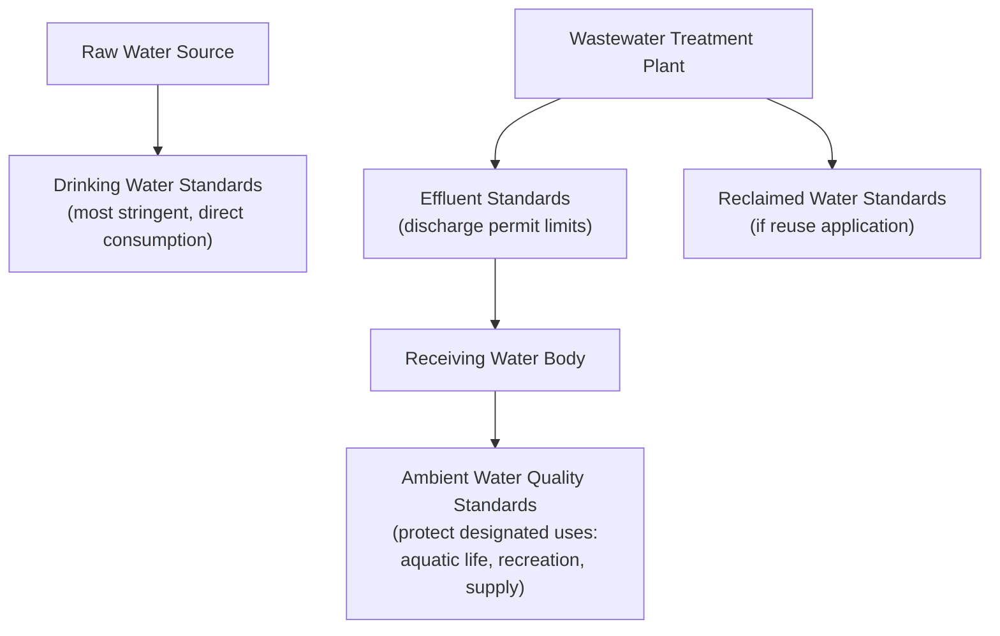

## Water Quality Parameters and Standards

### Overview

Water quality parameters are the physical, chemical, and biological characteristics used to assess whether water is suitable for its intended use — drinking, recreation, aquatic life support, or discharge to the environment. Standards translate these parameters into enforceable numeric or narrative limits, forming the regulatory basis for water and wastewater treatment design in environmental engineering.

### Physical Parameters

**Key Points**

- Physical parameters are generally the easiest and fastest to measure, often used for preliminary screening and process control
- Directly perceptible to users (taste, odor, appearance), making them important for public acceptance even when not health-critical

**Common Physical Parameters**

| Parameter | Description | Significance |
| --- | --- | --- |
| Turbidity | Cloudiness caused by suspended particles, measured in NTU (Nephelometric Turbidity Units) | Indicates filtration effectiveness; shields pathogens from disinfection |
| Total Suspended Solids (TSS) | Mass of particulate matter retained on a filter, mg/L | Affects treatment process loading, receiving water clarity |
| Total Dissolved Solids (TDS) | Mass of dissolved material remaining after filtration and evaporation, mg/L | Indicates overall mineral content, salinity |
| Color | True (dissolved) vs apparent (particulate) color, measured in Platinum-Cobalt (Pt-Co) units | Aesthetic concern; can indicate organic matter (e.g., natural organic matter, disinfection byproduct precursor) |
| Temperature | Affects reaction rates, dissolved oxygen saturation, organism metabolism | Influences treatment kinetics and receiving water ecology |
| Odor and Taste | Qualitative/threshold-based assessment | Aesthetic; can indicate contamination or biological activity |

### Chemical Parameters

**Key Points**

- Chemical parameters span a wide range from basic water chemistry indicators to specific regulated contaminants
- Some parameters (pH, alkalinity, hardness) primarily affect treatability and aesthetics; others (heavy metals, nitrates) have direct health significance

**pH and Alkalinity**

$$pH = -\log_{10}[H^+]$$

Alkalinity is the water's capacity to neutralize acids, primarily due to bicarbonate, carbonate, and hydroxide ions:

$$\text{Alkalinity (as } CaCO_3\text{)} = [HCO_3^-] + 2[CO_3^{2-}] + [OH^-] - [H^+]$$

expressed in equivalent concentration units, typically mg/L as $CaCO_3$.

**Hardness**

Caused primarily by dissolved calcium and magnesium ions:

$$\text{Hardness (as } CaCO_3\text{)} = 2.5[Ca^{2+}] + 4.1[Mg^{2+}]$$

(concentrations in mg/L; coefficients convert to $CaCO_3$-equivalent basis)

| Hardness Classification | mg/L as CaCO₃ |
| --- | --- |
| Soft | 0–60 |
| Moderately hard | 61–120 |
| Hard | 121–180 |
| Very hard | >180 |

**Dissolved Oxygen (DO)**

Critical indicator of a water body's capacity to support aquatic life; low DO indicates organic pollution or eutrophication stress. DO saturation concentration decreases with increasing temperature and decreasing atmospheric pressure (elevation).

**Nutrients**

Nitrogen (as ammonia $NH_3$/$NH_4^+$, nitrite $NO_2^-$, nitrate $NO_3^-$, organic nitrogen) and phosphorus (as orthophosphate, organic phosphate) are key nutrients; excess loading drives eutrophication in receiving waters.

**Regulated Chemical Contaminants (Examples)**

| Category | Examples | Concern |
| --- | --- | --- |
| Heavy metals | Lead, arsenic, mercury, cadmium, chromium | Toxicity, bioaccumulation, chronic health effects |
| Disinfection byproducts (DBPs) | Trihalomethanes (THMs), haloacetic acids (HAAs) | Formed from disinfectant reaction with organic matter; potential carcinogenicity |
| Synthetic organic compounds | Pesticides, industrial solvents, PFAS | Varied toxicological concerns, persistence |
| Inorganic ions | Nitrate, fluoride, sulfate, chloride | Health effects (e.g., nitrate and methemoglobinemia) or aesthetic/nuisance effects |

[Unverified: specific numeric standards for regulated chemical contaminants vary substantially by country/jurisdiction (e.g., WHO guidelines, US EPA National Primary Drinking Water Regulations, EU Drinking Water Directive, or national standards such as the Philippine National Standards for Drinking Water); designers must reference the specific applicable regulatory standard for the project jurisdiction]

### Biological/Microbiological Parameters

**Key Points**

- Direct pathogen testing is impractical for routine monitoring; indicator organisms are used as surrogates for the likely presence of fecal contamination and associated pathogens
- Biological oxygen demand quantifies the oxygen-consuming potential of biodegradable organic matter, central to wastewater treatment design

**Indicator Organisms**

| Indicator | Description |
| --- | --- |
| Total coliform | Broad group of bacteria; presence indicates possible contamination pathway, not necessarily fecal origin |
| Fecal coliform | Subset of total coliform associated with warm-blooded animal intestines; stronger indicator of fecal contamination |
| *E. coli* | Specific species within fecal coliform group; most direct standard indicator of recent fecal contamination in most modern regulatory frameworks |

**Biochemical Oxygen Demand (BOD)**

Measures the oxygen consumed by microorganisms decomposing organic matter over a specified incubation period (commonly 5 days, BOD₅):

$$BOD_t = BOD_L(1-e^{-kt})$$

where $BOD_L$ is the ultimate BOD (total oxygen demand as $t\to\infty$), $k$ is the deoxygenation rate constant, and $t$ is time.

**Chemical Oxygen Demand (COD)**

Measures total oxygen demand via strong chemical oxidation, including both biodegradable and non-biodegradable organic matter; typically higher than BOD for the same sample and obtainable faster (hours vs. days) — commonly used for process control given the same-day result.

**BOD vs COD Relationship**

$$\text{BOD}_5/\text{COD ratio}$$ gives a rough indication of biodegradability; a higher ratio suggests more readily biodegradable waste, useful for screening treatability. [Unverified: typical ratio ranges vary by wastewater source/characteristics and are not universally standardized]

### Water Quality Standards Framework

**Key Points**

- Standards differ by intended use: drinking water standards are generally the most stringent (direct human consumption); effluent/discharge standards protect receiving water quality; ambient water quality standards protect designated uses of the water body itself
- Standards are typically expressed as Maximum Contaminant Levels (MCLs) or similar enforceable numeric limits, sometimes paired with treatment technique requirements

**Standard Types**

| Standard Type | Purpose |
| --- | --- |
| Drinking water standards | Protect direct human consumption (e.g., WHO Guidelines, national potable water standards) |
| Effluent/discharge standards | Limit pollutant loading from point sources (treatment plants, industrial discharges) into receiving waters |
| Ambient (receiving water) standards | Protect designated beneficial uses of a water body (aquatic life, recreation, water supply source) |
| Wastewater reuse/reclamation standards | Govern water quality for reuse applications (irrigation, industrial, indirect potable reuse) |

**Diagram: Water Quality Standards Application Framework**

### Water Quality Index Concepts

**Key Points**

- Multiple parameters are sometimes aggregated into a single index for simplified communication of overall water quality status
- Index methodologies vary by region/agency; not a substitute for parameter-specific regulatory compliance assessment

A generalized Water Quality Index (WQI) approach assigns sub-index scores to individual parameters (e.g., DO, pH, turbidity, BOD, coliform) and combines them (commonly via weighted arithmetic or geometric aggregation) into a single composite score used for reporting and public communication. [Unverified: specific WQI formulas, parameter weightings, and sub-index scoring curves vary significantly between agencies/methodologies (e.g., NSF WQI, CCME WQI) and are not universally standardized]

### Sampling and Monitoring Considerations

**Key Points**

- Parameter selection for monitoring programs depends on the water use, known/suspected contaminant sources, and regulatory requirements
- Sample holding time, preservation method, and analytical method significantly affect result validity for many parameters

**General Practice Notes**

- DO and pH are typically measured in-situ or immediately upon sampling due to rapid change potential
- Microbiological samples require sterile collection technique and prompt analysis (typically within 24 hours) to avoid regrowth or die-off skewing results
- Composite sampling (time- or flow-weighted) is often used for wastewater characterization to capture representative daily variation, versus grab sampling for parameters that change rapidly or require immediate field measurement

### Common Pitfalls

- Using COD as a direct substitute for BOD in design calculations without accounting for the systematic difference between the two (COD typically exceeds BOD for the same sample)
- Applying total coliform results as a direct fecal contamination indicator, when fecal coliform or *E. coli* testing is the more appropriate specific indicator
- Neglecting temperature correction when interpreting dissolved oxygen or BOD test results, since both are temperature-dependent
- Assuming a single "water quality standard" applies universally, without distinguishing between drinking water, effluent, ambient, and reuse standard frameworks, which differ substantially in stringency and applicable parameters
- Treating water quality index scores as equivalent to regulatory compliance, when index methodologies are for communication purposes and typically do not replace parameter-specific standard verification

**Next Steps**

- The Hydrologic Cycle (foundational review)
- Water Treatment Process Fundamentals
- Wastewater Treatment Processes
- Environmental Sampling and Monitoring Design
- Eutrophication and Nutrient Management
- Drinking Water Regulatory Frameworks