## Water Treatment Processes

### Overview

Water treatment processes convert raw water (surface or groundwater) into water meeting potable or process-specific quality standards through a sequence of physical, chemical, and biological unit operations. Conventional treatment trains are designed around removing turbidity, pathogens, and dissolved contaminants while maintaining aesthetic and chemical stability in the finished water.

### Conventional Treatment Train Overview

**Key Points**

- Most conventional surface water treatment plants follow a standard sequence: coagulation, flocculation, sedimentation, filtration, disinfection
- Groundwater sources often require fewer steps (frequently disinfection alone, or targeted treatment for specific contaminants like iron/manganese) due to natural filtration through the aquifer
- Each unit process targets specific contaminant removal mechanisms; sequence and redundancy are critical to overall treatment reliability

**Diagram: Conventional Water Treatment Train**

```mermaid
flowchart LR
    RW["Raw Water Intake"] --> PS["Pre-screening<br/>(bar screens, grit removal)"]
    PS --> COAG["Coagulation<br/>(rapid mix, coagulant dosing)"]
    COAG --> FLOC["Flocculation<br/>(slow mix, floc growth)"]
    FLOC --> SED["Sedimentation<br/>(clarification, settling)"]
    SED --> FILT["Filtration<br/>(rapid sand/multimedia)"]
    FILT --> DIS["Disinfection<br/>(chlorination, UV, ozone)"]
    DIS --> CW["Clearwell / Storage"]
    CW --> DS["Distribution System"]
```

### Coagulation

**Key Points**

- Destabilizes colloidal particles (which naturally repel each other due to negative surface charge) so they can aggregate
- Coagulant dose, mixing intensity, and pH are the primary controllable design/operational variables

**Common Coagulants**

| Coagulant | Chemical Form | Notes |
| --- | --- | --- |
| Aluminum sulfate (alum) | $Al_2(SO_4)_3 \cdot 14H_2O$ | Most widely used; effective across moderate pH range |
| Ferric chloride | $FeCl_3$ | Effective over broader pH range than alum; can add color/corrosivity concerns |
| Polyaluminum chloride (PACl) | Pre-hydrolyzed aluminum polymer | Often more effective at lower doses, less pH-sensitive |

**Coagulation Reaction (Alum, simplified)**

$$Al_2(SO_4)_3 \cdot 14H_2O + 3Ca(HCO_3)_2 \rightarrow 2Al(OH)_3\downarrow + 3CaSO_4 + 14H_2O + 6CO_2$$

The insoluble aluminum hydroxide floc ($Al(OH)_3$) both neutralizes particle charge and physically enmeshes colloidal material (sweep flocculation), depending on dose and pH.

**Rapid Mix Design Parameter**

$$G = \sqrt{\frac{P}{\mu V}}$$

where $G$ is the velocity gradient ($s^{-1}$), $P$ is power input, $\mu$ is dynamic viscosity, and $V$ is mixing basin volume. Rapid mix typically targets high $G$ (700–1000 $s^{-1}$) over a short detention time (seconds) to achieve instantaneous, complete coagulant dispersion.

### Flocculation

**Key Points**

- Promotes gentle mixing to encourage destabilized particles to collide and grow into larger, settleable flocs
- Excessive mixing intensity breaks apart formed flocs (floc shear), so $G$ is deliberately much lower than in rapid mix

**Design Parameters**

$$Gt = \text{dimensionless flocculation parameter (typically } 10^4-10^5\text{)}$$

where $t$ is detention time. Typical flocculation basins use $G$ values of 20–70 $s^{-1}$ with detention times of 20–30 minutes, often tapered (decreasing $G$ through successive compartments) to grow larger, stronger flocs progressively without breakage.

### Sedimentation (Clarification)

**Key Points**

- Removes settleable flocs formed in flocculation via gravity settling before filtration, substantially reducing the solids loading on filters
- Governed by particle settling velocity relative to basin surface loading rate (overflow rate), not basin depth (for ideal discrete settling)

**Surface Overflow Rate (Design Basis)**

$$v_o = \frac{Q}{A_s}$$

where $v_o$ is surface overflow rate (design settling velocity), $Q$ is flow rate, and $A_s$ is basin surface area. Particles with settling velocity $\geq v_o$ are theoretically completely removed, independent of basin depth — the foundational principle of ideal sedimentation basin design (Hazen's theory).

**Typical Design Overflow Rates**

| Basin Type | Overflow Rate (m³/m²/day), approximate |
| --- | --- |
| Conventional rectangular/circular clarifier | 30–60 |
| High-rate (plate/tube settler) clarifier | 80–160+ |

[Unverified: actual design overflow rates depend on floc characteristics, water temperature, and specific basin hydraulics; values shown are illustrative ranges and should be verified against applicable design standards]

### Filtration

**Key Points**

- Removes remaining fine particulates and flocs that escaped sedimentation, providing critical protection against pathogen breakthrough (particularly for protozoan cysts/oocysts resistant to chlorine disinfection)
- Rapid sand/multimedia filtration is standard for conventional plants; requires periodic backwashing to remove accumulated solids

**Filtration Mechanisms**

| Mechanism | Description |
| --- | --- |
| Straining | Physical size exclusion at media surface/pores |
| Sedimentation (within filter) | Gravity settling onto media grain surfaces |
| Interception | Particle contacts media grain while following flow streamline |
| Adsorption | Physicochemical attachment to media surface |

**Filter Design Parameters**

Typical rapid filtration loading rate: 5–15 m/hr (conventional rapid sand), with dual/multimedia (anthracite over sand) filters commonly operating at the higher end of this range due to greater depth utilization for solids capture.

**Backwash Requirement**

$$v_{bw} > v_{settling of media particles}$$

Backwash rate must exceed the minimum fluidization velocity of the filter media to properly expand the bed and dislodge accumulated solids, typically expressed as a percentage bed expansion target (commonly 20–50%). [Unverified: specific backwash rates and bed expansion targets depend on media size/density/gradation and are manufacturer/design-specific]

### Disinfection

**Key Points**

- Final barrier against pathogenic microorganisms before distribution; inactivates bacteria, viruses, and (to varying degrees depending on method) protozoan cysts
- Chlorination remains the most widely used method globally due to cost-effectiveness and the residual protection it provides through the distribution system

**Common Disinfection Methods**

| Method | Mechanism | Notes |
| --- | --- | --- |
| Chlorination (free chlorine, chloramines) | Oxidative damage to microbial cell structures | Provides residual protection in distribution; can form DBPs (THMs, HAAs) with organic matter |
| Ozonation | Strong oxidant, highly effective including against protozoa | No lasting residual; requires downstream chlorination/chloramination for residual protection |
| UV disinfection | Damages microbial DNA/RNA, preventing reproduction | Highly effective against Cryptosporidium/Giardia; no residual, no DBP formation |
| Chloramines | Combined chlorine (chlorine + ammonia) | Longer-lasting residual, lower DBP formation, weaker primary disinfectant than free chlorine |

**CT Concept (Disinfection Effectiveness)**

$$CT = C \times t$$

where $C$ is disinfectant residual concentration and $t$ is contact time; regulatory frameworks commonly specify required CT values (or CT tables) for a given disinfectant, target pathogen, temperature, and pH to achieve a specified log-removal/inactivation credit.

**Chick-Watson Model (Disinfection Kinetics)**

$$\ln\left(\frac{N}{N_0}\right) = -k \cdot C^n \cdot t$$

where $N/N_0$ is the surviving fraction of organisms, $k$ is a disinfection rate constant, $C$ is disinfectant concentration, $n$ is the coefficient of dilution (empirical), and $t$ is contact time.

### Advanced/Supplemental Treatment Processes

**Key Points**

- Applied when conventional treatment alone cannot address specific contaminants or when source water quality is degraded
- Selection depends on the specific contaminant(s) of concern identified through water quality characterization

**Common Advanced Processes**

| Process | Target/Application |
| --- | --- |
| Activated carbon (GAC/PAC) adsorption | Taste/odor compounds, synthetic organic chemicals, some DBP precursors |
| Membrane filtration (micro/ultra/nanofiltration, reverse osmosis) | Fine particulates, pathogens, dissolved salts (RO), varying by membrane pore size |
| Ion exchange | Hardness removal (softening), specific ion removal (nitrate, arsenic) |
| Aeration | Volatile organic compound stripping, iron/manganese oxidation, taste/odor control |
| Advanced oxidation processes (AOP) | Recalcitrant organic contaminant destruction (e.g., UV/ozone/peroxide combinations) |

### Sludge/Residuals Management

**Key Points**

- Sedimentation and filter backwash generate residual solids (sludge) requiring proper handling and disposal
- Residuals management is an often-underestimated component of overall treatment plant design and operating cost

Typical handling train: sludge thickening → dewatering (mechanical or drying beds) → disposal (landfill, land application, or beneficial reuse, subject to regulatory characterization of the residuals).

### Design Example — Rapid Mix Basin Sizing

A plant treats $Q = 0.5\,m^3/s$ with a target rapid mix detention time $t = 30\,s$:

$$V = Qt = 0.5 \times 30 = 15\,m^3$$

If mixing power input is $P = 3.5\,kW$ and water viscosity $\mu = 1.14\times10^{-3}\,Pa\cdot s$ (at approximately 15°C):

$$G = \sqrt{\frac{P}{\mu V}} = \sqrt{\frac{3500}{1.14\times10^{-3}\times15}} = \sqrt{\frac{3500}{0.0171}} = \sqrt{204{,}678} \approx 452\,s^{-1}$$

This is somewhat below the typical 700–1000 $s^{-1}$ target range, suggesting either increased power input or reduced basin volume would be needed to reach standard rapid-mix intensity for this application. [Inference: actual required G values are process/coagulant-specific; this example illustrates the calculation method rather than a universally applicable target]

### Common Pitfalls

- Undersizing flocculation detention time or using excessive mixing intensity, breaking apart flocs before they reach settleable size
- Relying on chlorination alone against Cryptosporidium, which is highly chlorine-resistant — filtration or UV/ozone is required for reliable inactivation/removal
- Neglecting DBP formation potential when selecting chlorination dose/contact time, particularly with source waters high in natural organic matter
- Designing sedimentation basins based on detention time alone rather than surface overflow rate, missing the actual governing removal mechanism (Hazen's ideal settling theory)
- Overlooking residuals (sludge) management requirements and costs during initial treatment process selection

**Next Steps**

- Water Quality Parameters and Standards (foundational review)
- Wastewater Treatment Processes
- Membrane Filtration and Advanced Treatment
- Disinfection Byproduct Formation and Control
- Distribution System Hydraulic Design
- Sludge/Residuals Management and Disposal