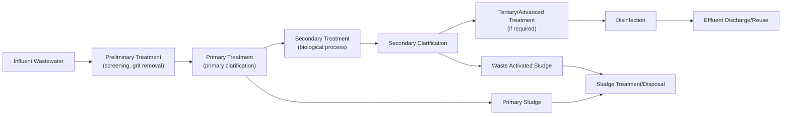

## Wastewater Collection and Treatment


### Overview

Wastewater collection and treatment encompasses the sewer infrastructure that conveys domestic, commercial, and industrial wastewater away from its source, and the treatment processes that remove pollutants before discharge to receiving waters or reuse. This chain protects public health and environmental water quality by controlling pathogens, organic loading, nutrients, and solids prior to release.

### Wastewater Collection Systems

**Key Points**

- Collection systems convey wastewater via gravity sewers (primary approach) supplemented by lift/pump stations and force mains where gravity flow is impractical
- Sewer systems are classified as sanitary (wastewater only), storm (stormwater only), or combined (both), with combined systems presenting distinct overflow management challenges

**System Types**

| System Type | Conveys | Key Design Consideration |
| --- | --- | --- |
| Sanitary sewer | Domestic/industrial wastewater only | Sized for wastewater flow plus infiltration/inflow allowance |
| Storm sewer | Stormwater runoff only | Sized per drainage design storm (see runoff estimation methods) |
| Combined sewer | Both wastewater and stormwater | Requires overflow structures (CSOs) to prevent treatment plant hydraulic overload during storms |

**Sanitary Sewer Design Flow**

$$Q_{design} = Q_{avg} \times PF + I/I$$

where $Q_{avg}$ is average dry-weather wastewater flow (based on population and per-capita generation rate), $PF$ is a peaking factor (accounting for diurnal variation), and $I/I$ is infiltration/inflow allowance (extraneous groundwater and stormwater entering the sewer through defects, connections, or manholes).

**Peaking Factor (Harmon Formula, Common Empirical Approach)**

$$PF = 1 + \frac{14}{4+\sqrt{P}}$$

where $P$ is the tributary population in thousands. [Unverified: multiple peaking factor formulas exist (Harmon, Babbitt, and others); selection and applicable population range should follow the governing local design standard]

**Sewer Hydraulic Design**

Gravity sewers are typically designed as open channel flow using Manning's equation, sized to maintain minimum self-cleansing velocity (commonly ≥0.6 m/s at design flow) to prevent solids deposition, while limiting maximum velocity to control pipe erosion and turbulence-induced odor/corrosion (commonly ≤3 m/s):

$$V = \frac{1}{n}R^{2/3}S^{1/2}$$

### Wastewater Characteristics

**Key Points**

- Understanding raw wastewater characteristics is essential for treatment process sizing, informed by the water quality parameters covered previously (BOD, TSS, nutrients, pathogens)
- Typical (domestic) wastewater strength provides a starting design basis, though actual values vary significantly by service population and industrial contribution

**Typical Domestic Wastewater Characteristics**

| Parameter | Typical Range (mg/L) |
| --- | --- |
| BOD₅ | 110–350 |
| COD | 250–800 |
| TSS | 120–400 |
| Total Nitrogen | 20–70 |
| Total Phosphorus | 4–12 |

[Unverified: these ranges represent commonly cited textbook values for domestic wastewater (e.g., Metcalf & Eddy classifications of weak/medium/strong); actual site-specific characterization via sampling is standard practice for design]

### Treatment Train Overview

**Key Points**

- Wastewater treatment is organized into preliminary, primary, secondary, and (where required) tertiary/advanced stages, with increasing levels of treatment corresponding to increasing removal of pollutants
- Treatment level required depends on discharge/reuse standards and receiving water sensitivity

**Diagram: Wastewater Treatment Train**



### Preliminary Treatment

**Key Points**

- Removes large solids, grit, and debris that could damage or clog downstream equipment
- Protective/mechanical function rather than significant pollutant removal

**Unit Processes**

| Process | Function |
| --- | --- |
| Bar screens (coarse/fine) | Removes large debris (rags, plastics, wood) |
| Grit chambers | Removes sand, gravel, and heavy inorganic particles that would abrade pumps/equipment |
| Flow equalization (optional) | Dampens flow/load variability entering downstream processes |

### Primary Treatment

**Key Points**

- Physical removal of settleable and floatable solids via gravity sedimentation, prior to biological treatment
- Typically removes a substantial portion of TSS and a smaller fraction of BOD (since much BOD is dissolved/colloidal, not removed by settling alone)

**Typical Primary Clarifier Removal Efficiency**

| Parameter | Typical Removal |
| --- | --- |
| TSS | 50–70% |
| BOD₅ | 25–40% |

[Unverified: removal efficiencies depend on wastewater characteristics, clarifier design/detention time, and are illustrative ranges rather than guaranteed performance values]

### Secondary (Biological) Treatment

**Key Points**

- Removes dissolved and colloidal biodegradable organic matter via microbial metabolism, converting it to biomass, CO₂, and water
- The core treatment step responsible for the majority of BOD removal in conventional treatment

**Common Secondary Treatment Processes**

| Process | Mechanism | Notes |
| --- | --- | --- |
| Activated Sludge | Suspended-growth aerobic biomass in an aeration basin, followed by clarification and biomass recycle (RAS) | Most widely used; many process variants (conventional, extended aeration, SBR, MBR) |
| Trickling Filter | Attached-growth (biofilm) process; wastewater trickles over fixed media | Lower energy than activated sludge; less flexible operational control |
| Rotating Biological Contactor (RBC) | Attached-growth biofilm on rotating discs partially submerged in wastewater | Compact footprint, moderate energy use |
| Lagoons/Stabilization Ponds | Extended natural biological treatment in large earthen basins | Low energy/O&M, requires substantial land area, common in smaller communities |

**Activated Sludge — Key Design Parameters**

$$F/M = \frac{Q \cdot S_0}{V \cdot X}$$

where $F/M$ is the food-to-microorganism ratio (kg BOD/kg MLVSS·day), $Q$ is flow rate, $S_0$ is influent BOD concentration, $V$ is aeration basin volume, and $X$ is mixed liquor volatile suspended solids (MLVSS) concentration.

$$SRT = \theta_c = \frac{V \cdot X}{Q_w \cdot X_w}$$

where $SRT$ (solids retention time, or mean cell residence time) is the average time biomass remains in the system, $Q_w$ is waste sludge flow rate, and $X_w$ is waste sludge solids concentration. SRT is a primary control parameter governing effluent quality, sludge production, and nitrification capability.

**Typical Activated Sludge Design Ranges**

| Parameter | Conventional | Extended Aeration |
| --- | --- | --- |
| F/M (kg BOD/kg MLVSS·day) | 0.2–0.5 | 0.05–0.15 |
| SRT (days) | 4–15 | 20–30 |
| MLSS (mg/L) | 1500–3000 | 3000–5000 |

[Unverified: design ranges vary by specific process configuration, climate, and effluent quality objectives; values shown are commonly cited illustrative ranges]

**Secondary Clarifier**

Separates biomass (activated sludge) from treated effluent via gravity settling; a portion is returned to the aeration basin (Return Activated Sludge, RAS) to maintain biomass concentration, with the remainder wasted (Waste Activated Sludge, WAS) to control SRT.

### Nutrient Removal (Biological)

**Key Points**

- Conventional secondary treatment removes limited nitrogen/phosphorus; enhanced biological nutrient removal (BNR) configurations are required where nutrient discharge limits apply
- Nitrogen removal requires sequential aerobic (nitrification) and anoxic (denitrification) conditions; phosphorus removal can be biological or chemical

**Nitrification (Aerobic)**

$$NH_4^+ + 1.5O_2 \xrightarrow{\textit{Nitrosomonas}} NO_2^- + H_2O + 2H^+$$


$$NO_2^- + 0.5O_2 \xrightarrow{\textit{Nitrobacter}} NO_3^-$$

**Denitrification (Anoxic)**

$$NO_3^- \rightarrow NO_2^- \rightarrow NO \rightarrow N_2O \rightarrow N_2\uparrow$$

(using organic carbon as electron donor under anoxic, oxygen-limited conditions, converting nitrate to nitrogen gas released to atmosphere)

**Biological Phosphorus Removal**

Relies on cycling biomass between anaerobic (phosphorus release, volatile fatty acid uptake) and aerobic (luxury phosphorus uptake) zones, favoring phosphorus-accumulating organisms (PAOs) that store excess phosphorus intracellularly, subsequently removed with wasted sludge.

**Diagram: BNR Process Zones**

```mermaid
flowchart LR
    INF2["Influent"] --> AN["Anaerobic Zone<br/>(P release)"]
    AN --> ANX["Anoxic Zone<br/>(denitrification)"]
    ANX --> AER["Aerobic Zone<br/>(nitrification,<br/>luxury P uptake)"]
    AER --> CL["Clarifier"]
    CL --> EFF2["Effluent"]
    CL -.->|RAS| AN
    AER -.->|Internal recycle<br/>(NO3-rich)| ANX
```

### Tertiary/Advanced Treatment

**Key Points**

- Applied when secondary effluent does not meet discharge or reuse quality requirements, targeting residual solids, nutrients, or specific contaminants
- Increasingly required as discharge standards tighten and water reuse applications expand

**Common Tertiary Processes**

| Process | Target |
| --- | --- |
| Filtration (sand, cloth, membrane) | Residual TSS polishing |
| Chemical phosphorus removal (alum, ferric salts) | Enhanced/backup phosphorus removal |
| Membrane bioreactor (MBR) | Combines biological treatment with membrane solids separation, producing high-quality effluent |
| Activated carbon | Trace organics, taste/odor |
| UV/chlorination | Final disinfection before discharge/reuse |

### Sludge (Biosolids) Treatment and Disposal

**Key Points**

- Treatment generates primary and secondary (waste activated) sludge requiring stabilization before final disposal or beneficial reuse
- Digestion serves dual purposes: pathogen/odor reduction and volume reduction (via volatile solids destruction)

**Sludge Treatment Train**

$$\text{Thickening} \rightarrow \text{Stabilization (digestion)} \rightarrow \text{Dewatering} \rightarrow \text{Disposal/Reuse}$$

**Anaerobic Digestion**

Converts volatile solids to biogas (methane + CO₂) under anaerobic conditions in the absence of oxygen, achieving both stabilization and potential energy recovery via biogas utilization:

$$\text{Organic matter} \xrightarrow{\text{anaerobic bacteria}} CH_4 + CO_2 + \text{stabilized solids}$$

**Disposal/Reuse Options**

Land application (as fertilizer/soil amendment, subject to pathogen/pollutant regulatory classification), landfill disposal, or incineration, selected based on biosolids quality classification, local regulations, and economics.

### Design Example — Aeration Basin Sizing

A plant treats $Q = 4000\,m^3/day$ with influent BOD $S_0 = 250\,mg/L$, targeting $F/M = 0.3\,kg\,BOD/kg\,MLVSS\cdot day$ with $MLVSS = 2500\,mg/L$:

$$V = \frac{Q \cdot S_0}{F/M \cdot X} = \frac{4000 \times 250}{0.3 \times 2500} = \frac{1{,}000{,}000}{750} = 1333\,m^3$$

This gives the required aeration basin volume for the target loading rate; actual design would additionally verify oxygen transfer requirements and hydraulic retention time.

### Common Pitfalls

- Designing sanitary sewers without adequate infiltration/inflow (I/I) allowance, leading to hydraulic overload during wet weather
- Confusing SRT (solids retention time) with hydraulic retention time (HRT) — SRT governs biological process performance (nitrification, sludge age) and is intentionally decoupled from HRT via sludge recycle/wasting
- Applying conventional activated sludge F/M and SRT ranges directly to BNR processes, which require different (typically longer) SRT to support nitrification and denitrification
- Neglecting combined sewer overflow (CSO) management in combined sewer systems, resulting in untreated discharge during storm events
- Underestimating sludge handling costs and complexity relative to the liquid treatment train during initial process selection

**Next Steps**

- Water Quality Parameters and Standards (foundational review)
- Water Treatment Processes (foundational review)
- Sewer System Hydraulic Design
- Biological Nutrient Removal Process Design
- Biosolids Management and Beneficial Reuse
- Combined Sewer Overflow Control Strategies