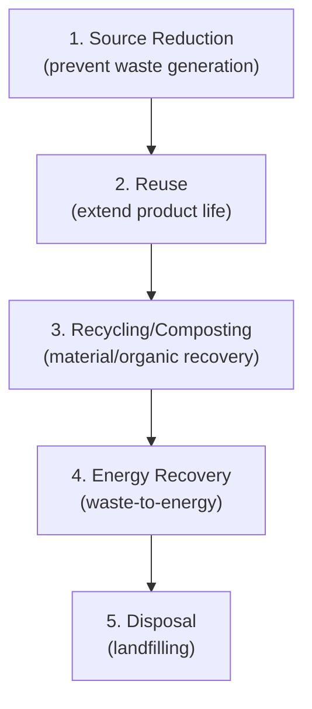

## Solid Waste Management

### Overview

Solid waste management encompasses the collection, transport, processing, and disposal of solid wastes generated by residential, commercial, industrial, and institutional sources. Civil and environmental engineers design the infrastructure and systems — collection routes, transfer stations, material recovery facilities, and landfills — that manage this waste stream while minimizing environmental and public health impacts.

### Integrated Solid Waste Management Hierarchy

**Key Points**

- Modern practice follows a hierarchy that prioritizes waste prevention and resource recovery over disposal
- The hierarchy reflects environmental preference, not necessarily cost or ease of implementation, and actual system design balances hierarchy goals against local economic and logistical constraints

**Waste Management Hierarchy (Most to Least Preferred)**

### Waste Characterization

**Key Points**

- Waste composition and generation rate are the fundamental data inputs for sizing collection, processing, and disposal systems
- Composition varies significantly by region, income level, season, and source type (residential vs. commercial vs. industrial)

**Typical Municipal Solid Waste (MSW) Composition Categories**

| Component | Typical Range (% by weight) |
| --- | --- |
| Organic/food waste | 30–50 |
| Paper/cardboard | 10–25 |
| Plastics | 8–15 |
| Glass | 2–7 |
| Metals | 2–8 |
| Yard/garden waste | 5–20 |
| Other/residuals | 5–15 |

[Unverified: composition varies substantially by region, urbanization level, and local consumption patterns; site-specific waste characterization studies are standard practice for design rather than reliance on generalized global ranges]

**Physical Properties Relevant to Design**

| Property | Significance |
| --- | --- |
| Density (as-discarded, compacted) | Determines container/vehicle/landfill volume requirements |
| Moisture content | Affects composting, combustion, and leachate generation |
| Volatile solids content | Relevant to biodegradability, composting, and landfill gas potential |
| Heating value | Relevant to waste-to-energy feasibility |

**Per Capita Generation Rate**

$$G = \frac{W_{total}}{P \times t}$$

where $G$ is generation rate (mass/capita/day), $W_{total}$ is total waste generated over period $t$, and $P$ is population — the fundamental parameter for sizing collection fleets, transfer stations, and landfill capacity, typically established through local waste characterization studies or generation surveys.

### Collection Systems

**Key Points**

- Collection is typically the largest single cost component of a solid waste management system
- System design (container type, collection frequency, route design, vehicle type) significantly affects both cost efficiency and service quality

**Collection System Types**

| System | Description |
| --- | --- |
| Hauled container system (HCS) | Containers are transported to disposal/processing site, emptied, and returned; suited to high-volume generation points |
| Stationary container system (SCS) | Collection vehicle empties containers on-route into onboard storage, returning to a central point when full; typical for residential curbside collection |

**Route Design Objective**

Minimize total collection cost (vehicle time, fuel, labor) subject to service constraints (collection frequency, time windows, vehicle capacity), commonly informed by network routing optimization principles (e.g., minimizing deadheading, balancing route loads).

**Collection Vehicle Capacity Relationship**

$$N_{trips} = \frac{W}{V \times \rho \times CF}$$

where $N_{trips}$ is required trips, $W$ is waste mass to be collected, $V$ is vehicle volumetric capacity, $\rho$ is as-collected waste density, and $CF$ is the vehicle's compaction factor (volume reduction ratio achieved by onboard compaction, if applicable).

### Transfer Stations

**Key Points**

- Used when the final disposal/processing facility is too distant from the collection area for direct-haul collection vehicles to be economical
- Consolidates waste from smaller collection vehicles into larger transfer vehicles (tractor-trailers, rail cars) for long-haul transport

**Economic Basis for Transfer Station Use**

A transfer station becomes economical when the haul-distance savings from using larger, more efficient long-haul vehicles exceed the fixed and operating costs of the transfer facility itself — generally favorable beyond a threshold one-way haul distance, though the specific breakeven distance is project-specific. [Unverified: exact breakeven distances depend on labor rates, fuel costs, vehicle capacities, and facility costs, which vary by region and over time]

### Material Recovery and Recycling

**Key Points**

- Material Recovery Facilities (MRFs) separate recyclable materials from the waste stream, either from source-separated recyclables (clean MRF) or mixed waste (dirty MRF)
- Separation technology combines manual sorting with increasingly automated processes (magnetic separation, eddy current separation, optical sorting, screening)

**Common MRF Separation Technologies**

| Technology | Target Material |
| --- | --- |
| Magnetic separator | Ferrous metals |
| Eddy current separator | Non-ferrous metals (aluminum) |
| Optical sorter (NIR) | Plastic resin type sorting, paper grade sorting |
| Trommel/disc screens | Size-based separation |
| Manual picking | Contaminant removal, quality control |

### Composting

**Key Points**

- Aerobic biological decomposition of organic waste into a stable, humus-like product (compost), diverting biodegradable material from landfills
- Process control (moisture, aeration, carbon-to-nitrogen ratio, temperature) governs decomposition rate and pathogen destruction

**Key Process Parameters**

| Parameter | Typical Target Range |
| --- | --- |
| C:N ratio | 25:1 to 30:1 (optimal for microbial activity) |
| Moisture content | 50–60% |
| Temperature (thermophilic phase) | 55–65°C (required for pathogen destruction) |
| Oxygen concentration | >5% (aerobic conditions) |

[Unverified: optimal ranges vary somewhat by feedstock and composting method (windrow, aerated static pile, in-vessel); values shown are commonly cited illustrative targets]

**Common Composting Methods**

| Method | Description |
| --- | --- |
| Windrow composting | Elongated piles, periodically turned for aeration |
| Aerated static pile | Forced air supplied via perforated piping, no turning |
| In-vessel composting | Enclosed reactor system, most process control, highest cost |

### Landfilling

**Key Points**

- Sanitary landfills are engineered facilities designed to isolate waste from the surrounding environment, controlling leachate and landfill gas generation and migration
- Modern landfill design integrates geotechnical, hydrogeological, and environmental engineering to prevent groundwater and air quality impacts

**Key Landfill Design Components**

| Component | Function |
| --- | --- |
| Liner system | Composite liner (geomembrane + compacted clay/geosynthetic clay liner) preventing leachate migration to groundwater |
| Leachate collection system | Perforated piping network draining leachate to collection/treatment |
| Landfill gas collection system | Wells and piping to capture gas (methane, CO₂) for flaring or energy recovery |
| Final cover system | Multi-layer cap (barrier, drainage, vegetative layers) limiting infiltration after closure |
| Groundwater monitoring wells | Detect potential liner failure/contaminant migration |

**Diagram: Sanitary Landfill Cross-Section (svg_diagram)**

<svg xmlns="http://www.w3.org/2000/svg" viewBox="0 0 700 340">
<rect x="0" y="0" width="700" height="340" fill="#ffffff" />
<text x="350" y="22" text-anchor="middle" font-size="15" font-weight="bold" fill="#1a1a1a">Sanitary Landfill Cross-Section (svg_diagram)</text>
<polygon points="50,300 650,300 550,120 150,120" fill="#a16207" opacity="0.5" />
<text x="300" y="220" font-size="12" fill="#1a1a1a">Compacted MSW (daily cover between lifts)</text>
<path d="M 150 120 L 550 120 L 500 100 L 200 100 Z" fill="#84cc16" opacity="0.6" />
<text x="280" y="95" font-size="11" fill="#1a1a1a">Final cover (vegetative + drainage + barrier layer)</text>
<rect x="30" y="295" width="640" height="10" fill="#374151" />
<text x="10" y="330" font-size="10" fill="#1a1a1a">Composite liner (geomembrane + clay)</text>
<line x1="70" y1="300" x2="70" y2="150" stroke="#059669" stroke-width="4" stroke-dasharray="3,2" />
<text x="10" y="150" font-size="9" fill="#059669">LFG well</text>
<line x1="630" y1="300" x2="630" y2="150" stroke="#059669" stroke-width="4" stroke-dasharray="3,2" />
<path d="M 100 305 L 140 305 L 160 320" stroke="#dc2626" stroke-width="3" fill="none" />
<text x="100" y="335" font-size="9" fill="#dc2626">Leachate collection to treatment</text>
<rect x="0" y="305" width="700" height="35" fill="#78716c" opacity="0.3" />
<text x="600" y="325" font-size="10" fill="#1a1a1a">Native soil/subgrade</text>
</svg>

### Landfill Gas and Leachate

**Key Points**

- Anaerobic decomposition of organic waste within the landfill generates landfill gas (LFG), primarily methane and carbon dioxide, and leachate (liquid that has percolated through waste, carrying dissolved/suspended contaminants)
- Both require active management for environmental protection and, in the case of LFG, offer potential energy recovery value

**Landfill Gas Generation Phases**

1. **Aerobic phase** — initial short-duration oxygen-consuming decomposition immediately after placement
2. **Anaerobic acid phase** — transition to anaerobic conditions, volatile fatty acid production, $CO_2$-dominated gas
3. **Methanogenic phase** — methane-producing bacteria dominate, gas becomes predominantly $CH_4$ and $CO_2$ (commonly approaching roughly 50-60% methane at peak, though composition varies)
4. **Maturation phase** — declining gas generation as readily degradable material is depleted

**Leachate Characteristics**

Leachate strength (BOD, COD, heavy metals, ammonia) is typically highest in young landfills and decreases over time as the waste stabilizes; requires collection and treatment (on-site treatment, discharge to municipal WWTP, or a combination) before release to the environment. [Unverified: leachate characteristics vary substantially by waste composition, age, climate/precipitation, and landfill operational practices]

### Landfill Capacity/Airspace Design

**Key Points**

- Landfill design must estimate required airspace (volume) based on projected waste generation, density after compaction, and required daily/intermediate cover material volume

**Simplified Airspace Estimate**

$$V_{required} = \frac{W_{annual} \times L}{\rho_{compacted}} \times (1+CF_{cover})$$

where $W_{annual}$ is annual waste mass, $L$ is design life (years), $\rho_{compacted}$ is in-place compacted density, and $CF_{cover}$ is an additional volume factor for cover material (commonly an added percentage to account for daily/intermediate soil cover volume).

### Waste-to-Energy (Incineration)

**Key Points**

- Combusts waste to reduce volume substantially while recovering energy as heat/electricity, applicable where suitable waste heating value and regulatory/air quality permitting support the technology
- Requires air pollution control systems (scrubbers, baghouses, selective catalytic reduction) to manage combustion emissions

**General Combustion Relationship**

$$\text{Heat Release} \propto \text{Waste Mass} \times \text{Heating Value} \times \text{Combustion Efficiency}$$

Ash residue (bottom ash and fly ash) requires separate management, with fly ash often classified as requiring more stringent handling due to concentrated heavy metal/contaminant content relative to bottom ash. [Unverified: ash classification and handling requirements are jurisdiction-specific regulatory determinations]

### Common Pitfalls

- Designing collection routes without accounting for seasonal generation variability (e.g., increased yard waste, holiday waste spikes)
- Underestimating leachate generation by neglecting precipitation infiltration through active (uncapped) landfill areas
- Assuming uniform waste composition across a service area without site-specific characterization, leading to inaccurate MRF or composting facility sizing
- Neglecting landfill gas migration control, risking subsurface methane accumulation in nearby structures
- Treating the waste hierarchy as a strict operational mandate rather than a guiding framework — actual diversion rates depend heavily on local market conditions, infrastructure, and policy support for recycling/composting end markets

**Next Steps**

- Water Quality Parameters and Standards (foundational review)
- Wastewater Collection and Treatment (foundational review)
- Landfill Design and Environmental Monitoring
- Composting Facility Design
- Air Quality and Emissions Control
- Hazardous Waste Management Fundamentals