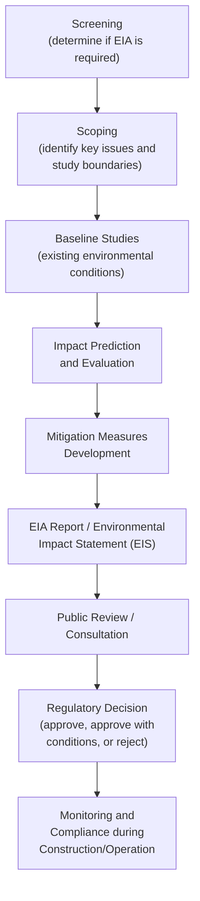
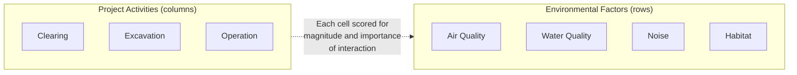

## Environmental Impact Assessment

### Overview

Environmental Impact Assessment (EIA) is the systematic process of identifying, predicting, and evaluating the likely environmental consequences of a proposed project or development before key decisions are made. It serves as a regulatory and planning tool integrating technical environmental analysis (water, air, ecology, noise, socioeconomic factors) into civil engineering project development, informing design modifications, mitigation measures, and approval decisions.

### Purpose and Regulatory Context

**Key Points**

- EIA is a procedural requirement in most jurisdictions for projects above defined thresholds of scale or environmental sensitivity
- The process is intended to support informed decision-making, not to guarantee project approval or rejection
- Requirements, thresholds, and procedural steps are established by national/local environmental law and vary significantly by jurisdiction

**Typical Triggers for EIA Requirement**

| Trigger Category | Example |
| --- | --- |
| Project scale threshold | Infrastructure exceeding defined capacity/size (e.g., dam height, road length, treatment plant capacity) |
| Environmentally sensitive location | Protected areas, critical habitats, coastal zones, watersheds |
| Potentially significant impact type | Projects involving hazardous materials, significant land use change, or population displacement |

[Unverified: specific EIA legal frameworks, thresholds, and required procedures vary by country — e.g., the US National Environmental Policy Act (NEPA), the EU EIA Directive, or the Philippine Environmental Impact Statement (EIS) System under the Philippine Environmental Impact Statement System (PD 1586); project teams must reference the applicable local regulatory framework]

### General EIA Process Stages

**Key Points**

- Most EIA frameworks follow a broadly similar sequence of stages, though terminology and specific procedural requirements differ by jurisdiction
- The process is intended to be iterative, with findings feeding back into project design refinement

**Diagram: General EIA Process Flow**

### Screening

**Key Points**

- Determines whether a proposed project requires a full EIA, a reduced-scope assessment, or is exempt
- Based on project type, scale, and location relative to regulatory thresholds and sensitive receptors

Screening outcomes commonly fall into categories such as: full EIA required, limited/initial environmental examination sufficient, or categorical exclusion (no further assessment required), depending on the specific regulatory framework's classification system.

### Scoping

**Key Points**

- Identifies which environmental factors and potential impacts warrant detailed study, focusing assessment resources on the most significant issues
- Typically involves consultation with regulatory agencies, technical experts, and potentially the public to identify concerns

**Common Scoping Outputs**

- Terms of Reference (ToR) or scoping document defining study boundaries, methodology, and required technical studies
- Identification of Valued Environmental Components (VECs) — the specific environmental, social, or cultural resources warranting detailed assessment
- Definition of the project's spatial and temporal boundaries for impact assessment (study area, construction and operational phases)

### Baseline Studies

**Key Points**

- Establishes existing environmental conditions before project implementation, providing the reference point against which predicted impacts are measured
- Typically spans multiple environmental disciplines, each requiring discipline-specific field data collection and analysis

**Common Baseline Study Components**

| Component | Typical Content |
| --- | --- |
| Physical environment | Topography, geology, soils, hydrology, air quality, noise levels |
| Biological environment | Flora, fauna, aquatic ecology, protected/endangered species, habitats |
| Socioeconomic environment | Population, land use, economic activities, infrastructure, cultural/historical resources |
| Water quality | Surface and groundwater quality parameters (see water quality parameters and standards) |

### Impact Prediction and Evaluation

**Key Points**

- Predicts the nature, magnitude, extent, duration, and significance of potential environmental changes resulting from the project
- Uses a combination of quantitative modeling (where established methods exist) and qualitative/expert judgment assessment

**Impact Characterization Dimensions**

| Dimension | Description |
| --- | --- |
| Nature | Beneficial or adverse |
| Magnitude | Size/intensity of the change |
| Extent | Geographic area affected (local, regional) |
| Duration | Temporary (construction-phase) vs. permanent (operational) |
| Reversibility | Whether the impact can be reversed after project cessation |
| Significance | Overall importance, often determined by combining magnitude with the sensitivity/value of the affected receptor |

**Common Impact Prediction Tools**

| Tool/Method | Application |
| --- | --- |
| Checklist | Systematic listing of potential impact categories for completeness |
| Matrix (e.g., Leopold Matrix) | Cross-references project activities against environmental factors, often with magnitude/importance scoring |
| Network/systems diagram | Traces cause-effect chains through interconnected environmental systems |
| Quantitative modeling | Discipline-specific models (e.g., Gaussian plume for air dispersion, hydraulic/hydrologic models for water impacts, noise propagation models) |
| Geographic Information Systems (GIS) overlay | Spatial analysis combining multiple environmental data layers |

**Example: Leopold Matrix Concept**

### Cumulative Impact Assessment

**Key Points**

- Evaluates the combined effect of the proposed project together with other past, present, and reasonably foreseeable future projects/actions in the same area
- Increasingly emphasized in modern EIA practice, since individually minor impacts can combine to produce significant cumulative effects

Cumulative assessment requires defining an appropriate spatial and temporal boundary (e.g., a watershed, airshed, or regional planning area) within which other relevant actions are identified and their combined effects with the proposed project are evaluated — a methodologically challenging aspect of EIA due to data availability and boundary definition subjectivity. [Unverified: specific cumulative impact assessment methodologies and required boundary-setting approaches vary by regulatory framework and are subject to ongoing methodological development]

### Mitigation Hierarchy

**Key Points**

- Mitigation measures follow a preference hierarchy prioritizing impact prevention over compensation
- Mirrors the broader environmental management principle of addressing impacts as early and directly as possible in project planning

**Mitigation Hierarchy (Most to Least Preferred)**

1. **Avoidance** — modify project design/location to avoid the impact entirely
2. **Minimization** — reduce the magnitude, duration, or extent of unavoidable impacts
3. **Rectification/Restoration** — repair or restore the affected environment after impact occurs
4. **Reduction over time** — implement measures reducing impact through project operational lifetime (e.g., ongoing management practices)
5. **Compensation/Offset** — provide replacement resources or environments to counterbalance unavoidable residual impacts (e.g., wetland mitigation banking, habitat offset)

### Environmental Management Plan (EMP)

**Key Points**

- Translates EIA findings and mitigation commitments into an actionable implementation document for the construction and operational phases
- Typically a required deliverable/condition of EIA approval, providing the basis for compliance monitoring and enforcement

**Common EMP Components**

| Component | Purpose |
| --- | --- |
| Mitigation measure schedule | Specific actions, responsible parties, timing |
| Monitoring program | Parameters, locations, frequency for tracking actual vs. predicted impacts |
| Emergency/contingency procedures | Response plans for unplanned events (spills, exceedances) |
| Reporting requirements | Documentation and submission schedule to regulatory authorities |
| Roles and responsibilities | Assigns accountability for implementation across project team |

### Public Participation and Consultation

**Key Points**

- Most EIA frameworks require some form of public disclosure and consultation, reflecting the principle that affected communities have a right to be informed and to provide input
- Timing and extent of consultation requirements vary by jurisdiction, but commonly occur at scoping and draft-report review stages at minimum

**Common Consultation Mechanisms**

- Public hearings/meetings
- Public comment periods on draft EIA reports
- Stakeholder/affected community consultations (particularly important where displacement or direct community impact is involved)
- Publication of EIA documents for public access

### Monitoring and Compliance

**Key Points**

- Post-approval monitoring verifies whether actual environmental impacts match predictions and whether mitigation measures are effectively implemented
- Provides feedback for adaptive management and enforcement of approval conditions

**Monitoring Program Elements**

- Baseline comparison monitoring (tracking change relative to pre-project baseline data)
- Compliance monitoring (verifying adherence to permit conditions/EMP commitments)
- Effects monitoring (assessing whether predicted impacts and mitigation effectiveness match actual outcomes)

### Common Pitfalls

- Treating EIA as a compliance checkbox exercise rather than integrating findings into iterative project design refinement
- Conducting baseline studies with insufficient temporal coverage (e.g., single-season sampling) to capture seasonal environmental variability
- Underestimating cumulative impacts by evaluating the project in isolation from other planned or existing developments in the same area
- Proposing compensation/offset mitigation prematurely, before adequately pursuing avoidance and minimization options higher in the mitigation hierarchy
- Failing to establish clear, monitorable indicators in the Environmental Management Plan, making post-approval compliance verification difficult
- Assuming EIA requirements and procedures are uniform across jurisdictions, when legal frameworks, thresholds, and required content differ substantially by country/region

**Next Steps**

- Water Quality Parameters and Standards (foundational review)
- Air Quality and Pollution Control Basics (foundational review)
- Solid Waste Management (foundational review)
- Environmental Regulatory Frameworks and Permitting
- Ecological Impact Assessment Methods
- Environmental Management Plan Implementation
- Social Impact Assessment and Resettlement Planning