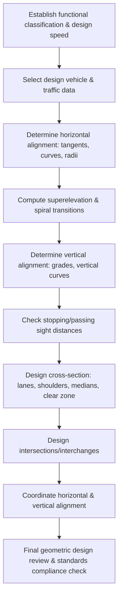

## Highway Geometric Design

### Overview and Scope

Highway geometric design is the branch of civil engineering concerned with the proportioning of the physical elements of a roadway — alignment, cross-section, and profile — to provide safe, efficient, and comfortable operation for vehicles at a design speed appropriate to traffic function, terrain, and cost constraints. It translates driver behavior, vehicle dynamics, and traffic operations into physical geometry: horizontal curves, vertical curves, superelevation, sight distances, and cross-sectional elements.

Geometric design standards in most jurisdictions derive from AASHTO's *A Policy on Geometric Design of Highways and Streets* (the "Green Book"), or equivalent national standards (e.g., DPWH Highway Safety Design Standards in the Philippines, which largely adapt AASHTO principles).

### Design Controls and Criteria

**Key Points**

- **Functional classification**: Freeway, arterial, collector, local — determines access control, design speed, and level of service targets.
- **Design speed**: A selected speed used to determine geometric features; should be consistent with the design vehicle, terrain, and adjacent land use. Higher functional classes and flatter terrain permit higher design speeds.
- **Design vehicle**: Governs turning radii, lane widths, and intersection geometry (e.g., passenger car (P), single-unit truck (SU), WB-62 semi-trailer).
- **Traffic volume and composition**: AADT, design hourly volume (DHV), and percentage of trucks influence lane/shoulder width, number of lanes, and grade design.
- **Terrain classification**: Level, rolling, or mountainous — affects achievable grades and curve radii.
- **Level of Service (LOS)**: Target operating quality (A–F) informs capacity-related geometric decisions (lane count, shoulder width).

### Horizontal Alignment

Horizontal alignment consists of tangents (straight segments) connected by circular curves, sometimes with transition (spiral) curves.

**Minimum Radius of Curvature**

The minimum radius for a horizontal curve is governed by the side friction available and superelevation rate, derived from the point-mass vehicle cornering equation:

$$R_{min} = \frac{V^2}{127(e + f_{max})}$$

Where:

- $R_{min}$ = minimum radius (m)
- $V$ = design speed (km/h)
- $e$ = superelevation rate (m/m, decimal)
- $f_{max}$ = maximum side friction factor (dependent on speed; decreases as design speed increases)

[Inference] The constant 127 arises from unit conversion when $V$ is in km/h and gravitational acceleration is in SI units; in US customary units (V in mph), the equivalent constant is 15.

**Superelevation**

Superelevation (e) is the banking of the roadway on curves to counteract centrifugal effects, typically limited to a maximum of 0.04–0.08 (4%–8%) depending on climate (ice/snow regions use lower maxima) and road classification. Superelevation is developed gradually over a **superelevation transition length**, often coinciding with the spiral curve length.

**Transition (Spiral) Curves**

Spiral curves provide a gradual change in curvature from tangent (infinite radius) to circular curve (fixed radius), allowing:

- Gradual introduction of centripetal acceleration
- A natural path for superelevation runoff
- Improved driver comfort and reduced encroachment on adjacent lanes

The minimum spiral length is commonly computed from:

$$L_s = \frac{0.0214 V^3}{R \cdot C}$$

Where $C$ is the rate of increase of centripetal acceleration (typically 0.3–1.0 m/s³ for comfort). [Inference: exact constants and $C$ values vary by design manual — verify against the governing standard.]

**Horizontal Sight Distance**

On horizontal curves, sight distance can be obstructed by roadside objects (cut slopes, walls, barriers). The required clearance from the centerline to the obstruction (middle ordinate, $M$) is:

$$M = R\left(1 - \cos\frac{28.65 \, S}{R}\right)$$

Where $S$ is the required sight distance and $R$ is the curve radius.

### Vertical Alignment

Vertical alignment consists of tangent grades connected by parabolic vertical curves (crest or sag).

**Grades**

Maximum grades are constrained by design speed, terrain, and truck performance (climbing ability). Typical maximum grades range from 3%–5% for freeways in flat terrain up to 8%–12% for local roads in mountainous terrain. Minimum grades (~0.5%) are often specified for drainage on curbed sections.

**Vertical Curves**

A parabolic curve is used because it provides a constant rate of change of grade, simplifying design and construction. The general equation of a parabolic vertical curve:

$$y = y_0 + g_1 x + \frac{(g_2 - g_1)}{2L}x^2$$

Where $g_1, g_2$ are the approach and departure grades (as decimals), and $L$ is the curve length.

**Crest Vertical Curve Length (Stopping Sight Distance control)**

$$L = \frac{A S^2}{100\left(\sqrt{2h_1} + \sqrt{2h_2}\right)^2} \quad (S < L)$$

Where $A = |g_2 - g_1|$ (algebraic difference in grades, %), $h_1$ = driver eye height (typically 1.08 m), $h_2$ = object height (typically 0.60 m for stopping sight distance).

**Sag Vertical Curve Length (Headlight sight distance control)**

$$L = \frac{A S^2}{120 + 3.5S} \quad (S < L)$$

This formula accounts for headlight beam divergence (typically 1° upward) rather than eye/object height.

**Stopping Sight Distance (SSD)**

$$SSD = 0.278 Vt + \frac{V^2}{254f}$$

Where $V$ = speed (km/h), $t$ = perception-reaction time (commonly assumed as 2.5 s), $f$ = coefficient of friction (deceleration-dependent). The first term is the perception-reaction distance; the second is the braking distance.

### Cross-Section Elements

**Key Points**

- **Lane width**: Typically 3.0–3.7 m; wider lanes for higher-speed/higher-volume facilities.
- **Shoulders**: Provide refuge for disabled vehicles, structural support to pavement edge, and lateral clearance; widths typically 0.6–3.0 m depending on classification.
- **Cross slope**: Typically 1.5%–2% on tangents for drainage; adjusted through superelevation on curves.
- **Median**: Separates opposing traffic flows on divided highways; width and type (raised, depressed, flush) depend on access control and available right-of-way.
- **Clear zone**: Unobstructed, traversable roadside area to accommodate errant vehicle recovery; width scales with speed, traffic volume, and embankment slope.
- **Side slopes**: Fill and cut slopes designed for stability and traversability (e.g., 1V:4H or flatter is considered "recoverable").

### Intersection and Interchange Geometry

Intersections require additional geometric considerations beyond the basic alignment:

- **Sight triangles**: Clear sight areas at intersection approaches, sized using intersection sight distance (ISD) formulas dependent on the maneuver (left turn, right turn, crossing).
- **Turning radii**: Sized to the design vehicle's turning path (e.g., WB-62 for truck-heavy intersections).
- **Channelization**: Islands and pavement markings to separate conflicting movements and control speed.
- **Interchange types**: Diamond, cloverleaf, directional, and single-point urban interchange (SPUI), each with trade-offs in land use, capacity, and weaving length requirements.

### Worked Example

**Example**

Determine the minimum radius of a horizontal curve for a design speed of 100 km/h, given a maximum superelevation of 0.08 and a maximum side friction factor of 0.12.

$$R_{min} = \frac{100^2}{127(0.08 + 0.12)} = \frac{10000}{127 \times 0.20} = \frac{10000}{25.4} \approx 393.7 \text{ m}$$

The minimum radius is approximately **394 m**. Any curve on this facility should use a radius equal to or greater than this value; larger radii are preferred where right-of-way permits, both to increase driver comfort margin and to allow lower superelevation and friction demand.

### Design Process Flow

### Horizontal Curve Elements (svg_diagram)

<svg xmlns="http://www.w3.org/2000/svg" viewBox="0 0 700 380">
<text x="350" y="25" font-size="16" text-anchor="middle" font-weight="bold">Horizontal Curve Elements (svg_diagram)</text>

<line x1="60" y1="300" x2="220" y2="180" stroke="#2b6cb0" stroke-width="3" />

<path d="M 220 180 A 180 180 0 0 1 480 180" fill="none" stroke="#2b6cb0" stroke-width="3" />

<line x1="480" y1="180" x2="640" y2="300" stroke="#2b6cb0" stroke-width="3" />

<line x1="220" y1="180" x2="480" y2="180" stroke="#a0aec0" stroke-dasharray="5,5" stroke-width="1.5" />
<circle cx="350" cy="120" r="3" fill="#e53e3e" />
<line x1="220" y1="180" x2="350" y2="120" stroke="#a0aec0" stroke-dasharray="3,3" stroke-width="1" />
<line x1="480" y1="180" x2="350" y2="120" stroke="#a0aec0" stroke-dasharray="3,3" stroke-width="1" />
<text x="350" y="100" font-size="13" text-anchor="middle" fill="#e53e3e">PI</text>

<circle cx="220" cy="180" r="4" fill="#2f855a" />
<circle cx="480" cy="180" r="4" fill="#2f855a" />
<text x="195" y="200" font-size="13" fill="#2f855a">PC</text>
<text x="490" y="200" font-size="13" fill="#2f855a">PT</text>

<circle cx="350" cy="0" r="0" fill="none" />
<line x1="220" y1="180" x2="350" y2="-0" stroke="none" />

<line x1="350" y1="360" x2="220" y2="180" stroke="#dd6b20" stroke-width="1.5" stroke-dasharray="4,4" />
<line x1="350" y1="360" x2="480" y2="180" stroke="#dd6b20" stroke-width="1.5" stroke-dasharray="4,4" />
<circle cx="350" cy="360" r="3" fill="#dd6b20" />
<text x="360" y="358" font-size="13" fill="#dd6b20">O (Center)</text>
<text x="270" y="290" font-size="13" fill="#dd6b20">R</text>
<text x="420" y="290" font-size="13" fill="#dd6b20">R</text>

<line x1="350" y1="180" x2="350" y2="140" stroke="#805ad5" stroke-width="1.5" />
<text x="358" y="165" font-size="12" fill="#805ad5">M</text>

<text x="80" y="290" font-size="13" fill="#2b6cb0">Tangent</text>
<text x="560" y="290" font-size="13" fill="#2b6cb0">Tangent</text>
<text x="330" y="155" font-size="13" fill="#2b6cb0">L (curve length)</text>
</svg>

### Common Pitfalls and Practical Considerations

- **Coordinating horizontal and vertical alignment**: Sharp horizontal curves should not coincide with the crest of a vertical curve — this combination hides curvature from drivers and reduces perceived sight distance. Design practice generally recommends phasing horizontal and vertical curvature so they roughly overlap in a "balanced" way rather than horizontal curves beginning/ending mid-grade-change.
- **Superelevation runoff on multi-lane facilities**: Adequate transition length must be provided to avoid noticeable "roll" as cross-slope changes, especially for trucks with high centers of gravity.
- **Truck climbing lanes**: On sustained grades exceeding roughly 3% for long lengths, a climbing lane may be warranted where truck speed reduction exceeds a threshold (commonly 15 km/h below the design speed), determined via critical length of grade charts.
- **Sight distance verification**: [Inference] Sight distance should be checked as an as-built condition, not just as-designed, since vegetation growth, temporary structures, and later roadside development can obstruct originally clear lines of sight.

**Related Topics**

- Pavement Design (Flexible and Rigid Pavements)
- Traffic Engineering and Capacity Analysis (Highway Capacity Manual methods)
- Drainage Design for Highways (culverts, ditches, storm drainage)
- Earthwork and Mass-Haul Diagrams
- Intersection Sight Distance and Traffic Control Devices
- Highway Safety Design (Roadside Design Guide, clear zones, barriers)
- Route Location and Reconnaissance Surveys