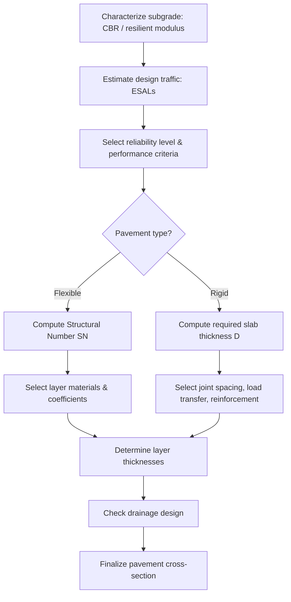

## Pavement Design Principles

### Overview and Scope

Pavement design is the process of proportioning the layers of a road structure — surface, base, subbase, and subgrade — so that the pavement can withstand anticipated traffic loading and environmental effects over a specified design life, while providing a safe and comfortable riding surface. The two dominant pavement types are **flexible pavements** (asphalt-surfaced) and **rigid pavements** (Portland cement concrete-surfaced), each with distinct load-transfer mechanisms and design methodologies.

Major design frameworks include the AASHTO 1993 Guide for Design of Pavement Structures, the more recent AASHTOWare Pavement ME Design (mechanistic-empirical), and various national adaptations (e.g., DPWH pavement design guidelines in the Philippines).

### Pavement Types and Load Transfer

**Key Points**

- **Flexible pavement**: Composed of asphalt concrete surface, granular or stabilized base/subbase, over compacted subgrade. Distributes load through a widening stress cone across multiple layers — each layer bears a diminishing share of stress with depth.
- **Rigid pavement**: Composed of a Portland cement concrete slab acting as a beam, distributing loads over a wide area primarily through slab bending (flexural) action rather than layer-by-layer stress dissipation.
- **Composite pavement**: A concrete slab overlaid with asphalt (or vice versa in overlay design), combining structural benefits of both.
- **Semi-rigid pavement**: Uses a cement- or lime-stabilized base beneath an asphalt surface, offering intermediate stiffness.

### Flexible Pavement Structural Layers

1. **Surface course (wearing course)**: Provides skid resistance, smoothness, and waterproofing; typically hot-mix asphalt (HMA).
2. **Binder course**: Intermediate asphalt layer providing additional structural strength (may be combined with surface course in thinner designs).
3. **Base course**: Load-distributing layer, often crushed aggregate or stabilized material.
4. **Subbase course**: Additional load distribution and drainage layer, may use lower-quality material than base.
5. **Subgrade**: The compacted natural or improved soil foundation; its strength (commonly measured via California Bearing Ratio, CBR, or resilient modulus, $M_R$) governs required structural thickness above it.

### Rigid Pavement Structural Layers

1. **Concrete slab**: The primary structural element, resisting loads through flexural strength.
2. **Base/subbase course**: Provides uniform support, controls pumping (erosion of fines under repeated loading), and aids drainage.
3. **Subgrade**: As with flexible pavements, its stiffness affects slab support and stress levels.

**Types of rigid pavement:**

- **Jointed Plain Concrete Pavement (JPCP)**: Contains contraction joints to control cracking, no reinforcement (or minimal).
- **Jointed Reinforced Concrete Pavement (JRCP)**: Wire mesh or reinforcement controls crack width between wider-spaced joints.
- **Continuously Reinforced Concrete Pavement (CRCP)**: No transverse joints; heavy longitudinal reinforcement controls crack spacing and width.

### Traffic Loading Characterization

Pavement design converts mixed traffic (varying axle loads and configurations) into an equivalent number of standard load applications.

**Equivalent Single Axle Load (ESAL)**

$$ESAL = \sum_{i} n_i \times LEF_i$$

Where $n_i$ is the number of axle load applications of type $i$, and $LEF_i$ is the Load Equivalency Factor relating that axle load's damaging effect to a standard 80 kN (18,000 lb) single axle load. LEFs are derived empirically (commonly from AASHO Road Test data) and increase rapidly (roughly with the 4th power of axle load), reflecting the disproportionate damage caused by heavier axles — a principle known as the **"fourth power law."**

[Inference] The exact exponent varies by pavement type and structural condition; 4 is a widely cited approximation from AASHO Road Test correlations, not a universal physical constant.

### Flexible Pavement Design — AASHTO 1993 Method

The AASHTO 1993 empirical design equation relates required structural capacity to traffic, reliability, and material properties:

$$\log_{10}(W_{18}) = Z_R S_0 + 9.36 \log_{10}(SN+1) - 0.20 + \frac{\log_{10}\left[\frac{\Delta PSI}{4.2-1.5}\right]}{0.40 + \frac{1094}{(SN+1)^{5.19}}} + 2.32\log_{10}(M_R) - 8.07$$

Where:

- $W_{18}$ = predicted number of 18-kip ESAL applications
- $Z_R$ = standard normal deviate for the selected reliability level
- $S_0$ = combined standard error of traffic and performance prediction
- $SN$ = Structural Number (index of total pavement structural capacity)
- $\Delta PSI$ = difference between initial and terminal serviceability index
- $M_R$ = subgrade resilient modulus (psi)

**Structural Number and Layer Coefficients**

$$SN = a_1 D_1 + a_2 D_2 m_2 + a_3 D_3 m_3$$

Where $a_i$ are layer coefficients (reflecting relative strength of each material), $D_i$ are layer thicknesses (inches), and $m_i$ are drainage coefficients applied to base/subbase layers to account for moisture effects.

### Rigid Pavement Design — AASHTO 1993 Method

The rigid pavement design equation (structurally more complex than the flexible equation) solves for required **slab thickness (D)** given traffic, reliability, concrete modulus of rupture, load transfer efficiency (dowels/aggregate interlock), drainage coefficient, and subgrade/subbase support (modulus of subgrade reaction, $k$). Key inputs:

- **Modulus of rupture ($S_c'$)**: Flexural strength of the concrete, governs slab's resistance to cracking under bending stress.
- **Load transfer coefficient ($J$)**: Reflects the ability of joints to transfer load across discontinuities (lower with dowels, higher without).
- **Modulus of subgrade reaction ($k$)**: Represents the stiffness of the foundation supporting the slab (units: pressure per unit deflection, e.g., pci or MPa/m).

### Mechanistic-Empirical Design Concepts

Modern pavement design (e.g., AASHTOWare Pavement ME) uses mechanistic analysis (multi-layer elastic or finite element theory) to compute critical stresses/strains, combined with empirical distress transfer functions calibrated to observed field performance.

**Key critical responses:**

- **Horizontal tensile strain at the bottom of the asphalt layer** — governs **fatigue cracking**.
- **Vertical compressive strain at the top of the subgrade** — governs **rutting** (permanent deformation).
- **Tensile stress at the bottom of the concrete slab** — governs **fatigue cracking** in rigid pavements.

$$N_f = k_1\left(\frac{1}{\varepsilon_t}\right)^{k_2}\left(\frac{1}{E}\right)^{k_3}$$

A generalized fatigue transfer function form, where $N_f$ is the number of load repetitions to fatigue failure, $\varepsilon_t$ is tensile strain, $E$ is mixture stiffness, and $k_1, k_2, k_3$ are calibration constants. [Inference: specific calibration constants vary substantially by material and calibration dataset — always use locally calibrated or agency-published coefficients rather than generic values.]

### Pavement Distress Types

**Flexible pavement distresses:**

- Fatigue (alligator) cracking
- Rutting (permanent deformation in wheel paths)
- Thermal/low-temperature cracking
- Raveling and stripping
- Bleeding and shoving

**Rigid pavement distresses:**

- Transverse/longitudinal cracking
- Faulting (differential elevation across joints/cracks, often from pumping)
- Joint spalling
- Punchouts (typical of CRCP)
- Blowups (in hot weather, from excessive slab expansion)

### Worked Example

**Example**

A flexible pavement is designed with a Structural Number, $SN = 4.5$. Layer coefficients are $a_1 = 0.44$ (asphalt surface), $a_2 = 0.14$ (granular base), with drainage coefficient $m_2 = 1.0$. If the surface thickness $D_1 = 4$ in, determine the required base thickness $D_2$.

$$SN = a_1 D_1 + a_2 D_2 m_2$$

$$4.5 = (0.44)(4) + (0.14)(D_2)(1.0)$$

$$4.5 = 1.76 + 0.14 D_2$$

$$D_2 = \frac{4.5 - 1.76}{0.14} = \frac{2.74}{0.14} \approx 19.6 \text{ in}$$

A base course thickness of approximately **20 inches** (rounded up for constructability) would satisfy the required structural number, assuming the assumed layer coefficients and drainage conditions are accurate for the actual materials used.

### Design Process Flow

### Flexible vs. Rigid Load Distribution (svg_diagram)

<svg xmlns="http://www.w3.org/2000/svg" viewBox="0 0 700 320">
<text x="350" y="25" font-size="16" text-anchor="middle" font-weight="bold">Flexible vs. Rigid Load Distribution (svg_diagram)</text>

<text x="160" y="55" font-size="14" text-anchor="middle" font-weight="bold">Flexible Pavement</text>

<rect x="60" y="70" width="200" height="20" fill="`#4a5568`" />

<text x="270" y="85" font-size="11">Surface</text>

<rect x="60" y="90" width="200" height="30" fill="`#a0aec0`" />

<text x="270" y="110" font-size="11">Base</text>

<rect x="60" y="120" width="200" height="30" fill="`#cbd5e0`" />

<text x="270" y="140" font-size="11">Subbase</text>

<rect x="60" y="150" width="200" height="60" fill="`#edf2f7`" />

<text x="270" y="180" font-size="11">Subgrade</text>

<line x1="160" y1="70" x2="120" y2="210" stroke="#e53e3e" stroke-width="1.5" stroke-dasharray="4,3" />
<line x1="160" y1="70" x2="200" y2="210" stroke="#e53e3e" stroke-width="1.5" stroke-dasharray="4,3" />
<line x1="160" y1="70" x2="80" y2="210" stroke="#e53e3e" stroke-width="1" stroke-dasharray="2,2" />
<line x1="160" y1="70" x2="240" y2="210" stroke="#e53e3e" stroke-width="1" stroke-dasharray="2,2" />
<line x1="160" y1="55" x2="160" y2="70" stroke="#1a202c" stroke-width="3" />
<text x="165" y="60" font-size="10">Wheel Load</text>
<text x="80" y="230" font-size="10" fill="#e53e3e">Widening stress cone</text>

<text x="530" y="55" font-size="14" text-anchor="middle" font-weight="bold">Rigid Pavement</text>

<rect x="440" y="70" width="200" height="35" fill="`#2d3748`" />

<text x="650" y="90" font-size="11">Concrete Slab</text>

<rect x="440" y="105" width="200" height="25" fill="`#cbd5e0`" />

<text x="650" y="122" font-size="11">Base</text>

<rect x="440" y="130" width="200" height="80" fill="`#edf2f7`" />

<text x="650" y="170" font-size="11">Subgrade</text>

<line x1="540" y1="70" x2="540" y2="90" stroke="#1a202c" stroke-width="3" />
<text x="545" y="65" font-size="10">Wheel Load</text>
<path d="M 460 105 Q 540 115 620 105" fill="none" stroke="#3182ce" stroke-width="2" />
<text x="500" y="145" font-size="10" fill="#3182ce">Broad distribution via slab bending</text>
</svg>

### Common Pitfalls and Practical Considerations

- **Subgrade characterization errors**: Underestimating subgrade support (CBR or $M_R$) leads to over-conservative, costly designs; overestimating leads to premature structural failure. Field testing (e.g., DCP, plate load tests) should validate assumed values where feasible.
- **Drainage neglect**: Poor subsurface drainage accelerates pumping in rigid pavements and stripping/moisture damage in flexible pavements — drainage coefficients and cross-sectional drainage layers are often under-designed in practice.
- **Traffic growth assumptions**: ESAL projections are sensitive to assumed traffic growth rate and truck factor; [Inference] design life estimates can be substantially wrong if actual freight growth or vehicle mix diverges from projections, so sensitivity analysis is good practice.
- **Layer coefficient selection**: Using generic layer coefficients from design guides without verifying against local material test data (e.g., resilient modulus testing) can introduce significant error into the Structural Number calculation.
- **Joint design in rigid pavements**: Improper joint spacing relative to slab thickness increases risk of uncontrolled cracking; general rule-of-thumb ratios (e.g., panel length-to-thickness ratios) exist but should be checked against agency-specific guidance.

**Related Topics**

- Highway Geometric Design
- Subgrade Improvement and Soil Stabilization
- Pavement Materials (Asphalt Mix Design, Concrete Mix Design)
- Pavement Management Systems and Life-Cycle Cost Analysis
- Pavement Evaluation (Falling Weight Deflectometer, Pavement Condition Index)
- Drainage Design for Highways
- Mechanistic-Empirical Pavement Design (AASHTOWare Pavement ME)