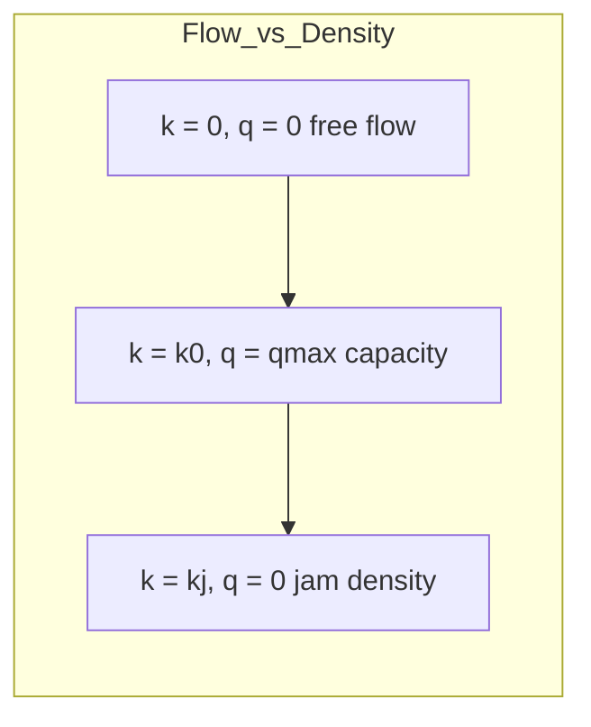

## Traffic Flow Theory and Capacity Analysis

### Overview and Scope

Traffic flow theory studies the mathematical relationships governing vehicle movement on roadways — the interaction between flow rate, speed, and density — while capacity analysis applies these relationships to determine how much traffic a facility can serve at an acceptable level of operation. Together, they form the analytical basis for geometric design decisions, signal timing, and operational evaluation, most commonly codified in the **Highway Capacity Manual (HCM)**.

### Fundamental Traffic Flow Parameters

**Key Points**

- **Flow rate ($q$)**: Number of vehicles passing a point per unit time (veh/h).
- **Density ($k$)**: Number of vehicles occupying a unit length of roadway (veh/km or veh/mi).
- **Speed ($v$)**: Commonly expressed as either **time mean speed** (arithmetic mean of speeds observed at a point) or **space mean speed** (harmonic mean, representing average speed over a section — the parameter used in flow theory).

**The Fundamental Relationship**

$$q = k \cdot v$$

Flow equals density multiplied by space mean speed. This relationship underlies all macroscopic traffic flow models.

### Speed-Density-Flow Models

**Greenshields' Linear Model**

Greenshields proposed a linear relationship between speed and density:

$$v = v_f\left(1 - \frac{k}{k_j}\right)$$

Where $v_f$ = free-flow speed (speed at zero density) and $k_j$ = jam density (density at zero speed, i.e., stopped traffic).

Substituting into $q = kv$ gives a parabolic flow-density relationship:

$$q = v_f k\left(1 - \frac{k}{k_j}\right)$$

This produces **maximum flow (capacity)** at a critical density $k_0 = k_j/2$, with corresponding critical speed $v_0 = v_f/2$, and maximum flow:

$$q_{max} = \frac{v_f k_j}{4}$$

[Inference] The Greenshields model is a simplification; it fits reasonably well for uninterrupted flow at moderate densities but deviates from observed behavior at very low and very high densities. Other models (Greenberg's logarithmic model, Underwood's exponential model) were developed to better fit specific flow regimes.

### The Flow-Density-Speed Curve

**Interpreting the curve:**

- **Uncongested (stable) branch**: From zero density to critical density $k_0$ — flow increases as density increases; speeds are relatively high.
- **Capacity point**: Maximum throughput at critical density/speed.
- **Congested (unstable) branch**: Beyond $k_0$ — flow decreases as density increases further, despite more vehicles being present, because speeds drop sharply (stop-and-go conditions, breakdown).

### Shockwave Analysis

When traffic conditions change abruptly (e.g., a bottleneck, incident, or signal), a **shockwave** — a boundary between two flow states — propagates through the traffic stream. Its speed is given by:

$$u_w = \frac{q_2 - q_1}{k_2 - k_1}$$

Where subscripts 1 and 2 denote conditions upstream and downstream of the discontinuity. A negative $u_w$ indicates the shockwave moves upstream (against traffic direction) — characteristic of a queue forming behind a bottleneck; a positive value indicates downstream propagation (e.g., a queue dissipating).

### Car-Following Models

Microscopic traffic flow theory models individual driver behavior in response to a lead vehicle. A general car-following stimulus-response formulation:

$$a_{n+1}(t+T) = \lambda \left[v_n(t) - v_{n+1}(t)\right]$$

Where $a_{n+1}$ is the acceleration of the following vehicle, $T$ is driver reaction time, and $\lambda$ is a sensitivity coefficient (which may itself depend on speed and spacing in more advanced formulations, e.g., Gazis-Herman-Rothery models). These models underpin microsimulation software behavior and form a bridge between individual driver behavior and macroscopic flow patterns.

### Highway Capacity Manual Methodology

**Level of Service (LOS)**

LOS is a qualitative measure (A through F) describing operational conditions from a traveler's perspective, based on measures of effectiveness (MOE) specific to facility type:

- **Freeways/uninterrupted flow**: Density (pc/km/lane) is the primary MOE.
- **Signalized intersections**: Control delay (seconds/vehicle) is the primary MOE.
- **Two-lane highways**: Percent time-spent-following and average travel speed.

**Capacity**

Capacity is the maximum sustainable flow rate under prevailing roadway, traffic, and control conditions — typically expressed in passenger cars per hour per lane (pc/h/ln), adjusted from base (ideal) capacity using adjustment factors for lane width, heavy vehicles, grade, driver population, and access points.

$$c = c_j \times f_w \times f_{HV} \times f_p \times \ldots$$

Where $c_j$ is the ideal (base) capacity under standard conditions, and $f_i$ terms are adjustment factors reflecting deviations from ideal conditions.

**Heavy Vehicle Adjustment Factor**

$$f_{HV} = \frac{1}{1 + P_T(E_T - 1) + P_R(E_R - 1)}$$

Where $P_T, P_R$ are proportions of trucks and RVs, and $E_T, E_R$ are passenger-car equivalents for each vehicle type (larger for steeper/longer grades).

### Signalized Intersection Analysis

**Key Points**

- **Cycle length ($C$)**: Total time for one complete signal cycle.
- **Green ratio ($g/C$)**: Proportion of cycle allocated as effective green to an approach.
- **Saturation flow rate ($s$)**: Maximum sustainable flow rate for a lane group during green, under prevailing conditions (typically ~1,900 pc/h/ln base value, adjusted).
- **Capacity of a lane group**:

$$c_i = s_i \times \frac{g_i}{C}$$

**Control delay (simplified Webster-based approach, per HCM):**

$$d = d_1(PF) + d_2 + d_3$$

Where $d_1$ is uniform delay (assuming uniform arrivals), $d_2$ is incremental delay (accounting for random arrivals and oversaturation), $d_3$ is initial queue delay, and $PF$ is a progression adjustment factor reflecting signal coordination benefits.

**Uniform delay:**

$$d_1 = \frac{0.5 C (1 - g/C)^2}{1 - \left[\min(1, X)\frac{g}{C}\right]}$$

Where $X = v/c$ is the volume-to-capacity ratio (degree of saturation).

### Worked Example

**Example**

A freeway lane group has a jam density of 160 veh/km and a free-flow speed of 100 km/h, following the Greenshields model. Determine the capacity and the speed and density at which it occurs.

$$k_0 = \frac{k_j}{2} = \frac{160}{2} = 80 \text{ veh/km}$$

$$v_0 = \frac{v_f}{2} = \frac{100}{2} = 50 \text{ km/h}$$

$$q_{max} = \frac{v_f k_j}{4} = \frac{100 \times 160}{4} = 4000 \text{ veh/h}$$

The theoretical capacity is **4,000 veh/h** (per the assumed lane group), occurring at a density of **80 veh/km** and a speed of **50 km/h** — illustrating that maximum throughput occurs at only half the free-flow speed, a counterintuitive but well-established result of the flow-density relationship.

### Traffic Flow Regimes Diagram (svg_diagram)

<svg xmlns="http://www.w3.org/2000/svg" viewBox="0 0 700 380">
<text x="350" y="25" font-size="16" text-anchor="middle" font-weight="bold">Flow vs. Density Curve (svg_diagram)</text>

<line x1="80" y1="320" x2="620" y2="320" stroke="#1a202c" stroke-width="2" />
<line x1="80" y1="320" x2="80" y2="60" stroke="#1a202c" stroke-width="2" />
<text x="350" y="355" font-size="13" text-anchor="middle">Density (k)</text>
<text x="35" y="190" font-size="13" text-anchor="middle" transform="rotate(-90 35 190)">Flow (q)</text>

<path d="M 80 320 Q 350 40 620 320" fill="none" stroke="#3182ce" stroke-width="3" />

<circle cx="350" cy="80" r="5" fill="#e53e3e" />
<line x1="350" y1="80" x2="350" y2="320" stroke="#e53e3e" stroke-dasharray="4,4" stroke-width="1" />
<line x1="80" y1="80" x2="350" y2="80" stroke="#e53e3e" stroke-dasharray="4,4" stroke-width="1" />
<text x="355" y="75" font-size="12" fill="#e53e3e">qmax (capacity)</text>
<text x="352" y="340" font-size="12" fill="#e53e3e">k0 (critical density)</text>

<circle cx="620" cy="320" r="4" fill="#2f855a" />
<text x="560" y="340" font-size="12" fill="#2f855a">kj (jam density)</text>

<circle cx="80" cy="320" r="4" fill="#805ad5" />
<text x="85" y="310" font-size="12" fill="#805ad5">k = 0 (free flow)</text>

<text x="180" y="150" font-size="12" fill="`#2b6cb0`">Uncongested (stable)</text>

<text x="440" y="150" font-size="12" fill="`#dd6b20`">Congested (unstable)</text>

</svg>

### Common Pitfalls and Practical Considerations

- **Confusing time mean speed and space mean speed**: Time mean speed is always greater than or equal to space mean speed for the same traffic stream (except when all vehicles travel at identical speed); using the wrong one in the fundamental equation $q = kv$ produces inconsistent results.
- **Model selection**: Greenshields' model performs poorly at very low or very high densities; agencies working with congested urban freeways often calibrate or select alternative models (Greenberg, Underwood, or empirically fitted piecewise models) instead.
- **LOS thresholds are context-dependent**: [Inference] LOS boundary values differ across facility types and have been revised across HCM editions — designs should reference the specific HCM edition and facility-type chapter in use, not generic LOS tables from unrelated contexts.
- **Saturation flow rate assumptions**: Using default (ideal) saturation flow values without field calibration for local driver behavior, lane width, and heavy vehicle mix can materially misstate signal timing needs and intersection LOS.
- **Oversaturated conditions**: The standard delay equations assume relatively short analysis periods; extended oversaturation (demand exceeding capacity over multiple cycles) requires queuing analysis beyond the basic HCM delay formulas to avoid underestimating delay.

**Related Topics**

- Highway Geometric Design
- Signal Timing and Coordination Design
- Traffic Simulation and Microsimulation Modeling
- Queuing Theory Applications in Transportation
- Highway Capacity Manual Methodologies (Freeways, Arterials, Roundabouts)
- Intelligent Transportation Systems (ITS)
- Transportation Demand Modeling (Trip Generation, Distribution, Assignment)