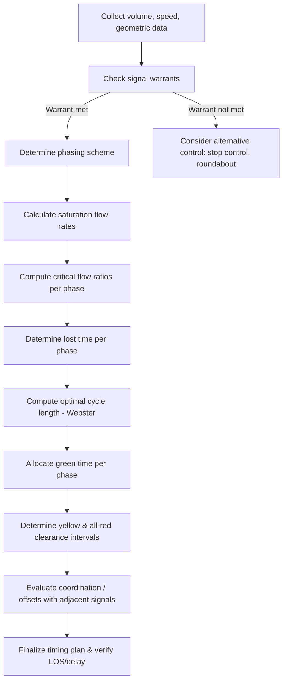

## Traffic Control Devices and Signal Design

### Overview and Scope

Traffic control devices (TCDs) are signs, signals, markings, and other devices used to regulate, warn, and guide traffic. Their design and placement are governed by standards such as the **Manual on Uniform Traffic Control Devices (MUTCD)** in the US, or equivalent national manuals (e.g., DPWH Road Signs and Pavement Markings Manual in the Philippines). Signal design — the subset dealing with traffic signals specifically — applies traffic flow theory to determine timing plans that safely and efficiently allocate right-of-way among conflicting movements.

### Categories of Traffic Control Devices

**Key Points**

- **Signs**: Regulatory (mandatory rules, e.g., stop, speed limit), warning (advance notice of hazards), and guide (wayfinding, e.g., route markers, destination signs).
- **Pavement markings**: Longitudinal lines (lane lines, edge lines, center lines), transverse markings (crosswalks, stop lines), and symbols/legends (arrows, words).
- **Traffic signals**: Electrically powered devices assigning right-of-way at intersections through timed indications.
- **Other devices**: Delineators, barricades, channelizing devices (cones, drums), and rumble strips.

**Fundamental principles (common to MUTCD-based systems):** a device should fulfill a need, command attention, convey a clear and simple meaning, command respect from road users, and give adequate time for proper response.

### Warrants for Traffic Signal Installation

A signal should not be installed merely because it seems reasonable — it must satisfy documented **warrants** based on traffic volume, pedestrian activity, crash history, or other factors, since unwarranted signals can increase delay and certain crash types (e.g., rear-end collisions).

**Common warrant categories (MUTCD-style framework):**

1. **Eight-Hour Vehicular Volume**: Minimum vehicular volumes sustained over 8 hours on major and minor approaches.
2. **Four-Hour Vehicular Volume**: Higher combined volumes sustained over a shorter 4-hour period.
3. **Peak Hour**: Severe peak-hour delay on the minor street combined with minimum volume thresholds.
4. **Pedestrian Volume**: Minimum pedestrian crossing volumes conflicting with vehicular traffic.
5. **School Crossing**: Minimum school-age pedestrians and gaps insufficient for safe crossing.
6. **Coordinated Signal System**: Need to maintain platooned traffic flow along a corridor.
7. **Crash Experience**: Documented crash patterns correctable by signal control, combined with volume thresholds.
8. **Roadway Network**: Location functions to encourage concentration of traffic on a network of arterials.

[Inference] Exact numerical thresholds for each warrant vary by manual edition and jurisdiction — the warrant categories above reflect the general MUTCD structure but specific volume/time thresholds must be verified against the governing manual in use.

### Signal Timing Fundamentals

**Key Points**

- **Phase**: A set of signal intervals allocating right-of-way to one or more non-conflicting traffic movements.
- **Cycle length ($C$)**: Total time for the signal to complete one full sequence of phases.
- **Interval**: A period of constant signal indication (e.g., green, yellow, all-red).
- **Split**: Portion of the cycle length allocated to each phase.
- **Lost time ($L$)**: Time during each phase not effectively used by traffic (start-up lost time + clearance lost time).

**Yellow (Change) Interval**

$$Y = t + \frac{v}{2a + 2gG}$$

Where $t$ = perception-reaction time (~1.0 s), $v$ = approach speed, $a$ = deceleration rate (~3.0 m/s²), $g$ = gravitational acceleration, and $G$ = grade (decimal, positive for upgrade). This ensures a vehicle unable to safely stop has adequate time to clear the intersection at legal speed before conflicting traffic receives green — commonly known as the **dilemma zone problem** avoidance calculation.

**All-Red Clearance Interval**

$$AR = \frac{w + L}{v}$$

Where $w$ = intersection width (curb-to-curb, conflicting path), $L$ = length of design vehicle, and $v$ = approach speed. This provides time for a vehicle that entered on yellow to fully clear the conflict zone before opposing movements start.

### Webster's Optimal Cycle Length

$$C_o = \frac{1.5L + 5}{1 - \sum Y_i}$$

Where $L$ = total lost time per cycle (sum of lost time across all phases), and $\sum Y_i$ = sum of the critical flow ratios ($v/s$) for each phase — i.e., the sum, over each phase, of the ratio of the critical lane group's volume to its saturation flow rate.

**Key Points**

- Webster's formula minimizes total intersection delay under a simplified queuing model assumption.
- Cycle lengths derived from this formula are typically increased slightly in practice (10–20%) to add capacity buffer against demand fluctuations, though this trade-off increases average delay per Webster's own curve, which is relatively flat near the optimum.

**Green Time Allocation (Proportional to Critical Flow Ratios)**

$$g_i = (C - L)\times\frac{y_i}{\sum y_i}$$

Where $g_i$ is the effective green time for phase $i$, and $y_i = v_i/s_i$ is that phase's critical flow ratio.

### Signal Phasing Schemes

**Common phasing approaches:**

- **Ring-and-barrier (NEMA) phasing**: Standard US framework organizing conflicting movements into rings and barriers, enabling flexible actuated control (e.g., permissive left turns, protected-only left turns, or protected-permissive combinations).
- **Split phasing**: Each approach gets an entirely separate phase (used when opposing left turns cannot safely share a phase due to geometry).
- **Leading/lagging left turns**: Protected left-turn phase placed before or after the corresponding through phase, used to optimize progression along a corridor.

### Signal Coordination and Progression

For arterials with closely spaced signals, coordinating cycle lengths and offsets allows vehicles to travel through consecutive intersections with minimal stops, forming a "green wave."

**Offset**: The time difference between the start of green at a reference intersection and the start of green at a downstream intersection, typically set to match the average travel time between intersections at the desired progression speed:

$$\text{Offset} = \frac{d}{v_p}$$

Where $d$ = distance between intersections and $v_p$ = desired progression speed.

**Time-space diagrams** are used to visualize and design progression bands — the "bandwidth" being the duration during which a platoon of vehicles can pass through a coordinated system without stopping.

### Signal Design Process Flow

### Signal Phase Sequence Diagram (svg_diagram)

<svg xmlns="http://www.w3.org/2000/svg" viewBox="0 0 700 340">
<text x="350" y="25" font-size="16" text-anchor="middle" font-weight="bold">Ring-and-Barrier Phase Diagram (svg_diagram)</text>

<text x="60" y="70" font-size="13" font-weight="bold">Ring 1</text>

<rect x="60" y="80" width="120" height="40" fill="`#3182ce`" />

<text x="120" y="105" font-size="12" text-anchor="middle" fill="white">Phase 1 (NB/SB Left)</text>

<rect x="180" y="80" width="200" height="40" fill="`#2b6cb0`" />

<text x="280" y="105" font-size="12" text-anchor="middle" fill="white">Phase 2 (NB/SB Through)</text>

<line x1="380" y1="60" x2="380" y2="260" stroke="#e53e3e" stroke-width="3" stroke-dasharray="6,3" />
<text x="385" y="55" font-size="11" fill="#e53e3e">Barrier</text>
<rect x="400" y="80" width="120" height="40" fill="#3182ce" />
<text x="460" y="105" font-size="12" text-anchor="middle" fill="white">Phase 3 (EB/WB Left)</text>
<rect x="520" y="80" width="120" height="40" fill="#2b6cb0" />
<text x="580" y="105" font-size="12" text-anchor="middle" fill="white">Phase 4 (EB/WB Thru)</text>

<text x="60" y="160" font-size="13" font-weight="bold">Ring 2</text>

<rect x="60" y="170" width="120" height="40" fill="`#38a169`" />

<text x="120" y="195" font-size="12" text-anchor="middle" fill="white">Phase 5 (NB/SB Left)</text>

<rect x="180" y="170" width="200" height="40" fill="`#2f855a`" />

<text x="280" y="195" font-size="12" text-anchor="middle" fill="white">Phase 6 (NB/SB Through)</text>

<rect x="400" y="170" width="120" height="40" fill="#38a169" />
<text x="460" y="195" font-size="12" text-anchor="middle" fill="white">Phase 7 (EB/WB Left)</text>
<rect x="520" y="170" width="120" height="40" fill="#2f855a" />
<text x="580" y="195" font-size="12" text-anchor="middle" fill="white">Phase 8 (EB/WB Thru)</text>

<text x="350" y="250" font-size="11" text-anchor="middle" fill="`#4a5568`">Each ring progresses independently but must cross the barrier simultaneously</text>

<text x="350" y="270" font-size="11" text-anchor="middle" fill="`#4a5568`">to prevent conflicting movements from receiving green at the same time.</text>

</svg>

### Worked Example

**Example**

An intersection has two phases with critical flow ratios $y_1 = 0.30$ and $y_2 = 0.25$. Total lost time per cycle is $L = 8$ s. Determine the optimal cycle length using Webster's formula, and the green time for Phase 1.

$$C_o = \frac{1.5(8) + 5}{1 - (0.30 + 0.25)} = \frac{12 + 5}{1 - 0.55} = \frac{17}{0.45} \approx 37.8 \text{ s}$$

Rounding to a practical value, $C_o \approx 40$ s.

$$g_1 = (C - L) \times \frac{y_1}{\sum y_i} = (40 - 8) \times \frac{0.30}{0.55} = 32 \times 0.545 \approx 17.5 \text{ s}$$

Phase 1 would be allocated approximately **17–18 seconds** of effective green within the 40-second cycle, with the remainder split between Phase 2 and total lost time — actual signage-displayed green would add back the portion of lost time attributable to that phase's start-up delay.

### Common Pitfalls and Practical Considerations

- **Ignoring pedestrian timing requirements**: Minimum pedestrian clearance time (based on walking speed across crosswalk width, often assuming ~1.0–1.2 m/s) can govern minimum green/phase length independently of vehicular volume-based calculations, especially at wide intersections.
- **Dilemma zone**: Poorly calculated yellow intervals can create a "dilemma zone" where a driver can neither safely stop nor clear the intersection before red — a frequent contributor to red-light-running crashes.
- **Over-reliance on Webster's formula alone**: [Inference] Webster's model assumes undersaturated, isolated intersection conditions; oversaturated or closely spaced/coordinated intersections require more advanced tools (e.g., Synchro, VISSIM, TRANSYT-7F) rather than the basic formula.
- **Static vs. actuated control**: Fixed-time signals calculated from average volumes may perform poorly under variable demand; actuated or adaptive signal control (using detectors) can better respond to fluctuating traffic but requires different design considerations (minimum/maximum green, detector placement, gap-out logic).
- **MUTCD compliance and liability**: Deviating from standard warrant procedures or clearance interval calculations without engineering justification can create both safety risk and legal liability exposure for the responsible agency.

**Related Topics**

- Traffic Flow Theory and Capacity Analysis
- Highway Geometric Design
- Intersection Sight Distance
- Roundabout Design Principles
- Intelligent Transportation Systems (Adaptive Signal Control)
- Pedestrian and Bicycle Facility Design
- Traffic Impact Studies and Warrant Analysis