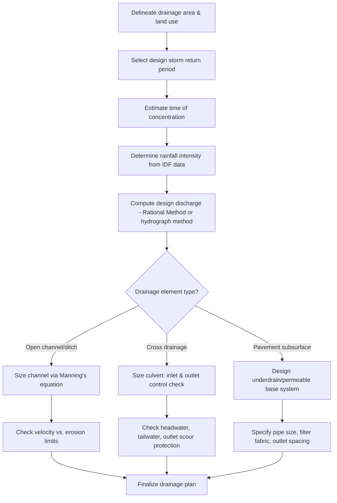

## Highway Drainage Design

### Overview and Scope

Highway drainage design manages surface and subsurface water to protect pavement structural integrity, prevent hydroplaning and flooding hazards, and control erosion of roadway embankments and adjacent land. It comprises **surface drainage** (removal of water from the pavement and right-of-way via cross slopes, ditches, and inlets), **subsurface drainage** (control of groundwater and infiltration within pavement layers), and **cross drainage** (conveyance of natural watercourses across the alignment via culverts and bridges).

### Surface Drainage Elements

**Key Points**

- **Cross slope**: Transverse slope of the pavement (typically 1.5%–2% on tangents) to shed water toward shoulders/gutters.
- **Longitudinal grade**: Minimum longitudinal grade (commonly ≥0.5%) required on curbed sections to prevent ponding, since cross slope alone cannot convey water along a flat profile.
- **Roadside ditches**: Open channels parallel to the roadway that collect and convey runoff from the pavement and adjacent slopes to an outfall or cross drainage structure.
- **Curb and gutter systems**: Used in urban/curbed sections to direct flow to inlets rather than relying on open ditches.
- **Inlets**: Structures (grate, curb-opening, or combination) that capture surface runoff and route it into the storm drain system.

### Hydrology: Estimating Design Runoff

**Rational Method**

The Rational Method is the most widely used approach for small drainage areas (typically <80–200 hectares depending on agency guidance):

$$Q = \frac{C \cdot i \cdot A}{K}$$

Where:

- $Q$ = peak discharge (m³/s or ft³/s)
- $C$ = runoff coefficient (dimensionless, reflecting land cover/imperviousness)
- $i$ = rainfall intensity (mm/hr or in/hr), corresponding to the time of concentration and selected return period
- $A$ = drainage area
- $K$ = unit conversion constant (1 in SI with consistent units of mm/hr, hectares, giving Q in a scaled unit; 1/360 in some SI conventions, or the constant simply becomes 1 when using consistent m/s and m² units — conventions vary by reference)

[Inference] The exact form and conversion constant of the Rational Method equation differ between design manuals (some absorb unit conversion into $C$, others use an explicit constant) — always confirm the exact formulation and units required by the governing local design manual.

**Time of Concentration ($t_c$)**

The time required for runoff to travel from the hydraulically most distant point in the watershed to the point of interest. Commonly estimated as the sum of:

- **Overland (sheet) flow time**: Using empirical formulas such as the Kinematic Wave or NRCS (SCS) lag equations.
- **Shallow concentrated flow time**: Velocity-based travel time once flow concentrates into rills/swales.
- **Channel/pipe flow time**: Based on Manning's equation velocity in defined channels.

**Rainfall Intensity-Duration-Frequency (IDF)**

Rainfall intensity $i$ is obtained from local IDF curves/equations for the selected **design storm return period** (e.g., 10-year for minor drainage, 25–50 year for culverts, 100-year for critical structures/floodplain checks), evaluated at a duration equal to $t_c$.

### Runoff Coefficient Selection

**Key Points**

- Impervious surfaces (pavement, roofs): $C \approx 0.80$–$0.95$
- Lawns/grass (flat to moderate slope): $C \approx 0.10$–$0.35$
- Composite watersheds: Area-weighted average of sub-area coefficients

$$C_{composite} = \frac{\sum C_i A_i}{\sum A_i}$$

### Open Channel (Ditch) Design — Manning's Equation

Roadside ditches and channels are typically designed using Manning's equation for uniform flow:

$$V = \frac{1}{n} R^{2/3} S^{1/2}$$

$$Q = V \times A_x$$

Where:

- $V$ = mean velocity (m/s)
- $n$ = Manning's roughness coefficient (channel lining-dependent, e.g., ~0.013 for concrete, ~0.030 for grassed channels)
- $R$ = hydraulic radius = $A_x / P$ (flow area divided by wetted perimeter)
- $S$ = channel longitudinal slope (m/m)
- $A_x$ = cross-sectional flow area

**Key Points**

- **Erosion control velocity limits**: Design velocity must remain below the maximum permissible (non-erosive) velocity for the channel lining material (e.g., ~0.6–1.0 m/s for unlined erodible soils, higher for riprap or concrete lining) — otherwise erosion protection (riprap, turf reinforcement mats, or lining) is required.
- **Freeboard**: Additional channel depth above the design water surface (commonly 150 mm minimum, or a percentage of depth) to accommodate uncertainty in flow estimates and debris.

### Culvert Design

Culverts convey concentrated flows (streams, ditches) beneath the roadway embankment. Culvert hydraulics can operate under two flow control regimes:

**Inlet Control**: Culvert capacity is limited by the entrance geometry; the barrel flows partially full downstream of the inlet. Governed by orifice/weir-type equations relating headwater depth to inlet geometry and a coefficient dependent on inlet edge condition.

**Outlet Control**: Culvert capacity is limited by the barrel's ability to convey flow, friction losses in the barrel, and tailwater conditions. Governed by energy balance:

$$HW = TW + H_L$$

Where $HW$ = headwater elevation, $TW$ = tailwater elevation, and $H_L$ = total head loss (entrance, friction, and exit losses) through the culvert barrel, computed via Manning's equation for the barrel plus minor loss coefficients.

**Key design parameters:**

- **Design storm frequency**: Typically 25- to 50-year for culvert sizing, with a check (overtopping analysis) at 100-year to confirm acceptable risk.
- **Allowable headwater**: Maximum acceptable upstream ponding depth, constrained by upstream property/infrastructure and embankment height.
- **Outlet velocity and scour protection**: High-velocity culvert discharge often requires energy dissipators (riprap aprons, stilling basins) to prevent downstream scour.

### Subsurface Drainage

**Key Points**

- **Underdrains**: Perforated pipe systems installed beneath or alongside the pavement structure to intercept and remove infiltrated water or groundwater, preventing saturation of base/subgrade layers.
- **Edge drains**: Installed at the pavement edge to collect water that infiltrates through joints/cracks and drains it away from the structural section.
- **Permeable base layers**: Open-graded aggregate base courses designed for rapid lateral drainage of infiltrated water, often paired with edge drain outlets.
- **Geotextile filter fabric**: Prevents fines migration into drainage aggregate while maintaining permeability.

[Inference] The relative importance of subsurface drainage varies significantly by climate — freeze-thaw regions and areas with high water tables generally require more robust subsurface drainage design than dry or well-drained regions.

### Drainage Design Process Flow

### Culvert Flow Control Regimes (svg_diagram)

<svg xmlns="http://www.w3.org/2000/svg" viewBox="0 0 700 340">
<text x="350" y="25" font-size="16" text-anchor="middle" font-weight="bold">Culvert Inlet vs. Outlet Control (svg_diagram)</text>

<text x="160" y="55" font-size="14" text-anchor="middle" font-weight="bold">Inlet Control</text>

<rect x="60" y="140" width="200" height="40" fill="`#a0aec0`" />

<path d="M 60 100 L 100 140" stroke="`#1a202c`" stroke-width="2" fill="none" />

<path d="M 60 60 L 100 140" stroke="`#3182ce`" stroke-width="2" fill="none" />

<text x="30" y="100" font-size="11" fill="`#3182ce`">HW</text>

<line x1="100" y1="140" x2="100" y2="60" stroke="`#3182ce`" stroke-dasharray="3,3" stroke-width="1" />

<text x="130" y="200" font-size="11" fill="`#4a5568`">Barrel flows partly full</text>

<text x="130" y="215" font-size="11" fill="`#4a5568`">(capacity limited by inlet)</text>

<text x="530" y="55" font-size="14" text-anchor="middle" font-weight="bold">Outlet Control</text>

<rect x="440" y="130" width="200" height="40" fill="`#a0aec0`" />

<path d="M 440 90 L 480 130" stroke="`#3182ce`" stroke-width="2" fill="none" />

<line x1="480" y1="130" x2="480" y2="90" stroke="`#3182ce`" stroke-dasharray="3,3" stroke-width="1" />

<text x="410" y="90" font-size="11" fill="`#3182ce`">HW</text>

<rect x="620" y="150" width="40" height="20" fill="`#63b3ed`" opacity="0.6" />

<text x="600" y="145" font-size="11" fill="`#3182ce`">TW</text>

<text x="500" y="200" font-size="11" fill="`#4a5568`">Barrel may flow full</text>

<text x="500" y="215" font-size="11" fill="`#4a5568`">(capacity limited by friction/tailwater)</text>

</svg>

### Worked Example

**Example**

A 5-hectare urban drainage area has a composite runoff coefficient $C = 0.65$. The time of concentration is 15 minutes, and the corresponding 25-year rainfall intensity from the local IDF curve is 120 mm/hr. Using the Rational Method (with a unit constant such that $Q$ (m³/s) $= C \cdot i \text{(mm/hr)} \cdot A \text{(ha)} / 360$):

$$Q = \frac{0.65 \times 120 \times 5}{360} = \frac{390}{360} \approx 1.08 \text{ m}^3/\text{s}$$

The design peak discharge is approximately **1.08 m³/s**, which would then be used to size the downstream ditch, inlet, or culvert. [Inference: The constant 360 applies to this particular unit convention (mm/hr, hectares, m³/s); confirm the constant matches the governing design manual before applying to actual design.]

### Common Pitfalls and Practical Considerations

- **Undersized time of concentration**: Underestimating $t_c$ leads to selecting an overly high rainfall intensity (since intensity decreases with duration), producing an oversized and costly design; overestimating $t_c$ risks undersizing the facility.
- **Neglecting subsurface drainage in pavement design**: Trapped water within pavement layers is a leading cause of premature pavement distress (pumping, stripping, frost heave) — treating drainage as a purely surface-water problem is a common and costly oversight.
- **Outlet scour**: High-velocity culvert or ditch outlets discharging onto unprotected soil frequently cause downstream erosion and undermining if energy dissipation measures are omitted or undersized.
- **Composite coefficient errors**: Using a single runoff coefficient for a mixed land-use watershed without area-weighting can significantly misstate peak discharge, especially for watersheds transitioning from rural to urbanizing conditions.
- **Return period selection**: [Inference] Using a uniform return period for all drainage elements regardless of consequence of failure (e.g., treating a minor roadside ditch the same as a major floodplain crossing) does not reflect standard risk-based design practice, which scales return period with consequence and cost of failure.

**Related Topics**

- Pavement Design Principles
- Highway Geometric Design
- Hydrology and Hydraulics Fundamentals
- Erosion and Sediment Control
- Bridge Hydraulics and Scour Analysis
- Stormwater Management and Low Impact Development (LID)
- Culvert and Bridge Waterway Opening Design