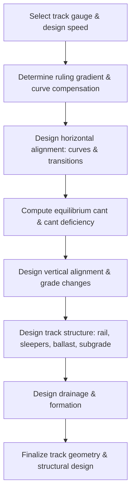
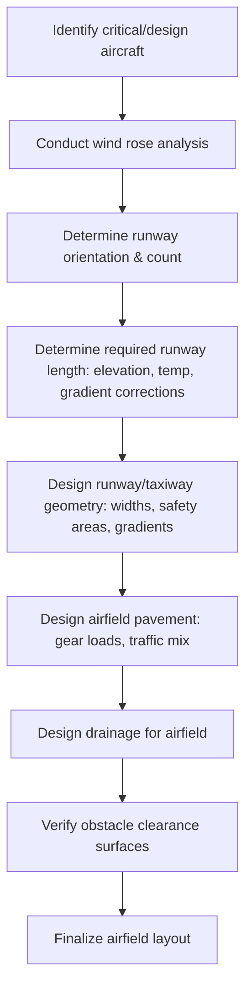

## Introduction to Railway and Airport Engineering

### Overview and Scope

Railway and airport engineering apply many of the same civil engineering fundamentals used in highway design — geometric alignment, earthwork, drainage, and pavement/track structure — but adapted to the distinct operational, mechanical, and safety constraints of rail vehicles and aircraft. This introduction surveys the core design domains of each mode: track structure and rail geometric design, and airfield geometric design and pavement.

### Railway Engineering Fundamentals

**Track Structure Components**

**Key Points**

- **Rail**: Steel members providing running surface and structural support; classified by weight per unit length (e.g., kg/m or lb/yd) — heavier rail sections support higher axle loads and speeds.
- **Sleepers (ties)**: Transverse members (timber, concrete, or steel) that distribute rail loads to the ballast and maintain gauge (the fixed spacing between rails).
- **Ballast**: Crushed stone layer beneath sleepers providing load distribution, drainage, and lateral/longitudinal track stability.
- **Subballast and subgrade**: Underlying layers analogous to pavement base/subgrade, distributing load to the natural foundation and providing separation to prevent ballast fouling.
- **Fastening systems**: Connect rail to sleeper (e.g., elastic clips, spikes) while accommodating thermal expansion in continuous welded rail (CWR).

**Track Gauge**

The distance between the inner faces of the rail heads. **Standard gauge** (1,435 mm / 4 ft 8½ in) is used by the majority of the world's railways; **broad gauge** and **narrow gauge** systems exist in various countries for historical, capacity, or cost reasons.

### Railway Horizontal Alignment

Similar in principle to highway horizontal curves, but with key differences arising from steel-wheel-on-steel-rail dynamics (much lower available lateral friction than rubber tires on pavement).

**Cant (Superelevation) in Rail**

Rail superelevation, called **cant**, banks the track on curves by raising the outer rail relative to the inner rail:

$$E = \frac{G \cdot V^2}{127 R}$$

Where $E$ = equilibrium cant (mm), $G$ = track gauge (mm), $V$ = speed (km/h), $R$ = curve radius (m). This is the cant at which centrifugal force is exactly balanced (zero net lateral force on passengers/cargo) at the given speed.

**Cant Deficiency**: Since mixed traffic runs at varying speeds on the same curve, actual applied cant is often less than the equilibrium cant for the fastest trains, producing a **cant deficiency** — an allowable amount of unbalanced lateral acceleration that passengers and freight can tolerate, bounded by comfort and stability limits (tilting trains can safely operate with higher cant deficiency than conventional stock).

**Transition (Spiral) Curves in Rail**

As in highway design, transition curves gradually introduce curvature and cant, preventing abrupt lateral jerk. Rail transition curves (often clothoid or cubic parabola forms) are typically longer, proportionally, than highway spirals due to tighter passenger comfort and mechanical (truck-hunting) constraints.

### Railway Vertical Alignment

- **Ruling gradient**: The maximum sustained grade that determines the maximum train load a locomotive can haul over a given route — a critical economic parameter since it governs the trailing tonnage per train.
- **Compensated gradient**: On curves, additional resistance from flange friction requires the ruling gradient to be reduced ("compensated") to maintain the same net hauling capacity — commonly approximated as a reduction of about 0.04% grade per degree of curvature (value varies by standard/region).
- **Vertical curves**: Parabolic curves connect changes in grade, sized to limit vertical acceleration for passenger comfort, generally more conservative (larger radius/length per unit grade change) than equivalent highway design due to lower tolerance for vertical jerk in rail vehicles.

### Railway Design Process Flow

### Airport Engineering Fundamentals

**Airfield Geometric Design**

**Key Points**

- **Runway**: The primary paved surface for aircraft takeoff and landing; length is determined by the critical (design) aircraft's performance requirements, adjusted for elevation, temperature, and runway gradient.
- **Taxiway**: Connects runways to aprons/gates, designed for lower-speed ground maneuvering with tighter turning geometry standards than runways.
- **Apron (ramp)**: Area for aircraft parking, loading, and servicing.
- **Runway Safety Area (RSA)**: A defined graded area surrounding the runway providing a measure of safety in the event of an aircraft excursion.
- **Obstacle-free zones and approach surfaces**: Imaginary surfaces (per ICAO Annex 14 or FAA standards) that must remain clear of obstructions to protect aircraft approach and departure paths.

**Runway Length Determination**

Runway length is governed by the most demanding ("critical") design aircraft's takeoff/landing performance, adjusted using correction factors:

$$L_{corrected} = L_{base} \times \left[1 + 0.07\left(\frac{E}{300}\right)\right] \times \left[1 + 0.01(T - T_s)\right]$$

Where $L_{base}$ = reference runway length at sea level, standard temperature; $E$ = airport elevation (m); $T$ = mean daily maximum temperature of the hottest month; $T_s$ = standard temperature at that elevation. [Inference] Exact correction coefficients and reference methodology vary between FAA Advisory Circulars and ICAO methods — this represents a generalized approach; actual design must use the governing agency's specific correction procedure and aircraft performance charts.

Additional adjustments apply for effective runway gradient (differences between high and low points along the runway) and wind conditions (headwind component reduces required length).

### Runway Orientation and Wind Coverage

Runway orientation is selected to maximize the percentage of time crosswind components remain within acceptable limits for the aircraft mix expected to use the airport, typically assessed via a **wind rose analysis**.

**Key Points**

- **Usability factor**: The percentage of time crosswind component does not exceed the allowable limit (commonly targeted at ≥95% per ICAO recommendations, varying by runway classification/reference code).
- **Allowable crosswind component**: Depends on aircraft category — smaller aircraft generally have lower crosswind tolerance than large transport aircraft.
- Where a single runway cannot achieve adequate wind coverage, a **crosswind runway** in a different orientation may be required.

### Pavement Design for Airfields

Airfield pavements (flexible and rigid) follow similar structural principles to highway pavements but are designed for very different loading — fewer load repetitions but far higher individual gear loads, with load distributed through complex multi-wheel landing gear configurations.

**Key differences from highway pavement design:**

- Design methods (e.g., FAA's **FAARFIELD** software, using layered elastic or finite element analysis) explicitly model aircraft gear configurations (single, dual, dual-tandem, or complex gear) rather than a simple standard axle.
- **Equivalent Single Wheel Load (ESWL)** concepts historically translated multi-wheel gear loads into an equivalent single-wheel load for design purposes, though modern mechanistic methods increasingly analyze the full gear configuration directly.
- Critical pavement areas (touchdown zones, runway ends) may warrant thicker sections than less heavily trafficked areas (taxiway centerlines away from turns).

### Airport Design Process Flow

### Rail Cant vs. Airfield Runway Cross-Section (svg_diagram)

<svg xmlns="http://www.w3.org/2000/svg" viewBox="0 0 700 340">
<text x="350" y="25" font-size="16" text-anchor="middle" font-weight="bold">Rail Cant vs. Runway Cross-Slope (svg_diagram)</text>

<text x="160" y="55" font-size="14" text-anchor="middle" font-weight="bold">Railway Cant (Curve)</text>

<line x1="80" y1="180" x2="240" y2="150" stroke="`#4a5568`" stroke-width="6" />

<line x1="80" y1="200" x2="240" y2="170" stroke="`#4a5568`" stroke-width="6" />

<line x1="90" y1="185" x2="90" y2="195" stroke="`#1a202c`" stroke-width="2" />

<line x1="230" y1="155" x2="230" y2="165" stroke="`#1a202c`" stroke-width="2" />

<text x="60" y="215" font-size="11">Inner rail (low)</text>

<text x="220" y="140" font-size="11">Outer rail (raised = cant)</text>

<text x="100" y="260" font-size="11" fill="`#4a5568`">Outer rail elevated relative to</text>

<text x="100" y="275" font-size="11" fill="`#4a5568`">inner rail to balance centrifugal force</text>

<text x="530" y="55" font-size="14" text-anchor="middle" font-weight="bold">Runway Cross-Slope</text>

<path d="M 440 180 L 540 165 L 640 180" fill="none" stroke="`#4a5568`" stroke-width="6" />

<line x1="540" y1="165" x2="540" y2="185" stroke="`#1a202c`" stroke-dasharray="3,3" stroke-width="1" />

<text x="545" y="160" font-size="11">Centerline crown</text>

<text x="460" y="270" font-size="11" fill="`#4a5568`">Symmetric cross-slope sheds water</text>

<text x="460" y="285" font-size="11" fill="`#4a5568`">to both sides from centerline crown</text>

</svg>

### Worked Example

**Example**

A railway curve has a radius of 800 m, track gauge of 1,435 mm, and a design speed of 120 km/h. Determine the equilibrium cant.

$$E = \frac{G V^2}{127 R} = \frac{1435 \times 120^2}{127 \times 800} = \frac{1435 \times 14400}{101600} = \frac{20{,}664{,}000}{101{,}600} \approx 203 \text{ mm}$$

An equilibrium cant of approximately **203 mm** would be required to fully balance lateral forces at 120 km/h on this curve. Since this exceeds typical maximum applied cant limits (often capped around 150–180 mm for conventional track due to stationary/slow-train tilt and maintenance considerations), the design would need to accept a calculated cant deficiency for trains operating at this speed, or reduce the maximum permitted speed on the curve.

### Common Pitfalls and Practical Considerations

- **Applying highway superelevation logic directly to rail**: The much lower friction coefficient between steel wheel and steel rail means rail curve design relies far more heavily on cant and cant deficiency limits than on side friction, unlike highway curve design.
- **Neglecting curve compensation on grades**: Failing to reduce ruling gradient on curved track sections can result in locomotives being unable to start or maintain speed with their rated trailing tonnage.
- **Underestimating airfield pavement loading concentration**: [Inference] Airfield pavements experience far higher point loads per gear than highway pavements despite lower total load repetitions — applying highway-style traffic/ESAL-based design logic without adapting to aircraft gear configurations would significantly underdesign the pavement.
- **Wind coverage assumptions**: Using regional average wind data without site-specific wind rose analysis can lead to a runway orientation that underperforms the intended usability factor, especially at sites with significant local topographic wind effects.
- **Obstacle clearance surfaces**: Overlooking imaginary surface encroachments (from future planned structures, vegetation growth, or nearby development) is a common long-term airport safety compliance issue distinct from the initial geometric design.

**Related Topics**

- Highway Geometric Design
- Pavement Design Principles
- Highway Drainage Design
- Earthwork and Mass-Haul Diagrams
- Transportation Planning and Modal Choice
- Airport Master Planning
- Rail Vehicle Dynamics and Track-Train Interaction