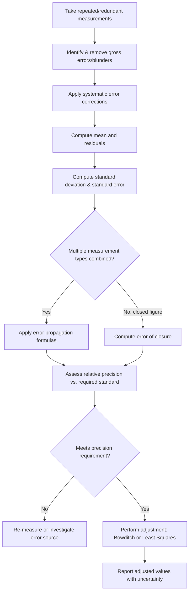

## Surveying Principles and Error Theory

### Overview and Scope

Surveying is the science and practice of determining the relative positions of points on, above, or beneath the Earth's surface, or establishing such points. Error theory is the mathematical framework for understanding, quantifying, and managing the unavoidable uncertainty inherent in all physical measurements — essential because no measurement is ever perfectly exact, and surveying practice depends on knowing how much confidence to place in a given result.

### Fundamental Surveying Principles

**Key Points**

- **Working from whole to part**: Establish overall control (high-precision reference points) first, then fill in detail relative to that control — this prevents accumulated error from progressively degrading accuracy across a large project.
- **Independent checks**: Every measurement should be verified through some form of redundancy (e.g., closing a traverse, checking angles against known geometric constraints) rather than accepted at face value.
- **Consistent datum and coordinate system**: All measurements must relate to a common, clearly defined horizontal and vertical reference (datum) to be meaningful and combinable.
- **Documentation and traceability**: Field notes, instrument calibration records, and observation conditions must be recorded to support later verification, adjustment, or legal defense of survey results.

### Types of Errors

**Key Points**

- **Systematic (cumulative) errors**: Follow a predictable physical or mathematical law and accumulate consistently in one direction if uncorrected (e.g., a tape of incorrect length, instrument miscalibration, atmospheric refraction). These can be modeled and corrected through calibration or mathematical correction formulas.
- **Random (accidental) errors**: Small, unpredictable variations remaining after systematic and gross errors are removed, arising from the observer's limits of perception and instrument reading precision. These follow the laws of probability and are managed statistically rather than eliminated.
- **Gross errors (mistakes/blunders)**: Large errors from carelessness (misreading a scale, transposing digits, incorrect instrument setup). These must be detected and eliminated entirely — they are not part of statistical error analysis, since they do not follow a probability distribution in the way random errors do.

### Precision vs. Accuracy

**Key Points**

- **Precision**: The degree of refinement and consistency in a group of measurements — how closely repeated measurements agree with each other, regardless of whether they are correct.
- **Accuracy**: The degree of conformity of a measurement to its true (or accepted) value.
- A measurement set can be precise but inaccurate (consistent but systematically biased) or accurate on average but imprecise (scattered but centered near the truth) — the two concepts are independent, though good survey practice seeks both.

### Statistical Foundations of Error Theory

Random errors are assumed to follow a **normal (Gaussian) distribution**, which underlies the standard statistical treatment of surveying measurements.

**Measures of Central Tendency and Dispersion**

**Mean (most probable value) of repeated observations:**

$$\bar{x} = \frac{\sum_{i=1}^{n} x_i}{n}$$

**Residual** (deviation of an individual observation from the mean):

$$v_i = \bar{x} - x_i$$

**Standard deviation of a single observation:**

$$\sigma = \sqrt{\frac{\sum v_i^2}{n-1}}$$

The use of $n-1$ (rather than $n$) in the denominator applies **Bessel's correction**, which ensures an unbiased estimate of the population variance from a sample when the true mean is unknown and estimated from the same data.

**Standard deviation of the mean (standard error):**

$$\sigma_{\bar{x}} = \frac{\sigma}{\sqrt{n}}$$

This demonstrates that averaging more independent observations reduces the uncertainty of the mean, but only in proportion to the square root of the number of observations — a law of diminishing returns for repeated measurement.

### Error Propagation

When a quantity is computed from multiple independently measured values, the uncertainty of the result depends on the uncertainties of the individual measurements, combined according to the **propagation of variance** (general law of propagation of errors), derived from a first-order Taylor series expansion:

$$\sigma_f^2 = \sum_{i=1}^{n}\left(\frac{\partial f}{\partial x_i}\right)^2 \sigma_{x_i}^2$$

**Common simplified cases:**

**Sum or difference of independent measurements:**

$$\sigma_{sum} = \sqrt{\sigma_1^2 + \sigma_2^2 + \cdots + \sigma_n^2}$$

**Error of the sum of $n$ measurements each with equal standard deviation $\sigma$:**

$$\sigma_{sum} = \sigma\sqrt{n}$$

This is a key practical result: total error in a chain of measurements (e.g., a taped traverse) grows with the square root of the number of measurements, not linearly — reflecting the partial cancellation expected from independent random errors of both signs.

### Most Probable Value and Weighted Observations

When observations have differing reliability (e.g., angles measured with different instruments, or a different number of repetitions), a **weighted mean** gives more influence to more reliable (lower-variance) observations:

$$\bar{x}_w = \frac{\sum w_i x_i}{\sum w_i}$$

Where weight $w_i$ is commonly taken as inversely proportional to the variance of observation $i$:

$$w_i \propto \frac1{\sigma_i^2}$$

[Inference] The specific weighting scheme (e.g., inverse of variance, inverse of number of setups, or inverse of distance for leveling) depends on the type of survey observation and adopted convention — verify the weighting basis matches the observation type and agency practice being followed.

### Traverse Closure and Error of Closure

For a closed traverse (a series of connected survey lines returning to the starting point or between two known control points), the **linear error of closure** quantifies the accumulated discrepancy between the computed and expected closing position:

$$E_c = \sqrt{(\Delta E)^2 + (\Delta N)^2}$$

Where $\Delta E$ and $\Delta N$ are the closure discrepancies in the easting and northing directions respectively.

**Relative precision** expresses this error as a ratio relative to the total traverse length:

$$\text{Relative Precision} = \frac{E_c}{\text{Total Traverse Length}} = \frac{1}{X}$$

Commonly expressed as "1 part in X" (e.g., 1:10,000) — a standard benchmark for judging whether a traverse meets the precision requirement of its intended use (e.g., 1:5,000 for general mapping, tighter for boundary or engineering control surveys).

### Traverse Adjustment Methods

**Compass (Bowditch) Rule**

Distributes closure error to each traverse leg's latitude/departure in proportion to the leg's length relative to the total traverse perimeter:

$$\text{Correction}_{L_i} = -\left(\frac{\text{Length}_i}{\text{Total Length}}\right) \times \Delta L_{total}$$

Where $\Delta L_{total}$ is the total latitude (or departure) misclosure. [Inference] The Bowditch rule is an empirical, simplified adjustment assuming errors are roughly proportional to distance measured, rather than a rigorous least-squares solution — it remains widely used for its simplicity in routine work, but least-squares adjustment is preferred for higher-precision or legally critical surveys.

**Least Squares Adjustment**

A rigorous statistical method that distributes corrections to all observations simultaneously such that the sum of the squares of the weighted residuals is minimized:

$$\text{minimize} \sum w_i v_i^2$$

Least squares adjustment properly accounts for the actual precision (weight) of each observation and provides statistically defensible estimates of both adjusted values and their remaining uncertainty — the standard approach in modern control surveying, GNSS network adjustment, and precise engineering surveys.

### Error Theory Application Flow

### Normal Distribution of Random Errors (svg_diagram)

<svg xmlns="http://www.w3.org/2000/svg" viewBox="0 0 700 340">
<text x="350" y="25" font-size="16" text-anchor="middle" font-weight="bold">Normal Distribution of Random Errors (svg_diagram)</text>

<line x1="80" y1="280" x2="620" y2="280" stroke="#1a202c" stroke-width="2" />
<text x="350" y="310" font-size="13" text-anchor="middle">Error magnitude</text>

<path d="M 100 280 C 200 280 220 80 350 80 C 480 80 500 280 600 280" fill="none" stroke="#3182ce" stroke-width="3" />

<line x1="350" y1="80" x2="350" y2="280" stroke="#e53e3e" stroke-dasharray="4,4" stroke-width="1.5" />
<text x="358" y="100" font-size="12" fill="#e53e3e">Mean (most probable value)</text>

<line x1="270" y1="280" x2="270" y2="160" stroke="#38a169" stroke-dasharray="3,3" stroke-width="1" />
<line x1="430" y1="280" x2="430" y2="160" stroke="#38a169" stroke-dasharray="3,3" stroke-width="1" />
<text x="230" y="255" font-size="11" fill="#38a169">-1σ</text>
<text x="435" y="255" font-size="11" fill="#38a169">+1σ</text>

<text x="140" y="150" font-size="11" fill="`#4a5568`">~68% of observations</text>

<text x="140" y="165" font-size="11" fill="`#4a5568`">fall within ±1σ</text>

</svg>

### Worked Example

**Example**

An angle is measured five times with the following values: 45°10'12", 45°10'08", 45°10'15", 45°10'10", 45°10'10". Determine the most probable value and standard deviation.

Working in seconds relative to 45°10'00": values are 12, 8, 15, 10, 10.

$$\bar{x} = \frac{12+8+15+10+10}{5} = \frac{55}{5} = 11 \Rightarrow \text{MPV} = 45°10'11"$$

Residuals: $v_i = \bar{x} - x_i$: $-1, 3, -4, 1, 1$

$$\sum v_i^2 = 1 + 9 + 16 + 1 + 1 = 28$$

$$\sigma = \sqrt{\frac{28}{5-1}} = \sqrt{7} \approx 2.65"$$

The most probable value of the angle is **45°10'11"**, with a standard deviation of approximately **±2.6 arcseconds** for a single observation. The standard error of this mean would be $\sigma/\sqrt{5} \approx 1.2"$, reflecting the improved confidence gained from averaging five independent readings.

### Common Pitfalls and Practical Considerations

- **Confusing precision with accuracy**: A tightly clustered set of readings (high precision) can still be systematically wrong (low accuracy) if an uncorrected systematic error is present — precision alone never validates a measurement's correctness.
- **Treating blunders statistically**: Attempting to average out a gross error (e.g., a misread scale) rather than identifying and removing it corrupts the entire statistical analysis; blunder detection must precede any error-theory calculation.
- **Misapplying the Bowditch rule to high-precision work**: [Inference] Using compass rule adjustment for control surveys requiring legal or high-precision standards (e.g., cadastral boundary or geodetic control) is generally considered inadequate compared to a proper least-squares adjustment, since Bowditch does not rigorously account for actual observation weights.
- **Ignoring correlation between observations**: The basic error propagation formulas assume independence between measurements; when observations share a common error source (e.g., the same miscalibrated instrument used throughout), the simple square-root-of-sum-of-squares approach underestimates the true combined uncertainty.
- **Insufficient redundancy**: A survey with no independent checks (e.g., an open, unclosed traverse) provides no means of detecting whether errors — systematic or gross — have occurred, undermining confidence in the final result regardless of how carefully individual readings were taken.

**Related Topics**

- Differential and Trigonometric Leveling
- Traverse Computations and Coordinate Geometry
- Global Navigation Satellite Systems (GNSS) Surveying
- Total Station and Electronic Distance Measurement (EDM)
- Geodesy and Datum Transformations
- Least Squares Adjustment of Survey Networks
- Topographic and Boundary Surveying