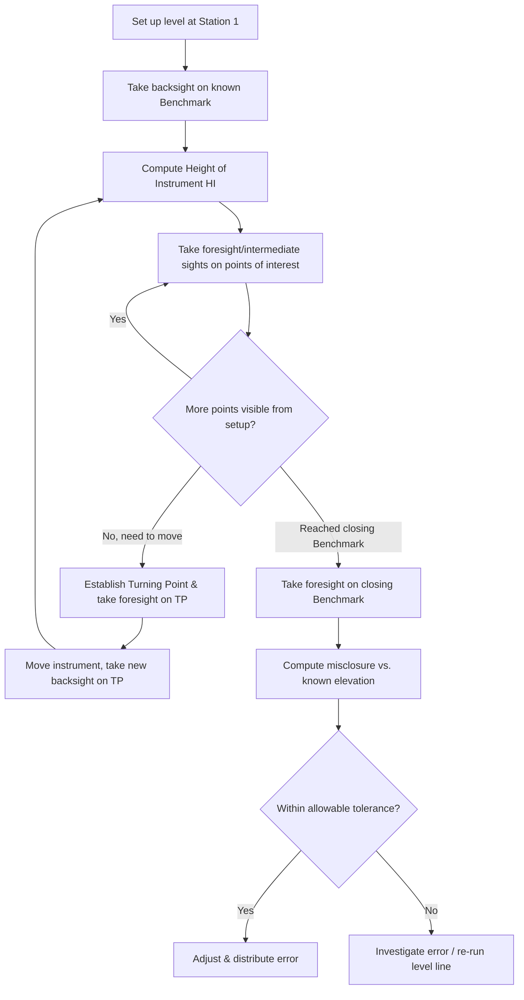

## Leveling and Elevation Determination

### Overview and Scope

Leveling is the branch of surveying concerned with determining the elevations (heights above a reference datum) of points, or the difference in elevation between points. It underlies virtually all civil engineering work requiring vertical control — road profiles, drainage grades, construction layout, and topographic mapping — and depends on establishing a consistent **vertical datum**, most commonly a mean sea level reference or a defined benchmark network.

### Fundamental Concepts and Terminology

**Key Points**

- **Datum**: The reference surface from which elevations are measured (e.g., Mean Sea Level, or a local/geodetic vertical datum).
- **Benchmark (BM)**: A physically marked point of known, established elevation, used as a starting/closing reference for leveling operations.
- **Backsight (BS)**: A rod reading taken on a point of known or previously determined elevation, used to determine the instrument's height.
- **Foresight (FS)**: A rod reading taken on a point whose elevation is being determined, used to compute that point's elevation from the instrument height.
- **Turning Point (TP)**: A temporary point used solely to carry the level line forward when a single instrument setup cannot see both the last known point and the next point of interest; requires both a foresight and a subsequent backsight reading.
- **Height of Instrument (HI)**: The elevation of the line of sight of the leveling instrument, computed as the known elevation plus the backsight reading.
- **Intermediate Sight (IS)**: A rod reading taken on a point where only the elevation (not the ability to continue the level run) is needed, without serving as a turning point.

### Types of Leveling

**Key Points**

- **Differential leveling**: Uses a level instrument and graduated rod to determine elevation differences between points, generally the most common and precise method for establishing vertical control over moderate distances.
- **Trigonometric leveling**: Uses a total station or theodolite to measure a vertical (zenith) angle and a slope distance to a point, then computes elevation difference trigonometrically — useful for steep terrain or long sights where direct differential leveling is impractical.
- **Barometric leveling**: Uses atmospheric pressure differences (which correlate with elevation) to estimate elevation differences — low precision, mainly used for reconnaissance-level work.
- **GNSS (GPS) leveling**: Determines ellipsoidal heights via satellite positioning, which must be converted to orthometric (elevation above mean sea level) heights using a geoid model, since GNSS heights are referenced to a mathematical ellipsoid rather than the physical gravity-based datum used in conventional leveling.

### Differential Leveling Procedure and Computation

**Height of Instrument (HI) Method**

$$HI = \text{Elev}_{known} + BS$$

$$\text{Elev}_{unknown} = HI - FS$$

This method computes the height of instrument at each setup, then derives the elevation of every foresight and intermediate sight point directly from that HI — efficient when many intermediate points must be determined at a single setup (e.g., cross-sections, topographic detail points).

**Rise and Fall Method**

Compares consecutive backsight and foresight readings directly to determine whether the ground rises or falls between points:

$$\text{Rise} = BS - FS \quad (\text{if } BS > FS)$$

$$\text{Fall} = FS - BS \quad (\text{if } FS > BS)$$

This method provides a built-in arithmetic check (the sum of backsights minus the sum of foresights should equal the sum of rises minus the sum of falls, which should equal the total elevation difference), making it preferred for work requiring a high degree of internal verification, though it is more laborious for large data sets with many intermediate sights.

### Leveling Field Procedure Flow

### Curvature and Refraction Correction

Over longer sight distances, the Earth's curvature causes the apparent line of sight to diverge from a true level surface, while atmospheric refraction bends the line of sight, partially compensating for curvature. The combined correction:

$$C\&R = 0.0675 \, d^2$$

Where $C\&R$ is the combined curvature and refraction correction (m), and $d$ is the sight distance (km). [Inference] The coefficient 0.0675 assumes a "standard" refraction coefficient (often taken as $k \approx 0.13$–$0.14$); actual atmospheric refraction is variable with temperature gradient and time of day, making this correction an approximation rather than a fixed physical constant — balancing backsight and foresight distances at each setup is the standard field practice used to cancel this error rather than rely solely on the formula.

**Practical mitigation**: Keeping backsight and foresight distances approximately equal at each instrument setup causes the curvature and refraction errors (and most collimation/instrument errors) to cancel automatically, without needing to apply the correction formula explicitly — this is why balanced sight distances are a standard field procedure in precise differential leveling.

### Instrumental (Collimation) Error

If the line of sight of the level is not perfectly horizontal when the bubble is centered (a collimation error), an error proportional to sight distance is introduced into every reading, in the same direction. As with curvature/refraction, **balancing backsight and foresight distances** at each setup causes this systematic error to cancel between the two readings, which is a primary reason (alongside curvature/refraction cancellation) that field procedure emphasizes distance balancing over pure geometric convenience.

### Reciprocal Leveling

Used when balancing sight distances is not possible (e.g., leveling across a wide river or valley), reciprocal leveling takes readings from both ends of the line, with the instrument set up near each end in turn. Averaging the two independently determined elevation differences cancels the effects of curvature, refraction, and collimation error, since both effects are inverted between the two setups:

$$\Delta h = \frac{(\Delta h_1) + (\Delta h_2)}{2}$$

Where $\Delta h_1$ and $\Delta h_2$ are the elevation differences computed from each instrument position.

### Trigonometric Leveling Computation

$$\Delta h = S\sin(z) + h_i - h_r + C\&R$$

Where:

- $S$ = measured slope distance
- $z$ = zenith angle from vertical
- $h_i$ = height of instrument above the ground point at the setup
- $h_r$ = height of the target/reflector above the ground point at the observed station
- $C\&R$ = curvature and refraction correction (significant at longer distances)

[Inference] Sign conventions and exact term arrangement vary between references depending on whether zenith angle or vertical angle from horizontal is used — always confirm the convention matches the instrument/software being used.

### Leveling Network Adjustment and Misclosure

For a leveling circuit (loop) returning to its starting benchmark, or a line run between two known benchmarks, the **misclosure** is the difference between the measured and known (or expected) elevation difference. Allowable misclosure is commonly specified as a function of the square root of the distance leveled or number of setups, reflecting the random-error accumulation principle from error theory:

$$C = k\sqrt{K}$$

Where $C$ = allowable misclosure (mm), $K$ = total distance leveled (km), and $k$ is a constant reflecting the required order/class of accuracy (e.g., smaller $k$ for first-order geodetic leveling, larger for lower-order engineering leveling). [Inference] The specific value of $k$ is set by the governing standard (e.g., national geodetic survey specifications) and differs substantially between precision classes — always reference the applicable specification rather than assuming a universal constant.

### Cross-Section Leveling Setup (svg_diagram)

<svg xmlns="http://www.w3.org/2000/svg" viewBox="0 0 700 340">
<text x="350" y="25" font-size="16" text-anchor="middle" font-weight="bold">Differential Leveling Setup (svg_diagram)</text>

<path d="M 60 280 L 200 260 L 350 240 L 500 220 L 640 200" fill="none" stroke="#4a5568" stroke-width="2" />

<line x1="350" y1="240" x2="350" y2="120" stroke="#1a202c" stroke-width="1" stroke-dasharray="2,2" />
<circle cx="350" cy="120" r="6" fill="#2d3748" />
<text x="360" y="115" font-size="11">Level Instrument</text>
<line x1="150" y1="120" x2="550" y2="120" stroke="#e53e3e" stroke-width="1.5" stroke-dasharray="6,3" />
<text x="555" y="123" font-size="11" fill="#e53e3e">Line of Sight (HI)</text>

<line x1="200" y1="260" x2="200" y2="130" stroke="#3182ce" stroke-width="4" />
<text x="175" y="290" font-size="12" fill="#3182ce">BM (Backsight)</text>
<line x1="200" y1="120" x2="220" y2="105" stroke="#3182ce" stroke-width="1" />
<text x="205" y="100" font-size="10" fill="#3182ce">BS reading</text>

<line x1="500" y1="220" x2="500" y2="130" stroke="#38a169" stroke-width="4" />
<text x="470" y="240" font-size="12" fill="#38a169">TP/Point (Foresight)</text>
<line x1="500" y1="120" x2="520" y2="105" stroke="#38a169" stroke-width="1" />
<text x="505" y="100" font-size="10" fill="#38a169">FS reading</text>
</svg>

### Worked Example

**Example**

A differential leveling run starts at Benchmark A (elevation = 100.000 m). Readings taken: BS on A = 1.520 m; FS on TP1 = 2.105 m; BS on TP1 = 1.875 m; FS on Benchmark B = 0.995 m. Determine the elevation of Benchmark B.

$$HI_1 = 100.000 + 1.520 = 101.520 \text{ m}$$

$$\text{Elev}_{TP1} = 101.520 - 2.105 = 99.415 \text{ m}$$

$$HI_2 = 99.415 + 1.875 = 101.290 \text{ m}$$

$$\text{Elev}_{B} = 101.290 - 0.995 = 100.295 \text{ m}$$

The computed elevation of Benchmark B is **100.295 m**. As an arithmetic check: $\sum BS - \sum FS = (1.520+1.875) - (2.105+0.995) = 3.395 - 3.100 = 0.295$ m, which matches the net elevation difference (100.295 − 100.000 = 0.295 m), confirming internal consistency of the computation.

### Common Pitfalls and Practical Considerations

- **Unbalanced sight distances**: Failing to keep backsight and foresight distances approximately equal at each setup allows curvature, refraction, and collimation errors to accumulate rather than cancel — a frequent source of systematic error in field leveling.
- **Rod not held vertically (plumb) during a sight**: Even slight rod tilt introduces a small but systematic positive bias into every reading, since a tilted rod always reads higher than a truly vertical one at the point of intersection with the line of sight.
- **Settling of turning points**: Using an unstable or soft turning point (rather than a solid, well-defined point) can allow the rod's supporting point to settle slightly between the foresight and subsequent backsight reading, introducing an undetectable error into the level run.
- **Confusing ellipsoidal and orthometric heights**: [Inference] Directly comparing raw GNSS-derived elevations with conventional spirit-leveled elevations without applying an appropriate geoid model correction will produce discrepancies, since the two height systems are referenced to fundamentally different surfaces (mathematical ellipsoid vs. gravity-based geoid/mean sea level).
- **Ignoring allowable misclosure standards**: Accepting a leveling circuit's closure without checking it against the specification appropriate to the required order of accuracy can mean an out-of-tolerance error goes undetected and uncorrected into subsequent design work.

**Related Topics**

- Surveying Principles and Error Theory
- Traverse Computations and Coordinate Geometry
- Global Navigation Satellite Systems (GNSS) Surveying
- Total Station and Electronic Distance Measurement (EDM)
- Geodesy and Vertical Datum Transformations
- Topographic Surveying and Contour Mapping
- Construction Layout and Grade Staking