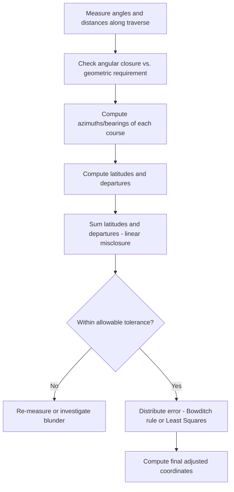

## Traversing and Triangulation

### Overview and Scope

Traversing and triangulation are classical horizontal control survey methods used to establish networks of accurately positioned points across a project area. **Traversing** builds control by measuring a connected series of angles and distances along a path of stations. **Triangulation** (and its close relative, trilateration) establishes control by measuring angles (and/or distances) within a network of interconnected triangles. Both methods remain foundational, even as GNSS has supplemented or replaced them for many applications, because they underpin the geometric logic used in coordinate computation, closure checking, and network adjustment.

### Traverse Fundamentals

**Key Points**

- **Traverse**: A series of connected lines (courses) whose lengths and directions are measured, used to determine the coordinates of a series of points.
- **Closed traverse**: Begins and ends at the same point, or at two points of known position — allows a mathematical check on measurement consistency (misclosure).
- **Open traverse**: Does not close back on itself or a known point — provides no internal check, and is generally avoided for precise or legally significant work except when absolutely necessary (e.g., route surveys where closure is impractical).
- **Loop traverse**: A specific closed traverse that returns to its own starting point.
- **Link (connecting) traverse**: A closed traverse that begins at one known control point and ends at a different known control point.

### Traverse Angle Measurement Conventions

**Interior angles**: Measured on the inside of a closed polygon traverse; the sum of interior angles of a closed polygon traverse must equal:

$$\sum \text{Interior Angles} = (n-2) \times 180°$$

Where $n$ is the number of sides (stations) in the traverse — a fundamental geometric check independent of any distance measurement.

**Deflection angles**: Measured from the prolongation of the previous course to the following course, recorded as right (clockwise) or left (counterclockwise) — commonly used in route/highway traverses.

**Azimuths and bearings**: Directions can be expressed as **azimuths** (clockwise angle from a reference north, 0°–360°) or **bearings** (acute angle from north or south, referenced to a quadrant, e.g., N45°E).

### Traverse Computations

**Latitudes and Departures**

Each traverse course is resolved into its north-south (**latitude**) and east-west (**departure**) components:

$$\text{Latitude} = L \cos(\alpha)$$

$$\text{Departure} = L \sin(\alpha)$$

Where $L$ is the course length and $\alpha$ is its azimuth (measured clockwise from north).

**Closure Check**

For a closed loop traverse, the algebraic sum of latitudes and the algebraic sum of departures should each equal zero (or match a known displacement, for a link traverse):

$$\sum \text{Latitudes} = 0 \quad \sum \text{Departures} = 0$$

Any nonzero sum represents the **linear misclosure**, as covered under error theory, and must be distributed across the traverse (e.g., via the Compass/Bowditch rule or least squares) before final coordinates are computed.

**Coordinate Computation**

Once latitudes and departures are adjusted, coordinates of each station are computed successively:

$$N_{i+1} = N_i + \text{Latitude}_i \quad E_{i+1} = E_i + \text{Departure}_i$$

### Traverse Computation Process Flow

### Triangulation Fundamentals

**Key Points**

- **Triangulation**: Establishes horizontal control by measuring all (or nearly all) angles within a network of triangles, with only a limited number of baseline distances measured directly — historically valuable because angle measurement (via theodolite) was far more practical over long distances than direct distance measurement, especially before EDM.
- **Trilateration**: The complementary approach — measuring all side lengths of the triangle network (feasible once electronic distance measurement, EDM, became widely available) rather than the angles.
- **Triangulateration**: A hybrid approach measuring both angles and distances within the same network, generally providing the strongest and most redundant geometric solution.
- **Baseline**: A precisely measured reference distance (historically measured with great care using calibrated tapes/wires) from which the entire triangulated network's scale is derived.

### Triangulation Network Geometry

A triangulation network is built from interconnected triangles, quadrilaterals, or more complex polygon figures, propagating position from a known baseline and control point outward across the survey area.

**Strength of Figure**

The reliability of a triangulated figure depends heavily on its geometry — triangles with angles close to 60° (equilateral) propagate distance and position error far better than "sliver" triangles with very small or very large angles. A well-known measure of network reliability is the **strength of figure** ($R$), which combines angle condition equations and the distance-strength relationship of each figure; lower $R$ values indicate stronger (more reliable) geometry. [Inference] The exact strength-of-figure formula (historically associated with the U.S. Coast and Geodetic Survey) is a specialized geodetic computation; the core principle — avoid triangles with very acute or very obtuse angles — is the practically important takeaway even without reproducing the full formula.

**Angle Condition and Side Condition Equations**

In a triangulation network, redundant angle observations must satisfy geometric closure conditions:

$$\sum \text{Angles in each triangle} = 180° \, (+\text{spherical excess for large-scale geodetic work})$$

For a closed network of multiple triangles/quadrilaterals sharing common sides, **side condition equations** ensure that a side computed via the Law of Sines through one triangulation path matches the value computed via an alternative path — this redundancy is the basis for detecting errors and performing a rigorous least-squares adjustment of the entire network.

### Triangulation Computation — Law of Sines

Given a baseline of known length and measured angles, unknown sides are computed successively using the Law of Sines:

$$\frac{a}{\sin A} = \frac{b}{\sin B} = \frac{c}{\sin C}$$

Where $a, b, c$ are side lengths opposite angles $A, B, C$ respectively. Since only angles are directly measured in pure triangulation, all distances propagate from the single known baseline through successive application of this relationship across the network.

### Triangulation Network Figure (svg_diagram)

<svg xmlns="http://www.w3.org/2000/svg" viewBox="0 0 700 340">
<text x="350" y="25" font-size="16" text-anchor="middle" font-weight="bold">Chain of Triangles Network (svg_diagram)</text>

<polygon points="80,260 220,260 150,120" fill="none" stroke="#3182ce" stroke-width="2" />
<circle cx="80" cy="260" r="4" fill="#1a202c" />
<circle cx="220" cy="260" r="4" fill="#1a202c" />
<circle cx="150" cy="120" r="4" fill="#1a202c" />
<text x="60" y="280" font-size="11">A</text>
<text x="225" y="280" font-size="11">B</text>
<text x="150" y="105" font-size="11">C</text>
<text x="120" y="270" font-size="10" fill="#e53e3e">Baseline (known)</text>

<polygon points="220,260 360,260 300,140" fill="none" stroke="#3182ce" stroke-width="2" />
<circle cx="360" cy="260" r="4" fill="#1a202c" />
<circle cx="300" cy="140" r="4" fill="#1a202c" />
<text x="365" y="280" font-size="11">D</text>
<text x="300" y="125" font-size="11">E</text>

<polygon points="360,260 500,260 440,130" fill="none" stroke="#3182ce" stroke-width="2" />
<circle cx="500" cy="260" r="4" fill="#1a202c" />
<circle cx="440" cy="130" r="4" fill="#1a202c" />
<text x="505" y="280" font-size="11">F</text>
<text x="440" y="115" font-size="11">G</text>

<text x="200" y="300" font-size="10" fill="`#4a5568`">Shared side BC/BD provides redundancy</text>

<text x="200" y="315" font-size="10" fill="`#4a5568`">and enables side-condition adjustment checks</text>

</svg>

### Worked Example

**Example**

A closed loop traverse has four sides. Interior angles measured: 89°58', 90°02', 89°59', 90°03'. Check angular closure, then compute the azimuth of the first course if the azimuth of the traverse's starting reference line is 0°00' and the first interior angle turned is 89°58' (clockwise from back-azimuth).

**Angular closure check:**

$$\sum \text{Interior Angles required} = (4-2)\times 180° = 360°$$

$$\sum \text{Measured} = 89°58' + 90°02' + 89°59' + 90°03' = 360°02'$$

Angular misclosure = 360°02' − 360°00' = **+2 arcminutes**, which would be distributed (commonly equally) across the four angles — a correction of approximately −30" per angle — before proceeding to compute azimuths and coordinates. If this misclosure exceeds the allowable tolerance for the required survey order, the angles should be re-measured rather than blindly adjusted.

### Common Pitfalls and Practical Considerations

- **Using an open traverse for critical work**: An open traverse provides no internal geometric check, meaning a blunder or systematic error in any single measurement can propagate undetected into all subsequent coordinates — closed traverses (loop or link) should be used whenever feasible.
- **Ignoring strength of figure in triangulation network design**: Chaining together triangles with poor (very acute/obtuse) angles amplifies distance and position errors through the network; network design should favor well-conditioned (near-equilateral) triangle geometry where the terrain and control point locations allow.
- **Distributing angular misclosure without investigating cause**: [Inference] Routinely applying an equal (or weighted) correction to close out angular misclosure without asking why the misclosure occurred can mask an instrument problem (e.g., uncalibrated angle reading) that will recur and degrade future work if not identified.
- **Mixing bearing/azimuth conventions inconsistently**: Errors frequently arise from inconsistent application of azimuth vs. bearing/quadrant conventions, or clockwise vs. counterclockwise angle direction, when computing latitudes and departures — a consistent convention must be maintained (and clearly documented) throughout a project's computations.
- **Baseline measurement error propagation**: Since triangulation scale depends entirely on the measured baseline(s), an error in baseline length propagates proportionally through every computed distance in the network — baseline measurement historically received (and still deserves) disproportionate care and redundancy relative to other network measurements.

**Related Topics**

- Surveying Principles and Error Theory
- Leveling and Elevation Determination
- Least Squares Adjustment of Survey Networks
- Global Navigation Satellite Systems (GNSS) Surveying
- Total Station and Electronic Distance Measurement (EDM)
- Geodesy and Coordinate Systems
- Topographic and Boundary Surveying