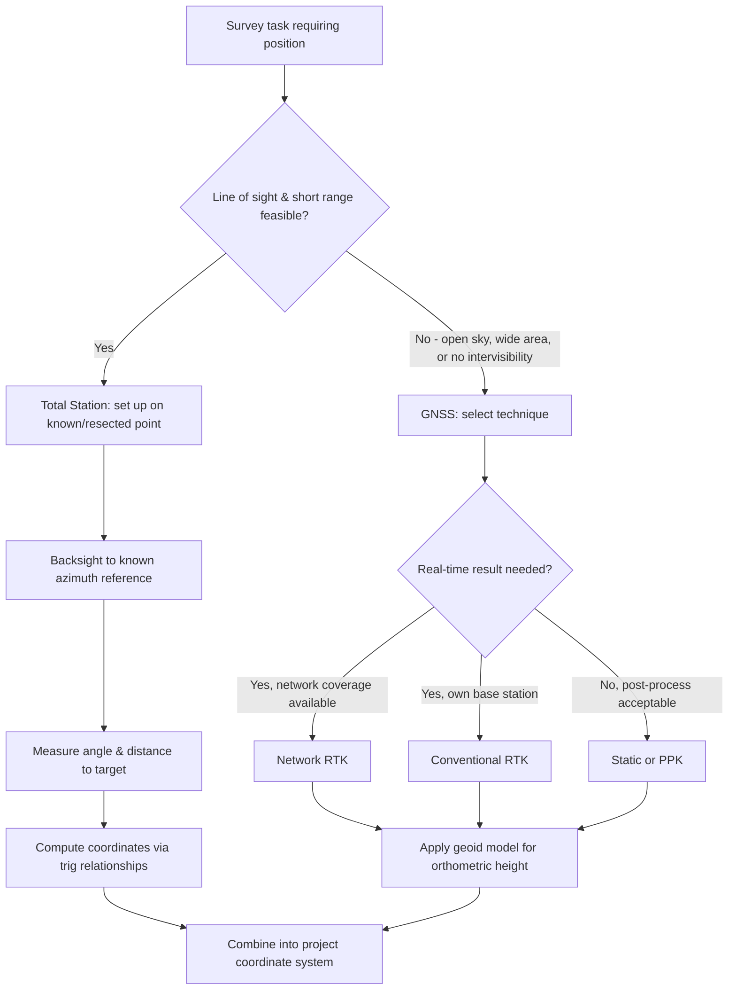

## Total Station and GNSS Surveying

### Overview and Scope

Total stations and Global Navigation Satellite Systems (GNSS) are the two dominant modern instruments for horizontal and vertical position determination in surveying, largely superseding classical triangulation and much manual traversing for routine work. A **total station** combines electronic angle measurement (theodolite) with electronic distance measurement (EDM) in a single instrument, providing precise position determination relative to a local setup. **GNSS** (of which GPS is the best-known constellation) determines absolute three-dimensional position anywhere on Earth's surface by measuring signals from orbiting satellites, referenced to a global geodetic datum.

### Total Station Fundamentals

**Key Points**

- **Electronic Distance Measurement (EDM)**: Measures slope distance by timing (or phase-comparing) a modulated infrared or laser signal reflected from a prism (or reflectorless, off a solid surface) back to the instrument.
- **Electronic angle measurement**: Digital encoders on the horizontal and vertical circles read angles automatically, eliminating manual vernier reading and its associated error.
- **On-board computation**: Modern total stations compute horizontal distance, elevation difference, and coordinates in real time from the raw slope distance and vertical angle, using the same trigonometric leveling relationships covered under leveling.
- **Robotic total stations**: Incorporate motorized tracking of a prism, allowing single-person operation (the operator holds the prism/rod while the instrument automatically tracks and points).

### Total Station Measurement Principle

The fundamental measurement from a total station setup to a target combines:

$$\text{Horizontal Distance} = S \sin(z)$$

$$\Delta \text{Elevation} = S\cos(z) + h_i - h_r$$

Where $S$ = measured slope distance, $z$ = zenith angle (measured from vertical), $h_i$ = height of instrument above the station point, and $h_r$ = height of the reflector/prism above the target point. This is functionally identical to the trigonometric leveling relationship, since a total station performs trigonometric leveling as an inherent part of every distance/angle observation.

**Coordinate Determination**

Given a known instrument station coordinate and a known backsight direction (azimuth), the coordinates of an observed point are computed via:

$$N_{point} = N_{station} + (\text{Horizontal Distance})\cos(\text{Azimuth})$$

$$E_{point} = E_{station} + (\text{Horizontal Distance})\sin(\text{Azimuth})$$

### Sources of Error in Total Station Work

**Key Points**

- **Instrument errors**: Collimation error (line of sight not perpendicular to the horizontal axis), horizontal/vertical axis errors, and circle eccentricity — many are compensated automatically by modern instruments or eliminated by taking both "face left" and "face right" (direct and reverse) observations and averaging.
- **Target/prism errors**: Prism constant (an offset specific to the reflector type) must be correctly entered into the instrument, or a systematic distance error results across all measurements using that prism.
- **Atmospheric corrections**: EDM distances are affected by air temperature and pressure (which affect the refractive index of the transmission medium); most total stations allow entry of atmospheric conditions to apply a correction to the raw measured distance.
- **Centering errors**: Errors in centering the instrument or target precisely over the survey point (using optical or laser plummets) directly translate into positional error, particularly significant for short sight distances.

### GNSS Fundamentals

**Key Points**

- **Constellations**: GPS (United States), GLONASS (Russia), Galileo (European Union), and BeiDou (China) are the major global constellations; modern receivers typically track multiple constellations simultaneously ("multi-GNSS") for improved accuracy and reliability.
- **Positioning principle**: A receiver determines its position by measuring the travel time (or carrier phase) of signals from multiple satellites, computing distances (pseudoranges) to each, and trilaterating a 3D position — requiring signals from at least four satellites to resolve position and receiver clock error simultaneously.
- **Code-based vs. carrier-phase positioning**: Code (pseudorange) positioning provides meter-level accuracy suitable for navigation; carrier-phase positioning, which tracks the satellite signal's wave cycles, enables the centimeter-level accuracy required for surveying, but requires resolving an initial "integer ambiguity" in the number of whole wavelengths between satellite and receiver.

### GNSS Surveying Techniques

**Static GNSS**

Two or more receivers occupy fixed points simultaneously for an extended period (minutes to hours, depending on baseline length and required accuracy), with post-processing used to resolve the carrier-phase ambiguities and compute highly precise baseline vectors between receivers — the highest-accuracy GNSS surveying method, commonly used for control network densification.

**Real-Time Kinematic (RTK)**

A base station (at a known or arbitrary fixed point) broadcasts carrier-phase correction data in real time to a roving receiver, allowing the rover to resolve ambiguities and compute centimeter-level positions instantly in the field — the dominant method for modern topographic and construction surveying due to its speed and immediate results.

**Network RTK (NRTK)**

Uses a network of permanently operating reference stations (rather than a single user-deployed base) to model and transmit corrections over a wider area via cellular data, eliminating the need for the surveyor to establish their own base station — increasingly the standard approach where cellular coverage and a suitable reference network exist.

**Post-Processed Kinematic (PPK)**

Similar data collection to RTK, but corrections are applied afterward in office software rather than in real time — useful where real-time communication links are unreliable, since data can still be logged and resolved later.

### GNSS Height Considerations

GNSS directly measures **ellipsoidal height** (height above a defined mathematical ellipsoid model of the Earth), which differs from the **orthometric height** (elevation above mean sea level / the geoid) used in conventional leveling and most engineering工作:

$$H_{orthometric} = h_{ellipsoidal} - N_{geoid}$$

Where $N_{geoid}$ is the geoid undulation (separation between the geoid and reference ellipsoid at that location), obtained from a geoid model appropriate to the region. [Inference] Using raw ellipsoidal heights directly as engineering elevations without applying the correct regional geoid model is a common source of significant (potentially meters-scale) vertical error in projects that mix GNSS and conventional leveling data.

### Total Station and GNSS Workflow Comparison

### GNSS Positioning Geometry (svg_diagram)

<svg xmlns="http://www.w3.org/2000/svg" viewBox="0 0 700 380">
<text x="350" y="25" font-size="16" text-anchor="middle" font-weight="bold">GNSS Trilateration Concept (svg_diagram)</text>

<circle cx="350" cy="300" r="60" fill="#a0c4e8" />
<text x="330" y="305" font-size="11">Earth</text>

<circle cx="350" cy="240" r="4" fill="#e53e3e" />
<text x="360" y="238" font-size="11" fill="#e53e3e">Receiver</text>

<circle cx="150" cy="80" r="6" fill="#2d3748" />
<circle cx="400" cy="60" r="6" fill="#2d3748" />
<circle cx="580" cy="120" r="6" fill="#2d3748" />
<circle cx="250" cy="50" r="6" fill="#2d3748" />
<text x="120" y="70" font-size="10">Sat 1</text>
<text x="405" y="50" font-size="10">Sat 2</text>
<text x="585" y="110" font-size="10">Sat 3</text>
<text x="255" y="40" font-size="10">Sat 4</text>

<line x1="150" y1="80" x2="350" y2="240" stroke="#3182ce" stroke-width="1" stroke-dasharray="4,3" />
<line x1="400" y1="60" x2="350" y2="240" stroke="#3182ce" stroke-width="1" stroke-dasharray="4,3" />
<line x1="580" y1="120" x2="350" y2="240" stroke="#3182ce" stroke-width="1" stroke-dasharray="4,3" />
<line x1="250" y1="50" x2="350" y2="240" stroke="#3182ce" stroke-width="1" stroke-dasharray="4,3" />

<text x="150" y="340" font-size="11" fill="`#4a5568`">Position solved from ≥4 pseudorange</text>

<text x="150" y="355" font-size="11" fill="`#4a5568`">measurements (3D position + clock error)</text>

</svg>

### Worked Example

**Example**

A total station is set up over a known point with instrument height 1.55 m. A prism is observed with height 1.75 m, at a slope distance of 150.250 m and a zenith angle of 88°30'. Determine the horizontal distance and elevation difference.

$$\text{Horizontal Distance} = 150.250 \times \sin(88°30') = 150.250 \times 0.99966 \approx 150.199 \text{ m}$$

$$\Delta \text{Elev} = 150.250 \times \cos(88°30') + 1.55 - 1.75$$

$$= 150.250 \times 0.02618 + (-0.20)$$

$$= 3.934 - 0.200 = 3.734 \text{ m}$$

The horizontal distance to the target is approximately **150.20 m**, and the target point is approximately **3.73 m higher** than the instrument station, assuming the entered instrument height, prism height, and atmospheric correction settings are all accurate.

### Common Pitfalls and Practical Considerations

- **Incorrect prism constant**: Failing to match the prism constant setting in the total station to the actual prism being used introduces a small but consistent systematic distance error across every measurement in the survey.
- **RTK "fixed" vs. "float" solutions**: [Inference] Accepting a GNSS RTK position while the receiver is still in a "float" ambiguity resolution state (rather than "fixed") can result in decimeter-level rather than centimeter-level accuracy without an obvious warning to an inattentive user — field procedure should always confirm fixed-solution status before recording critical points.
- **Multipath and canopy effects on GNSS**: Signal reflections off nearby structures (multipath) or signal blockage/degradation under tree canopy can silently degrade GNSS accuracy; total stations remain preferred in such obstructed environments.
- **Geoid model mismatch**: Using a geoid model that does not match the project's specified vertical datum, or omitting the geoid correction altogether, is a common cause of vertical errors when GNSS-derived elevations are compared against or combined with conventional leveling data.
- **Instrument calibration drift**: Both total stations and GNSS antennas require periodic calibration/verification (e.g., collimation checks, antenna phase center calibration) — assuming an instrument remains perfectly calibrated indefinitely without periodic checks risks undetected systematic error accumulating across a project.

**Related Topics**

- Surveying Principles and Error Theory
- Leveling and Elevation Determination
- Traversing and Triangulation
- Geodesy and Datum Transformations
- Geographic Information Systems (GIS) Integration
- Construction Layout and Machine Control
- Photogrammetry and LiDAR Surveying