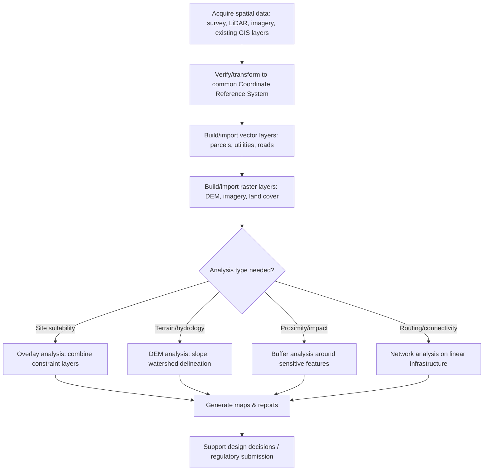

## Geographic Information Systems Basics

### Overview and Scope

A Geographic Information System (GIS) is a computer-based system for capturing, storing, managing, analyzing, and displaying spatially referenced data — information tied to a location on Earth. GIS extends surveying and geomatics data (coordinates, elevations, boundaries) into an analytical and decision-support framework, enabling civil engineers to integrate infrastructure data, terrain models, land use, environmental constraints, and utility networks within a common spatial reference system.

### Core GIS Data Models

**Key Points**

- **Vector data model**: Represents features as discrete geometric objects — **points** (e.g., utility poles, boreholes), **lines** (e.g., roads, pipelines, streams), and **polygons** (e.g., parcels, watersheds, land use zones) — each with associated attribute data stored in a linked table.
- **Raster data model**: Represents space as a grid of cells (pixels), each holding a value — used for continuous phenomena such as elevation (digital elevation models), satellite imagery, rainfall surfaces, or land cover classification.
- **Choosing a model**: Vector data is generally preferred for discrete, well-defined features requiring precise boundaries and attribute querying (e.g., cadastral parcels); raster data is preferred for continuous surfaces or when working with imagery-derived data.

### Attribute Data and the Relational Model

Every spatial feature in a GIS is linked to a **feature attribute table**, where each row represents a feature and each column represents an attribute (e.g., a road segment's name, surface type, and width). This relational structure allows:

- **Attribute queries**: Selecting features based on their non-spatial characteristics (e.g., "select all pipes with diameter > 300 mm").
- **Spatial queries**: Selecting features based on spatial relationships (e.g., "select all parcels within 100 m of a floodplain boundary").
- **Joins**: Linking external tabular data (e.g., a spreadsheet of survey results) to spatial features via a common identifier field.

### Coordinate Reference Systems (CRS)

**Key Points**

- **Geographic Coordinate System (GCS)**: Defines locations using angular units (latitude/longitude) on a reference ellipsoid/datum (e.g., WGS84).
- **Projected Coordinate System (PCS)**: Transforms the curved Earth surface onto a flat plane using a map projection (e.g., UTM, Transverse Mercator, State Plane), expressed in linear units (meters/feet) — necessary for accurate distance, area, and angle measurement in engineering applications, since geographic coordinates alone distort these properties.
- **Datum transformation**: Converting coordinates between different datums (e.g., a local national datum to WGS84) requires a defined transformation, which — if omitted or applied incorrectly — introduces systematic positional error, sometimes on the order of meters.

[Inference] Selecting an inappropriate or mismatched CRS for combined datasets is among the most common practical GIS errors; project data should always be verified to share (or be correctly transformed to) a single consistent CRS before spatial analysis.

### Fundamental GIS Analysis Operations

**Key Points**

- **Buffering**: Creates a zone of a specified distance around a feature (e.g., a 50 m buffer around a stream to identify a riparian setback area).
- **Overlay analysis**: Combines two or more spatial layers to identify relationships (e.g., intersecting a flood zone layer with a parcel layer to identify at-risk properties) — includes operations such as intersect, union, and clip.
- **Spatial interpolation**: Estimates values at unsampled locations based on nearby known values (e.g., generating a continuous elevation or rainfall surface from scattered survey points), using methods such as Inverse Distance Weighting (IDW), kriging, or triangulated irregular network (TIN) interpolation.
- **Network analysis**: Models connectivity and flow along linear features (e.g., shortest-path routing along a road network, or flow direction/accumulation within a stormwater or sewer network).
- **Digital Elevation Model (DEM) analysis**: Derives slope, aspect, watershed boundaries, and flow direction/accumulation from a raster elevation surface — directly supporting hydrologic and earthwork engineering analysis.

### Digital Terrain Representation

**Digital Elevation Model (DEM)**: A raster grid of elevation values, typically derived from LiDAR, photogrammetry, or interpolated survey/contour data.

**Triangulated Irregular Network (TIN)**: A vector-based terrain model constructed from irregularly spaced elevation points connected into a network of non-overlapping triangles, preserving breaklines (e.g., ridges, stream channels) more precisely than a uniform raster grid — often preferred for engineering earthwork and drainage design where accurate representation of specific terrain features matters.

**Key Points**

- **Slope and aspect derivation**: Computed from the rate of elevation change across neighboring cells (DEM) or triangle faces (TIN); fundamental inputs to erosion risk assessment, site grading, and hydrologic modeling.
- **Watershed delineation**: GIS hydrologic tools trace flow direction and accumulation across a DEM to automatically delineate drainage basin boundaries and stream networks, supporting the hydrology inputs described under highway drainage design.

### GIS Workflow for a Civil Engineering Project

### Vector vs. Raster Data Models (svg_diagram)

<svg xmlns="http://www.w3.org/2000/svg" viewBox="0 0 700 340">
<text x="350" y="25" font-size="16" text-anchor="middle" font-weight="bold">Vector vs. Raster Representation (svg_diagram)</text>

<text x="160" y="55" font-size="14" text-anchor="middle" font-weight="bold">Vector Model</text>

<rect x="60" y="70" width="200" height="180" fill="none" stroke="`#a0aec0`" stroke-width="1" />

<circle cx="100" cy="100" r="5" fill="`#e53e3e`" />

<text x="108" y="103" font-size="10">Point (e.g., manhole)</text>

<line x1="80" y1="150" x2="230" y2="140" stroke="`#3182ce`" stroke-width="3" />

<text x="80" y="165" font-size="10">Line (e.g., pipe)</text>

<polygon points="90,200 180,190 220,230 130,240" fill="`#68d391`" opacity="0.6" stroke="`#2f855a`" stroke-width="2" />

<text x="95" y="255" font-size="10">Polygon (e.g., parcel)</text>

<text x="530" y="55" font-size="14" text-anchor="middle" font-weight="bold">Raster Model</text>

<g>

<rect x="440" y="70" width="30" height="30" fill="`#2c5282`" />

<rect x="470" y="70" width="30" height="30" fill="`#3182ce`" />

<rect x="500" y="70" width="30" height="30" fill="`#63b3ed`" />

<rect x="530" y="70" width="30" height="30" fill="`#90cdf4`" />

<rect x="560" y="70" width="30" height="30" fill="`#bee3f8`" />

<rect x="440" y="100" width="30" height="30" fill="`#3182ce`" />

<rect x="470" y="100" width="30" height="30" fill="`#63b3ed`" />

<rect x="500" y="100" width="30" height="30" fill="`#90cdf4`" />

<rect x="530" y="100" width="30" height="30" fill="`#bee3f8`" />

<rect x="560" y="100" width="30" height="30" fill="`#ebf8ff`" />

<rect x="440" y="130" width="30" height="30" fill="`#63b3ed`" />

<rect x="470" y="130" width="30" height="30" fill="`#90cdf4`" />

<rect x="500" y="130" width="30" height="30" fill="`#bee3f8`" />

<rect x="530" y="130" width="30" height="30" fill="`#ebf8ff`" />

<rect x="560" y="130" width="30" height="30" fill="`#ffffff`" stroke="`#e2e8f0`" />

</g>

<text x="440" y="185" font-size="10">Grid cells, each holding a value</text>

<text x="440" y="200" font-size="10">(e.g., elevation, land cover class)</text>

</svg>

### Worked Example

**Example**

A municipality wants to identify all building parcels located within a 100 m flood-risk buffer of a river, and also outside the designated commercial zoning polygon. Outline the GIS operations required.

1. **Buffer**: Generate a 100 m buffer polygon around the river line layer.
2. **Overlay (Intersect)**: Intersect the parcel polygon layer with the buffer polygon to identify parcels falling (even partially) within the flood-risk zone.
3. **Overlay (Erase/Difference)**: Remove (erase) any parcels that fall within the commercial zoning polygon layer from the intersected result.
4. **Attribute query**: Optionally refine the result further (e.g., select only parcels attributed as "residential" in the parcel attribute table).

The resulting output layer contains parcels that are both within the flood-risk buffer and outside the commercial zone — directly supporting a targeted flood-risk mitigation or notification program, assuming the input river, parcel, and zoning layers are accurately georeferenced and up to date.

### Common Pitfalls and Practical Considerations

- **CRS mismatches between layers**: Combining layers stored in different coordinate reference systems without reprojecting them to a common system produces silently incorrect spatial analysis results (misaligned overlays, wrong buffer distances) rather than an obvious error message in many GIS platforms.
- **Topology errors in vector data**: Unintentional gaps, overlaps, or dangling lines in digitized vector data (e.g., parcel boundaries that don't quite meet) can cause overlay and area calculations to produce subtly incorrect results — topology validation rules are commonly used to detect and flag these issues before analysis.
- **Raster resolution and generalization**: [Inference] Using a coarse-resolution DEM for fine-scale engineering analysis (e.g., detailed site grading) can mask important small-scale terrain features; conversely, unnecessarily high-resolution rasters for large-area analysis increase processing time without proportional accuracy benefit — resolution should be matched to the scale and purpose of the analysis.
- **Attribute data currency**: GIS layers are only as reliable as their last update; using outdated parcel, zoning, or utility attribute data for design or regulatory decisions can lead to conflicts with actual current conditions.
- **Confusing GIS analysis output with survey-grade accuracy**: Positions and measurements derived from GIS overlay/buffer operations inherit the accuracy limitations of their source data — a buffer or intersection result is not automatically survey-grade accurate simply because it was computed in a GIS.

**Related Topics**

- Surveying Principles and Error Theory
- Total Station and GNSS Surveying
- Highway Drainage Design (Hydrologic Analysis)
- Photogrammetry and LiDAR Surveying
- Digital Terrain Modeling and Earthwork Computation
- Geodesy and Coordinate Reference Systems
- Infrastructure Asset Management Systems