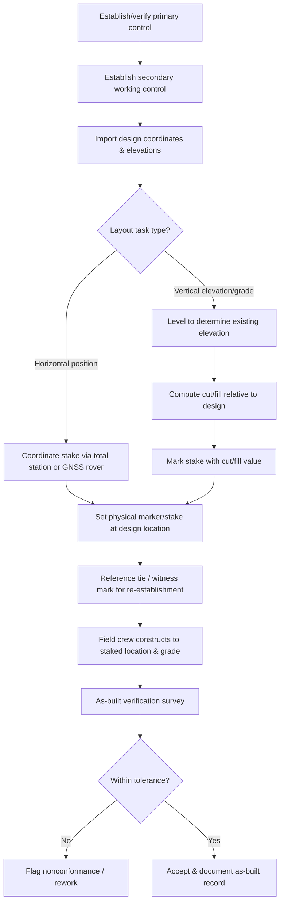

## Construction Layout and As-Built Surveying

### Overview and Scope

Construction layout (setting-out) is the process of translating design drawings into physical markers on the ground so that a structure is built in the correct location, orientation, and elevation. As-built surveying is the reciprocal process — measuring and documenting the actual completed (or in-progress) work to verify conformance with design, support payment/quantity verification, and produce accurate record drawings. Both rely directly on the control, leveling, and instrument techniques covered in prior surveying topics, applied to the specific demands of an active construction site.

### Establishing Construction Control

**Key Points**

- **Primary control**: A small number of highly accurate, well-monumented points established (typically via static GNSS or precise traversing/triangulation) before construction begins, from which all layout work is ultimately referenced.
- **Secondary (working) control**: Points established from primary control at convenient locations around the site, more numerous and less rigorously precise, used for day-to-day layout convenience — but must not accumulate error uncontrolled relative to primary control.
- **Control point protection**: Physical monuments must be placed where they are unlikely to be disturbed by construction traffic, excavation, or grading, and periodically checked for movement — a control point disturbed without detection can silently propagate positional error into every layout task referenced from it.
- **Reference ties (witness marks)**: Since layout points are frequently destroyed by construction activity (e.g., a point marking a column center will be buried by the footing), points are commonly tied to multiple offset reference marks so they can be re-established after disturbance.

### Horizontal Layout Methods

**Coordinate (Radial) Staking**

The dominant modern method: given the design coordinates of a point and the coordinates/orientation of the instrument setup, a total station (often with data collector/design file) computes and displays the horizontal angle and distance needed to locate the point directly, or a robotic instrument/GNSS rover guides the field crew in real time toward the target coordinate.

**Intersection Method**

A point is located by measuring/laying out angles from two known control points such that their sightlines intersect at the desired point — useful in situations without direct distance measurement capability, though largely superseded by EDM-equipped instruments.

**Offset Method**

Simple points are located by measuring a perpendicular offset distance from an established baseline or building line — commonly used for straightforward, low-precision layout tasks (e.g., fence lines) where full coordinate staking is unnecessary.

### Vertical Layout: Grade Staking and Batter Boards

**Key Points**

- **Grade stakes**: Marked with a **cut** or **fill** value indicating how much material must be removed or added at that point to reach design subgrade/finished elevation — computed as the difference between the design elevation and the existing ground elevation determined by leveling.
- **Batter boards**: Horizontal boards set at a fixed, known elevation and offset distance near excavation/foundation corners, allowing a string line to reestablish both the horizontal position and vertical reference after excavation removes the original layout point.
- **Laser levels**: Rotating or fixed-beam laser instruments projecting a level (or sloped) reference plane across a work area, widely used for high-production grading, pipe-laying, and slab work where continuous elevation reference is more practical than repeated total station shots.

**Cut/Fill Computation**

$$\text{Cut (or Fill)} = \text{Design Elevation} - \text{Existing Ground Elevation}$$

A positive result indicates fill is needed (ground must be raised); a negative result indicates cut (ground must be lowered) — sign conventions vary by agency/firm, so the stake marking convention must be clearly and consistently communicated to the construction crew.

### Construction Layout Workflow

### As-Built (Record) Surveying

**Key Points**

- **Purpose**: Documents the actual constructed position, elevation, and configuration of completed work — used for quality assurance/conformance checking, payment quantity verification, utility location records, and updating facility management/GIS records.
- **Timing**: Critical elements (e.g., underground utilities, foundation elements) must be surveyed **before** backfilling or covering, since access is lost afterward — a frequently cited best practice and common project failure point if overlooked.
- **Tolerance verification**: As-built measurements are compared against design values and the project's specified construction tolerances (which vary by element — e.g., tighter tolerance for structural steel connections than for rough grading) to determine conformance.
- **Record drawings ("as-builts")**: Final drawings incorporating verified as-built survey data, revised from the original design drawings to reflect actual constructed conditions — an important legal and operational document for the facility owner throughout the structure's service life.

### Machine Control Integration

**Key Points**

- **GNSS/total-station-guided machine control**: Modern earthmoving and grading equipment (graders, dozers, excavators) can be equipped with GNSS receivers or total-station-tracked prisms feeding real-time position data to an on-board computer, which compares actual blade/bucket position against a 3D design surface model and guides the operator (or automatically actuates hydraulics) to achieve design grade directly — reducing reliance on conventional grade staking for large-scale earthwork.
- **3D design surface models**: Machine control requires the design to exist as a digital terrain/surface model (often derived from the same TIN/DEM concepts used in GIS) rather than only 2D plan/profile drawings, representing a significant workflow shift from traditional stake-based construction.

[Inference] The degree of machine control adoption varies significantly by project scale, contractor capability, and regional practice — smaller or lower-budget projects may still rely primarily on conventional staking even where machine control technology exists.

### Construction Layout Setup (svg_diagram)

<svg xmlns="http://www.w3.org/2000/svg" viewBox="0 0 700 340">
<text x="350" y="25" font-size="16" text-anchor="middle" font-weight="bold">Batter Board and Grade Stake Setup (svg_diagram)</text>

<path d="M 200 250 L 200 200 L 400 200 L 400 250" fill="none" stroke="#4a5568" stroke-width="2" />
<text x="270" y="230" font-size="11" fill="#4a5568">Excavation</text>

<line x1="150" y1="150" x2="150" y2="190" stroke="#8b4513" stroke-width="4" />
<line x1="120" y1="150" x2="180" y2="150" stroke="#8b4513" stroke-width="4" />
<line x1="450" y1="150" x2="450" y2="190" stroke="#8b4513" stroke-width="4" />
<line x1="420" y1="150" x2="480" y2="150" stroke="#8b4513" stroke-width="4" />
<text x="105" y="140" font-size="10">Batter board</text>
<text x="410" y="140" font-size="10">Batter board</text>

<line x1="150" y1="150" x2="450" y2="150" stroke="#e53e3e" stroke-width="1.5" stroke-dasharray="5,3" />
<text x="270" y="145" font-size="10" fill="#e53e3e">String line (reference elevation)</text>

<line x1="200" y1="150" x2="200" y2="200" stroke="#1a202c" stroke-width="1" stroke-dasharray="2,2" />
<circle cx="200" cy="200" r="3" fill="#1a202c" />
<text x="205" y="195" font-size="10">Corner point</text>

<line x1="500" y1="280" x2="500" y2="230" stroke="#dd6b20" stroke-width="4" />
<text x="480" y="220" font-size="10" fill="#dd6b20">Grade stake</text>
<text x="480" y="300" font-size="10" fill="#dd6b20">Cut 0.35 m</text>
</svg>

### Worked Example

**Example**

A grade stake is to be set for a road subgrade with design elevation 125.400 m. A backsight is taken on a benchmark of elevation 126.000 m, giving a BS reading of 1.200 m (HI = 127.200 m). A foresight reading of 1.500 m is then taken on the existing ground at the stake location. Determine the cut or fill required and the value to mark on the stake.

$$\text{Existing Ground Elevation} = HI - FS = 127.200 - 1.500 = 125.700 \text{ m}$$

$$\text{Cut/Fill} = \text{Design Elevation} - \text{Existing Ground Elevation} = 125.400 - 125.700 = -0.300 \text{ m}$$

Since the result is negative (design elevation is below existing ground), **0.300 m of cut** is required at this stake — the stake would be marked "C 0.30" (or the equivalent convention used by the project), instructing the grading crew to remove 300 mm of material at that point to reach design subgrade.

### Common Pitfalls and Practical Considerations

- **Failure to protect control points**: Construction traffic, stockpiling, or grading frequently disturbs or destroys unprotected control monuments; a shifted but undetected control point corrupts every subsequent layout task referenced from it, often without any obvious symptom until a downstream conflict is discovered.
- **Surveying utilities after backfill**: Failing to as-built underground utilities, foundations, or other elements before they are covered permanently removes the ability to verify or later locate them — a frequent and costly oversight with long-term facility management consequences.
- **Sign convention confusion in cut/fill marking**: Inconsistent use of cut/fill sign or labeling conventions between the survey crew and construction crew is a common source of costly field errors (excavating when fill was intended, or vice versa).
- **Assuming secondary control accuracy equals primary control accuracy**: [Inference] Treating working (secondary) control points as equally reliable as primary control, without periodic verification against primary control, risks compounding small errors across a large site over the course of a long construction schedule.
- **Design model and field reality mismatch in machine control**: Machine control systems execute precisely against the digital design surface provided — an error or outdated revision in that 3D model will be built with the same precision as a correct one, making design model version control and verification critical.

**Related Topics**

- Surveying Principles and Error Theory
- Leveling and Elevation Determination
- Total Station and GNSS Surveying
- Earthwork and Mass-Haul Diagrams
- Geographic Information Systems Basics
- Quality Assurance and Construction Inspection
- Digital Terrain Modeling for Machine Control