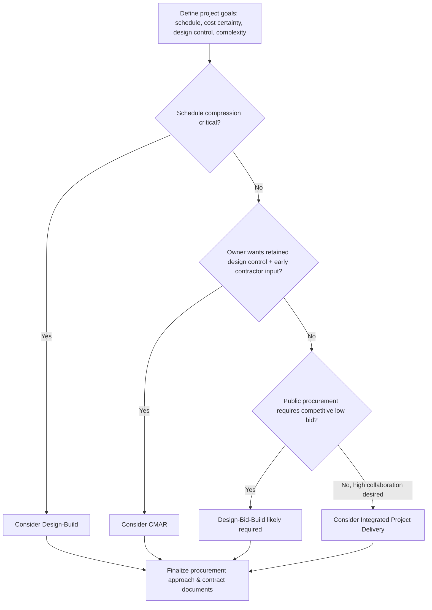
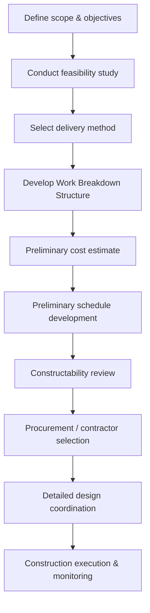

## Construction Project Planning and Delivery Methods

### Overview and Scope

Construction project planning establishes how a project's scope, schedule, cost, and quality objectives will be achieved before physical work begins, while **project delivery methods** define the contractual and organizational structure governing the relationships and risk allocation among owner, designer, and contractor. Selecting an appropriate delivery method is one of the earliest and most consequential decisions in a project's lifecycle, shaping schedule, cost certainty, design flexibility, and the distribution of risk.

### Project Planning Fundamentals

**Key Points**

- **Scope definition**: Clear delineation of what is (and is not) included in the project, forming the basis for all subsequent estimating, scheduling, and contracting decisions.
- **Work Breakdown Structure (WBS)**: A hierarchical decomposition of the total project scope into manageable work packages, providing the organizing framework for cost estimating, scheduling, and progress tracking.
- **Feasibility studies**: Early assessments of technical, financial, environmental, and regulatory viability, informing the go/no-go decision and preliminary delivery method selection.
- **Constructability review**: Early involvement of construction expertise during design to identify and resolve issues that would otherwise cause delays, rework, or cost overruns during actual construction.

### Traditional Design-Bid-Build (DBB)

**Key Points**

- **Sequence**: Owner engages a designer to complete full design documents; the completed design is then competitively bid to contractors; the selected contractor builds per the fixed design.
- **Risk allocation**: Owner bears design risk (errors/omissions in design documents); contractor bears construction risk (means, methods, and performance to the fixed design) under a largely fixed-price contract.
- **Advantages**: Well-understood, legally established process; competitive bidding tends to produce price competition; clear separation of design and construction responsibilities.
- **Disadvantages**: Sequential (design fully complete before construction starts) process extends overall project duration; no contractor input during design can miss constructability improvements; adversarial dynamics can arise from the arm's-length contractual relationship, particularly around change orders and design ambiguities.

### Design-Build (DB)

**Key Points**

- **Sequence**: Owner contracts with a single entity (or joint venture) responsible for both design and construction, typically selected via qualifications-based or best-value proposal rather than solely low-bid.
- **Risk allocation**: Design and construction risk are consolidated within the single design-build entity, reducing the owner's exposure to disputes over design-construction interface issues.
- **Advantages**: Overlapping (fast-track) design and construction phases can significantly compress overall schedule; single point of responsibility simplifies owner's contract administration; design-builder's construction expertise can inform more constructable design decisions.
- **Disadvantages**: Owner has less direct control over design details once the contract is awarded; effective competition depends on a well-developed set of performance criteria/bridging documents at the outset, since the owner typically has less-detailed design at the time of contractor selection than in DBB.

### Construction Manager at Risk (CMAR / CM at Risk)

**Key Points**

- **Sequence**: Owner separately engages a designer and a Construction Manager (CM) early in the design phase; the CM provides preconstruction services (cost estimating, scheduling, constructability input) during design, then commits to a **Guaranteed Maximum Price (GMP)** and acts as the general contractor for construction.
- **Risk allocation**: The CM assumes construction cost risk above the GMP (absent owner-directed scope changes), while benefiting from early involvement to help manage that risk before design is finalized.
- **Advantages**: Combines early contractor input (as in Design-Build) with a separate, owner-controlled design process; GMP provides cost certainty once established; collaborative preconstruction phase can improve design decisions and reduce change orders.
- **Disadvantages**: Requires a qualifications-based CM selection process (rather than simple low-bid); GMP negotiation can be contentious; owner still bears some risk for design completeness up to GMP establishment.

### Integrated Project Delivery (IPD)

**Key Points**

- **Sequence**: Owner, designer, and contractor (and often key trade subcontractors) enter into a single multi-party agreement from an early project stage, sharing risk and reward through mechanisms such as pooled profit/incentive structures.
- **Risk allocation**: Explicitly shared among all major parties, with contractual incentives aligning each party's success with overall project outcomes rather than individual scope performance.
- **Advantages**: [Inference] Proponents report reduced adversarial behavior and improved collaborative problem-solving due to aligned incentives, though rigorous independent outcome data (cost/schedule performance versus other methods) remains more limited than for the more established delivery methods.
- **Disadvantages**: Requires significant owner sophistication and trust to structure and administer; less standardized contractual precedent compared to DBB, DB, or CMAR; may not suit owners requiring traditional competitive bidding for public accountability.

### Delivery Method Comparison

| Feature | DBB | DB | CMAR | IPD |
| --- | --- | --- | --- | --- |
| Design-construction overlap | None | High | Moderate | High |
| Owner design control | High | Lower | High | Shared |
| Cost certainty timing | At bid (full design) | At contract award | At GMP | Ongoing/shared |
| Contractor input during design | None | Full (integrated) | Preconstruction phase | Full (integrated) |
| Number of prime contracts | 2 (design, construction) | 1 | 2 (design, CM) | 1 (multi-party) |

### Delivery Method Selection Process

### Project Planning Process Flow

### Design-Construction Overlap Comparison (svg_diagram)

<svg xmlns="http://www.w3.org/2000/svg" viewBox="0 0 700 340">
<text x="350" y="25" font-size="16" text-anchor="middle" font-weight="bold">Delivery Method Timeline Comparison (svg_diagram)</text>

<text x="60" y="60" font-size="12" font-weight="bold">DBB</text>

<rect x="120" y="45" width="150" height="25" fill="`#3182ce`" />

<text x="145" y="62" font-size="10" fill="white">Design</text>

<rect x="270" y="45" width="180" height="25" fill="`#a0aec0`" />

<text x="270" y="40" font-size="9">Bid</text>

<rect x="320" y="45" width="200" height="25" fill="`#38a169`" x2="520" />

<text x="380" y="62" font-size="10" fill="white">Construction</text>

<text x="60" y="120" font-size="12" font-weight="bold">DB</text>

<rect x="120" y="105" width="150" height="25" fill="`#3182ce`" />

<text x="145" y="122" font-size="10" fill="white">Design</text>

<rect x="220" y="105" width="250" height="25" fill="`#38a169`" />

<text x="290" y="122" font-size="10" fill="white">Construction (overlapping)</text>

<text x="60" y="180" font-size="12" font-weight="bold">CMAR</text>

<rect x="120" y="165" width="150" height="25" fill="`#3182ce`" />

<text x="145" y="182" font-size="10" fill="white">Design</text>

<rect x="120" y="165" width="150" height="10" fill="`#dd6b20`" />

<text x="270" y="182" font-size="9" fill="`#dd6b20`">CM preconstruction input</text>

<rect x="270" y="165" width="230" height="25" fill="`#38a169`" />

<text x="330" y="182" font-size="10" fill="white">Construction (post-GMP)</text>

<text x="60" y="240" font-size="12" font-weight="bold">IPD</text>

<rect x="120" y="225" width="120" height="25" fill="`#805ad5`" />

<text x="130" y="242" font-size="10" fill="white">Integrated Design</text>

<rect x="200" y="225" width="270" height="25" fill="`#38a169`" />

<text x="270" y="242" font-size="10" fill="white">Construction (fully overlapping)</text>

<text x="60" y="290" font-size="10" fill="`#4a5568`">Bar length is schematic, not to a fixed time scale</text>

</svg>

### Worked Example

**Example**

A public agency needs to deliver a new bridge project. It must comply with public procurement rules generally favoring competitive low-bid selection, has a well-defined and stable scope, and schedule compression is not a critical driver. Which delivery method is most likely appropriate, and why?

Given the combination of (1) public competitive-bidding requirements, (2) stable, well-defined scope allowing complete design before construction, and (3) no urgent schedule compression need, **Design-Bid-Build** is the delivery method most consistent with these constraints: it satisfies competitive low-bid procurement rules directly, and the absence of schedule pressure removes the main incentive that would otherwise favor Design-Build's overlapping schedule benefits. [Inference: If the agency's enabling legislation or procurement rules specifically authorize CMAR or Design-Build for public work — increasingly common in many jurisdictions — those methods could still be considered if early contractor constructability input were valued; the "most likely appropriate" conclusion here follows directly from the stated constraints, not from an assumption that DBB is universally preferred.]

### Common Pitfalls and Practical Considerations

- **Mismatching delivery method to project drivers**: Selecting Design-Bid-Build for a schedule-critical project (or Design-Build for a project requiring maximum owner design control) works against the project's actual priorities rather than supporting them.
- **Underdeveloped bridging documents in Design-Build procurement**: [Inference] If the owner's performance criteria/bridging documents are too vague at the time of design-builder selection, proposals may not be comparable on an apples-to-apples basis, and post-award scope disputes become more likely.
- **GMP established too early in CMAR**: Committing to a Guaranteed Maximum Price before design is sufficiently developed increases the risk of scope gaps, contingency disputes, and change orders later in the project.
- **Underestimating IPD's organizational demands**: [Inference] IPD's shared-risk model depends on genuine cultural and contractual alignment among all signatory parties; attempting IPD without the owner's sustained commitment to collaborative governance can undermine the very mechanisms meant to differentiate it from traditional adversarial delivery.
- **Neglecting constructability review regardless of delivery method**: Even under methods with contractor involvement (DB, CMAR, IPD), constructability review benefits diminish if not conducted rigorously and early — the delivery method enables early input but does not automatically guarantee it occurs effectively.

**Related Topics**

- Construction Scheduling and Critical Path Method
- Cost Estimating and Cost Control
- Construction Contracts and Risk Allocation
- Quality Assurance and Construction Inspection
- Construction Safety Management
- Value Engineering and Constructability Analysis
- Public-Private Partnerships (P3) in Infrastructure