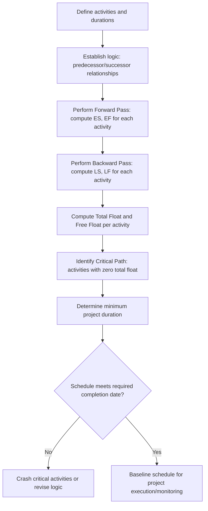

## Scheduling Techniques: CPM and PERT

### Overview and Scope

Critical Path Method (CPM) and Program Evaluation and Review Technique (PERT) are network-based scheduling techniques used to plan, sequence, and monitor construction (and other project) activities. Both represent a project as a network of interdependent activities, but they differ in a key respect: **CPM** uses deterministic (single-value) activity durations and emphasizes cost-time tradeoffs, while **PERT** was developed for projects with significant duration uncertainty and uses probabilistic (three-point) duration estimates.

### Network Diagram Fundamentals

**Key Points**

- **Activity**: A discrete task consuming time and resources, represented as a node (Activity-on-Node, AON) or an arrow (Activity-on-Arrow, AOA) in the network diagram.
- **Event/Node**: In AOA diagrams, a point in time representing the completion of preceding activities and the start of following ones; in AON diagrams (now the dominant convention in most modern scheduling software), the activity itself is the node.
- **Dependency (logic link)**: A relationship defining which activities must precede others — most commonly **Finish-to-Start (FS)**, but also **Start-to-Start (SS)**, **Finish-to-Finish (FF)**, and **Start-to-Finish (SF)**, often with lead or lag time applied.
- **Predecessor / Successor**: An activity that must occur before (predecessor) or after (successor) another activity per the defined logic.

### Critical Path Method (CPM) — Forward and Backward Pass

**Forward Pass** (computes Early Start and Early Finish for each activity):

$$ES_j = \max(EF_i) \text{ for all predecessors } i$$

$$EF_j = ES_j + D_j$$

Where $D_j$ is the duration of activity $j$. The project's calculated duration is the maximum Early Finish among all activities with no successors.

**Backward Pass** (computes Late Start and Late Finish, working from the project end date backward):

$$LF_i = \min(LS_j) \text{ for all successors } j$$

$$LS_i = LF_i - D_i$$

**Total Float (Slack)**

$$TF = LS - ES = LF - EF$$

Total float represents the amount an activity can be delayed without delaying the overall project completion date.

**Free Float**

$$FF = \min(ES_{successors}) - EF_{activity}$$

Free float represents the amount an activity can be delayed without delaying the *early start* of any successor activity — a stricter, more locally-scoped measure than total float.

**The Critical Path**

The critical path is the longest continuous chain of dependent activities through the network, determining the minimum possible project duration. Activities on the critical path have **zero total float** — any delay to a critical activity directly delays the entire project, making critical path identification the central output of CPM scheduling.

### CPM Network Computation Flow

### Example Network Diagram (svg_diagram)

<svg xmlns="http://www.w3.org/2000/svg" viewBox="0 0 700 300">
<text x="350" y="25" font-size="16" text-anchor="middle" font-weight="bold">Activity-on-Node CPM Network (svg_diagram)</text>

<rect x="40" y="120" width="80" height="50" fill="#3182ce" stroke="#1a202c" />
<text x="80" y="140" font-size="11" fill="white" text-anchor="middle">A</text>
<text x="80" y="155" font-size="9" fill="white" text-anchor="middle">D=3</text>
<rect x="180" y="60" width="80" height="50" fill="#e53e3e" stroke="#1a202c" />
<text x="220" y="80" font-size="11" fill="white" text-anchor="middle">B (critical)</text>
<text x="220" y="95" font-size="9" fill="white" text-anchor="middle">D=5</text>
<rect x="180" y="180" width="80" height="50" fill="#3182ce" stroke="#1a202c" />
<text x="220" y="200" font-size="11" fill="white" text-anchor="middle">C</text>
<text x="220" y="215" font-size="9" fill="white" text-anchor="middle">D=2</text>
<rect x="340" y="60" width="80" height="50" fill="#e53e3e" stroke="#1a202c" />
<text x="380" y="80" font-size="11" fill="white" text-anchor="middle">D (critical)</text>
<text x="380" y="95" font-size="9" fill="white" text-anchor="middle">D=4</text>
<rect x="500" y="120" width="80" height="50" fill="#e53e3e" stroke="#1a202c" />
<text x="540" y="140" font-size="11" fill="white" text-anchor="middle">E (critical)</text>
<text x="540" y="155" font-size="9" fill="white" text-anchor="middle">D=3</text>

<line x1="120" y1="140" x2="175" y2="90" stroke="#1a202c" stroke-width="2" marker-end="url(#arrow)" />
<line x1="120" y1="150" x2="175" y2="200" stroke="#1a202c" stroke-width="2" marker-end="url(#arrow)" />
<line x1="260" y1="85" x2="335" y2="85" stroke="#1a202c" stroke-width="2" marker-end="url(#arrow)" />
<line x1="260" y1="205" x2="330" y2="145" stroke="#1a202c" stroke-width="2" marker-end="url(#arrow)" />
<line x1="420" y1="90" x2="495" y2="135" stroke="#1a202c" stroke-width="2" marker-end="url(#arrow)" />
<text x="200" y="260" font-size="10" fill="`#e53e3e`">Critical path: A → B → D → E (12 days)</text>

</svg>

### Worked Example — CPM

**Example**

Given the network above: Activity A (duration 3) has no predecessor; B (duration 5) and C (duration 2) both follow A; D (duration 4) follows B and C; E (duration 3) follows D. Compute the forward pass and identify the critical path.

$$ES_A = 0, \, EF_A = 0+3 = 3$$

$$ES_B = 3, \, EF_B = 3+5 = 8$$

$$ES_C = 3, \, EF_C = 3+2 = 5$$

$$ES_D = \max(EF_B, EF_C) = \max(8,5) = 8, \, EF_D = 8+4 = 12$$

$$ES_E = 12, \, EF_E = 12+3 = 15$$

Project duration = **15 days**. Path A-B-D-E totals $3+5+4+3=15$ days, matching the project duration, so this is the **critical path**. Path A-C-D-E totals $3+2+4+3=12$ days, giving Activity C a total float of $15-12=3$ days.

### PERT — Probabilistic Duration Estimation

PERT addresses activities whose duration is uncertain by using three time estimates per activity rather than a single deterministic value:

- **Optimistic time ($t_o$)**: Duration under the best realistic conditions.
- **Most likely time ($t_m$)**: Duration under normal conditions.
- **Pessimistic time ($t_p$)**: Duration under the worst realistic conditions.

**Expected (Mean) Duration**

$$t_e = \frac{t_o + 4t_m + t_p}{6}$$

This weighted average, derived from an assumed Beta probability distribution for activity duration, gives four times the weight to the most likely estimate relative to each extreme.

**Activity Standard Deviation and Variance**

$$\sigma = \frac{t_p - t_o}{6} \quad \Rightarrow \quad \sigma^2 = \left(\frac{t_p - t_o}{6}\right)^2$$

**Project Duration Variance and Standard Deviation**

Since activity durations along the critical path are assumed statistically independent, their variances sum directly:

$$\sigma_{project}^2 = \sum \sigma_i^2 \, (\text{for critical path activities})$$

$$\sigma_{project} = \sqrt{\sigma_{project}^2}$$

**Probability of Meeting a Target Completion Date**

Using the Central Limit Theorem, the project completion time is assumed approximately normally distributed, allowing the standard normal variate to be computed:

$$Z = \frac{T_{target} - T_{expected}}{\sigma_{project}}$$

The resulting $Z$-value is referenced against the standard normal distribution to estimate the probability of completing the project by the target date. [Inference] This probabilistic result depends on several simplifying assumptions (Beta distribution for individual activities, independence of activity durations, normality of the summed project duration) that are reasonable approximations but not exact representations of real-world schedule risk — PERT's probability estimates should be treated as indicative rather than precise.

### Worked Example — PERT

**Example**

A critical path activity has $t_o = 4$ days, $t_m = 6$ days, $t_p = 14$ days. Compute the expected duration and standard deviation.

$$t_e = \frac{4 + 4(6) + 14}{6} = \frac{4+24+14}{6} = \frac{42}{6} = 7 \text{ days}$$

$$\sigma = \frac{14-4}{6} = \frac{10}{6} \approx 1.67 \text{ days}$$

The expected duration is **7 days**, notably different from the simple average of the three estimates ($(4+6+14)/3 \approx 8$ days), because the most-likely estimate carries four times the weight of either extreme in the PERT formula. The standard deviation of approximately **1.67 days** reflects the considerable spread between optimistic and pessimistic estimates for this particular activity.

### Schedule Compression Techniques

**Key Points**

- **Crashing**: Adding resources to critical path activities to reduce their duration, typically at increased cost — decisions guided by comparing each activity's **cost slope** (additional cost per unit time saved) to identify the least expensive way to compress the schedule by a given amount.
- **Fast-tracking**: Overlapping activities that would normally occur sequentially (e.g., starting construction before design is fully complete) — reduces schedule duration but increases risk of rework if upstream information changes after downstream work has begun.

$$\text{Cost Slope} = \frac{\text{Crash Cost} - \text{Normal Cost}}{\text{Normal Duration} - \text{Crash Duration}}$$

[Inference] Crashing decisions should generally target the critical path activity with the lowest cost slope first; however, crashing a critical activity can shift the critical path to a previously non-critical sequence, requiring the network to be re-analyzed after each crashing decision rather than assuming a fixed critical path throughout the compression process.

### Common Pitfalls and Practical Considerations

- **Confusing total float with free float**: Using total float as if it were available without any effect on successor activities can create scheduling conflicts, since consuming total float on a non-critical activity may still delay the early start of its immediate successors (consuming their free float or shifting the near-critical path).
- **Treating PERT's most-likely estimate as the deterministic CPM duration**: Substituting $t_m$ directly into a standard CPM calculation ignores the asymmetric skew that pessimistic estimates often carry in construction (e.g., weather delays, permitting issues) — the PERT expected value $t_e$ is generally the more appropriate substitute where uncertainty is significant.
- **Ignoring near-critical paths**: A path with only slightly positive float (a "near-critical path") can become the actual critical path after even minor schedule slippage elsewhere — monitoring only the nominal critical path while ignoring near-critical paths is a common source of schedule surprises.
- **Re-crashing without re-analyzing the network**: [Inference] Continuing to crash what was originally the critical path after the critical path has shifted (due to earlier crashing) wastes resources without shortening the project, since the new critical path — not the old one — now governs overall duration.
- **Overlooking resource constraints**: Pure CPM/PERT network logic assumes unlimited resource availability for any activity; in practice, resource leveling or resource-constrained scheduling must often be layered onto the basic network logic to produce an achievable schedule.

**Related Topics**

- Construction Project Planning and Delivery Methods
- Resource Leveling and Resource-Constrained Scheduling
- Cost Estimating and Cost Control
- Earned Value Management
- Construction Claims and Delay Analysis
- Risk Management in Construction Projects
- Building Information Modeling (BIM) 4D Scheduling