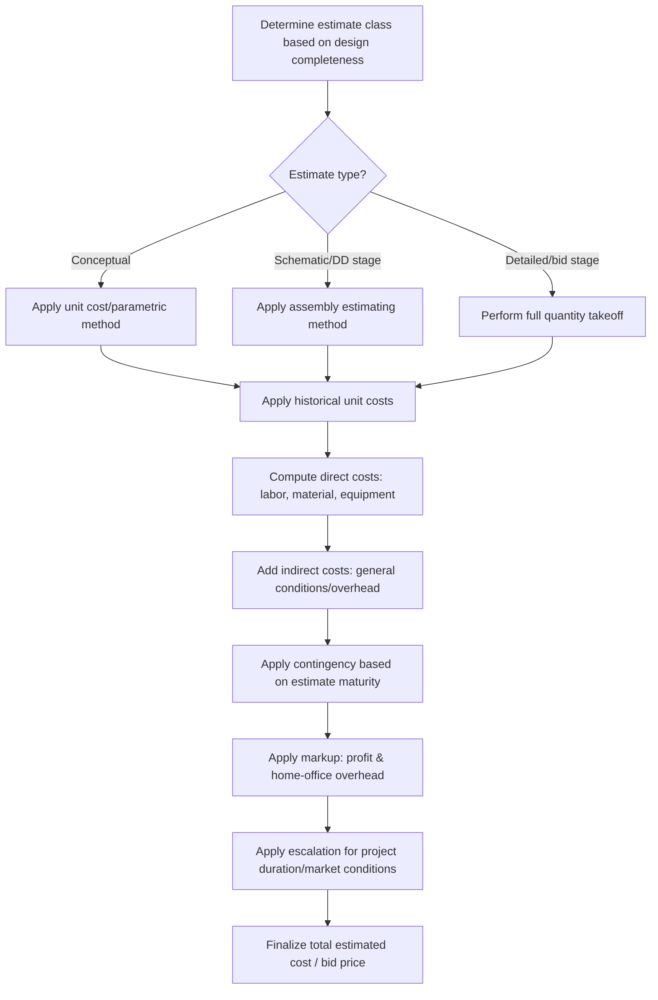

## Cost Estimation and Budgeting

### Overview and Scope

Cost estimation is the process of predicting the likely financial cost of a construction project before (and during) execution, while budgeting allocates that estimated cost across the project's scope, schedule, and organizational structure to establish a baseline against which actual performance is measured. Estimating accuracy and methodology evolve through the project lifecycle — from rough conceptual figures at the earliest planning stage to detailed, take-off-based estimates once design is complete.

### Estimate Classes and Accuracy Ranges

**Key Points**

- **Order-of-magnitude (conceptual) estimate**: Prepared with minimal design information (e.g., a capacity factor or unit cost per functional unit), used for early feasibility screening; accuracy range is wide, commonly cited as roughly −30% to +50%.
- **Preliminary (schematic design) estimate**: Prepared once basic scope and general system decisions are made; accuracy range narrows to roughly −15% to +30% (typical ranges).
- **Detailed (definitive) estimate**: Prepared from largely complete design documents using a full quantity takeoff; accuracy range narrows further to roughly −5% to +15%.
- **Engineer's estimate / bid estimate**: Prepared from complete construction documents, representing the highest achievable accuracy prior to actual bid receipt.

[Inference] These specific accuracy percentage ranges are illustrative and vary meaningfully by industry classification system (e.g., AACE International's Cost Estimate Classification System) and project type — the underlying principle (accuracy improves as design detail increases) is the reliable takeaway; exact bands should be verified against the classification system governing a given project.

### Estimating Methods

**Unit Cost (Parametric) Method**

Applies a historical cost per unit of a relevant parameter (e.g., cost per square meter of floor area, cost per lane-kilometer of roadway, cost per kilometer of pipeline) to the project's corresponding quantity — fast but coarse, appropriate mainly for conceptual-stage estimating.

$$\text{Estimated Cost} = \text{Unit Cost} \times \text{Quantity Parameter}$$

**Quantity Takeoff (Detailed) Method**

Measures actual quantities of each work item directly from completed design drawings (e.g., cubic meters of concrete, tons of reinforcing steel, square meters of formwork), then applies unit prices to each item:

$$\text{Direct Cost} = \sum_{i} Q_i \times UP_i$$

Where $Q_i$ is the measured quantity of item $i$ and $UP_i$ is its unit price (labor, material, and equipment combined or itemized separately).

**Assembly (Systems) Estimating**

An intermediate-detail method that groups related work items into composite "assemblies" (e.g., a complete exterior wall assembly including framing, insulation, sheathing, and finish) with a single combined unit cost — faster than full takeoff while more detailed than pure parametric estimating, commonly used at schematic/design-development stages.

### Cost Components

**Key Points**

- **Direct costs**: Labor, material, and equipment costs directly attributable to specific work items/activities.
- **Indirect costs (general conditions/overhead)**: Costs not tied to a specific work item but necessary to support the project as a whole (site supervision, temporary facilities, project insurance, permits, mobilization/demobilization).
- **Contingency**: An allowance for unforeseen costs arising from estimating uncertainty, incomplete design information, or unforeseen field conditions — typically expressed as a percentage of estimated cost, with the percentage decreasing as the estimate class matures (higher contingency for conceptual estimates, lower for detailed estimates).
- **Markup (profit and overhead)**: The contractor's home-office overhead allocation and profit margin, added to direct and indirect costs to determine the bid or contract price.
- **Escalation**: An allowance for anticipated cost increases between the time of estimating and the time costs are actually incurred, particularly significant for projects with long durations or volatile material markets.

### Labor, Material, and Equipment Cost Estimation

**Labor Cost**

$$\text{Labor Cost} = \text{Crew Hours} \times \text{Crew Hourly Rate}$$

Crew hours are derived from productivity rates (e.g., labor-hours per unit of work, such as labor-hours per cubic meter of concrete placed), themselves drawn from historical cost databases, published references (e.g., RSMeans), or the estimator's own historical project records — adjusted for project-specific conditions (site access, weather, crew experience, working conditions).

**Equipment Cost**

Typically estimated using an hourly **ownership and operating cost rate**, combining depreciation, financing, insurance, and taxes (ownership) with fuel, maintenance, and operator labor (operating), multiplied by the estimated hours of equipment use for the activity.

**Material Cost**

$$\text{Material Cost} = \text{Quantity} \times \text{Unit Material Price} \times (1 + \text{Waste Factor})$$

A waste factor accounts for material lost to cutting, handling, spillage, or installation losses, and varies by material type (e.g., higher waste factors for cut lumber or tile than for bulk aggregate).

### Cost Estimating Process Flow

### Cost Buildup Structure (svg_diagram)

<svg viewBox="0 0 700 340" xmlns="http://www.w3.org/2000/svg">
<text x="350" y="25" font-size="16" text-anchor="middle" font-weight="bold">Cost Estimate Buildup (svg_diagram)</text>
<!-- Stacked bar representing cost buildup -->
<rect x="250" y="280" width="200" height="20" fill="#3182ce"/>
<text x="460" y="295" font-size="11">Labor</text>
<rect x="250" y="240" width="200" height="40" fill="#2b6cb0"/>
<text x="460" y="265" font-size="11">Material</text>
<rect x="250" y="215" width="200" height="25" fill="#63b3ed"/>
<text x="460" y="232" font-size="11">Equipment</text>
<rect x="250" y="175" width="200" height="40" fill="#dd6b20"/>
<text x="460" y="200" font-size="11">Indirect costs / general conditions</text>
<rect x="250" y="140" width="200" height="35" fill="#e53e3e"/>
<text x="460" y="162" font-size="11">Contingency</text>
<rect x="250" y="105" width="200" height="35" fill="#805ad5"/>
<text x="460" y="127" font-size="11">Markup (profit & overhead)</text>
<line x1="250" y1="95" x2="450" y2="95" stroke="#1a202c" stroke-width="2"/>
<text x="300" y="85" font-size="12" font-weight="bold">Total Bid/Contract Price</text>
</svg>

### Worked Example

**Example**

A concrete slab requires 250 m³ of concrete. Concrete unit material price is $120/m³ with a 5% waste factor. Placing productivity is 0.8 labor-hours per m³, using a crew billed at $45/hour composite rate. Equipment (a concrete pump) is required for 20 hours at $150/hour. Compute the direct cost.

**Material cost:**

$$250 \times \$120 \times (1+0.05) = 250 \times 120 \times 1.05 = \$31{,}500$$

**Labor cost:**

$$250 \times 0.8 = 200 \text{ labor-hours}; \quad 200 \times \$45 = \$9{,}000$$

**Equipment cost:**

$$20 \times \$150 = \$3{,}000$$

**Total Direct Cost:**

$$\$31{,}500 + \$9{,}000 + \$3{,}000 = \$43{,}500$$

The estimated direct cost for this slab pour is **$43,500**, before indirect costs, contingency, markup, and escalation are applied to arrive at a final bid/budget figure — actual results will depend on site-specific productivity and current material/labor market rates at the time of construction.

### Budgeting and Cost Control Integration

**Key Points**

- **Cost codes / cost breakdown structure**: The approved estimate is typically reorganized into a cost breakdown structure aligned with the project's accounting and reporting system, enabling costs to be tracked against budget at a work-item or activity level during construction.
- **S-curve (cumulative cost curve)**: A cumulative planned cost curve over the project schedule, typically S-shaped (slow start, rapid middle progress, tapering completion), used as the baseline against which actual cumulative cost/progress is compared.
- **Earned Value Management (EVM)**: Extends basic budget tracking by comparing planned value, earned value (budgeted cost of work actually performed), and actual cost to assess both cost and schedule performance simultaneously (covered in depth under project controls topics).

### Common Pitfalls and Practical Considerations

- **Applying an inappropriate estimating method to the available design detail**: Attempting a full quantity takeoff before design is sufficiently developed wastes effort on quantities that will change; conversely, relying on parametric estimates when detailed drawings are already available forfeits achievable accuracy.
- **Underestimating indirect costs**: General conditions and overhead are sometimes estimated as an afterthought percentage rather than built up from actual project-specific requirements (site duration, supervision staffing, temporary facilities) — a frequent source of underestimated total project cost.
- **Contingency erosion without scope justification**: [Inference] Contingency funds are intended for unforeseen conditions and estimating uncertainty, not as a buffer to absorb scope creep or discretionary upgrades; treating contingency as generally available project funding undermines its risk-management purpose and can leave the project genuinely under-protected against real unforeseen conditions later.
- **Ignoring escalation on long-duration projects**: Failing to account for anticipated material and labor cost increases over a multi-year project schedule can produce a budget that appears adequate at time of estimate but proves insufficient as the project progresses through periods of market cost increases.
- **Productivity rate misapplication**: Using published generic productivity rates without adjusting for project-specific conditions (congested site access, adverse weather patterns, unusual crew experience levels) can systematically bias labor cost estimates in either direction.

**Related Topics**

- Scheduling Techniques: CPM and PERT
- Construction Project Planning and Delivery Methods
- Earned Value Management and Project Controls
- Construction Contracts and Risk Allocation
- Value Engineering and Constructability Analysis
- Quantity Takeoff and Bill of Quantities Preparation
- Life-Cycle Cost Analysis